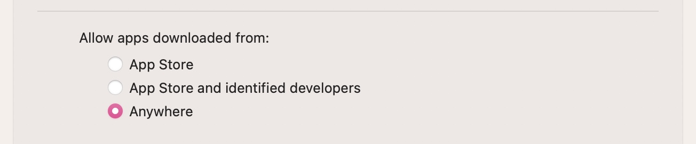

## GUI

- Modify launchpad icon layout

    You can modify the row number and column number the launchpad displays. 

    ```shell
    defaults write com.apple.dock springboard-rows -int 5
    defaults write com.apple.dock springboard-columns -int 10
    killall Dock
    ```

    To restore default, use
    ```shell
    defaults write com.apple.dock springboard-rows Default 
    defaults write com.apple.dock springboard-columns Default 
    killall Dock
    ```

## Third-party

- Remove QQ Login and Offline sound. (Note that we need to do this everytime we update QQ.app)
  
    ```shell
    sudo chmod go-r /Applications/QQ.app/Contents/Resources/LoginOKSound.mp3
    sudo chmod go-r /Applications/QQ.app/Contents/Resources/TerminalSound.mp3
    ```

## Install 'oh-my-zsh' and plugins

'oh-my-zsh'

```shell
zsh -c "$(curl -fsSL 'https://api.host.mintimate.cn/fileHost/public/download/1P0R')"
```

'zsh-syntax-highlighting`

```shell
git clone https://github.com/zsh-users/zsh-syntax-highlighting.git ${ZSH_CUSTOM:-~/.oh-my-zsh/custom}/plugins/zsh-syntax-highlighting
```

Then enable these plugins. Open `~/.zshrc` and modify the line `plugins=(git)` to 

```shell
plugins=(git zsh-syntax-highlighting colored-man-pages extract sudo z)
```

## Install HomeBrew

Add the following to the end of `~/.zshrc`

```shell
export HOMEBREW_BREW_GIT_REMOTE="https://mirrors.ustc.edu.cn/brew.git"
export HOMEBREW_CORE_GIT_REMOTE="https://mirrors.ustc.edu.cn/homebrew-core.git"
export HOMEBREW_BOTTLE_DOMAIN="https://mirrors.ustc.edu.cn/homebrew-bottles"
export HOMEBREW_NO_AUTO_UPDATE=true
```

then install homebrew with 

```shell
/bin/bash -c "$(curl -fsSL https://cdn.jsdelivr.net/gh/Homebrew/install@HEAD/install.sh)"
brew update
```

> Reference: [Homebrew 源使用帮助 - USTC Mirror Help](https://mirrors.ustc.edu.cn/help/brew.git.html)

## Command Line applications (Installed from brew)

- Node.js & npm
  
    ```shell
    brew install nodejs
    npm config set registry https://registry.npm.taobao.org
    npm update -g
    ```

- OpenJDK

  ```
  brew install openjdk
  ```

  


## CLI-related miscellaneous things

- Allow apps downloaded from 'Anywhere'

    

    ```shell
    sudo spctl --master-disable
    ```

- Make `jpg` (instead of `png`) the default screenshot filetype. This can significantly reduce screenshot size.

    ```shell
    defaults write com.apple.screencapture type jpg
    ```

- Make `~/Library/` a visible folder.

    ```shell
    chflags nohidden ~/Library
    ```

- Turn off 'powernap' and 'tcpkeealive'. This disables wifi connection at system sleep to save battery power, but may result in features like 'Find My Mac' not to function properly. Do with caution!

    ```shell
    sudo pmset -a powernap 0
    sudo pmset -a tcpkeepalive 0
    ```

- Turn off SIP protection. In recovery mode (press and hold 'command+R' after pressing power-on button). 

    ```shell
    csrutil disable
    ```

    This can prevent some annoying problems, such as `XprotectService` consuming your CPU after downloading some files, or your Mac refuses to open some unknown applications. But this will increase the risk your system being infected. Do with caution!

- 'sudo' without password.  Do with caution!

    ```shell
    visudo
    ```

    Modify the line `%admin  ALL = (ALL) ALL` to 
    ```shell
    %admin  ALL = (ALL) NOPASSWD:ALL
    ```

