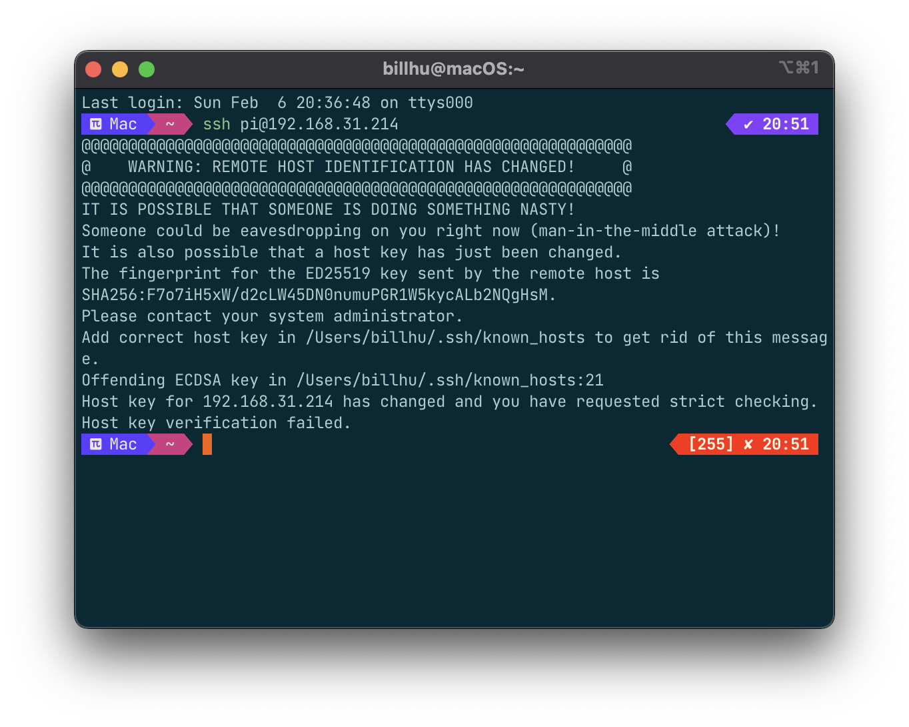

# 我的一些树莓派设置


### 启动VNC和SSH

`sudo raspi-config`，在界面中开启vnc和ssh即可

*<!-- more -->*

电脑ssh树莓派时，如果出现类似以下的错误：



解决方法是输入以下命令（将`<IP_ADDRESS>`换成树莓派的ip地址），然后重新连接：

```sh
ssh-keygen -R <IP_ADDRESS>
```

###  apt-get切换国内源，解决下载太慢问题

首先查看linux（树莓派os为debian）版本：`lsb_release -a`，版本可能是buster或bullseye

然后看一下清华源地址：

 [https://mirrors.tuna.tsinghua.edu.cn/help/debian/](https://mirrors.tuna.tsinghua.edu.cn/help/debian/)

[https://mirrors.tuna.tsinghua.edu.cn/help/raspbian/](https://mirrors.tuna.tsinghua.edu.cn/help/raspbian/)

<div class="note note-warning"><p>似乎只有64位的raspberrypi os才能使用这个源，32位的系统请勿使用，会出错。</p></div>

内容（可以去访问查看，也可以直接复制下面的文字）：

```shell
# 默认注释了源码镜像以提高 apt update 速度，如有需要可自行取消注释
deb https://mirrors.tuna.tsinghua.edu.cn/debian/ buster main contrib non-free
# deb-src https://mirrors.tuna.tsinghua.edu.cn/debian/ buster main contrib non-free
deb https://mirrors.tuna.tsinghua.edu.cn/debian/ buster-updates main contrib non-free
# deb-src https://mirrors.tuna.tsinghua.edu.cn/debian/ buster-updates main contrib non-free
deb https://mirrors.tuna.tsinghua.edu.cn/debian/ buster-backports main contrib non-free
# deb-src https://mirrors.tuna.tsinghua.edu.cn/debian/ buster-backports main contrib non-free
deb https://mirrors.tuna.tsinghua.edu.cn/debian-security buster/updates main contrib non-free
# deb-src https://mirrors.tuna.tsinghua.edu.cn/debian-security buster/updates main contrib non-free
```

把这段文字复制下来，然后更改`sources.list`文件。这个文件的位置在：`/etc/apt/sources.list`。可以用`sudo vim`或者 mousepad 去打开修改。

更改文件完成后，shell执行`sudo apt-get update && sudo apt-get upgrade -y`，更新这个配置文件并更新所有的包，等待一会儿就完成了！这样apt-get的速度就会快很多。


### 安装vim

```shell
sudo apt-get install vim 
```


### 安装zsh和oh my zsh

参考 [mintimate](https://mintimate.cn) 的教程。

1 安装zsh并设置为默认终端

安装zsh：`sudo apt-get install zsh`

查看zsh路径： `which zsh` ，路径应该是`/bin/zsh`或者`/usr/bin/zsh`

设置为默认shell：`chsh -s /bin/zsh`，重启终端或者重启系统生效

2 安装oh my zsh

一键安装脚本

```shell
zsh -c "$(curl -fsSL 'https://api.host.mintimate.cn/fileHost/public/download/1P0R')"
```

切换主题：

```shell
vim ~/.zshrc
# mintimate's theme: steeef
source ~/.zshrc
```


### vim代码高亮、显示行号等设置

```shell
vim ~/.zshrc  # 如果没有这个文件也没关系，直接vim会自动新建这个文件

# 在里面添加————————————————————————————————————————————
syntax on " 语法高亮

set tabstop=4  " Tab键的宽度
set softtabstop=4
set shiftwidth=4  "  统一缩进为4

set nu   " 显示行号
colorscheme pablo   " 设置颜色主题
set ruler   " 在编辑过程中，在右下角显示光标位置的状态行


# 保存并退出，下次进入vim会自动生效—————————————————————————————————

```


### 查看cpu情况：

```shell
sudo pip install s-tui

sudo s-tui
```


### github太慢：


此方法可能已经失效！


使用github的镜像网站进行访问，[github.com.cnpmjs.org](https://link.zhihu.com/?target=http%3A//github.com.cnpmjs.org)，我们将原本的网站中的github.com 进行替换。比如`git clone github.com/xxx/xxx.git`，将其替换为`git clone github.com.cnpmjs.org/xxx/xxx.git`


### 禁止息屏(?)：

```shell
sudo vim /etc/lightdm/lightdm.conf

# 找到[SeatDefaults]下：
#server-command=X 将这一行修改为：
xserver-command=X -s 0 -dpms

# -s 设置屏幕保护不启用
# dpms 关闭电源节能管理
```
