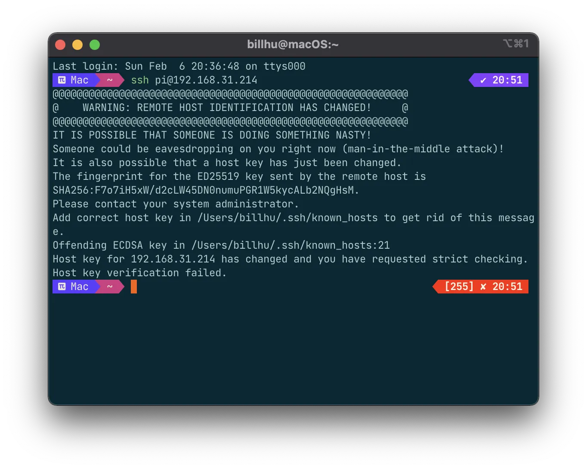

### Start VNC and SSH

Enter the terminal of raspi, `sudo raspi-config`，and start vnc and ssh with the UI interface.

Alternatively, after you flashed the SD card with raspi os, create a file named `ssh` (no filename extension, just `ssh`) at the root of the directory, and SSH will be automatically enabled during the first system startup.

*<!-- more -->*

### 'Remote host identification changed' error

When connecting to raspi (or any other ssh hosts) with ssh, if the following error happens: 



The solution is to use the following command (replace `<IP_ADDRESS>` with the IP address of raspi), and connect again

```sh
ssh-keygen -R <IP_ADDRESS>
```

### apt-get切换国内源

首先查看linux（树莓派os为debian）版本：`lsb_release -a`，版本可能是buster或bullseye

然后看一下清华源地址：

 [https://mirrors.tuna.tsinghua.edu.cn/help/debian/](https://mirrors.tuna.tsinghua.edu.cn/help/debian/)

[https://mirrors.tuna.tsinghua.edu.cn/help/raspbian/](https://mirrors.tuna.tsinghua.edu.cn/help/raspbian/)

<div class="note note-warning"><p>似乎只有64位的raspberrypi os才能使用这个源，32位的系统请勿使用，会出错。</p></div>

内容（可以去访问查看，也可以直接复制下面的文字）：

```shell
# 默认注释了源码镜像以提高 apt update 速度，如有需要可自行取消注释
deb https://mirrors.tuna.tsinghua.edu.cn/debian/ buster main contrib non-free
# deb-src https://mirrors.tuna.tsinghua.edu.cn/debian/ buster main contrib non-free
deb https://mirrors.tuna.tsinghua.edu.cn/debian/ buster-updates main contrib non-free
# deb-src https://mirrors.tuna.tsinghua.edu.cn/debian/ buster-updates main contrib non-free
deb https://mirrors.tuna.tsinghua.edu.cn/debian/ buster-backports main contrib non-free
# deb-src https://mirrors.tuna.tsinghua.edu.cn/debian/ buster-backports main contrib non-free
deb https://mirrors.tuna.tsinghua.edu.cn/debian-security buster/updates main contrib non-free
# deb-src https://mirrors.tuna.tsinghua.edu.cn/debian-security buster/updates main contrib non-free
```

把这段文字复制下来，然后更改`sources.list`文件。这个文件的位置在：`/etc/apt/sources.list`。可以用`sudo vim`或者 mousepad 去打开修改。

更改文件完成后，shell执行`sudo apt-get update && sudo apt-get upgrade -y`，更新这个配置文件并更新所有的包，等待一会儿就完成了！这样apt-get的速度就会快很多。


### Install vim

```shell
sudo apt-get install vim 
```


### Install zsh and oh my zsh

For reference:  [mintimate](https://mintimate.cn)

1 Install zsh and set it as the default terminal 

Install zsh：`sudo apt-get install zsh`

See the path of zsh： `which zsh` , which should be `/bin/zsh` or `/usr/bin/zsh`

Set it as the default shell：`chsh -s /bin/zsh`, restart terminal or restart system to take effect

2 Install 'oh my zsh'

One-click setup script:

```shell
zsh -c "$(curl -fsSL 'https://api.host.mintimate.cn/fileHost/public/download/1P0R')"
```

switch theme：

```shell
vim ~/.zshrc
# mintimate's theme: steeef
source ~/.zshrc
```


### vim code highlighting, line number display...

```shell
vim ~/.vimrc  # don't worry if the file does not exist, vim will create one 

# Add the following————————————————
syntax on " syntax highlighting

set tabstop=4  " 
set softtabstop=4
set shiftwidth=4  "  

set nu   " show line number
colorscheme pablo   " set theme
set ruler   " Show the pointer positon at bottom-right corner when editing


# Save and exit, and it will take effect the next time you enter vim

```


### See CPU usage：

```shell
sudo pip install s-tui

sudo s-tui
```


### 禁止息屏(?)：

```shell
sudo vim /etc/lightdm/lightdm.conf

# 找到[SeatDefaults]下：
#server-command=X 将这一行修改为：
xserver-command=X -s 0 -dpms

# -s 设置屏幕保护不启用
# dpms 关闭电源节能管理
```
