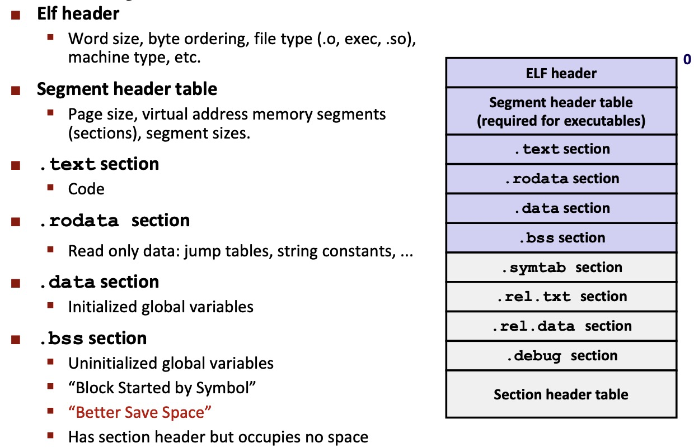
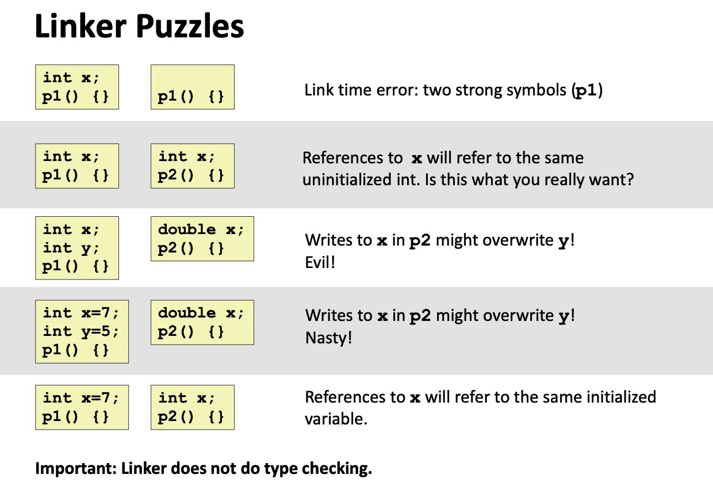
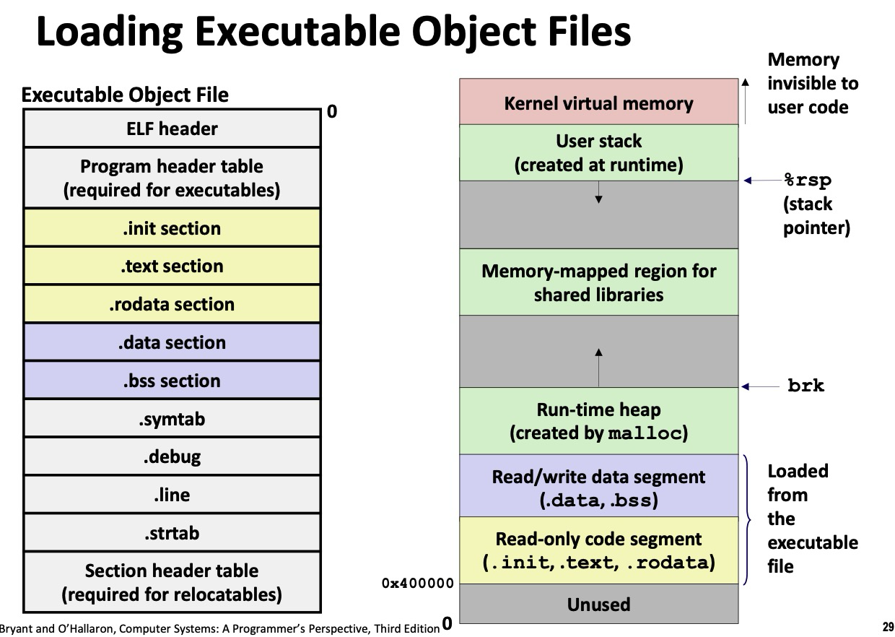



Disclaimer: 记得不全，已经会的都没记，不建议用作参考。




# Lec 3. Machine-Level Programming I

- x86-64 integer registers
  - `%rax` 64-bit
  - `%eax` 32-bit, `%ax` 16-bit, `%ah` `%al` high 8-bit and low 8-bit respectively
  - backwards compatibility 向下兼容❎ 历史包袱✅

| Register                       |      |      | Origin (许多已废弃)                       |
| ------------------------------ | ---- | ---- | ----------------------------------------- |
| `rax` (eax, ax, ah, al)        |      |      | Accumulate 累加器                         |
| `rbx` `ebx`                    |      |      | Base 基地址(例如数组首地址 和si di差不多) |
| `rcx` `ecx`                    |      |      | Counter                                   |
| `rdx` `edx`                    |      |      | Data                                      |
| `rsi` `esi`                    |      |      | Source Index (源变址)                     |
| `rdi` `edi`                    |      |      | Destination Index (目的变址)              |
| `rsp` `esp`                    |      |      | Stack Pointer                             |
| `rbp` `ebp`                    |      |      | Base Pointer                              |
| `r8` `r8d`                     |      |      |                                           |
| `r9`, `r10`, `r11`, ..., `r15` |      |      |                                           |

关于 bx/bp/si/di 寄存器：

```c
a[10] --> b[10]
for (int i = 0; i < 10; i++) {
	b[i] = a[i];
}
/**
	a -- source index      -- si register
	b -- destination index -- di register
	现在 bx bp si di差不多
	以前 si di用于数组中(用户), bx操作系统解决程序重定向问题使用 (程序每次加载到内存中都是不同地址 relative addressing)
	bx和bp段不一样, bx si di数据段, bp 堆栈段(ss, stack segment)
 */
```


- Operands 操作数

  - **Immediate**: e.g. `$0x400`, `$-533` (1, 2 or 4 bytes)
  - **Register**: e.g. `%rax`, `%r13`. 
    - But `%rsp` reserved for special use.
  - **Memory**: 8-byte mem at addr given by reg: e.g. `(%rax)`.

- `movq` operand combinations

  - ✅ imm to reg: `movq $0x4, %rax`
  - ✅ imm to mem: `movq $-147, (%rax)`
  - ✅ reg to reg: `movq %rax, %rdx`
  - ✅ reg to mem: `movq %rax, (%rdx)`
  - ✅ mem to reg: `movq (%rax), %rdx`
  - ❌ **Cannot do mem-mem transfer**!

- Complete mem addressing modes
  - **D(Rb, Ri, S) = MEM[Reg[Rb] + S*Reg[Ri] + D]**  (类似二维数组)
    
    - D: constant 1, 2, or 4 bytes
    
    - Rb: base register
    
    - Ri: index register (except `%rsp`)
    
    - S: scale 1, 2, 4, or 8
    
    - 关于数组寻址
      ```
      二维数组array[10][20]
      访问 a[2][3] = a[2*20+3]
      a=Reg[Rb]基地址, 2=Reg[Ri](下标i), 20=S (数组是int还是short等)
      
      二维数组  基址变址寻址 (基址rb bx bp, 变址si di)
      一维数组  
      ```
    
  - Special case: 
    - **(Rb, Ri) = MEM[Reg[Rb] + Reg[Ri]]**
    - **D(Rb, Ri) = MEM[Reg[Rb] + Reg[Ri] + D]**
    - **(Rb, Ri, S) = MEM[Reg[Rb] + S*Reg[Ri]]**

- Some arithmetic operations
  - `add`, `sub`, `imul` (`imul` 带符号乘法; `mul` 无符号乘法)
  - `sal` `shl` (left shift), `sar` (arithmetic right shift), `shr` (logical) 
  - `xor`, `and`, `or`
  - `inc` (++dest), `dec` (--dest), `neg` (-dest), `not` (~dest)
  - `lea` (load effective address 把存储单元的地址给dst)
    - CPU designers' inteneded use: calculate pointer
    - Compiler often do: ordinary arithmetic
      - e.g. `lea (%rbx, %rbx, 2), %rax` means `rax = rbx * 3`.
  
- In most instructions, a memory operand access memory. **LEA is exception!**


# Lec 4. Machine Control

- **EFLAGS** (RFLAGS in 64-bit) register
  - **CF (Carry Flag)**: unsigned overflow 进位(+)或借位(-)
    - e.g. uint8_t 255+1=0
  - **ZF (Zero Flag)**: zero
  - **SF (Sign Flag)**: negative 最高位为1 / 判断负数
  - **OF (Overflow Flag)**: signed overflow
    - 两个正数相加得到负数，或两个负数相加得到正数
    - 最高位w,y, `w == y && w != z`
    - e.g. int8_t 127+1=-128
  - **PF (Parity Flag)**
  - 一般算术运算会影响所有标志位
  - 一般逻辑运算会更改eflags然后把CF和OF置零（因为：逻辑运算只和本位有关）
  - 传送类指令`mov`, `lea` 等不影响标志位


- Compare

  - `cmp a, b`: compute b-a, update condition codes
    - `sub`和`cmp`唯一的区别在于减出来的差值是否保留
  - `test a, b`: compute b&a, update SF and ZF
    - `test`和`and`唯一的区别在于结果是否保留
    - e.g. 测试某一个bit是否为1，可使用 test  reg, 0b000100 指令，接下来使用 jz 判断是否全零
    - e.g. test reg, reg 将自己和自己相与，可判断是否自己是零（和 cmp reg 0一致，但硬件层面逻辑运算速度很快，逻辑运算(与门)比算术运算(sub)运算快，因此选择test指令）

- Jump

  | 指令 和等效标记   | 判断条件 (不用记) |                      |      |
  | ----------------- | ----------------- | -------------------- | ---- |
  | `jmp`             | true              | jump 无条件跳转      |      |
  | `je` `jz`         | ZF                | Equal / Zero         |      |
  | `jne` `jnz`       | ~ZF               | Not Equal / Not Zero |      |
  | `js`              | SF                | 负数                 |      |
  | `jns`             | ~SF               | 非负数               |      |
  | `jg` `jnle`       | ZF=0 and SF=OF    | > (signed)           |      |
  | `jge` `jnl`       | SF=OF             | >= (signed)          |      |
  | `jl` `jnge`       | SF != OF          | < (signed)           |      |
  | `jle` `jng`       | ZF=1 or SF != OF  | <= (signed)          |      |
  | `ja` `jnbe`       | CF=0 and ZF=0     | > (unsigned)         |      |
  | `jb` `jnae` `jc`  | CF                | < (unsigned)         |      |
  |                   |                   |                      |      |
  | `jae` `jnb` `jnc` | CF=0              | >= (unsigned)        |      |
  | `jbe` `jna`       | CF=1 or BF=1      | <= (unsigned)        |      |
  |                   |                   |                      |      |
  |                   |                   |                      |      |
  |                   |                   |                      |      |
  |                   |                   |                      |      |
  |                   |                   |                      |      |

- Set

  - 将condition codes赋值给寄存器低1字节? 高7字节不会修改


# Lec 5. Machine-Level Programming - Procedures

x86-64 stack

- `pushq` src: decrement **rsp** by 8
- `popq` dest: increment **rsp** by 8, copy value

- `call label`: push **return address** on stack (address of the next instruction after call), jump to label
- `ret`: pop address from stack, jump to that address

传参

- 前六个参数: `rdi`, `rsi`, `rdx`, `rcx`, `r8`, `r9`
- 更多的参数放在stack中
- 返回值: `rax`

Managing local data / 递归函数 Frame

- Stack allocated in **Frames**

Register Saving Conventions

- **Caller** Saved (Call-**Clobbered**)
  - rax (return value)
  - rdi, rsi, rdx, rcx, r8, r9 (arguments)
- **Callee** Saved (Call-**Preserved**)
  - rbx, r10, r11, r12, r13, r14, r15 (temporaries)
  - rbp (maybe used as frame pointer, can mix & match)
  - rsp (special: restored to original value upon exit)


# Lec 6. Machine-Level Programming - Data

Arrays 略

Structures 略

Floating Point

- Arguments passed in `%xmm0`, `%xmm1`, ...
- All XMM reg are **call-clobbered (caller saved)**


# Lec 7. Machine Advanced

### Buffer overflow

- #1 technical cause of security vulnerabilities
  - #1 overall cause is social engineering / user ignorance
- **Stack smashing** attacks: overwrite return address, to jump to other code
  - code injection attacks: input string contains byte representation of executable code
  - How to avoid?
    - **Avoid overflow vulnerabilities**: e.g. `fgets(buf, 4, stdin)` instead of `gets`
    - **Randomized stack offsets**: at the start of program, reposition stack. Makes it difficult for hacker to predict beginning of inserted code.
    - **Non-executable memory**: mark regions of mem as not executable. If jump into such region, immediate crash.
    - **Stack canaries**: 在stack的局部变量和返回地址之间插入一个特殊的标记值canary, 函数返回前检查该值是否被修改.
- **Return-oriented Programming** attacks (ROP)
  - 不插入恶意代码，而是利用现有程序中的代码片段 (gadgets) 通常以`ret`结尾

### Union


# Lec 8. Design and Debugging

- defect, error, failure (defeat, error not necessarily a failure)
- scientific debugging
  - hypothesis, prediction, experiment, observation & conclusion, hypothesis, ...

Design

...

TODO


# Lec 9. Memory Hierarchy

- The memory abstraction
  - **bus** 总线
- RAM (**SRAM** / static RAM, **DRAM** / dynamic RAM)
  - DRAM: 1 transistor, 1 capacitor per bit; must refresh state periodically
  - SRAM: 6 transistors per bit; holds state indefinitely (but will still lose data on power loss)
  - SRAM is more expensive
- Memory hierarchy
  - Big idea (ideal): creates a large pool of storage that costs as much as the cheap storage near the bottom, but that serves data to programs at the rate of the fast storage near the top.
- Cache
  - locality
  - 3 type of cache misses: **cold (compulsory)** miss, **capacity** miss, **conflict** miss
  
    - cold misses: first reference to the block; misses with infinitely large cache
    - capacity miss: occurs when the set of active cache blocks is larger than the cache; additional misses from finite-sized cache with no placement restrictions
    - conflict miss: occurs when the cache is large enough but too many data all map (by the placement policy) to the same limited set of blocks
  
    

# Lec 10. Cache Memories

CPU cache memory

- small, fast SRAM-based memories.

General cache organization (**S, E, B**)

- Cache size = $S \times E \times B$ data bytes
  - 一条cache line: valid bit + tag + B=$2^b$ bytes per cache block
- 一条地址: t bits - tag, s bits - set index, b bits - block offset
- Direct Mapped cache: E = 1, one line per set
- 

About Writes

- What to do on a write-hit?

  - **write-through**: write immediately to memory

  - **write-back**: defer write to memory until replacement of line (needs **dirty bit** for each cache line)

- What to do on a write-miss?

  - **write-allocate**: load into cache, update line in cache (good if more writes to the location will follow)
  - **no-write-allocate**: write straight to memory

- Typical: 

  - write through + no write allocate
  - **write-back** + **write-allocate**

- When write, the entire block of $2^b$ bytes are written back to memory.


Rearranging loops to improve **spatial locality** 矩阵乘法为例

- description:

  ```c
  // ijk
  for (i=0; i<n; i++) {
  	for (j=0; j<n; j++) {
  		sum = 0.0;  // variable sum in register.
  		for (k=0; k<n; k++) {
  			sum += a[i][k] * b[k][j];
  		}
  		c[i][j] = sum;
  	}
  }
  ```

  O(N^3)

  假设block size为32bytes (能够存下4个double)

- look at the access pattern:

  - Stepping through **columns** in one row: `for (i=0; i<N; i++) sum += a[0][i]`
    - exploit spatial locality, miss rate = sizeof(aij)/B
  - Stepping through **rows** in one column: `for (i=0; i<N; i++) sum += a[i][0]`
    - no spatial locality, miss rate = 100%
  - 接下来看内层循环: `sum += a[i][k] * b[k][j];`
    - 这里对于A的访问是stepping through columns, 对于B的访问是stepping through rows 
    - Miss rate: A 25%, B 100%, C 0%
    - 那么总miss per iteration是0.5
    - 上面是ijk的情况，同理可得kij也是0.5，而其它 ijk, jik 为1.25, jki, kji 为2.0

Use blocking to improve **temporal locality**

- code

  ```c
  c = (double*) calloc(sizeof(double), n*n);
  
  for (i=0; i<n; i+=B) {
      for (j=0; i<n; j+=B) {
          for (k=0; k<n; k+=B) {
              // B x B mini matrix multiplication
              
              for (i1=i; i1<i+B; i1++) {
                  for (j1=j; j1<j+B; j1++) {
                      for (k1=k; k1<k+B; k1++) {
                          c[i1 * n + j1] += a[i1 * n + k1] * b[k1 * n + j1]
                      }
                  }
              }
          }
      }
  }
  ```

  


# Lec 11. Virtual Memory

VM is a tool for memory management.

**Loading**:

- `execve` allocates virtual pages for .text and .data sections, and creates PTEs marked as invalid


page hit: reference to VM word that is in physical memory (DRAM cache hit)

**page fault**: not in physical memory (DRAM cache miss)

valid bit = 0: page not in memory (**page fault**)

On page fault: 

- valid bit = 0, MMU triggers page fault exception
- handler identifies **victim** (and, if dirty, pages it out to disk)
- handler pages in new page and updates PTE in memory
- handler returns to original process, **restarting** faulting instruction


# Lec 12. Virtual Memory: Details


# Lec 13. Malloc

dynamic memory allocators (such as `malloc`).

Explicit allocator: application allocates and frees space. E.g. C,C++ malloc, free

Implicit allocator: application allocates, but does not free space. E.g. Java new


## The **malloc** package

- On successful: returns a ptr to mem of at least `size` bytes, **aligned to 16-byte boundary** (on x64)
- Unsuccessful: returns NULL and sets `errno`
- Other functions: `free`, `calloc`, `realloc`
- `sbrk`: used internally by allocators to grow or shrink the heap

Performance goal: **Throughput**

- Given some sequence of `malloc` and `free` requests, Goal: maximize throughput and peak memory utilization.
- Throughput: number of completed requests per unit time. 
- Def: **Aggregate payload** $P_k$
  - `malloc(p)` results in a block with a **payload** of `p` bytes
  - The **aggregate payload** $P_k$ is the sum of currently allocated payloads
  - The **peak aggregate payload** $\max_{i\leq k}P_i$ is the max aggregate payload at any point in the sequence up to request
- Def: **Current heap size** $H_k$
  - Assume heap only grows when `sbrk`, never shrinks
- Def: **Overhead** $O_k$
  - Fraction of heap space NOT used for program data
  - $O_k = (H_k / \max_{i\leq k}P_i) - 1.0$

## **Fragmentation**

- **Internal fragmentation**: occurs if payload < block size
  - caused by:
    - overhead for maintaining heap data structures
    - padding for alignment
    - explicit policy decisions
  - depends only on the pattern of **previous** requests. Thus easy to measure.
- **External fragmentation**: enough aggregate heap mem, but no single free block is big enough
  - depends on future. Thus difficult to measure.

## Implementation

**Standard method**

- keep the length (in bytes) of a block in the word **preceding** the block 在分配的block之前存放信息
- word is often called **header field** or **header**
- To keep track of free blocks
  - method 1: **implicit list** using length - links all blocks 每个header的位置记录下一个的指针
    - need to tag each block as allocated/free
  - method 2: **explicit list** among the free blocks using pointers 存一堆指针
    - need space for pointers
  - method 3: **segregated free list**
    - different free lists for different size classes
  - method 4: **blocks sorted by size**
    - can use a balanced tree (e.g. 红黑树) with pointers within each free block, and the length used as a key

## **Method1: Implicit free list**

每个block的header需要存放size和allocated/free状态，需要两个word，比较浪费

由于分配内存的地址的低几位肯定是0 (因为要16-byte对齐), 所以省略这个低几位，用这几位的空间存放allocated/free 状态。读出size的时候mask out这低几位。

- Finding a free block
  - **first fit**: search list from beginning, choose the first free block that fits
    - finding space for `asize` bytes (including header)
    - can cause "splinters" at the beginning of list
  - **next fit**: search starts where previous search finished
    - faster than first fit. but fragmentation might be worse.
  - **best fit**: search the list and choose the best free block (with fewest bytes left over)
    - keep fragments small - usually improves memory utilization
    - typically slower.
    - still a greedy algorithm, not optimal.
- Allocating in a free block: **splitting**
  - 因为需要分配的空间可能小于这一段空余空间，所以可以对block进行split
  - 在free的时候，可以只清空allocated block。会导致 **false fragmentation** (有足够大的连续可用空间，但allocator无法找到)
- **Coalescing**: join (coalesce) with next/prev blocks, if they are free 
  - 将free block与紧邻的free block合并
  - 如何找到之前的block? 
  - **Boundary tags**: 在free block的末尾重复一遍size/allocated信息。

Summary:

- Implementation: very simple
- Allocate: worst case linear time. 所以不在malloc/free中使用。
- Free: constant time (even with coalescing)


# Lec 14. Malloc: Advanced

## Method2: Explicit free lists

Explicit list among the free blocks using pointers

Maintain list of **free** blocks, not all blocks. 


# Lec 15. Code Optimization

## Goals of compiler optimization

- minimize num of instructions (remove unnecessary calc, avoid slow instructions)
- avoid waiting for memory (keep in registers, cache-friendly, load data from mem early & only once)
- avoid branching (make prediction easier, unroll loops)

## Limits

- generally cannot improve algorithmic complexity
- cannot cause any change in behavior (including edge cases)
- often only analyze one func at a time (exception: inline func)
- tricky to anticipate run-time inputs

## Two kinds of optimizations

- **Local optimizations**: work inside a single basic block (const folding, strength reduction, dead code elimination, local CSE (Common Subexpression Elimination))
- **Global optimizations**: process the entire control flow graph fo a func (loop transformations, code motion, global CSE)

## Examples of optimization 

- Constant following

- Dead code elimination

  - `if (0)` remove
  - overwritten result. e.g.`x = 23; x = 42;`

- Common subexpression elimination

  - ```c
    norm[i] = v[i].x*v[i].x + v[i].y*v[i].y;
    ```

  - optimized:

    ```c
    elt = &v[i];
    x = elt->x;
    y = elt->y;
    norm[i] = x*x + y*y;
    ```

- **Code motion**: move calculations out of a loop (only valid if every iteration produces same result)

  - e.g.

    ```c
    long j;
    for (j = 0; j < n; j++)
    		a[n*i+j] = b[j];
    ```

  - optimized:

    ```c
    long j;
    int ni = n*i;
    for (j = 0; j < n; j++)
    		a[ni+j] = b[j];
    ```

- **Inlining**: copy body of a func into its caller (but can make code bigger and slower)

## Obstacles to optimization

- **Memory aliasing**: 两个指针或引用引用的是同一块内存，编译器不知道改变一个会不会影响其它
  - solution: use intermediate result; or use `restrict` keyword
- Can't move function calls out of loops

## Machine-dependent optimization

- Branches are a challenge
  - a simple heuristic:
    - Backwards branches are often loops, so predict taken
    - Forward branches are often ifs, so predict not taken
  - fancier algorithms track behavior of each branch
  - optimizing for branch prediction
    - reduce number of branches (transform loops, unroll loops)
    - make branches predictable (sort data, avoid indirect branches e.g. func ptr, virtual methods)
- Loop unrolling
- Scheduling
  - rearrange instructions to make it easier for CPU to keep all functional units busy
  - e.g. move all loades (memory) to top of an unrolled loop


# Lec 16. Linking

- Why linkers?
  - Modularity; Efficiency

## What do linkers do?

Step 1: **Symbol resolution**

- Symbol definitions stored in object files in **symbol table**
- Linker associates each symbol reference with exactly 1 symbol definition

Step 2: **Relocation**

- 

**3 kinds of object files** (modules)

- `.o` relocatable object file
- `a.out` executable object file
- `.so` shared object file

**ELF**

- standard binary format for object files. 
- 

**Linker symbols:**

- **global symbols**: can be referenced by other modules
- **external symbols**: references other modules
- **local symbols**: within module. Local linker symbols IS NOT local program variables.

**Linker's symbol rules**

- **strong symbol**: procedures and initialized globals
- **weak symbol**: uninitialized globals or ones declared with `extern`

- Rule 1: Multiple strong symbols not allowed
- Rule 2: Given a strong symbol and multiple weak symbols, choose the strong symbol
- Rule 3: If multiple weak symbols, pick an arbitrary one.
  - Can override with `gcc -fno-common`
- 





# Lec 17. Processes and Multitasking

## Processes

Definition: an instance of a running program. 

Process provides each program with two key abstractions:

- **private address space**: seems to have exclusive use of main memory; provided by virtual memory
- **logical control flow**: seems to have exclusive use of CPU; provided by context switching

Processes are managed by **kernel**

## System Calls

On error, most system-level functions return -1 and set global variable `errno`

Prints out`strerror(errno)` to see cause.

## Process Control

`pid_t getpid(void)`: get PID of current process

`pid_t getppid(void)`: get PID of parent process

At any time, each process is either

- **running**
- **blocked / sleeping**: usually IO
- **stopped**: process prevented from executing by user (ctrl+Z)
- **terminated / zombie**: process finished, parent process has not yet been notified.
  - Process become terminated because of 3 reasons
    - receiving a signal whose default action is to terminate
    - return from `main`
    - calling `exit`

Fork

- returns 0 to child, return child's PID to parent
- child gets copy of parent's virtual addr space, opened file descriptors.


## Reaping child process

当child terminate的时候仍然会占据系统资源，这个zombine process的exit status和resource storage可能它的父进程还需要，所以会保留。

Reaping: 如果parent用 `waitpid()` (对于特定child）, `wait()` (对于任意child) 来收集子进程的信息。父进程reaping之后(收集子进程信息之后), 子进程才会被cleanup。

如果父进程结束之后也没有reaping its children，那么一个pid=1 叫做 `init` 的进程会自动变为父进程。Not a good practice.

SIGCHID: 当父进程的任意一个子进程发生状态变化时，父进程会收到这个信号。默认行为是忽略。可以更改。

状态变化：terminates; is stopped by a signal; resumes 

```c
#include <sys/wait.h>
#include <sys/types.h> 
#include <signal.h>
#include <unistd.h>

void sigchld_handler(int sig) {
	int status;
	pid_t pid;
	while ((pid = waitpid(-1, &status, WNOHANG)) > 0) {
		// Handle child termination
	}
}
signal(SIGCHLD, sigchld_handler)
```


## wait(): synchronizing with children

- `pid_t wait(int *status)`
  - suspends current (parent) process until one of its children terminates (always waits for the 1st child to terminate)
  - returns PID of child, record exit status in `status`
    - status macros defined in `sys/wait.h`: `WIFEXITED`, `WIFSIGNALED`, ...
- `pid_t waitpid(pid_t pid, int *status, int options)`
  - wait for a specific child or group of children
    - pid = -1: wait for any child, like `wait()`
    - pid = 0: wait for any child in the same process group
    - pid < -1: wait for any child in process group |pid|
    - pid > 0: specific child
  - can be told to return immediately if there are no children to reap
    - options = `WNOHANG`: non-blocking wait. Function returns 0 immediately if no child has terminated yet.
    - options = `WUNTRACED`: report stopped children
    - options = `WCONTINUED`: report continued children

## execve(): loading and running programs

`int execve(char *filename, char *argv[], char *envp[])`

- loads and runs in the **current** process. **Overwrites** code, data and stack.
- `envp` is the environment variable list, `NAME=VALUE` strings.


# Lec 18. Exceptional Control Flow

