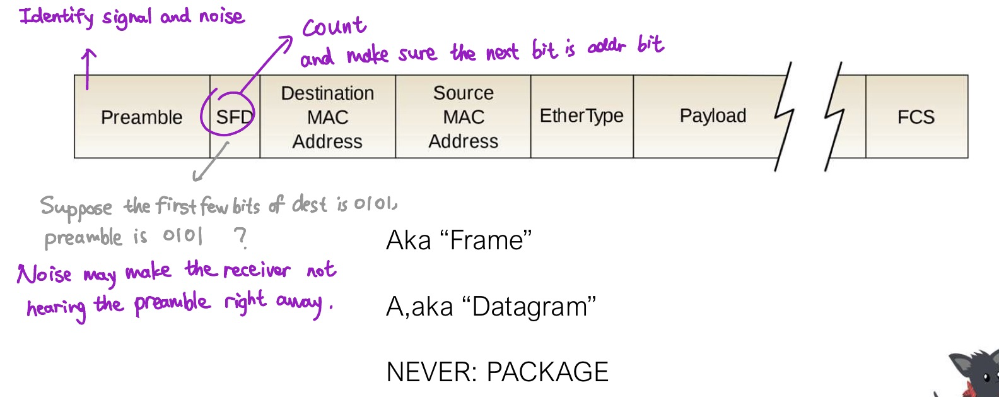
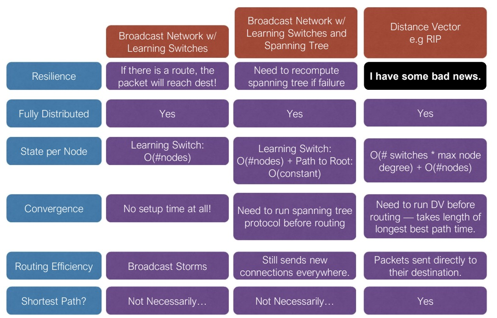
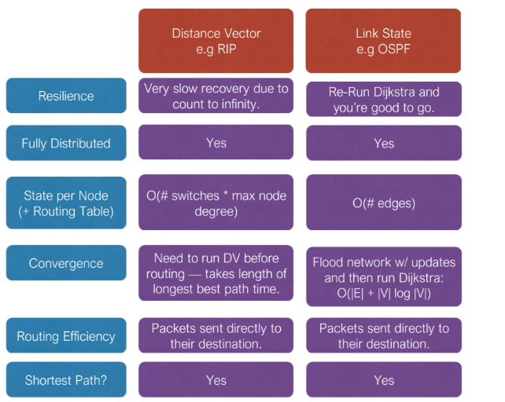
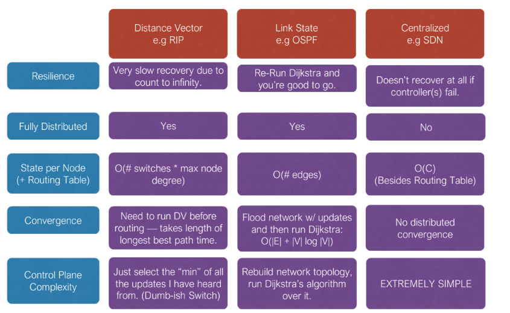
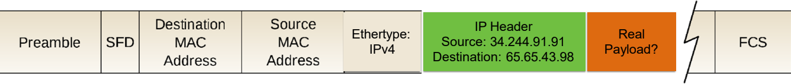



Disclaimer: 本人没选这门课，笔记是蹭课记的，不全，不建议用作参考。



# Lec 1

- **Propagation Delay**: how long the first bit is received
- **Transmission Delay**: how long it takes to put the remaining data

- Packet Latency = Transmission Delay + Propagation Delay

# Lec 3

解决多个设备同时发送/接收会冲突的问题

Solution: **Random Access Protocols**

- Carrier Sense: listen before you send
- Collision Detection: detect collisions and back off
  - Listen **while** you transmit. 
  - If you detect another signal, stop transmitting. Ethernet has you also send a special 'JAM' signal to tell other listeners that the transmission has been corrupted and stopped.
  - **Collision Recovery**: **Random Exponential Backoff**
    - 随机等待一段时间，随着冲突次数增加，随机等待时间的抽样范围变长
    - first collision: choose K from {0, 1}, delay K x 512 bit transmission times (timeslot)
    - second collision: choose K from {0,1,2,3}
    - 10+ collisions: choose K from {0,1, ..., 1023}
  - **Ethernet Multiple Access Protocol (CSMA/CD)**??  not used today 
- Collision Avoidance: request permission to send

**MAC addresses** (Media access control address)

- 48-bit long. Do not have a structure (think of them as random)

**Ethernet Packet**

- 
- **Preamble**: e.g. always 1010101010... repeating
- **SFD**: Start Frame Delimiter
- **FCS**: Frame Check Sequence (to detect errors)

**Routing**

- Routing, Generation 1: **Broadcast**
  - Everybody receives the package.
  - **Learning Switch Algorithm**

# Lec 4

## Spanning Tree Protocol

**Distributed Spanning Tree Overview**

- Embed a **tree** that provides a single unique path to each destination.
- Bridge with lowest ID (MAC addr) is **root**. 指定ID最小的人是root
- Each bridge finds and remembers the **shortest path to root**. 每人记住到root的最短长度和路径
- All nodes keep a simple data structure: **(Root, Path Length, Next Hop)** 

Basic Algorithm (交流建立tree的方法)

- Assume you are the root. Store (Me, 0, Me).
- Do {
  - tell neighbors (root, pathLength, yourID)
  - listen to neighbors, keep getting updates ... while ...
    - if their root ID is smaller, replace root, pathLength++
    - if their root ID is same but pathLength is shorter, replace pathLength and ++
    - if neighbor A and neighbor B both tell the same root, choose the shorter pathLength

**Resilience**: （指系统在遇到错误和挑战时还能不能保持正常功能）

**Fully distributed**: does not assume previous existence of a central coordinator

**Distance Vector (DV)**

- Each router maintains its **shortest distance to every destination** via **each of its neighbors**.
- Distance can be other value, e.g. latency.

# Lec 5

## Link State Algorithm

Link State:

- Everyone knows who they are connected to directly
- Everyone **broadcasts** a list of who they are connected to (and with link weight)
- Everyone can figure out what the entire graph is. (根据接收到的broadcast messages能推断出来)
- Everyone uses a shortest-path algorithm to find its **shortest path to each destination** (推断出entire graph之后使用算法找出最短路)
  - **DIJKSTRA算法**（greedy）寻找最短路
- Everyone then builds its own **forwarding table**

## Centralized Routing (aka Software-Defined Networking)

- Every node knows who it is connected to (和link state一样)
- All nodes tell a special **controller node** who they are connected to (而不是像link state一样broadcast to everyone)
- Controller computes the best routes for everyone
- Controller then tells everyone what to put in their routing tables

Fun fact: Centralized Routing is "state-of-the-art".

Because traditional routing algorithms **can't enforce policy requirements**

# Lec 6.

Four Challenges 存在的问题

- 1 Each network may have distinct ways of addressing the receiver 地址格式不同
- 2 Each network may accept data of different max size 不同网络支持的最大数据包大小不同
- 4 Within each network, communication may be disrupted due to unrecoverable mutation of data or missing data 可能出现丢包等
- 5 Status information, routing, fault detection, and isolation are different (actually multiple problems)
- 3下周再讲

## The Internet Protocol (IP) Addressing

- 对第一个问题的解决方法: Every host require an **Internet Address (IP)** that is distinct from its **local address** (e.g. MAC address). 需要一个IP地址，也就是常说的IPv4(32-bit), IPv6(128-bit)

- 如何获得IP地址? Using a protocol called **Dynamic Host Configuration Protocol (DHCP)**

- 如何使用IP地址？将IP地址信息也放在Ethernet header中 (放在原来payload的区域中)

  

- 如何routing? 
  - At the sender
    - If destination D is in **local** network: set IP dest to D's IP, set **Ethernet dest to D's Ethernet addr**
    - If destination D is **outside**: set IP dest to D's IP, set **Ethernet dest to my gateway's Ethernet addr**
  - **Gateway (aka router)** looks at packages it receives on its Ethernet addresses, peeks at the IP address, and use the IP addr to determine where to send the packet.
  - **netmask**: e.g. Gateway 34.244.91.1, netmask 255.255.255.0, means any IP address with 34.244.91.* are inside my LAN. Anything else is outside.

## Packet Sizing

- 对第二个问题的解决方法 (IPv4中): Allow routers to **'fragment' packets** into smaller ones
  - Every link has **Maximum Transmission Unit (MTU)**: max number of bytes of any packet
  - If packet larger than MTU, router split (sent as multiple IP packets). End-point reassemble it.
  - Adds complexity to IP header.
  - IPv6 does not use fragmentation. Instead: If packet too big, drop it and tell the sender, and then the sender knows to send smaller packets.

## Status Information, Routing, Potpourri?

- 对第五个问题的解决方法
  - 解决status information: New protocol called **Internet Control Message Protocol (ICMP)**
  - 解决routing, fault detection and isolation: 由每个network独立解决

## Loss

- 对第四个问题的解决方法：Internet不保证可靠传输，instead，host自己对丢失的packet重新传输
  - IP service model: 不保证will not be lost, 不保证 will not be corrupted, 不保证 will not be duplicated

## The Internet Model (architecture)

五个layer，从下到上

- **PHY / Physical**
- **LNK / Data Link**
- **NET / Network**
- **Transport**
- **Application**
