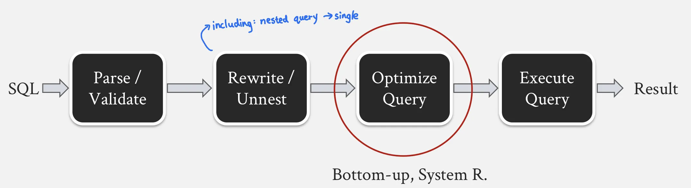
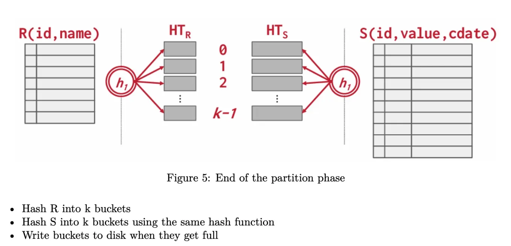
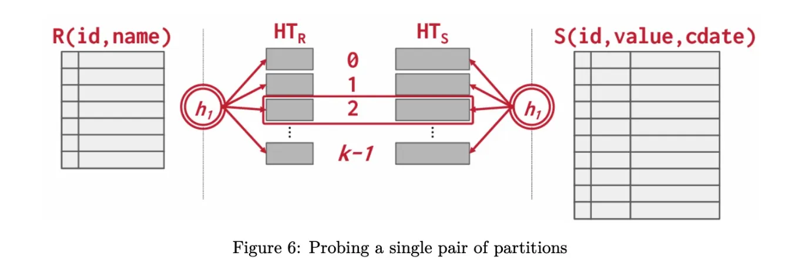
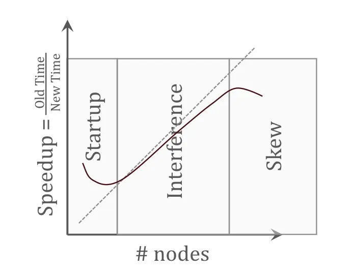
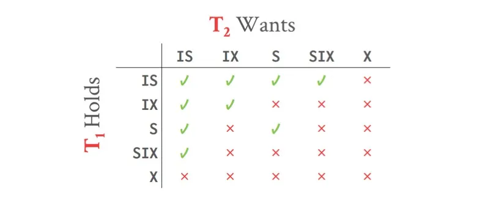
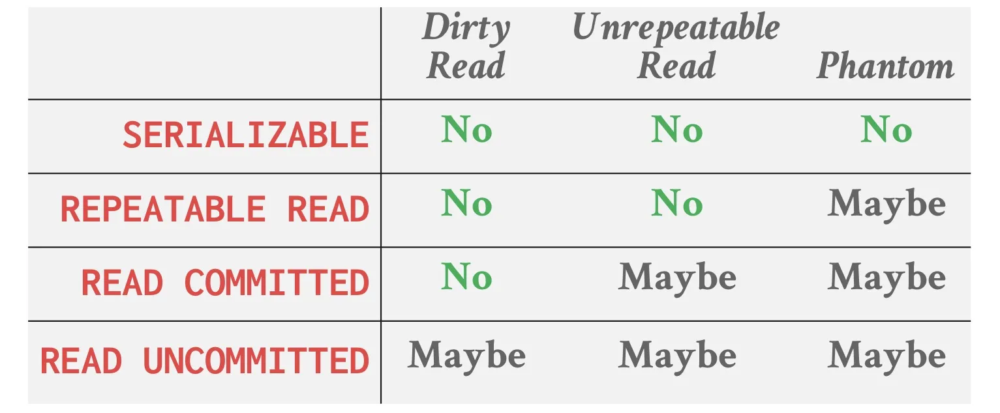
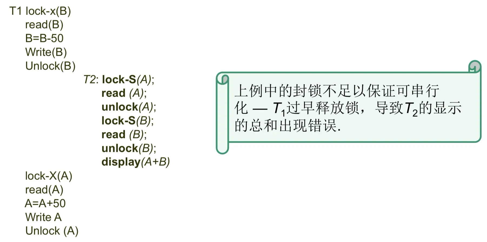

# Lec 2. System R optimizer

论文 A Relational Model of Data for Large Shared Data Banks

- key idea: **Data Independence (DI)** isolate user/application from low-level data representation.

  将用户看到的applications与底层数据存储结构隔离开

  - **Physical DI**: insulate against changes in internal structure, e.g. sorted file, index (比如说，switching from a sorted file to an indexed file, 用户看到的应用层不会改变)
  - **Logical DI**: insulate from changes in the schema (by using views)


**Multi-relation Query Planning**

- Choice 1 / **System R approach**: **Bottom-up optimization**
  - 从nothing开始，逐步添加subquery构建更大的plan
- Choice 2 / **Volcano / Cascades style**: **Top-down optimization**
  - 从整体查询开始，逐步分解为小的subquery

 

**Stages of processing SQL statement**



- **Parse**: the query block includes SELECT list, FROM list, WHERE clause fields. Checks validity.

- **Rewrite/Unnest**: including: nested queries --> flattened sub-queries; complex SQL queries --> simpler and equivalent forms.

- **Optimize**

  - **Bottom-up** approach: the optimizer evaluates all possible access paths and selects the plan with lowest total cost. **System R Optmizer** is this.

  - **Top-down** approach: the optimizer begins with the desired outcome and then works its way down the tree to identify the optimal plan to achieve the goal. 

    This results in having a working plan without enumerating the entire search space, at the cost of not having a globally optimal plan.

    An advantage: can timeout and still provide the best plan found so far. (In contrast, bottom-up requires processing all possible plans before delivering final result)

- **Execution**


Different plan structures: 

- bushy plan
- **left deep plan**: system R uses this
- linear plan


# Lec 3. The extensible cascades / Volcano QO


# Lec 5. Architecture-Conscious Query



Paper 1: P. A. Boncz, M. Zukowski, N. Nes: MonetDB/X100: [Hyper-Pipelining Query Execution.](https://www.cs.cmu.edu/~15721-f24/papers/X100_Hyper_Pipelining.pdf) CIDR 2005.

Paper 2: S. Schuh, X. Chen, J. Dittrich: [An Experimental Comparison of Thirteen Relational Equi-Joins in Main Memory.](https://www.cs.cmu.edu/~15721-f24/papers/Eval_13_Join_Algos.pdf) SIGMOD 2016.



Traditional: Single-node systems

Nowadays: processor caches started to appear. 需要memory access pattern更优的数据库系统；multi-core systems, division to E-cores and P-cores.

## Query Execution Processing Models

**Iterator model** (aka Volcano or Pipeline model)

-  每一次query被分解为一系列的操作符operator, 这些操作符按照流水线的方式逐个进行，处理完一条记录后立即传递给下一个操作符进行处理

- Each opertor consists of 3 main phases: **Open, Next, Close** 每一个操作符实现了open next close三个接口

In a traditional **tuple-at-a-time** execution, cache inefficiency. 每次调用 Next 时，操作符只处理一条记录。


**Vectorization model**

Each operator, like in the iterator model, implements a `Next` function. 

However operators emits batches of data at a time. 

Vectorized execution, combined with SIMD, is becoming a standard practice. 

## Other ways

Other ways to achieve high performance on modern processors

**Query Compilation**

- Transform the query to an intermediate form, then use LLVM to generate code.

**Early vs Lata Materialization in Column Stores**

- materialize: 存储中间结果
- **Eager** materialization: projecting and materializing all required values upfront, even before they are consumed by an operator later in the query plan.
- **Lazy** materialization: instead of immediately producing the full set of values, it passes only position identifiers or record IDs until the consuming operator specifically requires the data. Reduce IO traffic and mem usage. 
- **Hybrid**


# Lec 5. Architecture-Conscious Join

**Equi join**: one of the most important operators for db. 

Two common varieties

- **Sort-Merge Join (SMJ)**
- **Hash Join (HJ)**

## Partitioned Hash Join

Partitioned Hash Join consists of two phases: **partition phase** and **probe phase**

- Partition phase
  - 将两个table按照相同hash function各自进行hash。如果bucket内存不够放，放到disk。
  - 
- Probe phase
  - 将两个表的对应bucket逐一进行hash join。（此处hash join的体积较小）。
  - 

Partitioned Hash Join 处理大数据集时有用；每个分区可以并行处理。

**Multi-Core CPU Hash Join**

- We can create hash table partitions such that the smallest partition fits into cache. 

---

Equi join的例子

```sql
SELECT e.name, e.salary, d.department_name
FROM employees e
JOIN departments d
ON e.department_id = d.department_id;
```

equi join 非常常见因为数据库大多数表通过键值等值相互关联

sort-merge join: 通过对连接列进行排序，扫描排序后的两个表，合并相同键值



```
FUNCTION sort_merge_join(employees, departments)
    // Step 1: Sort both tables on the department_id
    SORT employees ON department_id
    SORT departments ON department_id

    // Step 2: Initialize pointers for both tables
    e_pointer = 0
    d_pointer = 0

    // Step 3: Iterate over both tables in a merge loop
    WHILE e_pointer < employees.size AND d_pointer < departments.size
        employee = employees[e_pointer]
        department = departments[d_pointer]

        // Step 4: Compare department_id from both tables
        IF employee.department_id == department.department_id THEN
            // Match found, output the result
            OUTPUT (employee.name, employee.salary, department.department_name)
            // Move both pointers forward since a match was found
            e_pointer += 1
            d_pointer += 1
        
        ELSE IF employee.department_id < department.department_id THEN
            // Employee department_id is smaller, move employee pointer
            e_pointer += 1

        ELSE
            // Department department_id is smaller, move department pointer
            d_pointer += 1
    END WHILE
END FUNCTION
```



hash join: 在内存中将一个较小的表的连接列构建为哈希表，然后遍历扫描另一个较大的表，通过查找哈希表中的匹配值来完成连接。



```
FUNCTION hash_join(employees, departments)
    // Step 1: Build a hash table from the smaller table, here assume departments is smaller
    HASH_TABLE = new HashTable()

    // Step 2: Insert departments into hash table using department_id as the key
    FOR EACH department IN departments
        HASH_TABLE.insert(department.department_id, department.department_name)
    END FOR

    // Step 3: Iterate through employees and probe the hash table for matches
    FOR EACH employee IN employees
        IF HASH_TABLE.contains(employee.department_id) THEN
            // Match found in hash table
            department_name = HASH_TABLE.get(employee.department_id)
            // Output the matching result
            OUTPUT (employee.name, employee.salary, department_name)
        END IF
    END FOR
END FUNCTION
```




# Lec 6. Parallel Database Systems



D. J. DeWitt, J. Gray: [Parallel Database Systems: The Future of High Performance Database Systems.](https://www.cs.cmu.edu/~15721-f24/papers/Parallel_Database_Systems.pdf) Commun. ACM (1992).



Background: 1980s, single machine performance is not enough.

Two options: **build database machines with specialized hardware** or to **run a single parallel database system over a cluster of general-purpose commodity machines**. The second option is appropriate.

**Types of Parallel Architectures**

- Shared memory
  - Pros: easy to migrate a single-node DBMS to this architecture; easily pass mem/buffers, so buffer pool management, catalog management, passing data between operators is easy. 
  - Cons: network expensive, does not scale as new nodes added
- Shared disk
  - Pros: same
  - Cons: network expensive (cheaper than shared memory), scalability
- **Shared nothing**
  - most scalable
  - Cons: nearly every component of DBMS needs change.


## **Metrics of Parallelism**: Speedup and Scaleup

- **Speedup** = Time of small system / Time of large system
  - **Ideally: linear** speedup. 
  - For a **fixed job**, twice as much hardware can perform in half time.
- **Scaleup** = Time of small job on small system / Time of large job on large system
  - **Ideally: 1**. Large system use K times as much hardware and the large job is K times as much as the small job.
  - Grow **both the job and system** sizes.

Impediments to perfect speedup

- 

- **Startup**: non-parallelizable time needed to start a parallel operation.
- **Interference**: operation slow down each other (e.g. network contention)
- **Skew**: variance among time consumed by different operations (jobs unevenly distributed)


## Parallelism in Relational Model

pipelined parallelism and partitioned parallelism

- **Pipelined Parallelism**

  - one operator streams its output to another. The two operators can execute in parallel

  - However, since

    - operation pipelines are usually short in relational queries
    - some operators (e.g. sorting, aggregation) need to consume all inputs before outputting anything
    - cost of one operator is much greater than others in the same pipeline (skew)

    The speedup is limited

- **Partitioned parallelism**

  - data is distributed across the nodes. A large part of speedup/scaleup comes from this.
  - Different partitioning schemes 不同划分数据的方法
    - **Range**: good for sequential, associative, and clustered access with those attributes. But can lead to **data skew** (划分不均匀)
    - **Round Robin**: evenly distribute, good for sequential scans, but bad for associative and clustered access because they require querying all nodes. 划分的最均匀，但缺少locality.
    - **Hash**: good for sequential and associative access. Bad for clustered access because hash tends to randomize data rather than cluster it. 
  - Data Partitioning Operators
    - Exchange operator (E): n个输入, m个输出, 使用特定的hash function来split input. 在m=1时，相当于merge操作.
    - 同时也能够设置为broadcast模式
    - Merge operator (M)


# Lec 7. Granularities of Locks



Paper: J. Gray, et al.: [Granularity of Locks and Degrees of Consistency in a Shared Data Base.](https://www.cs.cmu.edu/~15721-f24/papers/Granularities_of_Locking.pdf) IFIP Working Conference on Modelling in Data Base Management Systems 1976.



Granularities of Locks and Degrees of Consistency 多粒度锁

**ACID** property: **atomicity, consistency, isolation, durability**

**serializable**: a schedule equivalent to some serial execution of transactions.

Two operations **conflict** if:

- they are by different transactions
- they are on the same object and one of them is a write

Interleaved execution **anomalies**

- Read-Write conflicts (R-W) / Unrepeatable Read
- Write-Read conflicts (W-R) / Dirty Read
- Write-Write conflicts (W-W) / Loss Update


## Intention Locks

In addition to shared (S) and exclusive (X) lock: 

- **Intention-Shared (IS)** locks: 表示即将对更底层的某个节点加Shared锁
- **Intention-Exclusive (IX)** locks: 
- **Shared + Intention-Exclusive (SIX)** locks 

锁兼容性矩阵:



- S与S兼容，S与X、X与S、X与X互不兼容（本来就是这样）
- 注意IX与IX，IX与IS是可以兼容的（因为只代表某个descendent有意向加X锁，他们意向的descendent有可能不同）

加锁时：

- Start from the root node, in a top down manner. 首先对最上层的根节点加锁，从上往下加锁。
- To get S or IS on a node, the transaction must hold at least IS on parent node.
- To get X, IX or SIX on a node, must hold at least IX on parent node.
- 父节点被IX或IS方式加锁时，该节点可以被S或IS方式加锁
- 父节点被IX或SIX方式加锁时，该节点可以被X, SIX或IX方式加锁
- When releasing the locks, starting bottom up. 解锁时从leaf node往root node(从下往上)解锁。

**Lock upgrade**

- give priority to a transaction if it is already part of the granted group. 
- 如果一个资源已经被多个transaction加锁占用，也有其它的transaction正在等待，则已经是被授予的锁的组的一部分的那个transaction会优先进行（进行锁升级操作）。

**Deadlock 死锁**

死锁条件：

- **Mutual exclusion 互斥条件** （某个资源一次只能被一个事务占用，例如X锁，同时只能有一个人拿到X锁）
- **Hold and Wait 保存并等待条件**（某transaction在已经占有至少一个锁的同时，正在申请并等待其它锁）
- **No Preemption 非抢占条件** （资源不能被强行剥夺，只能由资源持有者主动释放）
- **Circular Wait 循环等待条件** （存在事务相互等待的等待循环）

避免死锁的方法

- **Deadlock detection**: Periodically examine the wait-for-graph, pick a victim (oldest txn or newest txn), abort it to break the deadlock
- **Deadlock prevention**: Abort a txn as soon as it waits for another txn. 
- Wound-wait or Wait-die


## Isolation Level

Want to allow various "degrees of consistency" in the same system and concurrent txns

Some txns may be ok with lower levels of consistency

四种isolation levels

- **Read Uncommitted**: 最低的isolation level。A transaction can read uncommitted writes of another transaction, 即可能发生dirty read。这个模式不使用read lock，只使用write lock。
- **Read Committed**: A transaction can read the committed writes of another transaction。这个模式的S和X锁会立即释放，不遵守2PL。
- **Repeatable Reads**: In a transaction, all reads on same values will return the same value. Reads are not interfered by writes of another transaction, despite committed or not。无法避免Phantom。这个模式会使用2PL。
- **Serializable**: 最高的isolation level。能够避免Phantom。





Interleaved execution **anomalies**

- Read-Write conflicts (R-W) / Unrepeatable Read
- Write-Read conflicts (W-R) / Dirty Read
- Write-Write conflicts (W-W) / Loss Update

**Phantom** 不属于常见的三种事务并发异常（Read-Write、Write-Read、Write-Write），而是额外的一种特殊异常。Phantom Read 是一种典型的 可串行化问题（Serialization Anomaly），




------

Two-phase locking (2PL)

- 满足2PL一定**recoverable 可恢复, serializable 可串行化**, 但满足recoverable, serializable不一定需要2PL

- **Shared mode** / Read lock 读锁: 其它事务只能再对A加S锁，而不能加X锁

- **Exclusive mode** / Write lock 写锁: 其它事务不能再加任何类型的锁

- Locking (Growing) Phase, Unlocking (Shrinking) Phase

  - 在release第一个锁之后，不能再加锁，必须要先growing phase再shrinking phase

  - 否则会无法保证serializable，例如

    

- **strict 2PL**: 在commit之后所有锁一起解锁

  - 2PL无法避免级联回滚 (cascading abort)，而strict 2PL可以避免。
  - **Cascading abort (级联回滚)**的意思是，某一个transaction需要回滚时，会连带导致其它transaction需要一并回滚。例如, T1对数据A进行修改，未commit，T2读取了T1修改的A，则T1由于某种原因需要回滚，T2也需要连带进行回滚。


# (todo) Lec 8. OCC-Optimistic Concurrency Control



H. T. Kung, J. T. Robinson: [On Optimistic Methods for Concurrency Control.](https://www.cs.cmu.edu/~15721-f24/papers/OCC.pdf) VLDB 1979.




# (todo) Lec 9. Hekaton



C. Diaconu, et al.: [Hekaton: SQL server's memory-optimized OLTP engine.](https://www.cs.cmu.edu/~15721-f24/papers/Hekaton_SQL_Server.pdf) SIGMOD 2013.




# (todo) Lec 10. Generalized Isolation Level



A. Adya, B. Liskov, P. E. O'Neil: [Generalized Isolation Level Definitions.](https://www.cs.cmu.edu/~15721-f24/papers/Generalized_Isolation_Levels_Definitions.pdf) ICDE 2000.


