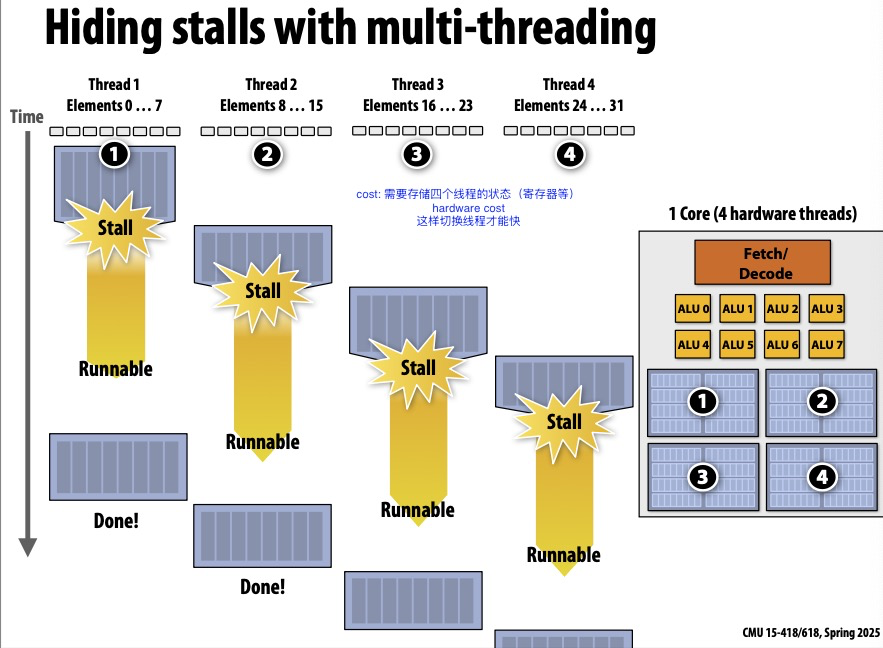
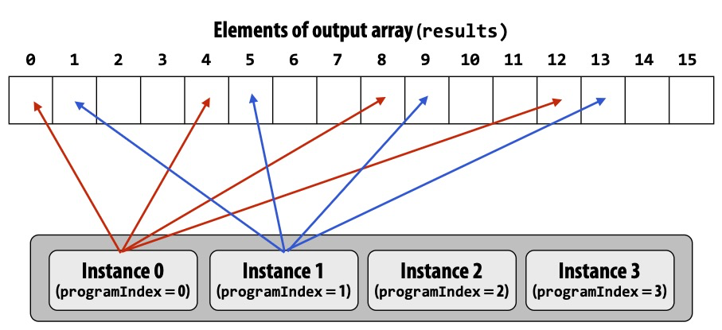
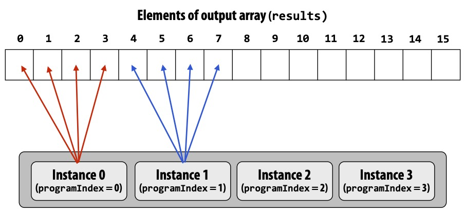
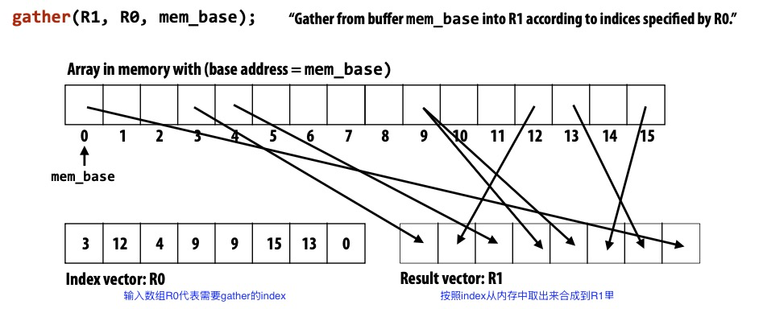
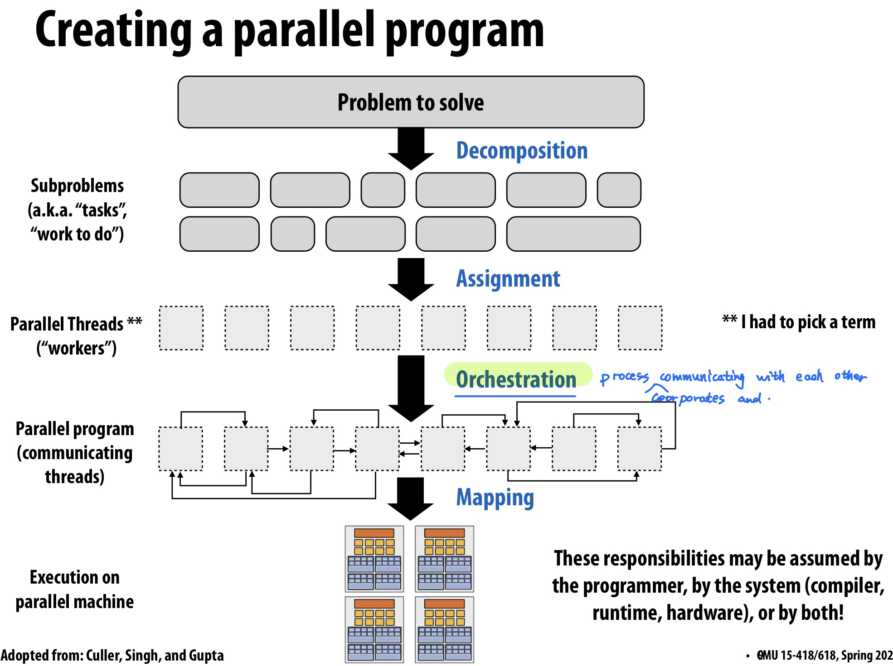
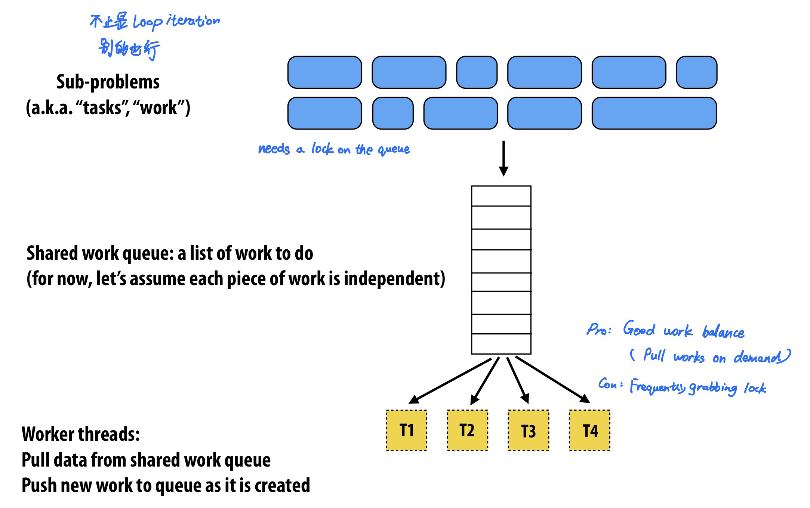
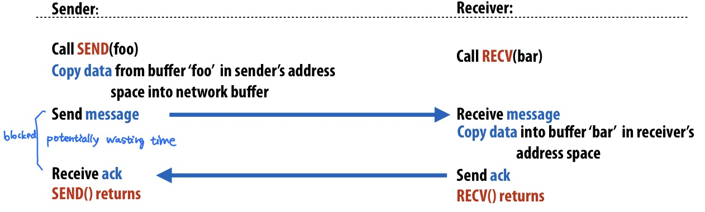
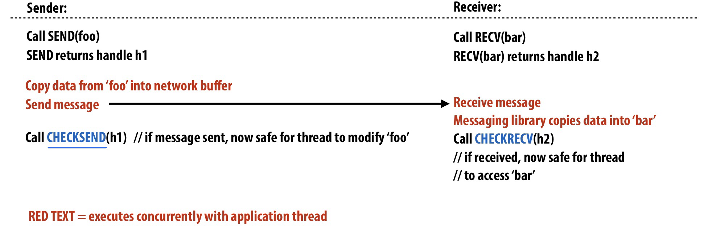
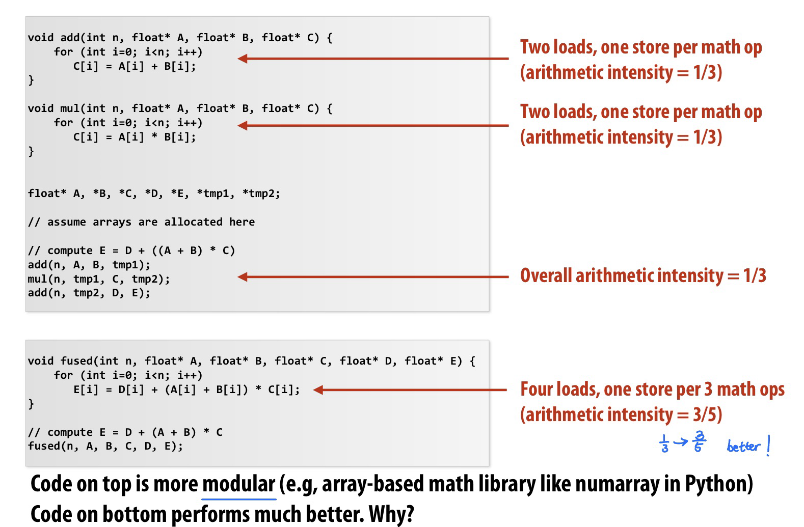
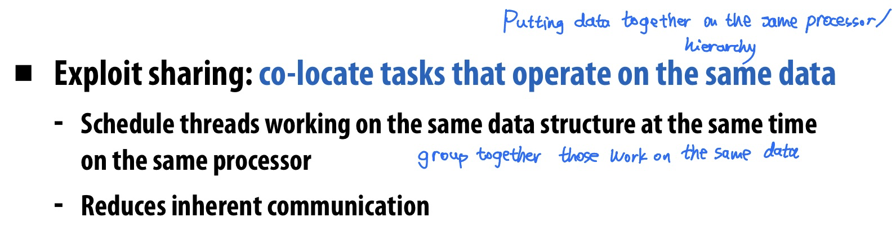

# Lec 2. A modern multi-core processor

4 key concepts: 两个与parallel execution有关, 两个与challenges of accessing memory 有关

## Parallel execution

- **Superscalar processor**: Instruction level parallelism (ILP)
  - ILP读未来的指令（每个周期读两条指令），有两个fetch/decode单元和两个exec单元，能够同时执行两条指令
- **Multi-core**: 多个processing cores
  - 多核之前，处理器提升重点在更大缓存，更多分支预测predictor等；同时更多晶体管（才能放得下更多缓存和更多predictor和乱序执行逻辑）促生更小的晶体管，促进更高的计算机主频
  - 2004年多核出现之后，人们在一个chip上放多个processor，用更多晶体管放更多核心。
- **SIMD processing** (aka **Vector processing**): 多个ALU(同一个core内)
  - 仍然只需要一个fetch/decode单元，多个ALU。
  - conditional execution: 如果想simd的程序块有if else，要通过mask处理
  - 手写avx代码（cpu指令）是**explicit SIMD**; 而GPU是**implicit SIMD**，因为compiler生成的并不是并行指令（是普通的scalar instructions），只有GPU硬件运行才是SIMD的

## Accessing memory

- **cache**: **reduce latency**

- **prefetching** reduces stalls: **hides latency**

- **Multi-threading**, **interleave** processing of multiple threads
  - 跟prefetching一样，也是hide latency，不能reduce latency
  - 指的是：开多个线程，在一个线程卡住的时候执行别的线程
  - 在下图中，创建thread1的时候不仅仅创建thread1，还会告诉电脑创建了thread 2 3 4，硬件检测线程是否发生了stall（被等待内存操作卡住），如果发生了stall会很快切换到别的线程，想juggling一样。硬件决定如何juggle这些线程。
  - 这样memory latency仍然存在，但是被hide了。memory latency在后台发生，前台CPU一直在执行有用的工作。
  - 这种操作会导致单个线程的执行时间变长（因为thread1从runnable到重新开始执行有一段空挡（这段空隙在执行thread 2 3 4）。
  - 需要更多硬件资源，存储线程的register等状态信息，这样切换线程才会快。且需要较大的memory bandwidth。



GPU设计成处理大量数据（远大于核内缓存的数据量）。

与CPU内存相比，GPU显存带宽更高，但延迟更高。


# Lec 3. Programming Models

## Abstraction vs Implementation

abstraction和implementation不是一个东西！


**ISPC** (Intel SPMD Program Compiler)

SPMD: single program multiple data

一个ISPC计算sin(x)的例子

- Interleaved

  - 

  - ```c
    export void sinx(
      uniform int N, uniform int terms,
      uniform float* x, uniform float* result) {
      // assume N % programCount = 0
      for (uniform int i=0; i<N; i+=programCount) {
        int idx = i + programIndex;
        // 不重要
      }
    }
    ```

- Blocked

  - 

  - ```c
    export void sinx(
      uniform int N, uniform int terms,
      uniform float* x, uniform float* result) {
      // assume N % programCount = 0
      uniform int count = N / programCount;
      int start = programIndex * count;
      for (uniform int i=0; i<count; i++) {
        int idx = start + i;
        // ... The same, 不重要
      }
    }
    ```

在这个示例中blocked比interleaved更好。

因为每个iteration工作量完全相同，SIMD指令load连续内存（直接_mm_load_ps1）比load不连续内存(这种操作叫gather，只在AVX2及以后才支持）更快。

我们可以使用`foreach`来代替。

`foreach`表示循环中的每一次iteration都是独立的，由ISPC决定如何分配

```c
foreach(i = 0 ... N) {
	// index ...
}
```

- ISPC: abstraction VS. Implementation
  - Programming model: SPMD
    - 程序员想的是，我们有programCount个逻辑指令流，写代码也按照这样的abstration去写
  - Implementation: SIMD
    - ISPC输出SSE4或AVX这种指令来实现逻辑操作


## Four Programming Models

- **Shared Address Space** model

  - 共享内存，不同线程通过读写同一块内存来通信

  - 很多人认为这是最方便易用的model，因为这和sequential programming最相近

  - 每个处理器都能访问任意内存地址

  - **Uniform memory access** time; Symmetric shared-memory multi-processor (SMP), : 指每个处理器都能访问内存且访问内存所需时间一致。**Scalability不好。**

    

  - **Non-uniform memory access (NUMA)**: 每个处理器都能访问完整内存，但所需时间不一致。这样**Scalability**比较好。但是performance tuning可能需要更多精力。

- **Message Passing** model

  - 线程之间不共享内存（address space不共享），只能通过发送和接收messages通信
  - 相比shared memory的优点：不需要别的硬件，可以纯软件做，实现起来简单。常用的库是**MPI** (message passing interface)
  - 现代很常用的操作是，在一个节点（节点内是多核的）内用shared address，在不同节点间用message passing



这里很搞：abstraction can target different types of machines.

分清**abstraction**和**implementation**的区别！

比如说：

message passing 这个 **abstraction** 可以使用硬件上的 shared address space 来 **implement**。

- 发送/接收消息就是读写message library的buffer。

shared address space 这个 **abstraction** 在不支持硬件 shared address space 的机器上也可以用软件来 **implement** (但是低效)

- 所有涉及共享变量的page都标记成invalid，然后使用page-fault handler来处理网络请求



- **The data-parallel** model
  - 上面的shared address space和message passing更general
  - data-parallel更specialized, rigid。
  - 在不同的数据（数据块）上执行相同的操作。
  - 通常用SPMD的形式：**map (function, collection)**，其中对所有的数据都做function的操作，function可以是很长的一段逻辑，比如一个loop body。collection是一组数据，可以包含多个数据。
  - **gather/scatter**: gather是把本来不连续的数据按照index放到一起，scatter是把本来连续的数据分散开。

- **The systolic arrays** model

  - 读内存太慢了，memory bandwidth会成为瓶颈

  - 所以要**避免不必要的内存读取**，尽量只读一次内存，做完所有需要用到这块内存的操作，再写回去。
  - 示例：矩阵乘法  https://www.youtube.com/watch?v=2VrnkXd9QR8


# Lec 5. Parallel Programming Basics




- **Decomposition**

  把问题分解成 **tasks** 

  Main idea: 创造至少能把机器占满的tasks数量，通常对于t个processor会给多于t个task，并且要让这些task尽可能 **independent**.

  **Amdahl's Law**: 程序中有S部分只能顺序运行（无法用并行加速）则整个程序的speedup $\leq$ 1/S.
  
  通常是programmer负责decomposition。
  
- **Assignment**

  Goal: **balance workload, reduce communication costs**

  can be performed **statically** or **dynamically**

  - statically: e.g. ISPC `foreach`
  - dynamically: e.g. ISPC `launch tasks` 运行的时候会维护线程池，线程池中的线程从任务队列中读。这样做的优点是runtime workload balance. 
  
- **Orchestration**

  Goal: **reduce communication/sync cost**, preserve locality of data reference, reduce overhead

  需要考虑机器的特性（上面的decomposition和assignment不用太考虑）。

  包括
  
  - **structuring communication**: 信息传递模型 e.g. 传一个chunk数据而不是只传一个byte，节约overhead
  - **adding synchronization** to preserve dependencies
  - organizing **data structures** in memory
  - **scheduling** tasks
  
- **Mapping** to hardware

  对程序员来说是optional的。programmer可以显式制定哪个thread跑在哪个processor上。

  - mapping by **OS**: e.g. pthread
  - mapping by **compiler**: e.g. ISPC maps ISPC program instances to vector instruction lanes
  - mapping by **hardware** e.g. GPU map CUDA threads to GPU cores
  
  Mapping 还能有不同的decisions，比如说
  
  - Place **related** threads on the same processor: 最大化locality，共享数据，减少通讯成本
  - Place **unrelated** threads on the same processor: 可能一个thread受制于内存带宽，另一个受制于计算时间，这两个thread放在一起可以让处理器利用率更高


A parallel programming example: 2D-grid based solver

TODO here.


# Lec 6. Work Distribution & Scheduling

key goals:

- balance workload
- reduce communication
- reduce extra work (overhead)

## workload balance

- **Static assignment**

  任务分配在运行之前就已经 **pre-determined**

  例如之前讲的blocked assignment和interleaved assignment.

  **Zero runtime overhead**

  当任务量可预测时可以使用。不一定要任务量相同，可预测不会变就行。

- **Semi-static assignment**

  可预测未来短期内的任务量

  一边运行一边profile并调整任务分配（periodically profiles itself and re-adjusts assignment）

- **Dynamic assignment**

  任务量unpredictable.

  - ```c
    while (1) {
      int i;
      lock(counter_lock);
      i = counter++;
      unlock(counter_lock);  // 或使用 atomic_incr(counter); 代替
      if (i >= N) break;
      // do with index i
    }
    ```

    processors grab value i as needed.

    **granularity** 可调，让1次获取多个i值可以降低synchronization cost.

    - small granularity --> good workload balance, high synchronization cost (overhead)
    - large granularity --> may have bad workload balance, minimize overhead
  
  - **shared work queue**
  
    优点：good work balance (pull work on demand)
  
    缺点：high synchronization cost (使用锁会占用时间)
  
    
  
  - **smarter task scheduling**
  
    假设任务量不是平均的，16个任务（编号1-16）中第16号任务特别长。
  
    那么用work queue会出现分配不均。但是如果采用 schedule long tasks first 的策略，可以缓解这个问题。
  
    例子：测试素数的程序中，越大的数越有可能触碰到最坏的复杂度，越有可能需要耗时长，所以从大数忘小的数算。
  
    
  
    
  
  - **Distributed set of queues**
  
    每个线程有自己的work queue。自己的work queue空了之后，从别的线程那里steal。
  
    大部分时间（不发生steal的时候）每个线程只读自己的queue，提高了locality，降低synchronization cost (communication)

## fork-join parallelism

### Writing fork-join programs

C++ extension: **Cilk plus**

- `cilk_spawn foo(args)`: （可能会）分出来一个线程调用foo函数。spawn只是一个建议，可能会开新线程也可能不开，如果不能开新线程（开新线程不会加速）那么就不会fork-off。
- `cilk_sync`: 类似于join，所有spawn的线程都运行完才会返回。包含`cilk_spawn`的函数末尾会自动加上cilk_sync.

Example: quick sort

```c
void quick_sort(int *begin, int *end) {
  if (begin >= end - PARALLEL_CUTOFF) std::sort(begin, end);
  else {
    int *middle = partition(begin, end);
    cilk_spawn quick_sort(begin, middle);
    quick_sort(middle+1, last);
  }
}
```

### Scheuling fork-join programs

- Bad idea: `cilk_spawn` --> `pthread_create`, `cilk_sync` --> `pthread_join` 

  因为创建kernel thread开销很大。

  应该用线程池。

- 让idle thread 从别家thread的queue里steal work to do.

  **continuation first**:

  - record child for later execution
  - child is made available for stealing by other threads (child stealing)
  - 在遇到spawn的时候，自己执行spawn后面的任务，并把spawn出来的放在自己的work queue里，等待别的线程（如果别的线程有空闲）steal自己的任务。
  - 如果没有stealing，那么（相比于去除所有spawn语句）执行顺序全都是反的

  **child first**:

  - record continuation for later execution
  - continuation is made available for stealing by other threads (continuation stealing)
  - 遇到spawn的时候，只创建一个可被steal的项目。

- work queue可以用**dequeue** (double-ended queue)实现

  每一个线程有自己的work queue，针对自己的work queue，在尾部添加，从尾部取出

  如果要steal别的线程的work queue，从头部取出


# Lec 7. Locality, Communication, and Contention

Lec6讲如何平均分配任务，Lec7讲如何降低communication开销.

- **synchronous (blocking)** send and receive

  

-  **non-blocking asynchronous** send and receive

  send()和recv()函数会立即返回 在后台做事

  


## Pipeline

使用Pipeline: **Latency 不变, Throughput 增加**

例子：

- Communication = Overhead(橙色) + Occupancy (蓝色) + Network delay (灰色)

- 最长的部分是瓶颈，决定了throughput上限


- **Overlap**: communication和其它工作同时运行的时间。

  我们希望能尽可能增加overlap这样communication cost才会降低。

  降低overlap的方法

  - Example 1: **Asynchronous** message send/recv 异步消息
  - Example 2: **Pipelining** 发送多条消息时让这个发送过程overlap


## Communication

Communication包含inherent和artifactual

- **Inherent communication**: 程序算法写好的，必须发生的通信

  - Communication-to-computation ratio: 通信量/计算量 的比值。越低越好。
  - **arithmetic intensity**: 1/communication-to-computation ratio. 越高越好。

- **Artifactual communication**: 所有别的通信，因为memory hierarchy导致额外的通信，例如L1/L2/L3/内存/网络之间的通信。包括：

  ① 系统有**minimum granularity of transfer**: 即使只需要读取4byte数据，也需要复制64-byte整条cache line

  ② 系统有**rules of operation**: 例如，写入内存需要先把内存读到cache line中（write-allocate）之后踢出cache line再写入内存，导致一次写入操作需要访问两次内存

  ③ **Poor placement** of data in distributed memories: 被某个processor访问最多的数据并没有放在这个processor附近

  ④ Finite replication **capacity**: 因为cache太小放不下，会被踢掉，所以有一些数据频繁被踢出/放入cache

  提高**locality**对降低artifactual communication很重要


提高**temporal locality**的例子

- by changing grid traversal order

  

- by fusing loops

  

- by sharing data

  

提高**spatial locality**

- false sharing 不好

- **4D array layout** (**blocked data layout**): Embedding a 2D array within another 2D array allows page granularities to remain within a tile, making it practical to map data to local portions of physical memory (thereby reducing cache miss latencies to main memory).

  


## Contention

**Contention**: 在短时间内很多人请求同一个resource

Example: distributed work queues (让每个线程有自己的work queue)可以降低contention


## Summary

- 降低communication costs
  - **Reduce overhead**: 发更少的消息数量，更长的消息内容（合并短消息）
  - **Reduce delay**：提高locality
  - **Reduce contention**: 把contended resource分开，例如local copies, fine-grained locks
  - **Increase overlap**: 用异步消息、pipeline等 提高communication和computation的overlap


# Lecture 9. Workload-Driven Perf Evaluation


- Super-linear Speedup: 
  - processor足够多的时候，每个processor分到的数据fits in cache
- Decreasing Speedup:
  - 随着processor增多，communication占比太大了
- Low speedup:
  - Increasing contexts are hyperthreaded contexts (?)


**Resource-oriented** scaling properties

- **Problem constrained** scaling (PC)
  - 更快速解决同一个问题
- **Memory constrained** scaling (MC)
  - 不爆内存的情况下运行最大能完成的任务
- **Time constrained** scaling (TC)
  - 同样的时间内完成更多任务


## Simulation

**Execution-driven** simulator

- 模拟内存，模拟内存访问
- 模拟器的performance通常与模拟的细节数量成反比

**Trace-driven** simulator

- 在real machine上运行real code得到内存访问的trace，或者用execution-driven simulator生成trace
- 然后在模拟器上运行trace


# 一些基础知识

## ISPC

ISPC代码调用时会生成多个program instances, 可以利用 `programCount` 和 `programIndex` 来获取instance总数和当前instance编号。

`uniform` 表示在一个SIMD程序块中，变量对所有SIMD通道都是相同的值。仅仅是一种优化，不影响正确性(因为uniform变量只需要加载一次或执行一次，编译器可以做出优化，不加uniform可能造成不必要的重复计算)。

非uniform (`varying`) 表示变量在不同SIMD通道可能有不同的值。

所以说 `programCount` 是 uniform, `programIndex` 是 varying.

-----


ISPC可以通过tasks来实现多核加速，利用多线程。

Contrary to threads, tasks do not have execution context and they are only pieces of work. ISPC编译器接受tasks并自行决定启动多少个threads。

通常我们应该启动比cpu逻辑线程数更多的tasks数量，但也不要太多，否则会有scheduling的overhead。

task自带 `taskIndex`。


## CUDA

host是CPU, device是GPU

`__device__`: 在device上执行，只能在device中调用

`__global__`: 在device上执行，只能在host中调用

`__host__`: 在host上执行且只能在host上调用

`cudaMemcpy(dst, src, size, cudaMemcpyDeviceToHost)`

----


threads grouped into blocks

需要指明blocks的数量，和每个block中threads的数量。

假设n是总的threads数量, t是每个block中threads的数量。

`KernelFunction<<<ceil(n/t), t>>>(args)`

每一个thread都会运行同样的kernel，每一个thread由blockID和这个block中的threadID来标识。

----


Example: 

```c
__global__ void vecAddKernel(float* A, float* B, float* C, int n) {
    int i = threadId.x + blockDim.x * blockId.x;
    if (i<n) C[i] = A[i] + B[i];
}
void vecAdd(float* A, float* B, float* C, int n) {
    int size = n * sizeof(float);
    float *d_A, *d_B, *d_C;
  
    cudaMalloc((void **) &d_A, size);
    cudaMemcpy(d_A, A, size, cudaMemcpyHostToDevice);
    cudaMalloc((void **) &d_B, size);
    cudaMemcpy(d_B, B, size, cudaMemcpyHostToDevice);
    cudaMalloc((void **) &d_C, size);
  
    vecAddKernel<<<ceil(n/256), 256>>>(d_A, d_B, d_C, n);
    
  	cudaMemcpy(C, d_C, size, cudaMemcpyDeviceToHost);
    cudaFree(d_A); cudaFree(d_B); cudaFree(d_C);
}
```


注: 为什么`cudaMalloc`第一个参数是二级指针，而不直接使用返回值来赋值给指针？

因为 `cudaMalloc` 的返回值已经用来返回 `cudaError_t`。

----


grid和blocks可以是1D, 2D, 3D的。上面这个例子是1D，所以是"`.x`"

2D的例子：假设要把一个WIDTH x WIDTH的矩阵P分成几块。

WIDTH=8, TILE_WIDTH为2的话，就是把8x8的矩阵分成16个小块(grid)，每一个小块大小是2x2(4个thread)。

```c
dim3 dimGrid(WIDTH / TILE_WIDTH, WIDTH / TILE_WIDTH, 1);
dim3 dimBlock(TILE_WIDTH, TILE_WIDTH, 1);
MatrixMulKernel<<<dimGrid, dimBlock>>>(args);
```

每一个thread可以用以下方式来标识

```c
row    = blockId.y * blockDim.y + threadId.y;
column = blockId.x * blockDim.x + threadId.x;
```

----


为什么用两层threads？因为组成多个grid的thread blocks比一个很大的单个thread block更好管理。

GPU有很多很多核心，核心group成SM(streaming multiprocessors)，每一组SM有自己的内存和调度。

GPU不同时启动所有100万个threads，而是把大约1000个thread装进一个block里，并分发给SM。

assign给SM的thread block会使用SM的资源（寄存器和共享内存）。这些资源已经pre-allocated，且由于寄存器数量很多，在切换threads时不需要register flush。

----


不同的block可以用任何顺序运行，因此不能assume block2在block1之后运行。如果真的要这么做，需要放在不同的kernel里（启动kernel比较耗资源）

同一个block中的thread可以使用 `__syncthreads()` 来做barrier synchronization。

但是通常不建议使用 `__syncthreads()`

----


如何选择合适的block size？

- Consideration 1: hardware constraints
  - 例如：每一个SM分配小于1536个thread，小于8个block；每一个block小于512个thread
- Consideration 2: complexity of each thread
- Consideration 3: thread work imbalance.


----


GPU memory

Global memory很慢，所以同时运行大量线程，线程因为内存IO卡住的时候切换其它线程，这是massive multi-threading (MMT).

这样总的throughput很高，即使每个thread的延迟也很高。

每个SM有自己的scheduler，每个SM存储了所有thread的context(PC, reg等)，所以SM内能做到零开销线程切换。同时，SM scheduler有一个scoreboard追踪哪些thread是blocked/unblocked，所以SM有大约30个核但可以运行大约1000个线程。

----


Tiled MM是一种进行矩阵乘法 内存友好的方法。

CUDA类型关键词

- `__device__ __shared__` memory: shared; scope: block; lifetime: block
- `__device__` memory: global; scope: grid; lifetime: application
- `__device__ __constant__` memory: constant; scope: grid; lifetime: application


----


Race conditions:

CUDA中难以实现mutex，而且包含critical sections的代码在GPU上本来就运行得不好。

CUDA中有一些原子操作，可以在global或shared memory变量上操作

- `int atomicInc(int *addr)`: 加一，返回旧值
- `int atomicAdd(int *addr, int val)`: 加val, 返回旧值
- `int atomicMax(int *addr, int val)`: 让*addr=max(*addr, val) 并返回旧值
- `int atomicExch(int *addr1, int val)`: set
- `int atomicCAS(int *addr, old, new)`: Compare and swap. 
  - `if (*addr == old) *addr = new; `

