# Lec 2. A modern multi-core processor

4 key concepts: 两个与parallel execution有关, 两个与challenges of accessing memory 有关

## Parallel execution

- **Superscalar processor**: Instruction level parallelism (ILP)
  - ILP读未来的指令（每个周期读两条指令），有两个fetch/decode单元和两个exec单元，能够同时执行两条指令
- **Multi-core**: 多个processing cores
  - 多核之前，处理器提升重点在更大缓存，更多分支预测predictor等；同时更多晶体管（才能放得下更多缓存和更多predictor和乱序执行逻辑）促生更小的晶体管，促进更高的计算机主频
  - 2004年多核出现之后，人们在一个chip上放多个processor，用更多晶体管放更多核心。
- **SIMD processing** (aka **Vector processing**): 多个ALU(同一个core内)
  - 仍然只需要一个fetch/decode单元，多个ALU。
  - conditional execution: 如果想simd的程序块有if else，要通过mask处理
  - 手写avx代码（cpu指令）是**explicit SIMD**; 而GPU是**implicit SIMD**，因为compiler生成的并不是并行指令（是普通的scalar instructions），只有GPU硬件运行才是SIMD的

## Accessing memory

- **cache**: **reduce latency**

- **prefetching** reduces stalls: **hides latency**

- **Multi-threading**, **interleave** processing of multiple threads
  - 跟prefetching一样，也是hide latency，不能reduce latency
  - 指的是：开多个线程，在一个线程卡住的时候执行别的线程
  - 在下图中，创建thread1的时候不仅仅创建thread1，还会告诉电脑创建了thread 2 3 4，硬件检测线程是否发生了stall（被等待内存操作卡住），如果发生了stall会很快切换到别的线程，想juggling一样。硬件决定如何juggle这些线程。
  - 这样memory latency仍然存在，但是被hide了。memory latency在后台发生，前台CPU一直在执行有用的工作。
  - 这种操作会导致单个线程的执行时间变长（因为thread1从runnable到重新开始执行有一段空挡（这段空隙在执行thread 2 3 4）。
  - 需要更多硬件资源，存储线程的register等状态信息，这样切换线程才会快。且需要较大的memory bandwidth。

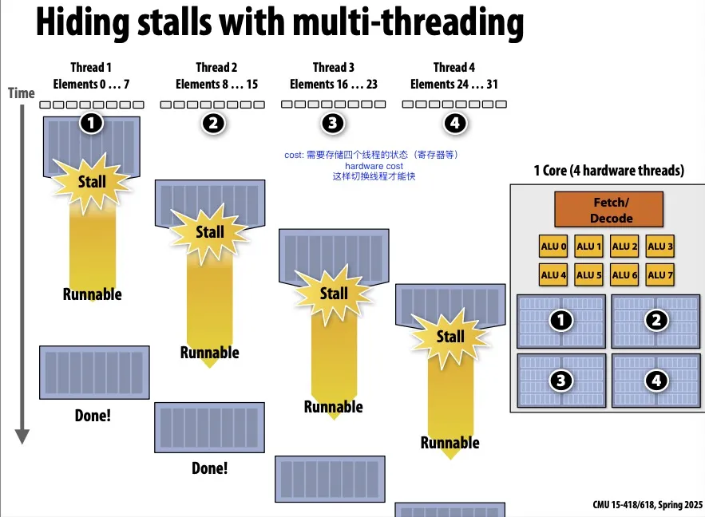

GPU设计成处理大量数据（远大于核内缓存的数据量）。

与CPU内存相比，GPU显存带宽更高，但延迟更高。


## 关于NV GPU架构的一些备注

一个GPU有多个SM；每个SM上有一块shared memory；同时每个线程有自己的registers和local memory，但如果线程registers超出，则会溢出到global memory。

因为一个block保证在一个SM上，所以threads within a block可以访问__shared__ memory。

Warp是硬件规定好的，通常为32-threads，warp内一定所有线程在任意时刻都做同一件事情（如果遇到branch divergence，则会被mask out，但warp仍然同一时刻执行同一个branch）

假设block size是256（程序员指定的），warp为32（硬件规定），那么threads in the same block可能在不同的warp里，threads within a block可能同一时刻在执行不同的指令，因为它们在不同的warp调度不同。


# Lec 3. Progpramming Models

## Abstraction vs Implementation

abstraction和implementation不是一个东西！


**ISPC** (Intel SPMD Program Compiler)

SPMD: single program multiple data

一个ISPC计算sin(x)的例子

- Interleaved

  - 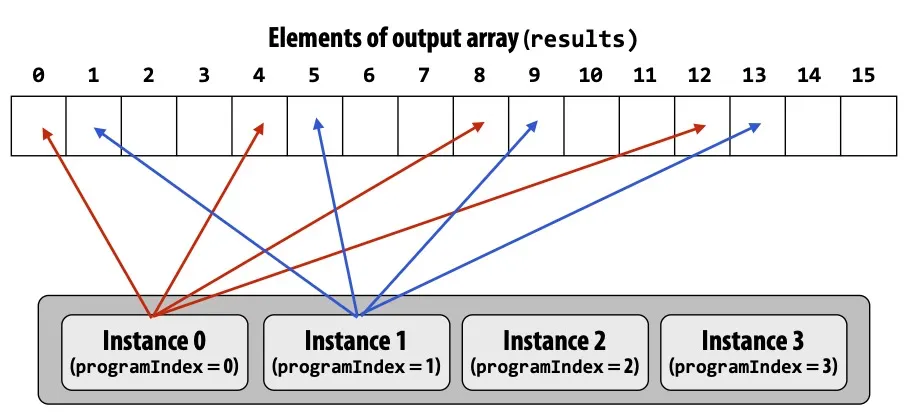

  - ```c
    export void sinx(
      uniform int N, uniform int terms,
      uniform float* x, uniform float* result) {
      // assume N % programCount = 0
      for (uniform int i=0; i<N; i+=programCount) {
        int idx = i + programIndex;
        // 不重要
      }
    }
    ```

- Blocked

  - 

  - ```c
    export void sinx(
      uniform int N, uniform int terms,
      uniform float* x, uniform float* result) {
      // assume N % programCount = 0
      uniform int count = N / programCount;
      int start = programIndex * count;
      for (uniform int i=0; i<count; i++) {
        int idx = start + i;
        // ... The same, 不重要
      }
    }
    ```

在这个示例中blocked比interleaved更好。

因为每个iteration工作量完全相同，SIMD指令load连续内存（直接_mm_load_ps1）比load不连续内存(这种操作叫gather，只在AVX2及以后才支持）更快。

我们可以使用`foreach`来代替。

`foreach`表示循环中的每一次iteration都是独立的，由ISPC决定如何分配

```c
foreach(i = 0 ... N) {
	// index ...
}
```

- ISPC: abstraction VS. Implementation
  - Programming model: SPMD
    - 程序员想的是，我们有programCount个逻辑指令流，写代码也按照这样的abstration去写
  - Implementation: SIMD
    - ISPC输出SSE4或AVX这种指令来实现逻辑操作


## Four Models of Communication

- **Shared Address Space** model

  - 共享内存，不同线程通过读写同一块内存来通信

  - 很多人认为这是最方便易用的model，因为这和sequential programming最相近

  - 每个处理器都能访问任意内存地址

  - **Uniform memory access** time; Symmetric shared-memory multi-processor (SMP), : 指每个处理器都能访问内存且访问内存所需时间一致。**Scalability不好。**

    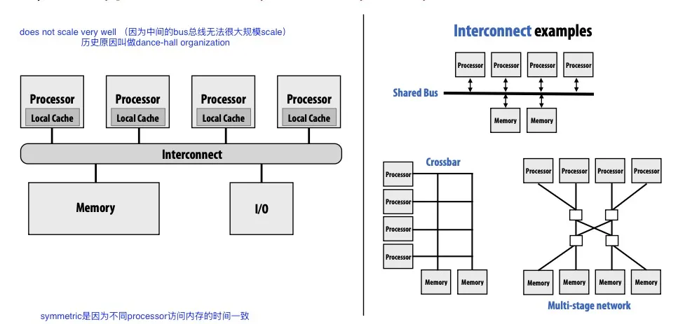

  - **Non-uniform memory access (NUMA)**: 每个处理器都能访问完整内存，但所需时间不一致。这样**Scalability**比较好。但是performance tuning可能需要更多精力。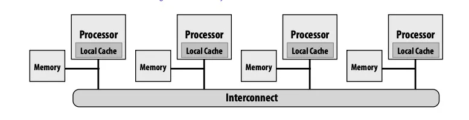

- **Message Passing** model

  - 线程之间不共享内存（address space不共享），只能通过发送和接收messages通信
  - 相比shared memory的优点：不需要别的硬件，可以纯软件做，实现起来简单。常用的库是**MPI** (message passing interface)
  - 现代很常用的操作是，在一个节点（节点内是多核的）内用shared address，在不同节点间用message passing



这里很搞：abstraction can target different types of machines.

分清**abstraction**和**implementation**的区别！

比如说：

message passing 这个 **abstraction** 可以使用硬件上的 shared address space 来 **implement**。

- 发送/接收消息就是读写message library的buffer。

shared address space 这个 **abstraction** 在不支持硬件 shared address space 的机器上也可以用软件来 **implement** (但是低效)

- 所有涉及共享变量的page都标记成invalid，然后使用page-fault handler来处理网络请求



- **The data-parallel** model
  - 上面的shared address space和message passing更general
  - data-parallel更specialized, rigid。
  - 在不同的数据（数据块）上执行相同的操作。
  - 通常用SPMD的形式：**map (function, collection)**，其中对所有的数据都做function的操作，function可以是很长的一段逻辑，比如一个loop body。collection是一组数据，可以包含多个数据。
  - **gather/scatter**: gather是把本来不连续的数据按照index放到一起，scatter是把本来连续的数据分散开。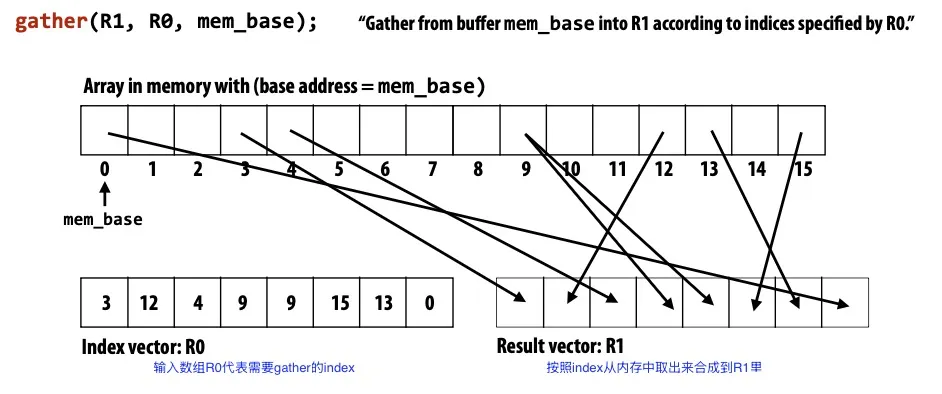

- **The systolic arrays** model

  - 读内存太慢了，memory bandwidth会成为瓶颈

  - 所以要**避免不必要的内存读取**，尽量只读一次内存，做完所有需要用到这块内存的操作，再写回去。
  - 示例：矩阵乘法  https://www.youtube.com/watch?v=2VrnkXd9QR8

概括four models of communication

- shared address space: 共享内存通信
- message passing: 发消息通信
- data parallel: 对一大块数据分块执行相同操作
- systolic arrays: 减少内存读取


# Lec 5. Parallel Programming Basics


- **Decomposition**

  把问题分解成 **tasks** 

  Main idea: 创造至少能把机器占满的tasks数量，通常对于t个processor会给多于t个task，并且要让这些task尽可能 **independent**.

  **Amdahl's Law**: 程序中有S部分只能顺序运行（无法用并行加速）则整个程序的speedup $\leq$ 1/S.
  
  通常是programmer负责decomposition。
  
- **Assignment**

  Goal: **balance workload, reduce communication costs**

  can be performed **statically** or **dynamically**

  - statically: e.g. ISPC `foreach`
  - dynamically: e.g. ISPC `launch tasks` 运行的时候会维护线程池，线程池中的线程从任务队列中读。这样做的优点是runtime workload balance. 
  
- **Orchestration**

  Goal: **reduce communication/sync cost**, preserve locality of data reference, reduce overhead

  需要考虑机器的特性（上面的decomposition和assignment不用太考虑）。

  包括
  
  - **structuring communication**: 信息传递模型 e.g. 传一个chunk数据而不是只传一个byte，节约overhead
  - **adding synchronization** to preserve dependencies
  - organizing **data structures** in memory
  - **scheduling** tasks
  
- **Mapping** to hardware

  对程序员来说是optional的。programmer可以显式制定哪个thread跑在哪个processor上。

  - mapping by **OS**: e.g. pthread
  - mapping by **compiler**: e.g. ISPC maps ISPC program instances to vector instruction lanes
  - mapping by **hardware** e.g. GPU map CUDA threads to GPU cores
  
  Mapping 还能有不同的decisions，比如说
  
  - Place **related** threads on the same processor: 最大化locality，共享数据，减少通讯成本
  - Place **unrelated** threads on the same processor: 可能一个thread受制于内存带宽，另一个受制于计算时间，这两个thread放在一起可以让处理器利用率更高


A parallel programming example: 2D-grid based solver

TODO here.


# Lec 6. Work Distribution & Scheduling

key goals:

- balance workload
- reduce communication
- reduce extra work (overhead)

## workload balance

- **Static assignment**

  任务分配在运行之前就已经 **pre-determined**

  例如之前讲的blocked assignment和interleaved assignment.

  **Zero runtime overhead**

  当任务量可预测时可以使用。不一定要任务量相同，可预测不会变就行。

- **Semi-static assignment**

  可预测未来短期内的任务量

  一边运行一边profile并调整任务分配（periodically profiles itself and re-adjusts assignment）

- **Dynamic assignment**

  任务量unpredictable.

  - ```c
    while (1) {
      int i;
      lock(counter_lock);
      i = counter++;
      unlock(counter_lock);  // 或使用 atomic_incr(counter); 代替
      if (i >= N) break;
      // do with index i
    }
    ```

    processors grab value i as needed.

    **granularity** 可调，让1次获取多个i值可以降低synchronization cost.

    - small granularity --> good workload balance, high synchronization cost (overhead)
    - large granularity --> may have bad workload balance, minimize overhead
  
  - **shared work queue**
  
    优点：good work balance (pull work on demand)
  
    缺点：high synchronization cost (使用锁会占用时间)
  
    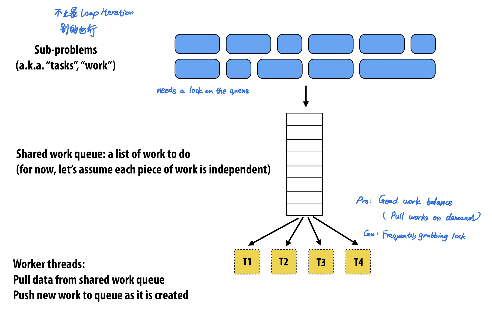
  
  - **smarter task scheduling**
  
    假设任务量不是平均的，16个任务（编号1-16）中第16号任务特别长。
  
    那么用work queue会出现分配不均。但是如果采用 schedule long tasks first 的策略，可以缓解这个问题。
  
    例子：测试素数的程序中，越大的数越有可能触碰到最坏的复杂度，越有可能需要耗时长，所以从大数忘小的数算。
  
    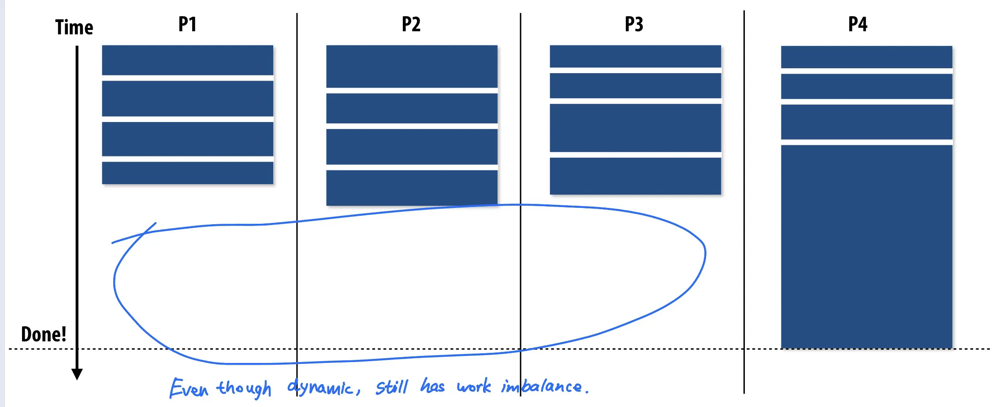
  
    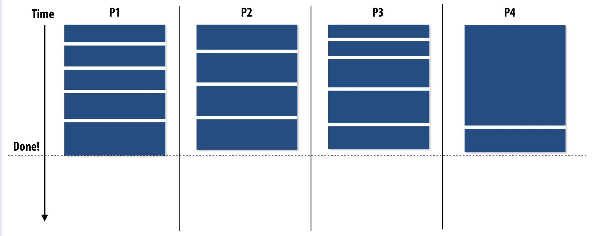
  
  - **Distributed set of queues**
  
    每个线程有自己的work queue。自己的work queue空了之后，从别的线程那里steal。
  
    大部分时间（不发生steal的时候）每个线程只读自己的queue，提高了locality，降低synchronization cost (communication)

## fork-join parallelism

### Writing fork-join programs

C++ extension: **Cilk plus**

- `cilk_spawn foo(args)`: （可能会）分出来一个线程调用foo函数。spawn只是一个建议，可能会开新线程也可能不开，如果不能开新线程（开新线程不会加速）那么就不会fork-off。
- `cilk_sync`: 类似于join，所有spawn的线程都运行完才会返回。包含`cilk_spawn`的函数末尾会自动加上cilk_sync.

Example: quick sort

```c
void quick_sort(int *begin, int *end) {
  if (begin >= end - PARALLEL_CUTOFF) std::sort(begin, end);
  else {
    int *middle = partition(begin, end);
    cilk_spawn quick_sort(begin, middle);
    quick_sort(middle+1, last);
  }
}
```

### Scheuling fork-join programs

- Bad idea: `cilk_spawn` --> `pthread_create`, `cilk_sync` --> `pthread_join` 

  因为创建kernel thread开销很大。

  应该用线程池。

- 让idle thread 从别家thread的queue里steal work to do.

  **continuation first**:

  - record child for later execution
  - child is made available for stealing by other threads (child stealing)
  - 在遇到spawn的时候，自己执行spawn后面的任务，并把spawn出来的放在自己的work queue里，等待别的线程（如果别的线程有空闲）steal自己的任务。
  - 如果没有stealing，那么（相比于去除所有spawn语句）执行顺序全都是反的

  **child first**:

  - record continuation for later execution
  - continuation is made available for stealing by other threads (continuation stealing)
  - 遇到spawn的时候，只创建一个可被steal的项目。

- work queue可以用**dequeue** (double-ended queue)实现

  每一个线程有自己的work queue，针对自己的work queue，在尾部添加，从尾部取出

  如果要steal别的线程的work queue，从头部取出


# Lec 7. Locality, Communication, and Contention

Lec6讲如何平均分配任务，Lec7讲如何降低communication开销.

- **synchronous (blocking)** send and receive

  

-  **non-blocking asynchronous** send and receive

  send()和recv()函数会立即返回 在后台做事

  


## Pipeline

使用Pipeline: **Latency 不变, Throughput 增加**

例子：

- Communication = Overhead(橙色) + Occupancy (蓝色) + Network delay (灰色)

- 最长的部分是瓶颈，决定了throughput上限

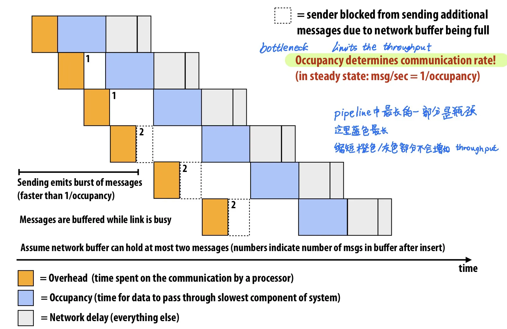

- **Overlap**: communication和其它工作同时运行的时间。

  我们希望能尽可能增加overlap这样communication cost才会降低。

  降低overlap的方法

  - Example 1: **Asynchronous** message send/recv 异步消息
  - Example 2: **Pipelining** 发送多条消息时让这个发送过程overlap


## Communication

Communication包含inherent和artifactual

- **Inherent communication**: 程序算法写好的，必须发生的通信

  - Communication-to-computation ratio: 通信量/计算量 的比值。越低越好。
  - **arithmetic intensity**: 1/communication-to-computation ratio. 越高越好。

- **Artifactual communication**: 所有别的通信，因为memory hierarchy导致额外的通信，例如L1/L2/L3/内存/网络之间的通信。包括：

  ① 系统有**minimum granularity of transfer**: 即使只需要读取4byte数据，也需要复制64-byte整条cache line

  ② 系统有**rules of operation**: 例如，写入内存需要先把内存读到cache line中（write-allocate）之后踢出cache line再写入内存，导致一次写入操作需要访问两次内存

  ③ **Poor placement** of data in distributed memories: 被某个processor访问最多的数据并没有放在这个processor附近

  ④ Finite replication **capacity**: 因为cache太小放不下，会被踢掉，所以有一些数据频繁被踢出/放入cache

  提高**locality**对降低artifactual communication很重要


提高**temporal locality**的例子

- by changing grid traversal order

  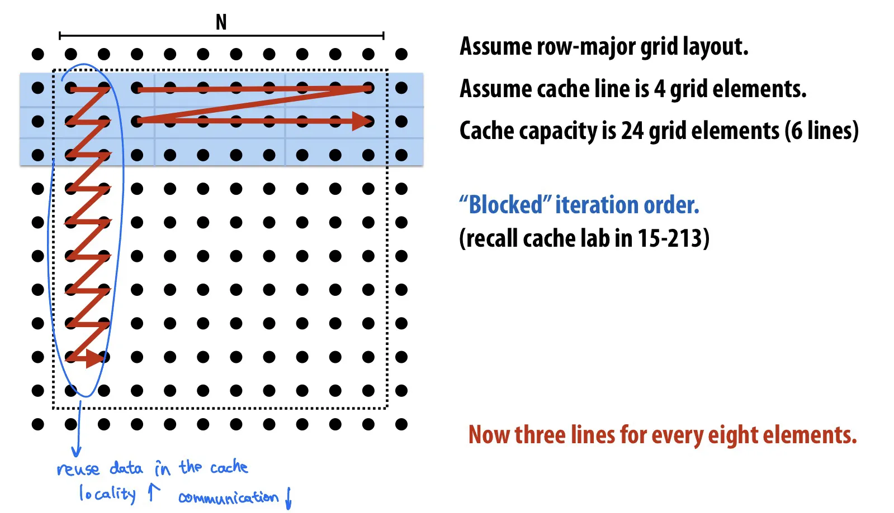

- by fusing loops

  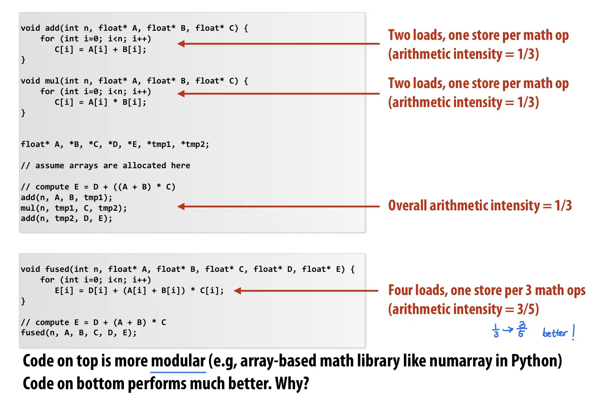

- by sharing data

  

提高**spatial locality**

- false sharing 不好

- **4D array layout** (**blocked data layout**): Embedding a 2D array within another 2D array allows page granularities to remain within a tile, making it practical to map data to local portions of physical memory (thereby reducing cache miss latencies to main memory).

  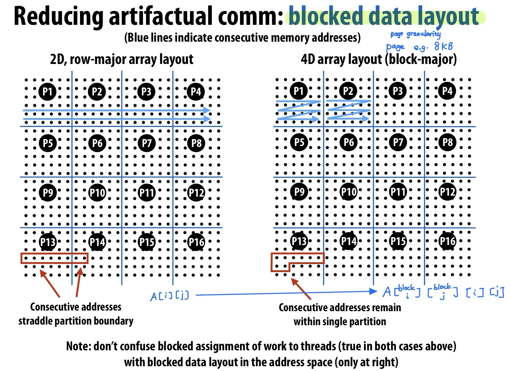


## Contention

**Contention**: 在短时间内很多人请求同一个resource

Example: distributed work queues (让每个线程有自己的work queue)可以降低contention


## Summary

- 降低communication costs
  - **Reduce overhead**: 发更少的消息数量，更长的消息内容（合并短消息）
  - **Reduce delay**：提高locality
  - **Reduce contention**: 把contended resource分开，例如local copies, fine-grained locks
  - **Increase overlap**: 用异步消息、pipeline等 提高communication和computation的overlap


# Lecture 9. Workload-Driven Perf Evaluation


- Super-linear Speedup: 
  - processor足够多的时候，每个processor分到的数据fits in cache
- Decreasing Speedup:
  - 随着processor增多，communication占比太大了
- Low speedup:
  - Increasing contexts are hyperthreaded contexts (?)


**Resource-oriented** scaling properties

- **Problem constrained** scaling (PC)
  - 更快速解决同一个问题
- **Memory constrained** scaling (MC)
  - 不爆内存的情况下运行最大能完成的任务
- **Time constrained** scaling (TC)
  - 同样的时间内完成更多任务


## Simulation

**Execution-driven** simulator

- 模拟内存，模拟内存访问
- 模拟器的performance通常与模拟的细节数量成反比

**Trace-driven** simulator

- 在real machine上运行real code得到内存访问的trace，或者用execution-driven simulator生成trace
- 然后在模拟器上运行trace


# Lec 10. Interconnects

## Interconnect terminology

Terminology

- **Network node**: 网络终端，会产生或消耗traffic，例如processor cache

- **Network interface**: 把nodes和network相连

- **Switch/Router**: 将固定数量的input links与固定数量的output links相连

- **Link**: 传输信号的线缆

  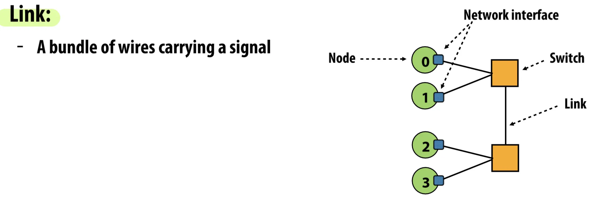

设计interconnection需要考虑的因素

- **topology**: 怎么相连

  - topology的属性：

    - **routing distance**: nodes之间的长度，nodes相连需要多少个links (hops)

    - **diameter**: 最大routing distance

    - **average distance**: 平均routing distance

    - **direct / indirect** networks

      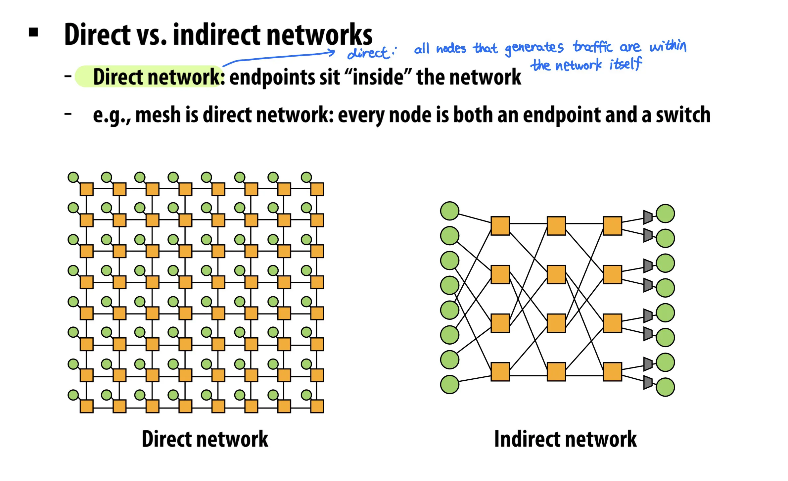

    - **bisection bandwidth**

    - **blocking vs non-blocking**: 如果任何两个pairs of nodes可以同时传输，不相干扰，则为non-blocking。大部分network都是blocking的

- routing: 消息沿什么路线传输到达目的地？可以static可以adaptive

- buffering and flow control


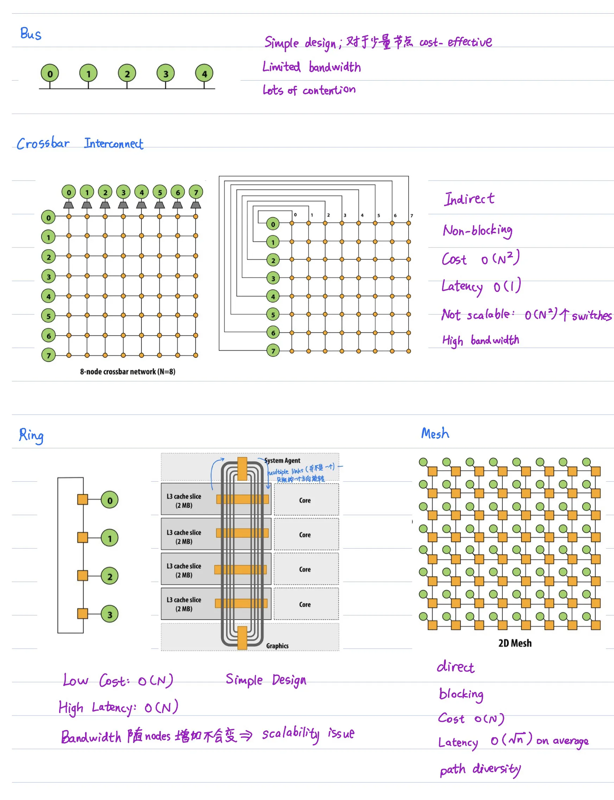

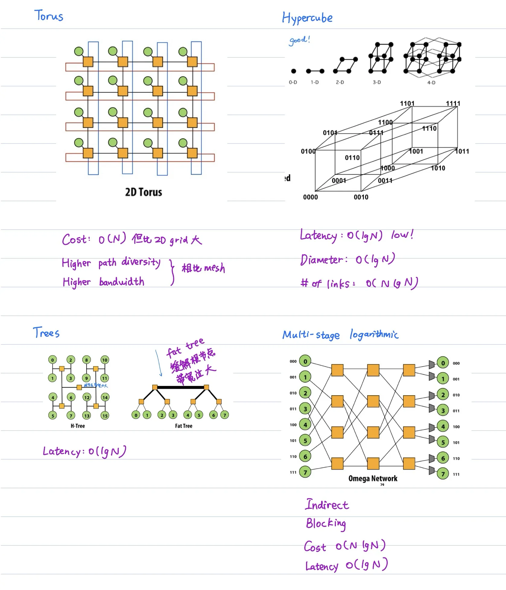


## Buffering and Flow control

和14740的第一节课讲的很像


# Lec 11. Perf Tools 

## 性能测试工具 

**GProf**

- compiler flag `-pg`
- places a call into every function --> **call graph** (total time in each function)
- 先跑程序，然后单独使用 `gprof` 命令(不传参数)

**Perf**

- 有硬件指令测量性能计数器：cache misses, branch mispredicts, IPC, ...
- `perf stat` (同时只能开启4个counter)

VTune

- similar to perf: analysis across counters
- 有图形界面和解析

## Debug工具

Valgrind

- heavy-weight, 需要 shadowing
- 有大量的overhead，不要用它测试performance
- `valgrind --tool=memcheck` 

Address Sanitizer

- GCC and LLVM support, 有编译器支持
- overhead比valgrind小一些
- `-fsanitize=address`

## Advanced analysis

Pin (Pintool)

- acts as a virtual machine: reassembles instructions
- can record every single instruction/block(无跳转)/trace(可能跨函数)

Contech

- compiler-based (uses clang+LLVM)
- record control flow, mem access, concurrency
- traces analyzed AFTER collection

## Summary questions

- Reproducible?
  - Do you have a workload? Is the system stable? (Stable是说每次运行性能差距不能太大)
- Workload at full CPU?
  - Other users using CPU? Does workload rely heavily on IO?
  - 使用`time` / `top` 看cpu占用时长
- Is CPU time confined to a small number of functions?
  - 占用时长最长的函数？算法复杂度？
  - `gprof` / `perf`
- Is there a small quantity of hot functions?
  - `perf` / `VTune`


# Lec 12. Snooping-based Cache Coherence



Recap:

- **write-allocate**: 如果写入的内存不在cache中，则需要先把memory读到cache中再写入cache
  - write-allocate与write-through和write-back都可以配合使用，但**通常write-allocate与write-back搭配**
- **no-write-allocate**: 直接写内存
- **write-through**: 同时写入cache和memory
- **write-back**: 只写入cache，之后再flush to memory



## Memory coherence

A memory system is **coherent** if: 

- the results of a parallel program's execution are such that for each memory location, there is a hypothetical **serial order of all program operations** (executed by all processors) to the location that is consistent with the results of execution.

  与某一个serial的内存访问顺序的结果一致

Said differently

**Definition**: A memory system is **coherent** if

- **obeys program order**:  一个processor先write再read一定读到新值
- **write-propagation**: P1先write，一段时间后(suffciently separated in time) P2再read，则P2一定读到新值。注意此处需要相隔多久并没有定义。
- **write serialization**: 两个processor写入同一个位置，则大家都必须agree on one order, 大家都同意这个顺序

可以用软件或硬件的方法解决

软件解法：OS采用page fault来propagate writes

硬件解法：Snooping based (本节课), Directory-based (下节课)

## Snooping

Cache controllers monitor (**snoop**) memory operations. 

任意一个processor修改cache都会broadcast通知其它所有人

现在cache controller不仅需要响应处理器，还需要响应其它cache的broadcast

Assume write-through: 

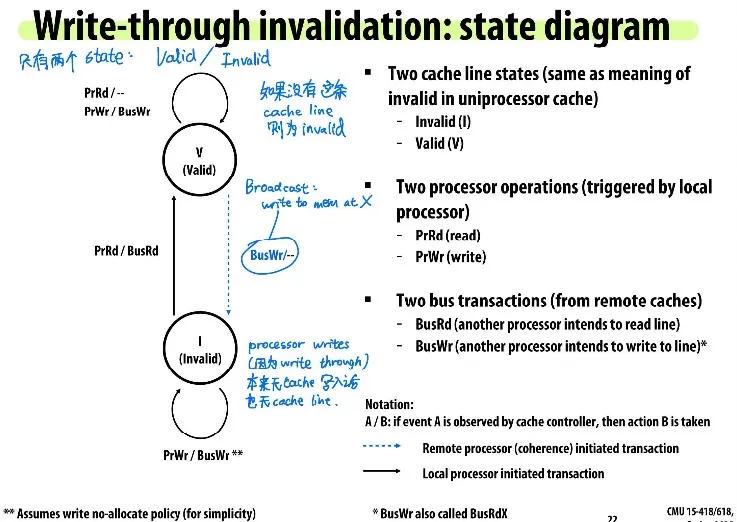

Write-through is inefficient: 因为每次write操作都需要写入内存，也是因为此原因write-through不常见

## MSI write-back invalidation protocol

Cache line加上dirty bit，如果dirty bit=1，代表处理器拥有这条cache line的exclusive ownership (**Dirty = Exclusive**)

如果其它processor想读同一条cache line，能从具有exclusive ownership的processor的cache中读（owner is responsible for supplying the line to other processors)

Processor也只能写入M-state的cache line; Processor能随时修改M-state的cache line不用通知他人

Cache controller监听是否有别人想要exclusive access，如果有，则自己必须要invalidate

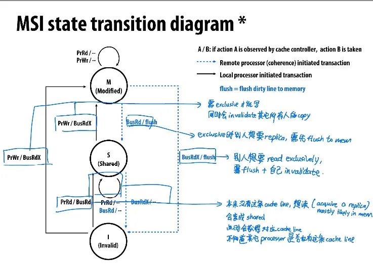


## MESI invalidation protocol

在MSI中read会有两种情况

- BusRd: 从I转成S，即使并没有真正shared
- BusRdX: 从S转成M

添加一个新的**E-state** (**exclusive clean**) 代表exclusive但尚未修改

读取时询问别的cache有没有这条cache line，如果别人也有则从I进S，否则从I进E

从E升级到M不需要通知他人

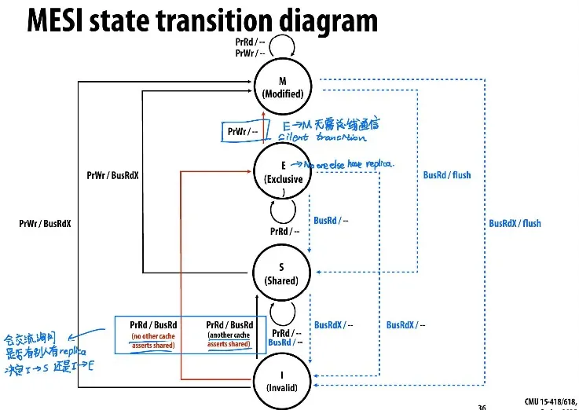

## Other (MESIF, MOESI)

- **MESIF**: F = Forward
  - 类似与MESI，但是在多个cache都shared的时候，有一个cache不在S而在F
  - F holded my most recent requester
  - F负责service miss（给别人提供数据），作为对比，MESI中所有S都会做出响应
  - I不能直接进入S，你要么进E(如果没人有), 要么进F(别人也有cache，但你是most recent requester所以你要负责给别的cache line提供data)。E和F随后有可能进入S。
  - Intel处理器用的是MESIF
- **MOESI**: O = Owned but Not Exclusive
  - 在MESI中，从M转成S需要flush to memory，MOESI添加O-state，从M转成O但不flush内存
  - 在O时，这条cache line负责给别人提供data，但不flush进内存

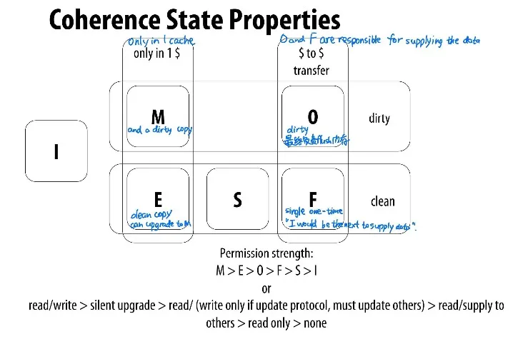

## Inclusive property

L1 L2 L3多级缓存

如果让所有L1缓存间和L2缓存间都interconnecting，那么效率低，所以让L2之间interconnect，并让L2 inclusive，即L2缓存中包含所有L1缓存，由L2控制L1的invalidate等

**Inclusive property** of caches: all lines in closer (to processor) cache are also in farther (from processor) cache. e.g. contents of L1 are a subset of L2

如果单纯让L2比L1大，不能自动保证inclusion

需要让L1和L2相互交流，L2中维护一个“是否在L1中”的bit

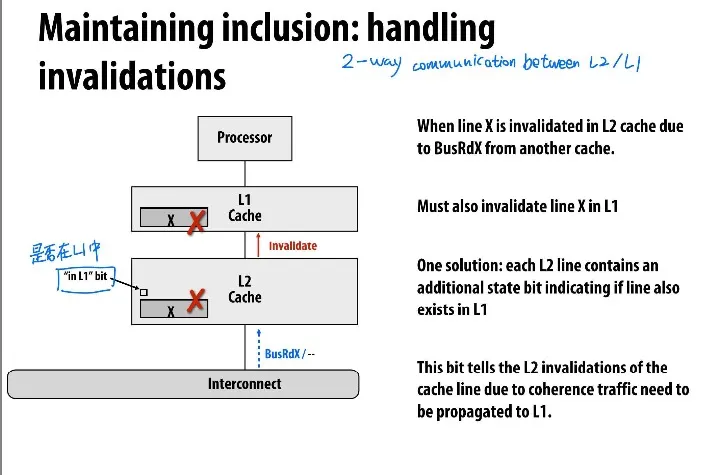

## GPU don't have cache coherence

每个cache都必须监听并对所有broadcast做出反应，这样interconnect开销会随着processor数量增长而增长

所以Nvidia GPU没有cache coherence，而是用atomic memory operation绕过L1 cache访问global memory

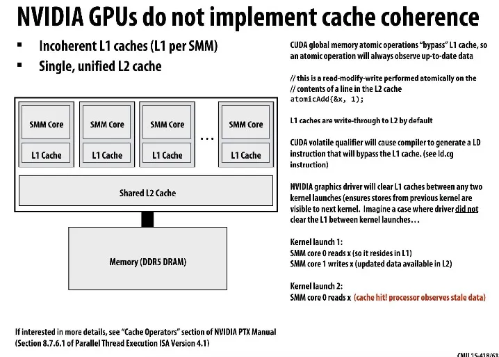

# Lec 13. Directory-based Cache coherence

上一节课讲Snooping

Snooping-based cache coherence需要依赖broadcast工作，每次cache miss时都要与其它所有cache通信

存在scalability问题

One possible solution: **hierarcical snooping**。缺点是root会成为瓶颈；延迟；不能用于不同的拓扑结构

## Scalable cache coherence using **Directories**

在一个地方存directory，每条cache line的directory信息存储着所有cache中这条cache line的状态

用point-to-point messages代替broadcast来传数据

Directory中包含 **dirty bit** 和 **presence bit**, 第k个presence bit代表第k个processor是否有这条cache line

Distributed directory: directory与memory大小同步增长

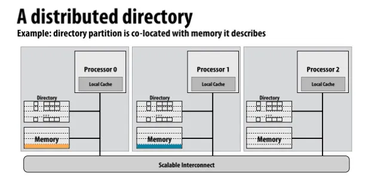


Example 1: **Read miss to clean line**

Processor 0把位于1的内存数据读到了自己的local cache 里，对应的directory记录P0有值

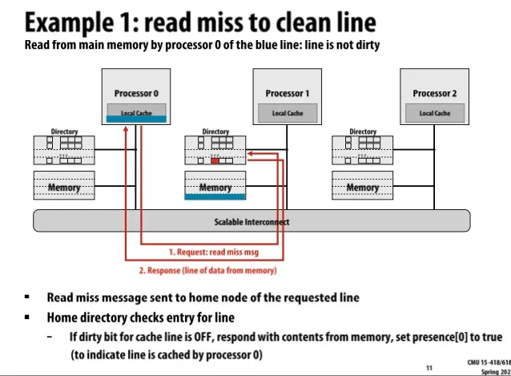

Example 2: **Read miss to dirty line**

本来P2的local cache中有dirty的数据

P0想读，发送read miss消息，P1告诉P0目前P2有dirty数据，P0收到后去向P2请求数据，P2将数据发给P0并将状态设置为shared，位置1的directory presence bit记录目前P0和P2有数据


Example 3: **Write miss**

P0有一条cache line，将要写入这条cache line，因此先请求找出有哪些Processor目前有这条cache line（找出sharer ids）然后向它们（P1和P2）发送invalidate请求，收到P1和P2的ack之后代表它们两个已经invalidate，此时再进行写入内存操作。

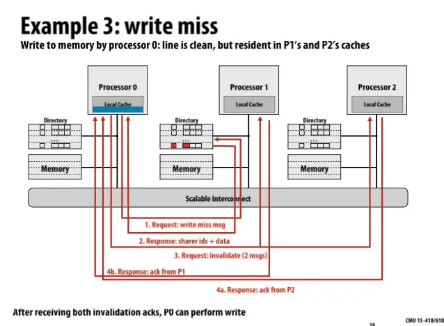

**Advantage of directories**:

- 在read时，directory能直接告诉节点应该去问谁要数据，仅需要点对点通信：如果line is clean, 从home node要；如果line is dirty, 从owner node要。
- 在write时，directory告诉sharer id，工作量取决于有多少节点在共享数据。极端情况，如果所有cache都在共享数据，则需要与所有节点通信，像broadcast一样。

## Limited pointer schemes

presense bit需要占用存储空间，会导致storage overhead

Reducing storage overhead

- increase cache line size: 让占比减小（M减小）
- group multiple processors into a single directory node (让P减小)
- 除此之外还能使用 **limited pointer scheme** (降低P) 和 **sparse directories**

**Limited pointer schemes**: 只存指针（指针=processor的id）

如果指针溢出，有几种不同的实际方法

- 指针溢出时改为broadcast（添加一个additional bit代表指针不够用）
- 设置最大共享者数量，不允许超出，如果超出，老的sharer被移除
- 指针溢出时改为bit vector representation


## Sparse directories

Key observation: majority of memory is NOT resident in cache.

Sparse directories只存一个指针，而在processor的cache line上存prev和next指针

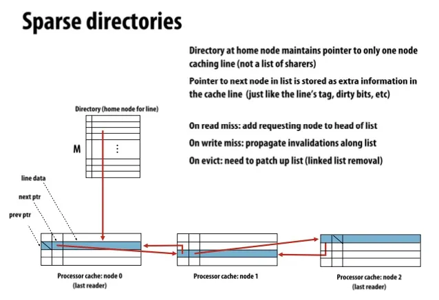

优化：**Intervention forwarding**, **Request forwarding**


----

# Lec 16. Memory Consistency

Correct behaviour for a parallel memory hierarchy: **reading should return the lastest value written (by any thread)** （write之后read一定要读出最新的结果）

- 注：因为write的结果只有在read发生时才能看见，所以我们只关注write之后的read
- 问题: **latest** 的定义是什么？单线程很好定义，但多线程不一定
  - e.g. 如果处理器之间通信需要10个周期，那么p1读2时钟周期前p0写入的值，如何获知p0改过值？类似于，你看见的星星是100秒前的

- 因此重新给出一个定义：



**writes from any particular thread must be consistent with program order** 对于一个线程的所有write，顺序必须相同

**across threads**: writes must be consistent with a **valid interleaving of threads** 



- (是hypothetical的interleaving，并非真实存在的interleaving)

- 像是有一个指针，同时只能指向一个处理器

  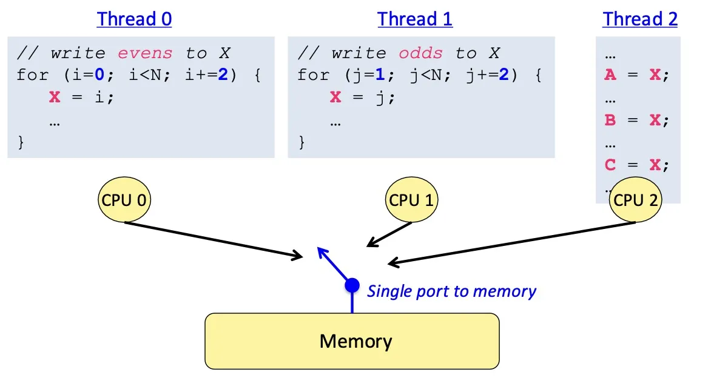


为什么memory consistency复杂？

- 处理器为了hide memory latency会对指令重排序，单线程没问题，多线程会导致错误
- write buffer在多核下会导致错误


TODO：

关键词: twist (气球间添加twist)

MFENCE

# Lec 17. Heterogeneous Parallel & Hardware Specialization

Recap: **Amdahl's law**
$$
\mathrm{speedup}(f,n) = \frac{1}{(1-f) + \frac{f}{n}}
$$

- $f$: 程序中可parallelizable部分的占比

  - $n$: 处理器数量

Rewrite **Aldahl's Law in terms of resource limits**
$$
\mathrm{speedup}(f,n,r) = 1 / \left[\frac{1-f}{\mathrm{perf}(r)} + \frac{f}{\mathrm{perf}(r) \cdot \frac{n}{r}}\right]
$$

- $f$: 程序中可parallelizable部分的占比
- $n$: 总共的处理器资源
- $r$: 每个处理器核心所能分配到的资源
  - 假设每个 $n/r$ 核心顺序执行的性能为 $\mathrm{perf}(r)$

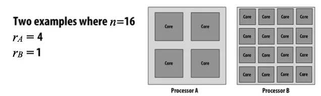

- Example: 上面这两张图total processing resources n都等于16，左图r=4，右图r=1


上图的例子

- 横坐标为$r$, 代表每个核心占多大面积。总面积$n$固定 (total chip resources keeps same)，越往左代表每个核心越小，核心数量越多 (many small cores)，越往右代表每个核心越大，核心数量越少 (fewer fatter cores)
- 不同线对应不同的$f$ 值（程序可并行部分的占比）
- $\mathrm{perf}(r) = \sqrt(r)$
- 纵坐标是相比于 $n=1$ 的单核处理器的speedup
- 课堂quiz题：为什么上面的图都converge到一点？因为r足够大的时候处理器只有一颗核心，所以不管f是多少执行结果都全部相同


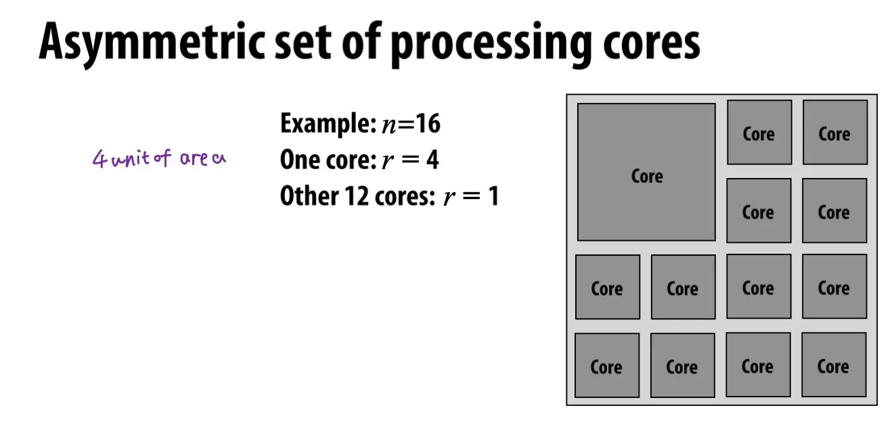
$$
\mathrm{speedup}(f,n,r) = 1 / \left[
	\frac{1-f}{\mathrm{perf}(r)} + \frac{f}{\mathrm{perf}(r) + (n-r)}
\right]
$$
上面的例子：$n=16$, 有一颗$r=4$的大核，剩下12颗$r=1$的小核

分母$\mathrm{perf}(r) + (n-r)$的意思是：一颗$\mathrm{perf}(r)$的处理器 + $n-r$颗$\mathrm{perf}(1)=1$的处理器

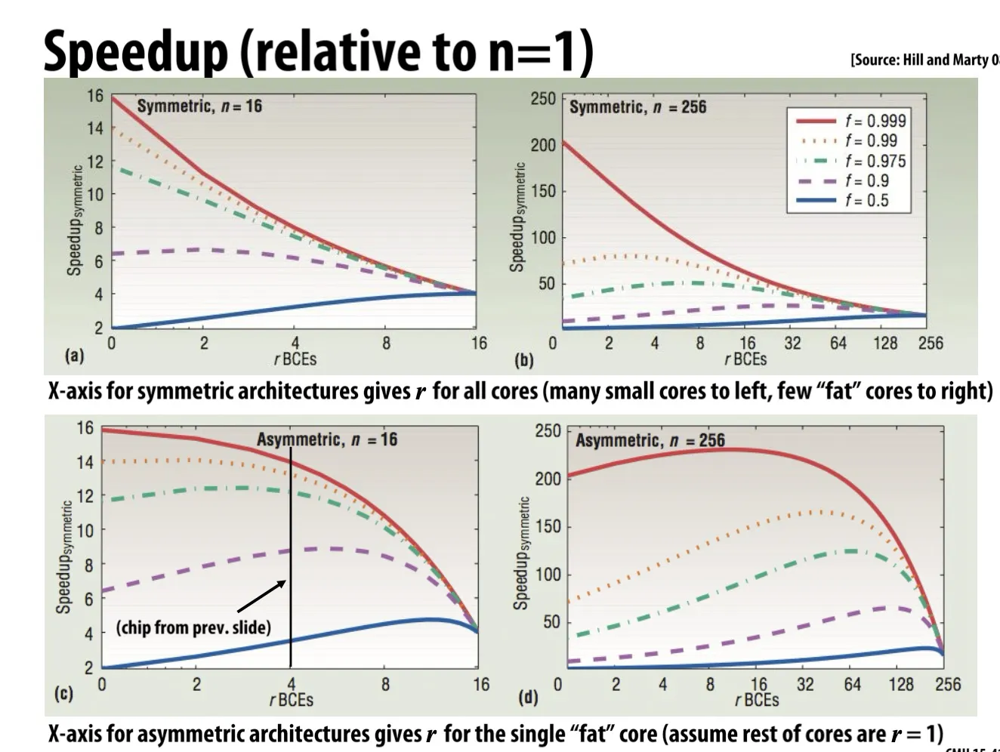


## Heterogeneous processing 异构处理器

- Observation: real world applications 的 workload characteristics 特性不同
  - 例如：有的部分能并行，有的不行；有的部分能使用SIMD，有的不行，因为divergent control flow；有的部分具有predictable data access，有的不行

- Idea: 最高效的处理器是 heterogeneous mixture of resources

- **Energy-contrained computing**
- Tradeoff: efficiency and **programmability**
  - debug更难，例如在GPU上debug就比在CPU上难
  - FPGA: efficient, 但难以program
  - ASIC (例如硬件video解码器): 更加efficient，但不能program，且需要大量资金来design/verify/create

## Challenges of heterogeneous designs

- 到目前为止，目标是: keep all processors busy all the time

- Heterogeneous的目标是：**use preferred processor for each task**


# Lec 18. Domain-specific Programming

不可能三角: 高性能、通用性（完整性）、方便编程，三个里面只能选两个

**Domain-specific languages (DSL)** 选择了high performance和productivity，代价是失去了generality/completeness (不能作为general purpose)

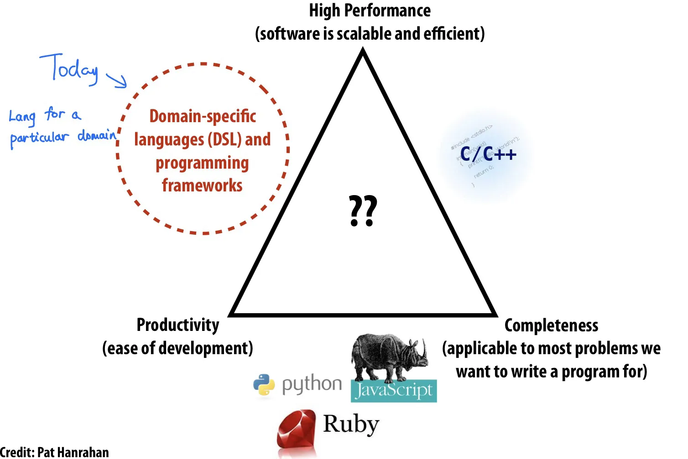

## Example 1: Lizst

对mesh做操作的一种编程语言

程序员不负责implement the mesh. 

程序员指定mesh的类型(regular, irregular)和topology拓扑结构，编译器根据程序员想对mesh做的操作来选择如何represent the mesh. 

为了生成能parallelizable的代码，lizst编程语言和编译器做了这些事

- identify **parallelism**: 做dependency analysis, 没有dependency的代码可以同时执行
- identify **data locality**: 如果有dependency则bad for parallelism，但是good for locality
- reason about required **synchronization**

## Example 2: Halide

a DSL for image processing

快速生成vectorize (SIMD)和parallel的代码


# Lec 19. DSL on graphs

设计图计算的系统programming system需要考虑什么

- what are the **fundamental operations** we want to be easy to express and efficient to execute
- what are the **key optimizations** performed by the best implementations of these operations

Graph computation的例子: **Page Rank**

- 经典的iterative graph algorithm, 用于计算网页重要性，节点为网页，边为网页链接

- **GraphLab**: 用于描述iterative computations on graphs的系统。提供C++ runtime

  - GAS (Gather-Apply-Scatter) 模型

    Gather 收集: 从邻居节点收集信息

    Apply 应用: 更新当前节点的值

    Scatter 散布: 将新的值更新至邻居节点或边上

  - GraphLab的调度机制

    - Synchronous: 每轮更新全部节点
    - Dynamic: 节点动态发出信号signal，根据需求进行更新

  - GraphLab提供不同的consistency models 一致性模型

    - Full Consistency
    - Edge Consistency
    - Vertex Consistency

  - 性能优化：瓶颈在于访存而非计算(aritimetic intensity低), 因此主要策略有

    - Graph Reorganization 图结构重组：提高locality
    - Graph Compression 图压缩


# Lec 20 Part1. Implement Message Passing

Threads拥有**private address spaces**, 只能够通过send/receive messages来通信

硬件不需要实现system-wide loads and stores.

能够通过将commodity systems连接起来形成巨大的parallel machine (message passing is a programming model for **clusters**)

Message Passing Implementation Options

- **synchronous**

  - send操作在匹配的接收操作完成后才结束
  - receive操作在所有数据传输完成之后才结束
  - 接收方没有contention，不需要buffering

- **asychronous**

  - send completes **after send buffer may be reused**

  - 分为optimistic和conservative

    - **optimistic**: 发送端不需要等待接收端响应即可完成发送操作，但可能需要额外的缓冲空间

      接收方接收时，如果失败，则allocate data buffer

      好处：发送方不会因为等待接收方准备而stall

      坏处：可能需要message layer有额外的存储空间

    - **conservative**: 需要接收方先准备好，发送方才会发送数据，避免缓冲区溢出问题

      发送方先发送send-ready request (assume fail), 接收方回复receive-ready request, 然后再开始真正的传数据

  - Optimistic对短消息友好(低延迟), 但Conservative整体上更安全(不会出现buffer overflow)

- **Hybrid** approach: **Credit-Based Async Message Passing**

  发送方预先分配有限的缓冲空间(credit)，只有确认有足够的credit时才会optimistically发送数据，否则采取conservative的方式

  Tracking credit limit的方式：

  发送方拥有一定数量的credit，每发送一个消息都会消耗一定的信用

  当接收方处理完消息、释放出缓冲区空间（增加了可用credit）后，不会单独向发送方发送专门的信用更新消息，而是将这些信用更新信息piggyback在返回给发送方的其他消息之中（减少发送消息的数量）

- Challenge: avoiding **fetch deadlock**

  - **deadlock**: 每个节点都需要持续接收消息，即使自己已经不能再发送新的消息。

    如果接收到的transaction消息是一个request，那么需要发送response，但因为buffer满了无法发送出去，就会导致fetch deadlock请求死锁

  - Approaches:

    - Logically independent request/reply networks

      将请求和响应信息使用不同的通道或网络分别传输

      即使reply通道堵塞，request通道也不受影响，可以继续接收请求

      实现方法可通过physical networks(物理独立网络)和virtual channels(同一个物理网络上划分多个逻辑队列)

    - Bound requests and reserve input buffer space

      主动限制每个节点能同时接收的请求数目

      假如共有P个节点，每个节点最多接收K个请求，则最多需要为每个节点预留 K(P-1)个request的buffer，还需要额外预留K个response的buffer

    - NACK on input buffer full

      节点buffer overflow不能接收新消息，会告诉发送方NACK (negative acknowledge)告知自己满了


# Lec 20 Part 2. Implement Parallel Runtimes

pthread, OpenMP, cilk

# Lec 21. Synchronization

## 锁的实现

- **busy waiting / spinning**: 循环等待。如果scheduling overhead大于预计等待时间则spin更好

- **blocking**: 如果卡住了就block，让OS de-schedule这个thread

- **test-and-set** lock: 

  lock: `ts R0, mem;  bnz R0, lock`; unlock: `st mem, 0`

  问题：拿锁失败的过程需要读取内存，造成bus contention (high interconnect traffic, poor scaling)

- **test and test-and-set** lock: 

  ```c
  void Lock(int *lock) {
  	while (1) {
  		while (*lock != 0);  // 当别人占用锁时等待
  		if (test_and_set(*lock) == 0) return;  // 当锁被释放时完成lock
  	}
  }
  void Unlock(volatile int *lock) {
    *lock = 0;
  }
  ```

  在uncontended时会有略高的latency，因为需要test然后再test-and-set，但是由于中间尝试拿锁只需要读local cache，所以会有显著更少的interconnect traffic

- **test-and-set with back off**

  contention时有更高的latency

  traffic更少，scalability因此也会更好，但是会有严重的不公平（新来的request back off时间短）

- **ticket lock**: 解决锁释放时大家一拥而上的问题，lock时++next_ticket, 当now_serving轮到自己时才会拿锁

- **array-based lock**: 让每个processor在不同的内存地址spin

- **queue-based lock (MCS lock)**: 创建waiter的队列（链表）建立global lock和my lock (local)

## Barrier的实现

普通的shared counter barrier存在问题：第一次barrier没问题，但是有人还没离开barrier又看到flag=0一直睡死 (类比：一堆人跑到了终点线睡觉，最后到的一个不睡觉，把flag的0翻成1，所有人看到1之后又起跑，第一个跑到下一终点线的把1重置回0，但是这时候可能有人还没起床，永远看不到flag变成1睡死在那里)

解决方法：增加leave_counter

**sense reversal**: one spin instead of two. 不要等待flag变成某个固定值 (如 1)，而是等待flag的值发生改变 (change)。利用 flag 的两个状态（0 和 1）来区分连续的barrier。每个线程需要维护local sense，记录它期望在当前屏障实例中看到的flag值

# Lec 22. Lock-free

Problem: lock can be big and expensive

C++11 `atomic<T>`: 使用mutex或处理器硬件原子指令(如果T是基本类型). 使用`.is_lock_free()` 查看是否atomicity的implementation是无锁的

Linkedlist例子

- global lock
- **fine-grained lock**
  - Challenge: deadlock? livelock?
  - Costs: overhead of locks, extra storage cost

## Lock-free data structures

**Blocking** algorithms/data structures: 一个线程能够防止其它线程完成操作. 只要算法使用了locks就是blocking的，无论锁的实现是spinning还是pre-emption.

**Non-blocking** algorithms are **lock-free** if: some thread is guaranteed to make progress

# Lec 23. Transactional Memory

Atomic construct is **declarative**: programmer states what to do (保证一块区域的原子性), not how to do.

**Transaction memory (TM)**: sequence of mem operations. Inspired by DB. 

- Atomicity: All (if commits) or nothing (if aborts).
- Isolation: Commit之前别的processor都看不到任何写入操作
- Serializability: 与某个顺序执行的结果一致

**Load-linked, store conditional (LL/SC)**: lite version of TM

- pair of instructions (而不是一条原子指令，不像CAS)
- `load_linked(x)` 加载内存地址, `store_conditional` 如果x在上次LL指令之后没有被写入过，则写入内存


**Failure** atomic: locks （发生exceptions时会发生什么）

- programmer需要决定如何写undo code
- undo code之前也有可能被别人看到错误的中间值

使用transactions则会由系统自动管理这些exceptions

**Composability**: 

e.g. 函数 `transfer(A,B,amount) {lock(A), lock(B), ...}`

如果 `transfer(x,y,100)` 和 `transfer(y,x,100)` 同时运行会死锁

Coarse-grained lock: poor performance

Fine-grain lock: good performance, but may have deadlock 

**Advantages (promise) of TM**:

- easy to use synchronization construct

  programmer如果要正确实现synchronization比较复杂，但transactional memory用起来和corase-grain lock一样简单

- often performs as well as fine-grained locks

  自动实现read-read序列化和fine-grained concurrency. Performance较好，易于开发

- failure atomicity and recovery, composability (不用担心failure scenerios)

Atomic != lock+unlock

- atomic: 只是一个high-level declaration, 没有决定如何实现.
- Lock可以用来实现atomic，也可以用于除了atomicity以外的用途
- programmer mistake：如果atomic的区域被错误分割成了两块atomic则中间可能被别人修改

## Implementing Transactional Memory (TM)

TM需要提供atomicity和isolation. 

Basic implementation: 需要data versioning（来支持回滚）；冲突检测和解决机制（什么时候abort）

分为硬件TM(**HTM**)，软件TM(**STM**)和**Hybrid TM** （例如硬件加速的STM）

### **Data Versioning**

- **eager versioning** (undo-log based): 立即更新内存，保存undo log以备abort用
  - **faster commit, slower aborts**, **fault tolerance issues** (transaction中间发生crash)
- **lazy versioning** (write-buffer based): 只写入到write buffer内，在commit成功时flush buffer
  - **faster abort, slower commit**, no fault tolerance issues

### **Conflict detection**

- read-write conflict: A读X，B有一个pending transaction写入X
- write-write conflict: A和B都在pending且都想写入X
- 系统需要追踪一个transaction的read set和write set
- **pessimistic detection**: load和store时检测conflict
  - good: detect conflicts early (更少的undo, 一部分abort会转为stall)
  - bad: no progress guarantee, fine-grained communication, detection on critical path

- **optimistic detection**: 当尝试commit的时候检测conflict（使用硬件cache coherence检测）。有冲突时committing transaction有优先权
  - good: forward progress guarantees; bulk communication & conflict detection
  - bad: detects conflicts late; fairness problems


### Hardware transactional memory (HTM)

- **data versioning** is implemented in **caches** (cache the write buffer or the undo log)

  - 一条cache line有MESI state, 和R bit, W bit (read set, write set). 此处的R和W可以选择word或cache-line作为granularity单位
  - 例如intel haswell: 有硬件指令 xbegin, xend, xabort. Xbegin将指针设置为fallback address, 在abort发生时回退指针。注意progress is not guaranteed (even if no other threads), 因为处理有很多原因会abort，包括cache line被evict。

  TSX doesn't guarantee progress

  - transaction有很多原因会失败。fallback path仍然需要锁。
  - TSX只能跟踪有限数量的内存位置(minimize memory touched). 

# Lec 25. Parallel DNN 

## Parallel Deep Neural Networks

- CNN (Convolutional neural networks) 卷积

  有一堆卷积的filter, 同时对image应用这么多卷积核

  卷积可以用矩阵乘法来算（卷积核视为一维数组，每个卷积核代表一列）

  普通的3层for循环的dense matrix multiplication的arithmetic intensity很低

  改为blocked dense matrix multiplication会更好（计算量不变，缓存命中率更好）

- reducing network footprint

  例如VGG，末尾的几个全连接层因为fully connected所以很大，model parameters太多会造成负担

  压缩network的方法

  - **prune low-weight links**: model训练完之后会有很多0和接近0的值，90%的值拿掉不会显著影响精度；将参数矩阵存为compressed sparse row (CSR)格式

  - **weight sharing**: 相近的数值可以合并，让所有参数共享a small set of weights

    将weights (32-bit浮点)变为**cluster index**(2-bit 代号)和**centroids**(2-bit代号到浮点数值的映射表)

  - **huffman encode** quantized weights and CSR indices

上面说的是evaluation, 下面说training

training比evaluation明显更耗资源

## **data-parallel training**

- across images: 每个核心有完整的model的copy. 两个核心对不同的image做训练，加barrier把梯度相加

- Asynchronous parameter update: 引入**parameter server**

  首先parameter server向大家分发parameter values, 同时divide training image set (让每个node拿到完整model和一部分训练集），如果有节点训练完成则向parameter server发送subgradient，让server的参数得到更新

  avoid global sync on all parameter updates between each SGD iteration

  好处: **没有barrier**；坏处：loss不好，影响SGD的收敛，实测效果不好、

  parameter server会成为瓶颈 ==> 通过将parameter server分开来可以缓解

## **model parallelism**

- 如果一个节点放不下model如何处理？

# Lec 26. Parallel DNN part 2

## AllReduce

Allreduce: perform element-wise reduction across multiple devices

例如：有四块GPU，每块GPU有一部分result，现在要把这四块result加起来并且让所有人都拿到最终结果

- (Parameter Server): $2*N*M$

- **Naive AllReduce**: 每个worker发送自己的gradient给其它所有邻居

  假设有N个worker, 每个worker有M个参数, 那么总共需要发送 $N*(N-1)*M$ 个parameter

  communication复杂度很高

- **Ring AllReduce**: 将M个参数分成N个slice，分**aggregation**和**broadcast**两步

  aggregation: 同一时刻，每个worker发送一个slice给别人，收到别人的slice后加起来，重复N次

  e.g. A发a0给B，B发b1给C...

  broadcast: 每个worker发送一个aggregated slice给别人，重复N次

  总的communication需要发送 $2*M*N$ 个parameter，其中aggreation和broadcast各占$M*N$

- **Tree AllReduce**: 树状结构，同样分aggregation和broadcast两步

  aggregation: 每人发M个参数给parent，重复log N次(tree height)

  broadcast: 每人发送M个参数给所有的children，重复log N次

  Overall communication同上

- **Butterfly AllReduce**: 使用butterfly network。重复logN次

  Overall communication为 $N*M*\log(N)$

同样是 $2*M*N$, Ring Allreduce表现比parameter server和tree allreduce都更好

- Ring的latency最低，分配任务最平均，scale well

  每个worker每个iteration发送M/N个参数，重复2N个iteration，latency = $M/N*(2*N)$

  在N变得很大的时候，latency为2M，N消失了，代表latency和机器数量无关

  通俗理解为，在机器数量变多的时候，因为slice变小，需要发送的量也会变小

## Model Parallelism

如果一个节点放不下model如何处理？

将一个model split开来放在不同的GPU上做

不同的运算可以选择使用data parallelism或model parallelism

**Convolutional layers**: 大量计算时长占比，少量parameters，大量中间结果 ==> Data parallelism

**Fully-connected layers**: 少量计算时长占比，大量parameters（不想频繁为了parameters通信） ==> Model parallelism

## Pipeline parallelism

因为放在了不同的GPU上运行导致出现三角形空隙，所以pipeline（pipeline无法彻底解决空隙问题，只能缓解）

------


# 一些基础知识

## ISPC

ISPC代码调用时会生成多个program instances, 可以利用 `programCount` 和 `programIndex` 来获取instance总数和当前instance编号。

`uniform` 表示在一个SIMD程序块中，变量对所有SIMD通道都是相同的值。仅仅是一种优化，不影响正确性(因为uniform变量只需要加载一次或执行一次，编译器可以做出优化，不加uniform可能造成不必要的重复计算)。

非uniform (`varying`) 表示变量在不同SIMD通道可能有不同的值。

所以说 `programCount` 是 uniform, `programIndex` 是 varying.

-----


ISPC可以通过tasks来实现多核加速，利用多线程。

Contrary to threads, tasks do not have execution context and they are only pieces of work. ISPC编译器接受tasks并自行决定启动多少个threads。

通常我们应该启动比cpu逻辑线程数更多的tasks数量，但也不要太多，否则会有scheduling的overhead。

task自带 `taskIndex`。


## CUDA

host是CPU, device是GPU

`__device__`: 在device上执行，只能在device中调用

`__global__`: 在device上执行，只能在host中调用。叫做**kernel**，返回值必须是void

`__host__`: 在host上执行且只能在host上调用

`cudaMemcpy(dst, src, size, cudaMemcpyDeviceToHost)`

----

### Threads, Blocks, Grids

threads grouped into blocks

需要指明blocks的数量，和每个block中threads的数量。

假设n是总的threads数量, t是每个block中threads的数量。

`KernelFunction<<<ceil(n/t), t>>>(args)`

每一个thread都会运行同样的kernel，每一个thread由blockID和这个block中的threadID来标识。

----


Example: 

```c
__global__ void vecAddKernel(float* A, float* B, float* C, int n) {
    int i = threadId.x + blockDim.x * blockId.x;
    if (i<n) C[i] = A[i] + B[i];
}
void vecAdd(float* A, float* B, float* C, int n) {
    int size = n * sizeof(float);
    float *d_A, *d_B, *d_C;
  
    cudaMalloc((void **) &d_A, size);
    cudaMemcpy(d_A, A, size, cudaMemcpyHostToDevice);
    cudaMalloc((void **) &d_B, size);
    cudaMemcpy(d_B, B, size, cudaMemcpyHostToDevice);
    cudaMalloc((void **) &d_C, size);
  
    vecAddKernel<<<ceil(n/256), 256>>>(d_A, d_B, d_C, n);
    
  	cudaMemcpy(C, d_C, size, cudaMemcpyDeviceToHost);
    cudaFree(d_A); cudaFree(d_B); cudaFree(d_C);
}
```


注: 为什么`cudaMalloc`第一个参数是二级指针，而不直接使用返回值来赋值给指针？

因为 `cudaMalloc` 的返回值已经用来返回 `cudaError_t`。

----


grid和blocks可以是1D, 2D, 3D的。上面这个例子是1D，所以是"`.x`"

2D的例子：假设要把一个WIDTH x WIDTH的矩阵P分成几块。

WIDTH=8, TILE_WIDTH为2的话，就是把8x8的矩阵分成16个小块(grid)，每一个小块大小是2x2(4个thread)。

```c
dim3 dimGrid(WIDTH / TILE_WIDTH, WIDTH / TILE_WIDTH, 1);
dim3 dimBlock(TILE_WIDTH, TILE_WIDTH, 1);
MatrixMulKernel<<<dimGrid, dimBlock>>>(args);
```

每一个thread可以用以下方式来标识

```c
row    = blockId.y * blockDim.y + threadId.y;
column = blockId.x * blockDim.x + threadId.x;
```

----


为什么用两层threads？因为组成多个grid的thread blocks比一个很大的单个thread block更好管理。

GPU有很多很多核心，核心group成SM(streaming multiprocessors)，每一组SM有自己的内存和调度。

GPU不同时启动所有100万个threads，而是把大约1000个thread装进一个block里，并分发给SM。

assign给SM的thread block会使用SM的资源（寄存器和共享内存）。这些资源已经pre-allocated，且由于寄存器数量很多，在切换threads时不需要register flush。

----


不同的block可以用任何顺序运行，因此不能assume block2在block1之后运行。如果真的要这么做，需要放在不同的kernel里（启动kernel比较耗资源）

同一个block中的thread可以使用 `__syncthreads()` 来做barrier synchronization。

但是通常不建议使用 `__syncthreads()`

----


如何选择合适的block size？

- Consideration 1: hardware constraints
  - 例如：每一个SM分配小于1536个thread，小于8个block；每一个block小于512个thread
- Consideration 2: complexity of each thread
- Consideration 3: thread work imbalance.


----


GPU memory

Global memory很慢，所以同时运行大量线程，线程因为内存IO卡住的时候切换其它线程，这是massive multi-threading (MMT).

这样总的throughput很高，即使每个thread的延迟也很高。

每个SM有自己的scheduler，每个SM存储了所有thread的context(PC, reg等)，所以SM内能做到零开销线程切换。同时，SM scheduler有一个scoreboard追踪哪些thread是blocked/unblocked，所以SM有大约30个核但可以运行大约1000个线程。

----


Tiled MM是一种进行矩阵乘法 内存友好的方法。

CUDA类型关键词

- `__device__ __shared__` memory: shared; scope: block; lifetime: block
- `__device__` memory: global; scope: grid; lifetime: application
- `__device__ __constant__` memory: constant; scope: grid; lifetime: application


----


Race conditions:

CUDA中难以实现mutex，而且包含critical sections的代码在GPU上本来就运行得不好。

CUDA中有一些原子操作，可以在global或shared memory变量上操作

- `int atomicInc(int *addr)`: 加一，返回旧值
- `int atomicAdd(int *addr, int val)`: 加val, 返回旧值
- `int atomicMax(int *addr, int val)`: 让*addr=max(*addr, val) 并返回旧值
- `int atomicExch(int *addr1, int val)`: set
- `int atomicCAS(int *addr, old, new)`: Compare and swap. 
  - `if (*addr == old) *addr = new; `

