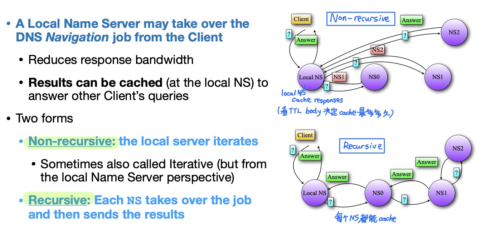
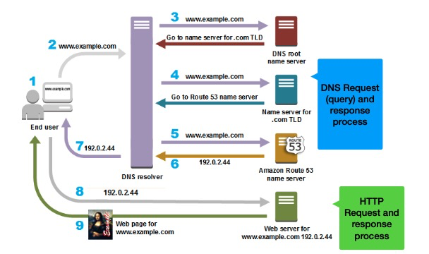
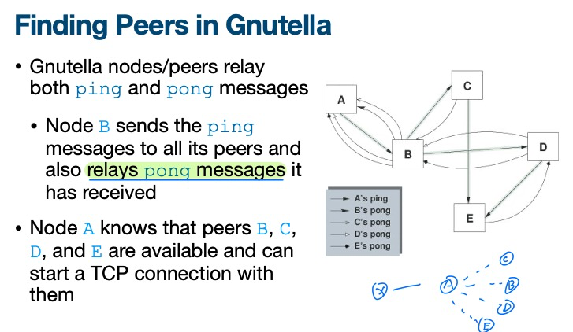
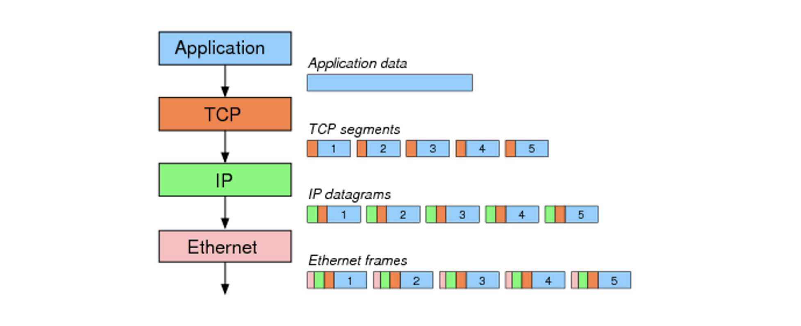

# Lec 1. Intro

Network **Protocols**: Define the **format** (of a message), **order** of messages sent and received among network entities, and **actions** taken on message transmission or receipt.

所有Internet的通信活动都由protocol管。

Reliable: 发送到的和接收到的数据一致，顺序一致。要reliable就会有overhead，需要trade-off.

- **circuit switching**
  - 每一个connection都由一个channel, **connection-oriented**
  - 在没有connection/call/user使用的时候会导致资源浪费
  - 每一个信号都有time和frequency，同一时刻有不同频率的信号频段都可以传输。如何切分？
    - **FDM** (Frequency Division Multiplexing) 频分复用
    - **TDM** (Time Division Multiplexing) 时分复用
- **packet switching**
  - **Connectionless**, 没有channel，用多个paths
  - 数据切分成小块，称为packets
  - 所有用户都可以使用完整的带宽，没有FDM、TDM等，**statistical sharing**
  - **Store and forward model**: 一条link上有好多个节点，节点必须接收到完整packet才会继续发送给下一个节点
  - 缺点是会有congestion，数据包太多会导致竞争

# Lec 2. Architecture

packet switching: 每一个packet都能占用全部的bandwidth，需要**queue**

如果queue满了，新的packet会被**drop**（aka lost, 丢包）

---

4 Sources of packet delay

- **processing delay** (nodal processing)
  - Router接收到packet时需要：①检查bit errors ②决定转发给谁
  - 与router的处理速度有关
- **queueing delay**
  - router一次只能发一个packet，需要排队等待
  - 与router的congestion level （拥堵情况）、buffer size都有关
  - 范围可以从0到无穷（无穷代表丢包）
  - Traffic intensity $\rho = L \times \lambda / R$ (=输入除以输出)
    - L = Packet Length (bits/pkt)
    - R = Link Speed / Data Rate (bps)
    - $\lambda$ = Average Packet Arrival Rate (pkt/s)
- **transmission delay**
  - $T_t$ = $L/R$ = Packet Length / Link Bandwidth
- **propagation delay**
  - 第一个bit发送需要的延迟时间。取决于光速（或物理介质速度）
  - $T_p = d / s$ = Length of physical link / Propagation speed in physical medium

Traceroute：发送给第i个node来回的时间

----

Layered Network Architecture

- Layer的优点

  - 每个layer里面的protocol可以分开设计，互不干扰，简化设计、实现和测试流程

- Layer的缺点

  - duplication：每个layer都做了一些reliability的设计，导致重复
  - 每层layer之间隐藏了信息，可能影响性能（完成某些操作可能需要底层layer的信息）

- **ISO OSI** reference model / **TCP/IP**

  - 1970s的时候不同的网络架构互不兼容，无法互相通信，所以ISO搞出了OSI来实现 **interoperability**

  - ISO: International Standard Organization

  - OSI: Open Systems Interconnection

  - 然后 TCP/IP 把OSI protocol给取代了

  - OSI有7层layer，TCP/IP有5层layer。顶上两个是end-to-end，底下的是hop-by-hop.

    

# Lec 3. Design Principles

## Virtual connections

每层layer都有自己的header。

**Encapsulation**: Sending host, 从更高层layer获取信息，在payload前加一个自己的header

**Decapsulation**: Receiving host, 从更底层layer获取信息，从自己的header提取信息然后去掉

## TCP/IP

- "**Hourglass**" design, IP 是最中间的glue，IP的上层和下层都有很多东西

  缺点：IP至关重要，并且改IP很困难，像IPv4到IPv6的迁移非常复杂。

- **No Strict layering**: 应用程序也可以绕过layer直接用底层。

- 协议需要 **standardized**.
  - Internet Engineering Task Force (IETF). 每个IETF标准都公开发布了Request for Comments (RFC).
  - 但不是所有RFC都成为了标准。RFC包含实验性的协议

## Goals of TCP/IP design

Clark88论文

- **Fundamental goal**: 把现有的网络给interconnect起来。使用 store-and-forward packet-switching 方法，用 gateways 连接起来.
- **Second level goals**: 
  - continue despite failures 失败了也要继续（失败了要重建连接）
    - 需要保存state(状态信息)，这样连接中断了才能重新建立连接
    - state是存在intermediate nodes还是存在end-hosts? 存在end-hosts里。**stateless nodes**.
  - 支持多种服务
    - TCP: **Connection-oriented**; UDP: **connectionless**
    - 最初TCP的目标是connection-oriented and reliable。Reliability是主要的延迟来源。所以TCP和IP分离了，搞了个UDP。
  - 支持多种网络技术（有线网、无线电等）
  - distributed management 自己需要能管理自己的网络
    - networks can be administered separately
  - cost-effective 效率
  - account for resources used
    - 早期设计的时候没有人在意（现在很多人在意网速）。
  - 上述后两个目标并没有获得太多attention甚至完全没有被考虑过

# Lec 4. Internet ISP's Architecture

The Internet is a **Network of Networks**.

ISP: **Internet Service Provider**

A **backbone** network ISP: 能够让所有customers连接到全球网络

- 最早的时候只有一个backbone ISP叫做 `NSFNET`
- 但是这样做不好，比如有两个中国电脑通信，仍然需要经过位于美国的全球唯一backbone
- 所以出现了多个 commercial backbone ISP 互相interconnect来实现全球互联网连接

## Transit & Peering

**Transit** interface: 一个backbone ISP将网络传输服务售卖给客户（“客户”指更小的ISP或别的大企业）

**Peering** interface: ISP之间互相直接访问

- peering通常是免费的，互惠互利，数据直接传输，不经过transit provider
- peering的关系通常是商业机密

## Different types of ISP

**Tier-1**：

- Tier-1的定义已经被滥用，每个ISP都自称自己是Tier-1。通常Tier-1指的是：
  - ① 和一大堆customer有 **transit** link
  - ② 和一大堆别的Tier-1 backbone ISP有 **peering** (business) interconnections. (通常有 **full-mesh** architecture)
- Tier-1网速快，延迟低，全球都有，与很多Tier-2 ISP相连（Tier-2 ISP是Tier-1 ISP的transit customers)
- Tier-1不需要从别的ISP购买transit就可以访问到全球互联网
- Tier-1 ISP通常有一种 **restrictive peering policy**
  - 不要轻易跟别的非Tier-1 ISP去peer，因为它们是潜在的客户，要向它们收钱

**Tier-2**:

- 通常来说，不是 Tier-1 的ISP就叫做 Tier-2.
- Tier-2需要从Tier-1 ISP购买transit access
- Tier-2向更下层的客户提供付费transit服务
- Tier-2和Tier-2之间也会peer。通常有一种 **open-peering policy**
  - Tier-2要和尽可能多的ISP去peer
  - 需要权衡一下成本：Peer会产生 **management cost** 和 **maintenance cost**

这几年有个新东西进入了ISP体系结构：**Content Providers** (Large Enterprise Companies)

**Content Providers**

- Do not sell transit.
- 可分为以下两类
  - Category A: Focus on content creation
    - 不peering，不运作网络
  - Category B: Sophisticated, large-scale players
    - open peering policy

# Lec 5. Application Layer & HTTP

Application Layer $\neq$ User Application

Application Layer provides Services (e.g. SMTP, HTTP, FTP, SSH)

许多Application Layer Services需要先创建一个**Transport Layer** (TL) **connection** (channel). 

## HTTP

**HTTP-message** 由 **request** 或 **response** 组成

Request或Response由 **start line**, **header**, **empty line** 和 **message body** 组成

- **Start line**: `Request-line` 或 `Status-line`

  - `Request-line` = `Method` sp `Request-URI` sp `HTTP-Version` CRLF

    e.g. `GET /images/logos.html HTTP/1.1`

    Method包含 `GET`, `POST`, `HEAD`, `PUT`, `DELETE`

    Method中的`GET`: 

    - **conditional `GET`**: `If-Modified-Since`, `If-Match`
    - **partial `GET`**: 只获取一个object的指定byte范围。header中包含`RANGE` field。

    Method中的 `HEAD`: 获取metadata（与GET相同，但不包含message body）

    Method中的 `OPTIONS`: 获取服务器或资源的能力，不获取资源本身

  - `Status-line` = `HTTP-version` sp `Status-Code` sp `Reason-Phrase` CRLF

    e.g. `HTTP/1.1 200 OK\r\n Connection: close...`

    Status code 是三位数字：

    - `1xx`: informational: 请求已收到，正在处理
    - `2xx`: success 成功
    - `3xx`: redirection 重定向/完成请求需要更多操作
    - `4xx`: client error 因为client的错误导致请求格式错误或无法满足请求
    - `5xx`: server error 请求完全正确，但服务器原因导致无法满足请求 (e.g. `505 HTTP Version Not Supported`)

- 0个或多个**headers** (**General, Request, or Entity headers**)

  - e.g. `User-agent: mozilla/5.0... \r\n  Connection: close`
  - Header包含HTTP request/response的 **metadata**
    - 日期，时间，Application或服务器信息，缓存控制，46个有定义的header
  - HTTP Request 需要 `HOST` 这一项（Response不需要）

- 空行 (CRLF) 

  空行是为了把header和body区分开

- message body (optional)

## Persistent & Non-persistent Connections

HTTP用TCP作为Transport Layer Protocol

(TCP在Transport层，HTTP在Application层)

建立一个HTTP连接需要先建立TCP连接

**Round Trip Time (RTT)**: 发送一条消息并得到回复的所需时间

- **Non-persistent HTTP**

  需要1个RTT建立TCP连接，1个RTT建立HTTP连接，然后传数据，最后1个RTT关闭连接

  Total Transmission Time = 2RTT + file transmit time

  Total Time (包括关闭连接) = 3RTT + file transmit time

  

- **Persistent HTTP**

  - ① **Reuse existing TCP connection**

    传数据之后不要关闭TCP connection，省去下一次建立TCP连接的时间

  - ② **Pipelining** at the Application Layer level

    不等到上一个(HTTP)请求收到回复，就发送下一个request。服务器按照顺序发送数据包。这样所有object最少只需要占用1个RTT

    HTTP/1.1默认使用这样的 Persistent HTTP + Pipelining

    

  - **Server Push** in HTTP 2.0

    服务器提前把client会用到的objects主动发过来，不需要client去请求

    

## Caching

- **Web Proxy Caching**

  建立一个中转代理 **Local Cache** (aka **Local Web Proxy**) 

- **File Validation** in HTTP Caching

  HTTP会想办法确保cache是否valid（cache的文件有没有过期）

  有两种 **Cache Expiration Model**

  - **Origin Server-specified expiration**

    服务器使用 `Expires` 或 `max-age` header 直接告诉文件多久后过期

  - **Heuristic expiration**

    服务器不给定过期时间，client请求资源时用 `If-modified-since` header，问服务器“我手里的资源是否fresh有没有过期？”

    如果资源过期则发送，资源没过期则用 304 Not Modified 避免重新传输。

# Lec 6. DNS

## DNS services (DNS作用)

- **Domain** 与 **IP address** 的转换
- **Host aliasing** (alias 和 canonical domain names 的转换)
- **Mail Server aliasing** (MX - Mail Exchange)
- **Load distribution across Name Servers** (一个域名轮换指向多个服务器)

## DNS Protocol

**Query** and **Reply** (和HTTP类似)

- query和reply用同样的消息格式：**Resource Record (RR)**
- 每个**Resource Record (RR)**由五部分组成：`(Name, Value, Type, Class, TTL)`
- `Name`: 由RR中的`Type`决定
- `Value`: e.g. 对于A解析，value是IP地址；对于CNAME解析，value是另一个域名
- `Type`: e.g. `A`, `CNAME` 等
  - `A`: Address 指向IPv4地址，`AAAA` 指向IPv6地址
  - `NS`: Nameserver: 指向Authoritative (organization) Name Server，例如cmu有自己的DNS，Name=cmu.edu, Value=dns.cmu.edu
  - `CNAME`: Canonical Name
  - `MX`: Mail Exchange 指向邮件服务器的hostname
- `Class`: 通常全都是 `IN` 意为Internet
- `TTL`: Time to live 代表这一条RR能被缓存多久，0代表不能缓存

DNS queries 在**53**号端口上用**UDP**运行

- Exception：在①Zone transfer②大于512字节的response 时会使用TCP
- 为什么用UDP？因为TCP的overhead通常比整个DNS query都要大

## **Navigation**

Client可能需要问多个Name Servers (NS)

每个Name Server返回指向下一个NS的指针（不止返回NS record，也另外返回一个指向另一个NS的A record）

- **Non-recursive** (右上图片) 有时也叫 **Iterative**
- **Recursive** (右下图片)

**DNS caching**

- Name Server (NS) 会缓存DNS mapping
- 由TTL决定cache多久
- Local Name Servers (Resolves) 通常缓存Top Level Domain (TLD) servers的IP地址

## **DNS Name Server Hierarchy**

- 1 **Root** (root name servers)

- 2 **Top-Level Domain (TLD** Name servers)

- 3 **Authoritative** (e.g. cmu name servers)

- **delegated administrative structure**: 

  - delegated指域名是反着来的 e.g. library.cmu.edu

  - administrative authority 不一定和 **namespace hierarchy**相符

    e.g. cs.cmu.edu有自己的name server, drama.cmu.edu没有

- **Zones**

  - namespace hierarchy被分成一个一个zones

  - 每一个zone有一个name server

  - zone owner必须：maintain zone data; run redundant name servers (for backup)

    

  - **Root Name Server** 知道所有TLD nameserver和它们的地址

    - 一共只有13个root server，标记为a到m

  - **TLD** （e.g. .com, .org, .net）

    - 由 IANA (Internet Assigned Number Authority) 管理
    - TLD NS知道它自己所有域名的所有authoritative (or intermediate) name server的地址

  - **Authoritative NS**

  - **Local Name Server** (DNS Resolver) 也叫 **Default Name Server or Resolver**

    - 并不严格属于DNS结构
    - 每个organization（公司、学校等）都有一个
    - Act as a proxy

# Lec 7. P2P

P2P: Peer-to-peer

## Napster (Centralized P2P)

Napster曾经是第一个p2p music-sharing应用

- **Centralized**: clients存储文件, 中央server只存储peer信息: `<file name, ip address, port number>`

- 虽然传文件是decentralized，但是定位文件是highly centralized

- ==> 导致的问题: 中央服务器稳定性、中央服务器性能瓶颈

## Gnutella (Distributed P2P)

- Fully **decentralized (distributed)**

  不需要中心的服务器，用户们自己安排自己

- **Not scalable**

  - fully distributed $\neq$ scalable

- **Bootstraping**

  Find peers的方法：每个节点**relay** **ping/pong** messages

  这样每个节点都能得到所有bootstrap nodes的列表

  

- Locate content: **query flooding**

  - 节点从现有的TCP连接发出`Query`消息，相连的Node会relay

  - `QueryHit` 消息会沿着反向路径发出

  - 为什么reverse path发送而不是直接发？

    因为requester只和它的direct peers有TCP connection，和目标节点可能没有connection

    但是会带来更高的延迟

  - `QueryHit` 之后使用HTTP传输文件。

  - **Not scalable** (因为find peer / find content所需的工作量指数级增长)
  - **Limited scope query flooding**: 在query message中添加 `peer-count` 属性，每经过一个hop减小1，从而限制hop的次数。
  - 但是仍然会有peer数量太多的问题，并且不能保证一定能找到目标 (**no guarantee**)

  

## KaZaA (Hybrid/Hierarchical P2P)

KaZaA使用 **Hierarchical (Hybrid) Design**

每个节点是 Super Node (SN) 或 Ordinary Node (ON)

- SN是leader，ON和SN有TCP连接，部分SN和SN之间有TCP连接
- SN存储了children的信息
- 某一个ON要找文件时，会询问它的parent (SN) 有没有，如果SN和SN的children都找不到所需信息，会问别的SN (SN-to-SN connections)
- 优点: 与Gnutella相比能够支持明显更多的peers，且没有**scalability**问题
- **KaZaA query**: client发送query，SN返回 **meta data, hash, IP address (of the peer)**
- KaZaA实现细节不公开，有人做Reverse engineering
- ON-SN, SN-SN的连接很短，因为node会不断寻找其余workload更小的节点

# Lec 8. Transport Layer UDP

## Transport Layer

**Mission**: Offers **Peer-to-peer** and **end-to-end** (virtual or logical) connections between two **processes (applications)** running on remote hosts.

Network Layer provides Internet Protocol (IP)

- IP - **packet switching** 不提供reliability

  (第一节课内容：circuit switching: connection-oriented, FDM/TDM; packet switching: connectionless)

Transport Layer protocols 主要有TCP和UDP

Transport Layer 主要功能

- **Multiplex** & **De-multiplex**: process的信息在发送方TL multiplex，接收方TL de-multiplex

  - 有multiplex一定需要addressing, Transport Layer用**port numbers**来addressing
  - Port Assignment: 端口一共有三种类型：**well-known** (0-1023), **registered** (1024-49151), **dynamic or ephemeral** (49152-65535)
  - Port numbers are bound to an application

- **Breaking data into segments** and reassemble at receiver

  - 发送方的Application Layer提供任意长度的信息，Transport Layer会将其切成**segments**，一个一个发送

    - TL会往每个segments前添加header

    - 后续会被封装成**packets**(aka **datagrams**)，然后封装成**frames**

      

  - 接收方的Transport Layer接收到segments，重新组装，传给Application layer

- connection setup, state management, connection teardown (if necessary)

- TCP: reliability guarantees.

## UDP

缺点：segments可能丢失，可能顺序乱

优点：

- **connectionless** (不需要handshake/agreement，不需要预先建立连接)
- **simple**: no state to maintain
- UDP header is smaller
- No congestion or flow control (less processing overhead)
- reliability可以在Application Layer添加，开销更低

UDP常用于

- loss tolerant & rate sensitive (timeliness): 多媒体应用，例如直播
- big overhead compared to transmitted data: payload很小的应用，例如DNS

**UDP segment format**:

UDP的**header**一共**8bytes/64bits**

**source port, destination port, length, checksum**各占16bits

Notes:

- length是整个segment包含header的长度，单位为bytes
- 为什么需要包含source port number？因为另一边回复时需要用到（需要反转source port#和dest port#）
- **checksum**: end-to-end detection
  - 发送方：把segments中的所有16-bit words加起来，如果加法过程中产生进位1，则给结果加上进位1。最后反转所有bit。
  - 接收方：把所有segment连带着checksum一起加起来，同样如果产生进位则加上进位。结果必须全1.
  - 如果UDP发现有错误，则会丢弃，如果没错误则上传给application layer
