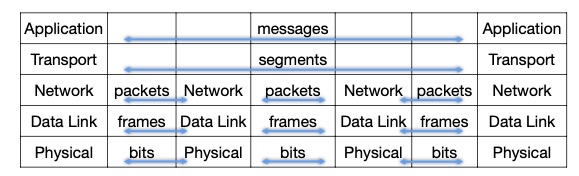
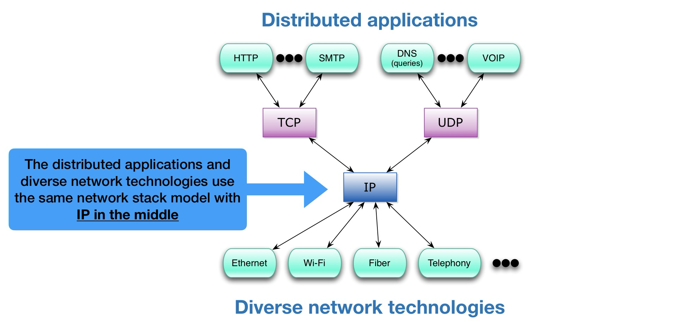
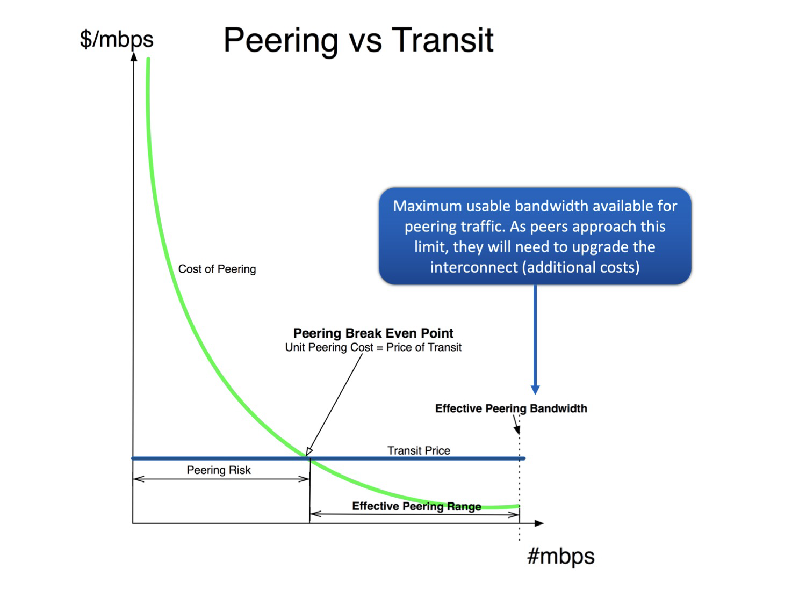

# Lec 1. Intro

Network **Protocols**: Define the **format** (of a message), **order** of messages sent and received among network entities, and **actions** taken on message transmission or receipt.

所有Internet的通信活动都由protocol管。

Reliable: 发送到的和接收到的数据一致，顺序一致。要reliable就会有overhead，需要trade-off.

- **circuit switching**
  - 每一个connection都由一个channel, **connection-oriented**
  - 在没有connection/call/user使用的时候会导致资源浪费
  - 每一个信号都有time和frequency，同一时刻有不同频率的信号频段都可以传输。如何切分？
    - **FDM** (Frequency Division Multiplexing) 频分复用
    - **TDM** (Time Division Multiplexing) 时分复用
- **packet switching**
  - **Connectionless**, 没有channel，用多个paths
  - 数据切分成小块，称为packets
  - 所有用户都可以使用完整的带宽，没有FDM、TDM等，**statistical sharing**
  - **Store and forward model**: 一条link上有好多个节点，节点必须接收到完整packet才会继续发送给下一个节点
  - 缺点是会有congestion，数据包太多会导致竞争

# Lec 2. Architecture

packet switching: 每一个packet都能占用全部的bandwidth，需要**queue**

如果queue满了，新的packet会被**drop**（aka lost, 丢包）

---

4 Sources of packet delay

- **processing delay** (nodal processing)
  - Router接收到packet时需要：①检查bit errors ②决定转发给谁
  - 与router的处理速度有关
- **queueing delay**
  - router一次只能发一个packet，需要排队等待
  - 与router的congestion level （拥堵情况）、buffer size都有关
  - 范围可以从0到无穷（无穷代表丢包）
  - Traffic intensity $\rho = L \times \lambda / R$ (=输入除以输出)
    - L = Packet Length (bits/pkt)
    - R = Link Speed / Data Rate (bps)
    - $\lambda$ = Average Packet Arrival Rate (pkt/s)
- **transmission delay**
  - $T_t$ = $L/R$ = Packet Length / Link Bandwidth
- **propagation delay**
  - 第一个bit发送需要的延迟时间。取决于光速（或物理介质速度）
  - $T_p = d / s$ = Length of physical link / Propagation speed in physical medium

Traceroute：发送给第i个node来回的时间

----

Layered Network Architecture

- Layer的优点

  - 每个layer里面的protocol可以分开设计，互不干扰，简化设计、实现和测试流程

- Layer的缺点

  - duplication：每个layer都做了一些reliability的设计，导致重复
  - 每层layer之间隐藏了信息，可能影响性能（完成某些操作可能需要底层layer的信息）

- **ISO OSI** reference model / **TCP/IP**

  - 1970s的时候不同的网络架构互不兼容，无法互相通信，所以ISO搞出了OSI来实现 **interoperability**

  - ISO: International Standard Organization

  - OSI: Open Systems Interconnection

  - 然后 TCP/IP 把OSI protocol给取代了

  - OSI有7层layer，TCP/IP有5层layer。顶上两个是end-to-end，底下的是hop-by-hop.

    

# Lec 3. Design Principles

## Virtual connections

每层layer都有自己的header。

**Encapsulation**: Sending host, 从更高层layer获取信息，在payload前加一个自己的header

**Decapsulation**: Receiving host, 从更底层layer获取信息，从自己的header提取信息然后去掉

## TCP/IP

- "**Hourglass**" design, IP 是最中间的glue，IP的上层和下层都有很多东西

  缺点：IP至关重要，并且改IP很困难，像IPv4到IPv6的迁移非常复杂。

- **No Strict layering**: 应用程序也可以绕过layer直接用底层。

- 协议需要 **standardized**.
  - Internet Engineering Task Force (IETF). 每个IETF标准都公开发布了Request for Comments (RFC).
  - 但不是所有RFC都成为了标准。RFC包含实验性的协议

## Goals of TCP/IP design

Clark88论文

- **Fundamental goal**: 把现有的网络给interconnect起来。使用 store-and-forward packet-switching 方法，用 gateways 连接起来.
- **Second level goals**: 
  - continue despite failures 失败了也要继续（失败了要重建连接）
    - 需要保存state(状态信息)，这样连接中断了才能重新建立连接
    - state是存在intermediate nodes还是存在end-hosts? 存在end-hosts里。**stateless nodes**.
  - 支持多种服务
    - TCP: **Connection-oriented**; UDP: **connectionless**
    - 最初TCP的目标是connection-oriented and reliable。Reliability是主要的延迟来源。所以TCP和IP分离了，搞了个UDP。
  - 支持多种网络技术（有线网、无线电等）
  - distributed management 自己需要能管理自己的网络
    - networks can be administered separately
  - cost-effective 效率
  - account for resources used
    - 早期设计的时候没有人在意（现在很多人在意网速）。
  - 上述后两个目标并没有获得太多attention甚至完全没有被考虑过

# Lec 4. Internet ISP's Architecture

The Internet is a **Network of Networks**.

ISP: **Internet Service Provider**

A **backbone** network ISP: 能够让所有customers连接到全球网络

- 最早的时候只有一个backbone ISP叫做 `NSFNET`
- 但是这样做不好，比如有两个中国电脑通信，仍然需要经过位于美国的全球唯一backbone
- 所以出现了多个 commercial backbone ISP 互相interconnect来实现全球互联网连接

## Transit & Peering

**Transit** interface: 一个backbone ISP将网络传输服务售卖给客户（“客户”指更小的ISP或别的大企业）

**Peering** interface: ISP之间互相直接访问

- peering通常是免费的，互惠互利，数据直接传输，不经过transit provider
- peering的关系通常是商业机密

## Different types of ISP

**Tier-1**：

- Tier-1的定义已经被滥用，每个ISP都自称自己是Tier-1。通常Tier-1指的是：
  - ① 和一大堆customer有 **transit** link
  - ② 和一大堆别的Tier-1 backbone ISP有 **peering** (business) interconnections. (通常有 **full-mesh** architecture)
- Tier-1网速快，延迟低，全球都有，与很多Tier-2 ISP相连（Tier-2 ISP是Tier-1 ISP的transit customers)
- Tier-1不需要从别的ISP购买transit就可以访问到全球互联网
- Tier-1 ISP通常有一种 **restrictive peering policy**
  - 不要轻易跟别的非Tier-1 ISP去peer，因为它们是潜在的客户，要向它们收钱

**Tier-2**:

- 通常来说，不是 Tier-1 的ISP就叫做 Tier-2.
- Tier-2需要从Tier-1 ISP购买transit access
- Tier-2向更下层的客户提供付费transit服务
- Tier-2和Tier-2之间也会peer。通常有一种 **open-peering policy**
  - Tier-2要和尽可能多的ISP去peer
  - 需要权衡一下成本：Peer会产生 **management cost** 和 **maintenance cost**

这几年有个新东西进入了ISP体系结构：**Content Providers** (Large Enterprise Companies)

**Content Providers**

- Do not sell transit.
- 可分为以下两类
  - Category A: Focus on content creation
    - 不peering，不运作网络
  - Category B: Sophisticated, large-scale players
    - open peering policy

