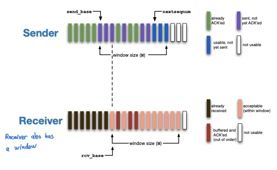
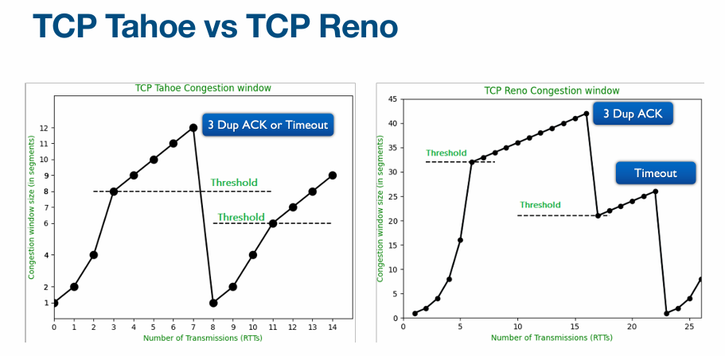

# Lec 1. Intro

Network **Protocols**: Define the **format** (of a message), **order** of messages sent and received among network entities, and **actions** taken on message transmission or receipt.

所有Internet的通信活动都由protocol管。

Reliable: 发送到的和接收到的数据一致，顺序一致。要reliable就会有overhead，需要trade-off.

- **circuit switching**
  - 每一个connection都有一个channel, **connection-oriented**
  - 在没有connection/call/user使用的时候会导致资源浪费
  - 每一个信号都有time和frequency，同一时刻有不同频率的信号频段都可以传输。如何切分？
    - **FDM** (Frequency Division Multiplexing) 频分复用
    - **TDM** (Time Division Multiplexing) 时分复用
- **packet switching**
  - **Connectionless**, 没有channel，用多个paths
  - 数据切分成小块，称为packets
  - 所有用户都可以使用完整的带宽，没有FDM、TDM等，**statistical sharing**
  - **Store and forward model**: 一条link上有好多个节点，节点必须接收到完整packet才会继续发送给下一个节点
  - 缺点是会有congestion，数据包太多会导致竞争

# Lec 2. Architecture

packet switching: 每一个packet都能占用全部的bandwidth，需要**queue**

如果queue满了，新的packet会被**drop**（aka lost, 丢包）

---

4 Sources of packet delay

- **processing delay** (nodal processing)
  - Router接收到packet时需要：①检查bit errors ②决定转发给谁
  - 与router的处理速度有关
- **queueing delay**
  - router一次只能发一个packet，需要排队等待
  - 与router的congestion level （拥堵情况）、buffer size都有关
  - 范围可以从0到无穷（无穷代表丢包）
  - Traffic intensity $\rho = L \times \lambda / R$ (=输入除以输出)
    - L = Packet Length (bits/pkt)
    - R = Link Speed / Data Rate (bps)
    - $\lambda$ = Average Packet Arrival Rate (pkt/s)
- **transmission delay**
  - $T_t$ = $L/R$ = Packet Length / Link Bandwidth
- **propagation delay**
  - 第一个bit发送需要的延迟时间。取决于光速（或物理介质速度）
  - $T_p = d / s$ = Length of physical link / Propagation speed in physical medium

Traceroute：发送给第i个node来回的时间

----

Layered Network Architecture

- Layer的优点

  - 每个layer里面的protocol可以分开设计，互不干扰，简化设计、实现和测试流程

- Layer的缺点

  - duplication：每个layer都做了一些reliability的设计，导致重复
  - 每层layer之间隐藏了信息，可能影响性能（完成某些操作可能需要底层layer的信息）

- **ISO OSI** reference model / **TCP/IP**

  - 1970s的时候不同的网络架构互不兼容，无法互相通信，所以ISO搞出了OSI来实现 **interoperability**

  - ISO: International Standard Organization

  - OSI: Open Systems Interconnection

  - 然后 TCP/IP 把OSI protocol给取代了

  - OSI有7层layer，TCP/IP有5层layer。顶上两个是end-to-end，底下的是hop-by-hop.

    

# Lec 3. Design Principles

## Virtual connections

每层layer都有自己的header。

**Encapsulation**: Sending host, 从更高层layer获取信息，在payload前加一个自己的header

**Decapsulation**: Receiving host, 从更底层layer获取信息，从自己的header提取信息然后去掉

## TCP/IP

- "**Hourglass**" design, IP 是最中间的glue，IP的上层和下层都有很多东西

  缺点：IP至关重要，并且改IP很困难，像IPv4到IPv6的迁移非常复杂。

- **No Strict layering**: 应用程序也可以绕过layer直接用底层。

- 协议需要 **standardized**.
  - Internet Engineering Task Force (IETF). 每个IETF标准都公开发布了Request for Comments (RFC).
  - 但不是所有RFC都成为了标准。RFC包含实验性的协议

## Goals of TCP/IP design

Clark88论文

- **Fundamental goal**: 把现有的网络给interconnect起来。使用 store-and-forward packet-switching 方法，用 gateways 连接起来.
- **Second level goals**: 
  - continue despite failures 失败了也要继续（失败了要重建连接）
    - 需要保存state(状态信息)，这样连接中断了才能重新建立连接
    - state是存在intermediate nodes还是存在end-hosts? 存在end-hosts里。**stateless nodes**.
  - 支持多种服务
    - TCP: **Connection-oriented**; UDP: **connectionless**
    - 最初TCP的目标是connection-oriented and reliable。Reliability是主要的延迟来源。所以TCP和IP分离了，搞了个UDP。
  - 支持多种网络技术（有线网、无线电等）
  - distributed management 自己需要能管理自己的网络
    - networks can be administered separately
  - cost-effective 效率
  - account for resources used
    - 早期设计的时候没有人在意（现在很多人在意网速）。
  - 上述后两个目标并没有获得太多attention甚至完全没有被考虑过

# Lec 4. Internet ISP's Architecture

The Internet is a **Network of Networks**.

ISP: **Internet Service Provider**

A **backbone** network ISP: 能够让所有customers连接到全球网络

- 最早的时候只有一个backbone ISP叫做 `NSFNET`
- 但是这样做不好，比如有两个中国电脑通信，仍然需要经过位于美国的全球唯一backbone
- 所以出现了多个 commercial backbone ISP 互相interconnect来实现全球互联网连接

## Transit & Peering

**Transit** interface: 一个backbone ISP将网络传输服务售卖给客户（“客户”指更小的ISP或别的大企业）

**Peering** interface: ISP之间互相直接访问

- peering通常是免费的，互惠互利，数据直接传输，不经过transit provider
- peering的关系通常是商业机密

## Different types of ISP

**Tier-1**：

- Tier-1的定义已经被滥用，每个ISP都自称自己是Tier-1。通常Tier-1指的是：
  - ① 和一大堆customer有 **transit** link
  - ② 和一大堆别的Tier-1 backbone ISP有 **peering** (business) interconnections. (通常有 **full-mesh** architecture)
- Tier-1网速快，延迟低，全球都有，与很多Tier-2 ISP相连（Tier-2 ISP是Tier-1 ISP的transit customers)
- Tier-1不需要从别的ISP购买transit就可以访问到全球互联网
- Tier-1 ISP通常有一种 **restrictive peering policy**
  - 不要轻易跟别的非Tier-1 ISP去peer，因为它们是潜在的客户，要向它们收钱

**Tier-2**:

- 通常来说，不是 Tier-1 的ISP就叫做 Tier-2.
- Tier-2需要从Tier-1 ISP购买transit access
- Tier-2向更下层的客户提供付费transit服务
- Tier-2和Tier-2之间也会peer。通常有一种 **open-peering policy**
  - Tier-2要和尽可能多的ISP去peer
  - 需要权衡一下成本：Peer会产生 **management cost** 和 **maintenance cost**

这几年有个新东西进入了ISP体系结构：**Content Providers** (Large Enterprise Companies)

**Content Providers**

- Do not sell transit.
- 可分为以下两类
  - Category A: Focus on content creation
    - 不peering，不运作网络
  - Category B: Sophisticated, large-scale players
    - open peering policy

# Lec 5. Application Layer & HTTP

Application Layer $\neq$ User Application

Application Layer provides Services (e.g. SMTP, HTTP, FTP, SSH)

许多Application Layer Services需要先创建一个**Transport Layer** (TL) **connection** (channel). 

## HTTP

**HTTP-message** 由 **request** 或 **response** 组成

Request或Response由 **start line**, **header**, **empty line** 和 **message body** 组成

- **Start line**: `Request-line` 或 `Status-line`

  - `Request-line` = `Method` sp `Request-URI` sp `HTTP-Version` CRLF

    e.g. `GET /images/logos.html HTTP/1.1`

    Method包含 `GET`, `POST`, `HEAD`, `PUT`, `DELETE`

    Method中的`GET`: 

    - **conditional `GET`**: `If-Modified-Since`, `If-Match`
    - **partial `GET`**: 只获取一个object的指定byte范围。header中包含`RANGE` field。

    Method中的 `HEAD`: 获取metadata（与GET相同，但不包含message body）

    Method中的 `OPTIONS`: 获取服务器或资源的能力，不获取资源本身

  - `Status-line` = `HTTP-version` sp `Status-Code` sp `Reason-Phrase` CRLF

    e.g. `HTTP/1.1 200 OK\r\n Connection: close...`

    Status code 是三位数字：

    - `1xx`: informational: 请求已收到，正在处理
    - `2xx`: success 成功
    - `3xx`: redirection 重定向/完成请求需要更多操作
    - `4xx`: client error 因为client的错误导致请求格式错误或无法满足请求
    - `5xx`: server error 请求完全正确，但服务器原因导致无法满足请求 (e.g. `505 HTTP Version Not Supported`)

- 0个或多个**headers** (**General, Request, or Entity headers**)

  - e.g. `User-agent: mozilla/5.0... \r\n  Connection: close`
  - Header包含HTTP request/response的 **metadata**
    - 日期，时间，Application或服务器信息，缓存控制，46个有定义的header
  - HTTP Request 需要 `HOST` 这一项（Response不需要）

- 空行 (CRLF) 

  空行是为了把header和body区分开

- message body (optional)

## Persistent & Non-persistent Connections

HTTP用TCP作为Transport Layer Protocol

(TCP在Transport层，HTTP在Application层)

建立一个HTTP连接需要先建立TCP连接

**Round Trip Time (RTT)**: 发送一条消息并得到回复的所需时间

- **Non-persistent HTTP**

  需要1个RTT建立TCP连接，1个RTT建立HTTP连接，然后传数据，最后1个RTT关闭连接

  Total Transmission Time = 2RTT + file transmit time

  Total Time (包括关闭连接) = 3RTT + file transmit time

  

- **Persistent HTTP**

  - ① **Reuse existing TCP connection**

    传数据之后不要关闭TCP connection，省去下一次建立TCP连接的时间

  - ② **Pipelining** at the Application Layer level

    不等到上一个(HTTP)请求收到回复，就发送下一个request。服务器按照顺序发送数据包。这样所有object最少只需要占用1个RTT

    HTTP/1.1默认使用这样的 Persistent HTTP + Pipelining

    

  - **Server Push** in HTTP 2.0

    服务器提前把client会用到的objects主动发过来，不需要client去请求

    

## Caching

- **Web Proxy Caching**

  建立一个中转代理 **Local Cache** (aka **Local Web Proxy**) 

- **File Validation** in HTTP Caching

  HTTP会想办法确保cache是否valid（cache的文件有没有过期）

  有两种 **Cache Expiration Model**

  - **Origin Server-specified expiration**

    服务器使用 `Expires` 或 `max-age` header 直接告诉文件多久后过期

  - **Heuristic expiration**

    服务器不给定过期时间，client请求资源时用 `If-modified-since` header，问服务器“我手里的资源是否fresh有没有过期？”

    如果资源过期则发送，资源没过期则用 304 Not Modified 避免重新传输。

# Lec 6. DNS

## DNS services (DNS作用)

- **Domain** 与 **IP address** 的转换
- **Host aliasing** (alias 和 canonical domain names 的转换)
- **Mail Server aliasing** (MX - Mail Exchange)
- **Load distribution across Name Servers** (一个域名轮换指向多个服务器)

## DNS Protocol

**Query** and **Reply** (和HTTP类似)

- query和reply用同样的消息格式：**Resource Record (RR)**
- 每个**Resource Record (RR)**由五部分组成：`(Name, Value, Type, Class, TTL)`
- `Name`: 由RR中的`Type`决定
- `Value`: e.g. 对于A解析，value是IP地址；对于CNAME解析，value是另一个域名
- `Type`: e.g. `A`, `CNAME` 等
  - `A`: Address 指向IPv4地址，`AAAA` 指向IPv6地址
  - `NS`: Nameserver: 指向Authoritative (organization) Name Server，例如cmu有自己的DNS，Name=cmu.edu, Value=dns.cmu.edu
  - `CNAME`: Canonical Name
  - `MX`: Mail Exchange 指向邮件服务器的hostname
- `Class`: 通常全都是 `IN` 意为Internet
- `TTL`: Time to live 代表这一条RR能被缓存多久，0代表不能缓存

DNS queries 在**53**号端口上用**UDP**运行

- Exception：在①Zone transfer②大于512字节的response 时会使用TCP
- 为什么用UDP？因为TCP的overhead通常比整个DNS query都要大

## **Navigation**

Client可能需要问多个Name Servers (NS)

每个Name Server返回指向下一个NS的指针（不止返回NS record，也另外返回一个指向另一个NS的A record）

- **Non-recursive** (右上图片) 有时也叫 **Iterative**
- **Recursive** (右下图片)

**DNS caching**

- Name Server (NS) 会缓存DNS mapping
- 由TTL决定cache多久
- Local Name Servers (Resolves) 通常缓存Top Level Domain (TLD) servers的IP地址

## **DNS Name Server Hierarchy**

- 1 **Root** (root name servers)

- 2 **Top-Level Domain (TLD** Name servers)

- 3 **Authoritative** (e.g. cmu name servers)

- **delegated administrative structure**: 

  - delegated指域名是反着来的 e.g. library.cmu.edu

  - administrative authority 不一定和 **namespace hierarchy**相符

    e.g. cs.cmu.edu有自己的name server, drama.cmu.edu没有

- **Zones**

  - namespace hierarchy被分成一个一个zones

  - 每一个zone有一个name server

  - zone owner必须：maintain zone data; run redundant name servers (for backup)

    

  - **Root Name Server** 知道所有TLD nameserver和它们的地址

    - 一共只有13个root server，标记为a到m

  - **TLD** （e.g. .com, .org, .net）

    - 由 IANA (Internet Assigned Number Authority) 管理
    - TLD NS知道它自己所有域名的所有authoritative (or intermediate) name server的地址

  - **Authoritative NS**

  - **Local Name Server** (DNS Resolver) 也叫 **Default Name Server or Resolver**

    - 并不严格属于DNS结构
    - 每个organization（公司、学校等）都有一个
    - Act as a proxy

# Lec 7. P2P

P2P: Peer-to-peer

## Napster (Centralized P2P)

Napster曾经是第一个p2p music-sharing应用

- **Centralized**: clients存储文件, 中央server只存储peer信息: `<file name, ip address, port number>`

- 虽然传文件是decentralized，但是定位文件是highly centralized

- ==> 导致的问题: 中央服务器稳定性、中央服务器性能瓶颈

## Gnutella (Distributed P2P)

- Fully **decentralized (distributed)**

  不需要中心的服务器，用户们自己安排自己

- **Not scalable**

  - fully distributed $\neq$ scalable

- **Bootstraping**

  Find peers的方法：每个节点**relay** **ping/pong** messages

  这样每个节点都能得到所有bootstrap nodes的列表

  

- Locate content: **query flooding**

  - 节点从现有的TCP连接发出`Query`消息，相连的Node会relay

  - `QueryHit` 消息会沿着反向路径发出

  - 为什么reverse path发送而不是直接发？

    因为requester只和它的direct peers有TCP connection，和目标节点可能没有connection

    但是会带来更高的延迟

  - `QueryHit` 之后使用HTTP传输文件。

  - **Not scalable** (因为find peer / find content所需的工作量指数级增长)
  - **Limited scope query flooding**: 在query message中添加 `peer-count` 属性，每经过一个hop减小1，从而限制hop的次数。
  - 但是仍然会有peer数量太多的问题，并且不能保证一定能找到目标 (**no guarantee**)

  

## KaZaA (Hybrid/Hierarchical P2P)

KaZaA使用 **Hierarchical (Hybrid) Design**

每个节点是 Super Node (SN) 或 Ordinary Node (ON)

- SN是leader，ON和SN有TCP连接，部分SN和SN之间有TCP连接
- SN存储了children的信息
- 某一个ON要找文件时，会询问它的parent (SN) 有没有，如果SN和SN的children都找不到所需信息，会问别的SN (SN-to-SN connections)
- 优点: 与Gnutella相比能够支持明显更多的peers，且没有**scalability**问题
- **KaZaA query**: client发送query，SN返回 **meta data, hash, IP address (of the peer)**
- KaZaA实现细节不公开，有人做Reverse engineering
- ON-SN, SN-SN的连接很短，因为node会不断寻找其余workload更小的节点

# Lec 8. Transport Layer UDP

## Transport Layer

**Mission**: Offers **Peer-to-peer** and **end-to-end** (virtual or logical) connections between two **processes (applications)** running on remote hosts.

Network Layer provides Internet Protocol (IP)

- IP - **packet switching** 不提供reliability

  (第一节课内容：circuit switching: connection-oriented, FDM/TDM; packet switching: connectionless)

Transport Layer protocols 主要有TCP和UDP

Transport Layer 主要功能

- **Multiplex** & **De-multiplex**: process的信息在发送方TL multiplex，接收方TL de-multiplex

  - 有multiplex一定需要addressing, Transport Layer用**port numbers**来addressing
  - Port Assignment: 端口一共有三种类型：**well-known** (0-1023), **registered** (1024-49151), **dynamic or ephemeral** (49152-65535)
  - Port numbers are bound to an application

- **Breaking data into segments** and reassemble at receiver

  - 发送方的Application Layer提供任意长度的信息，Transport Layer会将其切成**segments**，一个一个发送

    - TL会往每个segments前添加header

    - 后续会被封装成**packets**(aka **datagrams**)，然后封装成**frames**

      

  - 接收方的Transport Layer接收到segments，重新组装，传给Application layer

- connection setup, state management, connection teardown (if necessary)

- TCP: reliability guarantees.

## UDP

缺点：segments可能丢失，可能顺序乱

优点：

- **connectionless** (不需要handshake/agreement，不需要预先建立连接)
- **simple**: no state to maintain
- UDP header is smaller
- No congestion or flow control (less processing overhead)
- reliability可以在Application Layer添加，开销更低

UDP常用于

- loss tolerant & rate sensitive (timeliness): 多媒体应用，例如直播
- big overhead compared to transmitted data: payload很小的应用，例如DNS

**UDP segment format**:

UDP的**header**一共**8bytes/64bits**

**source port, destination port, length, checksum**各占16bits

Notes:

- length是整个segment包含header的长度，单位为bytes
- 为什么需要包含source port number？因为另一边回复时需要用到（需要反转source port#和dest port#）
- **checksum**: end-to-end detection
  - 发送方：把segments中的所有16-bit words加起来，如果加法过程中产生进位1，则给结果加上进位1。最后反转所有bit。
  - 接收方：把所有segment连带着checksum一起加起来，同样如果产生进位则加上进位。结果必须全1.
  - 如果UDP发现有错误，则会丢弃，如果没错误则上传给application layer

# Quiz 1

Quiz1分界线

# Lec 9. Reliable Data Transport (RDT)

RDT: **Error-free** + Bits received in the **same order**

**Network Layer** may have faults (bit errors, missing segments, out-of-order of segments)

 ==> guarantee RDT at **Transport Layer** (因为Network Layer可能出错，所以在Transport Layer中保证reliability)

RDT Tools

- `ACK`: **positive** acknowledgement, `NAK`: **negative** acknowledgement
- checksum
- Time expiration
- Retransmission
- Sequence number

## Stop-and-wait RDT protocol

每次只发送一个segment

**S&W version 1**: Checksum, ACK, NAK

- 发送一个segment和checksum之后，等待收到ACK/NAK回复，再发送下一个

**S&W version 2**: Checksum, ACK, NAK, **1-bit sequence number**

- sequence number 是0或1，下一个segment的sequence number是上一个的比特反转

- 能解决duplicate

  

**S&W version 3**: Checksum, ACK, NAK, 1-bit sequence number, **timers**

- 解决超时一直收不到ACK/NAK回复，发送方会一直等待的问题

- sequence number可以解决**premature timeout**(过早超时)导致的duplicate

  

## Sliding Window Protocols

上面的Stop-and-wait Utilization很低，可以使用pipeline提高利用率

Sender and Receiver agrees on N **(N = size of the sliding window)**

GBN和SR

- **Go-Back-N (GBN)**
  - **Sender**维护一个滑动窗口 (只有发送方维护窗口，接收方没有窗口，只能顺序接收)
  - ACK(n)代表所有<=n sequence number的segment都已经收到，大于n的可能未收到
  - e.g. 如果发送1,2,3...10，第6个未收到，则6,7,8,9,10都需要重传
  - Receiver没有buffering, 不支持接收out-of-order的segment，如果接收到的segment未按照顺序则会被丢弃
  - **minimal state at the ends, especially receiver end**: Receiver只需要维护last Seq# ACKed
  - 但是一个segment error可能导致很多segment需要重发，因为乱序发送的packet即使正确也已经被丢弃
  - 
- **Selective Repeat (SR)**
  - 两个window，发送方和接收方各一个
  - 每一个segment各需要一个ACK，ACK不一定连续，可以out-of-order
  - 发送方对每个segment设置timeout，如果超时则重新发送这个segment
  - 发送方收到ACK(n)后，如果n是尚未收到ACK的最小元素，则可以向右移动窗口(移动send_base指针)
  - 接收方接收到Seg(n)会发送ACK(n)，如果乱序则buffer/store，如果顺序正确则移动窗口 (deliver all buffered, in-order segments and advance window to not-yet-received segment)
  - 
  - SR的问题: 发送方和接收方对window的看法不同
  - Solution: 避免接收方的最大Seq #和发送方最小Seq #产生overlap
  - Seq # space至少要有两倍window size

# Lec 10. TCP

## Overview

TCP: **Transmission Control Protocol**

- **Point-to-point**: 点对点，一个发送者一个接收者
- **Reliable** (RDT): 数据顺序正确，没有segment loss或duplicates。使用pipeline和滑动窗口。
- **Full duplex data transfer**: client和server可以双向传输
- **Connection-oriented**: 在发送任何数据之前需要handshake建立连接

TCP用两种方法限制同时能发送的segment数量

- **Flow control**: 至于接收方的资源（window size N）有关，发送方要确保不要发太多了让接收方吃不消
- **Congestion control**: 与网络有关，发送方要尽量不让network产生congestion阻塞

## TCP Segment

TCP Header 包含至少5个 32-bit words，如果有header中有`options`则长度会大于5x32-bit.

- Source Port #, Destination Port # 各占 16-bit

- Sequence # 和 Acknowledgement # 各占 32-bit，以 **Bytes of Data** 编号，而不是按 segment 数量编号

  **Seq #**: number of the **first byte** in the segment to be sent

  **Ack #**: number of the **next expected byte** by the receiver. (隐性告诉发送方所有之前的bytes都已成功收到)

- In TCP, **ACKs are cumulative**

- hdr len: 共4-bit，代表header的长度，以32-bit为单位，通常值为5，如果有options则大于5

- Flags:

  - **ACK**: 确认收到，与ACK #有关
  - **SYN**: 建立TCP连接，发送方与接收方同步sequence number和receive window
  - **RST**: Reset 重置TCP连接

- **Receive window**: 单位为bytes，代表接收方期望每次能接收到多少数据不用发送ACK，由接收方的window size决定。会被用作**TCP Flow Control**

- checksum: 纠错

- Options包括 **Maximum Segment Size (MSS)**: 同一个TCP segment最大能够包含的application layer data大小

## TCP Connection Management

**TCP 三次握手**

- Step 1: Client发送**SYN** (包含SYN的TCP segment)，指定Client使用的最初的**Seq #** (client_isn)
- Step 2: Server回复**SYN, ACK**, 创建buffer space (window size)，指定Server使用的最初的 **Seq #** (server_isn), 并acknowledge client_isn+1 (代表已经收到截止client_isn字节的segments，期望下次接收到client_isn+1字节) 此时仍然不发送任何data
- Step 3: Client回复 **ACK**, 并 acknowledge server_isn+1. 此时可能包含data

**TCP 关闭连接**

- Step 1: Client发送 **FIN**

- Step 2: Server回复ACK，并发送FIN

- Step 3: Client收到FIN，并回复ACK，进入 **timed wait** state

  - 为什么client已经收到Server的FIN还需要timed wait才会关闭连接？

    因为client回复的ACK可能未成功发送给Server，Server因为无法收到回复会重新发送FIN。如果下次client在相同的端口重新开启连接会收到server重发的FIN，导致刚建立连接就被关闭

    Timed wait state lets TCP resend the final ACK in case this ACK is lost. Any segment that arrives during this time is discarded. 

- Step 4: Server收到ACK

## TCP Reliable Data Transport

TCP RDT

- TCP只使用ACK，不像Lec9的RDT一样使用NAK
- TCP is **pipelined** (sliding window)
- **cumulative ACKs**
- **retransmission timer** (timeout events)
- **buffers on both sides** (接收方buffer乱序的segments)

Is TCP a GBN or SR? **between them**

- TCP对于认为传输失败的segment，只传输那一个segment，而不传输整个window
- TCP接收方buffers out-of-order segments，但ACK能表示missing的Sequence number

# Lec 11. TCP Flow & Congestion Control

TCP用两种方法限制同时能发送的segment数量

Flow control 取决于接收方，Congestion control 取决于network

## Flow Control 

Receiver allocates a **Receive buffer** of size **RcvBuffer**, and a **Receive Window** of size **RcvWindow**.

**RcvWindow** 会告诉sender(在TCP segment header里)

RcvWindow = RcvBuffer - | LastByteReceived - LastByteRead |

## Congestion Control

Network Congestion (Definition): Too many sources (nodes) sending too much data too fast for a network (e.g. intermediate routers) to handle.

想要: large throughput AND small delay. 

Two options for feedback: **network assisted**, **end-to-end**

- network assisted 中, routers会把congestion情况的feedback给sender，告知sender explicit max send rate
- end-to-end中，只从终端获取losses和delays
- TCP选择end-to-end

## TCP Congestion Control

`CongWin` (发送方维护的一个变量) 

LastByteSend - LastByteAcked <= `CongWin`

Roughly, TCP Send rate = CongWin/RTT

**End-to-end loss segment events**

- Segment **timeout**
- **Three duplicate ACKs**

发现loss segment event时江都send rate (`CongWin`)，未发现时增加send rate

TCP is **self-clocking** (does not receive explicit feedback from other nodes)

有多个TCP Congestion Control的算法，今天讲 **TCP Tahoe** 和 **TCP Reno (most widely used)**

**TCP Congestion Control Phases/States**

1. **slow start**
   - 开始时，`CongWin` = 1MSS (Max Segment Size)
   - exponentially fast 每次乘2，指数级增长
   - 直到发生loss event，或超过 `ssthresh` (`ssthresh` = Slow Start Threshold)

2. **congestion avoidance**
   - **Additive Increase, Multiplicative Decrease (AIMD)**
   - Additive Increase: 每次RTT 加1MSS直到发生loss event
   - Multiplicative Decrease: `CongWin`减半
   - **Tahoe**不区分timeout和3 dup ack，直接降低到`CongWin=1` 然后slow start
   - **Reno** 对于timeout同上，对于3 dup ack让`CongWin`减半然后线性增长
   - `ssthresh` = CongWin / 2 (减半threshold)
   
3. **RTT estimation**

   - timeout的值需要准确设定: 不是常数(与网络拥堵情况有关); 必须比RTT长

     如果timeout太长：slow reaction to segment loss

     如果timeout太短：premature timeout, unnecessary retransmissions 过早超时

   - 取多个Sample RTT取平均。

   - 必须忽略retransmissions（retransmitted segments的回复不计入RTT，因为无法分清是原包回复还是重发包回复）

   - **Exponential Weighted Moving Average (EWMA)**:

     EstimatedRTT_t = (1-alpha) * EstimatedRTT_t-1 + alpha * SampleRTT

   - Timeout = EstimatedRTT + **safety margin**

     safety margin也会变，与SampleRTT的方差有关

// 上面讲了 TCP Tahoe, TCP Reno

# Lec 12. TCP Advanced Congestion Control (End Hosts)

## TCP CC Versions

Reno: 对于timeout降低到`CongWin=1`, 对于3 dup ack将`CongWin`减半

TCP Reno的局限性: 可能会多次降低congestion window (对于2次loss event会减半两次，相当于减到1/4，但其实减到1/2已经足够)

**TCP New Reno**: improves **fast recovery** retransmissions

- Fast Recovery中引入 **Partial ACK** 的概念
- Partial ACK: 不acknowledge CongWin里全部Segment的ACK
- New Reno在high error rates的场景下显著比Reno表现更好

**TCP Vegas**

- 之前讲的Tahoe, Reno, New Reno都是**loss-based**: 对于loss event (timeout或3 dup ack)做出反应
- TCP Vegas是首个**delay-based** TCP variant
- 根据RTT的时长判断congestion, 如果RTT小于expected, 增加`CongWin`, 否则减少`CongWin`
- 相比Reno, much smoother data flow; higher average throughput
- 但是 only ~2/3 of Reno's total bandwidth，原因是Vegas在congestion前back off，Reno在congestion后back off

**TCP Hybla**

- Goal: 在高延迟、高错误率场景下提高效率
- TCP Hybla analytically evaluates `CongWin` dynamics, 而不是直接测量RTT

**LFN (Long Fat Networks)** problem

- **high speed**/bandwidth, **high latency**/delay

- 典型的congestion avoidance在LFN上表现不好，解决办法是more aggressive: get lots of segments in flight
- **TCP-BIC** (binary increase congestion) / **CUBIC**: 用二分查找查找出bandwidth（而不是每次RTT加1个MSS）
  - `Target CongWin = (max + min) / 2`
  - 如果当前`CongWin`增大到`target`, 则`min = target`, 重新计算`target`
  - 如果发生loss, 则`max = current`, `min = recovery point` (二分之一处), 重新计算`target`
- **Fairness**: 同一个network(例如同一套intermediate routers)加上可以同时建立多个TCP连接，每个TCP连接可以采用不同的CC算法。一个**overly aggressive** TCP CC algorithm会抢占别人的带宽。

**Compound TCP (CTCP)**

- A **hybrid of loss-based and delay-based** algorithms

- 没有congestion的时候变得更aggressive，发现congestion时考虑对其它CC的公平性更加缓和

- key idea: 同时使用一个loss-based congestion window `cwind` 和 delay-based congestion window `dwind`

  - `CTCP Total CongWin = cwind + dwind`

  - `cwind`由AIMD正常更新: 没有loss时`cwind`每个RTT增加1MSS，有loss时减半

  - 观察RTT，如果带宽underutilized, 则 

    $$
    dwind(t+1) = dwind(t) + \alpha \cdot dwind(t)^k
    $$

  - 如果检测到queueing，代表开始发生congestion，则
    $$
    dwind(t+1) = dwind(t) - queue\_length
    $$
  
  - 如果发生loss event，则
    $$
    dwind(t+1) = (1-\beta) dwind(t)
    $$
  
  - $\alpha, \beta, k$可调节。queue_length的预测较为复杂，不讲

## Prisoner's Dilemma

Flow Control: 接收方显式告诉发送方最大能发送多少东西（size of receiving window)

Congestion Control: 发送方推断或观察congestion情况来决定发送多少东西

TCP is "**self-clocking**": send rate由smallest window (either flow or congestion windows) 和接收到的event (receive window, ack, timers, 3 dup acks)决定

**Fairness**: 如果一个TCP flow非常aggressive，会导致别的flows产生loss，别的flow会back off降低自己的带宽，这进一步导致aggressor抢占更多的带宽

**Prisoner's Dilemma**: 

- 两名罪犯分开审讯，两人都沉默：各蹲6个月；两人都背叛：各蹲5年；一人背叛一人沉默：背叛者释放，沉默者蹲10年

## QUIC: a new "transport" layer protocol

TCP的问题：

- Header不加密
- 单一stream of data
- 需要多个RTT (三次握手等)

QUIC

- 2012年google开发
- still **based on UDP**, 降低handshake时间至1RTT，从协议层面加密数据
- **Multi-stream connections**
  - 一个**QUIC connection**可由多个**QUIC stream**组成，QUIC stream管理数据交换。每个stream都是独立的，各自管理自己的flow control、丢包数据重传等，由stream ID标记
  - 一个**QUIC packet**包含一个或多个**QUIC Frame**, QUIC Frame是ACK, CRYPTO, STREAM等
  - flow control很类似TCP
- **0-RTT connection**
  - 握手只需要消耗0RTT，因为第一条**Client Hello**握手消息已经包含请求(encryption details和HTTP method)，第一条Server Hello (服务器回复)已经包含返回的数据(和security相关的数据)。这些信息在多个QUIC packets和QUIC frames同时传递。
  - 
- QUIC在大部分场景比TCP更好，尤其是high latency和high packet loss的场景
- QUIC的缺点是jitter会导致packet reordering, 以及large data transfers情况下QUIC提升不明显，在少量数据传输时QUIC才体现优势

# Lec 13. The Network Layer

## Network Layer

IP那一层就在Network Layer (recap: **hourglass model**)

Service: move a **packet** from Sending Host to Receiving Host (Logical **host-to-host** connection)

- **不同于Transport Layer**: Transport Layer是application-to-application / process-to-process; 
- Transport Layer只在end hosts中有implementation，而Network Layer在end hosts和intermediate routers中都有implementation

Network Layer key functions

- **routing (control plane)**: 判断end-to-end paths/routes
  - routing is the process of **creating and maintaining Forwarding Tables** at **all** routers
  - 需要在所有router内建立forwarding table
- **forwarding (data plane)**: 将packet从一个router的incoming interface/link移动到另一个outgoing router's interface/link
  - forwarding **determines the output link for each incoming packet**
  - an action in a **single router**. 会使用到forwarding table
- **connection setup**: 有些networks（不是IP）需要router内有state initialization

# IP: Internet Protocol

IP的三个主要部件(packet switching)

1. Internet Protocol (IP)

- 定义了**datagram/packet header format**, header由以下部分组成

  - `Version`: IPv4/IPv6
  - Header length (`Hdr Len`) 单位为32-bit words，通常为5 (代表20bytes) + options (options很少使用)
  - Type of Service (`ToS`): 很少使用
  - `Datagram Length` (Header+Data)的长度，单位为byte。理论最大值为65536 bytes，通常小于1500bytes
  - `ID` (16-bit identifier), `Flags`, `Offset` (13-bit fragment offset): 用于router的**fragmentation**
  - `TTL`: 每经过一个router这个值减1，如果TTL=0则drop这个datagram

  - `Protocol`: 决定Transport Layer中的哪个协议应该解包得到里面的segment (例如TCP)
  - `Header checksum`: 与UDP的计算方式相同，只对于header计算。header checksum每个router都必须重新计算，因为TTL减1会导致checksum发生变化
  - `IP Addresses` (unique host identifiers): 包含source和dest，对于IPv4此处为32-bit

  - `Options`: 很少使用
  - `Data`: 封装后的TCP/UDP segment
  - 

- 不同的connections/links会有不同的**Max Transmission Unit (MTU)** limitations。一个IP packet传输需要经过多重不同的link conditions

- 如果MTU太小了，一个IP Datagram/Packet装不下，则需要**fragment**将原有packet分散成更小的、能放入outbound link的MTU的IP packets

- 上面IP header的构成中，

  - `Identifier` (16-bit) : 一个packet的每个fragment有unique value，由fragment的router随机生成
  - `Flags`: `DF` 代表 do not fragment, 如果packet对于MTU太大了，则drop并发送ICMP error message回去；`MF` 代表 more fragments are expected after this fragment, 除了最后一个fragment以外值都是1
  - `Offset` (13-bit): fragment相对于packet开头的偏移量，单位为8-byte

- Fragment的Reassembly（重新组装）只在接收方做，这样能减轻intermediate router的负担。如果任何一个fragment丢了，则所有fragment都会被discard

2. Routing Protocols

3. Forward Protocols

## IP Addressing

Q: Ethernet (MAC) 地址已经能做到global uniqueness, 为什么network layer不使用MAC地址？

因为MAC地址不能帮助routing，我们需要一个hierarchical address, 帮助locate devices

IPv4

- 32-bit的数字
- 192.168开头代表non-routable, 224或239开头代表multi-cast, 255.255.255.255代表broadcast
- IP地址至少由**Network part (prefix)**和**Host part**组成, prefix大小可变
- Original的IP设计只有三个选项：network prefix占用8bits, 16bits或24bits

**Subnetworks**

- organizations会使用subset来将大network分成小的subnetworks，每个subnet内可以直接通信，router用于跨subnet间的通信
- 所有subnetwork内的所有host使用相同的network prefix

**IP address prefix notation and range**

e.g. `128.2.101.64/26` 代表固定前26 bit，后6个bit可以自由发挥，所以代表 `128.2.101.64` (01000000) 到 `128.2.101.127` (01111111) 的IP地址范围

**IP forwarding table**

- forwarding table把destination IP address map到outgoing link/interface的编号
- **prefix matching - longest prefix matching rule**
  - table中不需要enumerate所有地址
  - 一个IP地址可能会match到多个table entry，选择prefix能match位数最多的

# Lec 14. Routing Algorithms

Recall: routing, forwarding

## Routing theory: graphs

Internet由**routers** (位于**core** of network) 和**end devices** (位于**edge** of network)组成 

- **Internet core** 能用Graph **G = (N, E)** 来建模表示

  **N**: set of **routers** (nodes)

  **E**: set of **links** connecting routers (nodes)

**Link and Path Costs**

- $c(N_1, N_2)$: 两个节点之间的**link cost**。如果这两个节点没有直接连接，就是$\infin$

- $C(N_1, N_2, \cdots, N_p) = c(N_1, N_2) + c(N_2, N_3) + \cdots$: 代表$N_1$到$N_p$之间的**path cost**

- Routing algorithm: 找到任意两个节点的**least-cost path**

  router会在forwarding table上存储哪个outgoing link/interface由least-cost path

**Routing Algorithm 分类**: Link State (LS) 和 Distance Vector (DV) algorithms

## Link State (LS) algorithms (global)

- global意思是 All routers know all.

- 所有routers都有完整的global network拓扑结构的认识

- 所有router各自算出到其它所有节点的least-cost paths

- **Link State Flooding**: 每个node发送它的LS信息给所有直接连接的邻居 (known as **Link State Advertisement (LSA)**，每个节点relay LSA信息给自己的所有邻居

  Flood之后，每个router各自计算到其它所有router的最好路径。属于**deterministic algorithm**: 所有router计算出来的结果是相同的。

  常用方法有**Dijkstra's** algorithm: 

  - 每个节点算出其它所有节点的 D(node), p(node). D()是距离，p()的意思是下一步往哪走。 
  - ==> **Shortest Path Tree (SPT)**
  - 因为要记录所有节点，复杂度 O(n^2), 有更efficient的算法 O(n logn)

## Distance Vector (DV) algorithms (decentralized & local)

- 每个router只有local knowledge，只了解到neighbors和到neighbors的link cost

- **message exchange** 替代LS flooding

- 每个节点只和邻居传递 **distance vector (DV)**: DV是一个一维数组，写的是自己到其它节点的cost

- Iterative: 每次local iteration (exchange DV) 只会在以下时候发生

  - local link cost改变（节点到与之直接连接的邻居距离发生改变）
  - 收到邻居发来的DV update message

- **Distributed**: 每个节点自动用local knowledge计算routes

- 每个节点循环做: 等待邻居发来DV更新，重新计算，如果到任意节点的DV发生改变则通知邻居。直到**convergence**

- **Bellman-Ford (BF)** equation: $d_x(y) = \min_v \{c(x,v) + d_v(y)\}$

  其中 $\min_v$ 指的是节点x的所有邻居节点v拥有最小cost的那个

- "Good news travels fast", "Bad news travels slowly"

  如果某一条路径突然中断，会导致DV里某一个值逐渐增大，趋向于无穷

- 解决count-to-infinity的两种方法

  - **split horizon**: don't send routes back from where it learned the route

    当A告诉B更新后的DV，B更新完会告诉所有neighbor但不返回给A

  - split horizon with **poisoned reverse**

    Nodes advertise the cost of infinity for a dest to the neighbor it routes through to reach that destination

  - 也可以**redefine infinity**，定义 $C$=max cost, 大于C即认为是无穷

  - Unfortunately, 节点数大于3时，没有方法能彻底解决count-to-infinity问题

## LS, DV 对比

- Message complexity
  - LS: n个节点，E条边，总共需发送O(nE)条信息
  - DV: 只于邻居传输
- Converge速度
  - LS: After the correct message exchange (flooding)
  - DV: Varies. 可能出现routing loops.
- Robustness: 一个router坏掉时会发生什么
  - LS和DV中 node都有可能advertise出不正确的link cost

# Lec 15. Network Layer: Internet Routing

## Hierarchical Routing

完整的Internet有众多的organizations和routers，用LS或DV routing algorithm几乎永远无法converge

Solution: **Hierarchical Routing**

**Autonomous System (AS)**

- AS: a collection of physical networks with a **unified adiministrative routing policy** (同一个administration下的routers，例如ISP、校园网)

- AS的内部自由选择routing算法，AS与别的AS之间使用标准

  - With AS: Intra-domain routing, **Interior Gateway Protocol (IGP)**

  - Between AS: Inter-domain routing, **Exterior Gateway Protocol (EGP)**

    Between AS之间需要 **Border Gateways** (Border routers) 

**Autonomous System Number (ASN)**

- ASN identifies AS on the Internet
- 曾经16-bits，现在是32-bits
- 一个AS可以有一个ASN，多个ASN，或没有ASN（例如家庭宽带使用ISP的ASN）

# IGP

**OSPF: Open Shortest Path First**

- Link State (LS) routing算法的一种实现
- Dijkstra算法, Flooding messages are **broadcast** inside network
- 使用IP Port number 89
- Open 意为 **non-proprietary**
- Link weights (link costs) 可由管理员定义（例如: Inverse bandwidth, RTT, congestion level等）==> **no policy, just mechanisms**
- 一个AS下可以创建多个不同的 **OSPF routing areas**
  - **area border routers (gateways)** 将不同routing areas相连
  - area border routers在**backbone area**相连 
  - Flooding只会在一个routing area内部发生

**IS-IS: Intermediate System to Intermediate System**

- 一个LS algorithm。常用于large ISP.
- 相比于OSPF，flood的消息数量更少；能scale同时用于IPv4和IPv6（作为对比，OSPF为IPv4设计，需要大量修改才能用于IPv6）
- Runs on top of **data link layer**

**Routing Information Protocol (RIP)**

- DV routing algorithm

- Link weight (cost) 始终为1，path cost是number of hops，定义最大Path Cost C=15来限制count-of-infinity问题

- Routers定期(每30秒)发送RIP advertisement message 即Distance vectors。

  RIP message也用于向邻居请求指定的route信息

- Sent over **UDP port 520**

  RIP是一个Application Layer的进程，用Transport Layer发送消息，但RIP消息可以更改位于router的forwarding table，即可以更改底层Network Layer的信息

**IGRP: Internal Gateway Routing Protocol**

- 类似于RIP的一种DV Cisco protocol
- 与RIP的区别是可以link weight使用别的metrics (不同于hop count)

**EIGRP: Enhanced Interior Gateway Routing Protocol**

- A proprietary Cisco routing protocol
- EIGRP use metrics from **both DV and LS** protocols (**hybrid**) 来实现更快的convergence和更少的资源占用

## EGP

IGP底下有好多种, 但是EGP底下只有一个（因为需要globally使用，如果多种多样会“语言不通”）

**Border Gateway Protocol (BGP)**

- 使用 path-vector routing algorithm

- heavily **policy-based**, simple protocol, but configuration is complex.

- **BGP Border Gateways (routers)** 之间会建立**BGP session**

  使用TCP port 179与邻居AS交换routing信息

- BGP message types

  - `OPEN`: Border routers间开启BGP session/connection
  - `KEEPALIVE`
  - `NOTIFICATION`: 发生错误需要关闭TCP连接，关闭TCP连接前先发一条notification
  - `UPDATE`: 最主要的消息类型, 传输routes和paths信息(例如向别人广播自己的network prefixes)
    - Announce routes/paths: **Route = Network Prefix + [Path Attributes]**

- eBGP (externel BGP) 和 iBGP (internal BGP)

  - eBGP: 位于不同AS的router间建立
  - iBGP: 同一个AS下的router间建立，通常为全连接 complete mesh topology

## BGP Path Attributes

TODO

# Lec 16. DHCP, NAT, and IPv6

## DHCP (Dynamic Host Configuration Protocol)

用于在client和server之间交换**network configuration data**. 

network configuration data 包括 **client's IP address**, DNS服务器地址, 代理地址等

通常client是刚刚连接到网络的新设备。新client会发送**DHCP request**, 然后 **DHCP server**回复

每个DHCP server都存储了一个IP地址池子 (满足组织内IP地址前缀要求)

IP Allocation to Clients

- **dynamic allocation**: assign(**lease**)一个随机地址, 有时长限制 (**Lease Time**)
  - 为什么需要Lease? 因为大部分DHCP Client下线不会通知Server
- **automatic allocation**: 给一个permanent IP地址
- **manual allocation**: 系统管理员决定哪个client给哪个IP地址

DHCP Client刚进入网络时还不了解网络(包括不了解自己的IP地址)，会**broadcast**给其它所有人, 发送给**255.255.255.255**, 使用UDP 67端口

DHCP消息有多个Fields

- `type`: 有 `Discover`, `Offer`, `Request`, `Ack`, `Release` 类型
- `xid`: 随机的transaction值，用于对应请求和回复
- `chaddr`: Client hardware identifier (address), 与Client的硬件有关, 是MAC地址或其它unique key
- `siaddr`: DHCP Server的IP地址
- `yiaddr`: **Your address** (给client的新IP地址)
- `Options`: 其它可选参数 e.g. 租期时长

**DHCP Process (DORA)**

- 1: Client发送`DHCP DISCOVER`, broadcast消息来找DHCP server

- 2: Server提供`DHCP OFFER`, server也broadcast一条消息，其中包含xid和offer给client的IP地址和租期

  可能有多个DHCP服务器都会给client提供offer

- 3: Client接受其中一个offer `DHCP Request`, 通常broadcast以便让别的服务器知道client已经接受了一个offer

- 4: Server确认client已经接受offer `DHCP ACK`

- 5: Client使用IP地址完成后归还IP地址 `DHCP RELEASE`

Pure-DHCP可能有安全问题

- 恶意服务器可以给client发送错误的值，例如假冒DNS服务器
- 恶意Client可以让服务器的IP地址池耗尽，进行DoS攻击

## NAT (Network Address Translation)

**NAT** 对内多个private IP地址，对外1个IP地址。也叫做 **IP Masquerading** or **IP Sproofing**

Private networks使用Non-routable 或 Private IP addresses

- `10.0.0.0/8`
- `172.16.0.0/12`
- `192.168.0.0/16`

NAT router存储一个**NAT Address Translation Table**: Internal IP, Port到External IP, Port的双向映射

router会修改所有packets，按照翻译表将里面的IP/Port进行修改

除了修改packet之外可能还要修改别的东西: 

- Fix checksums
- FTP等协议在Application Layer的data stream内也有IP地址
- 需要重新组装fragmented packets

Port Forwarding: 端口转发，通常外网不能访问内网设备，端口转发可以提前更改table

NAT benefits

- 解决IPv4耗尽的问题
- 内网设备地址分配简单，不需要联系ISP获取额外的IPv4地址
- 内网架构外网不可见，安全

NAT objections

- 应该用IPv6来解决IPv4耗尽的问题

- NAT违反了end-to-end principle. 中间的node(路由器)保存了连接状态的state，并会修改数据包

  store and forward是可以的，保留states不可以

- Router不应该访问或处理高于Network Layer的内容，但IP/Port的修改改了transport Layer（高于network Layer）

- 使用端口号判断host（端口号应用于判断process/applications)

## IPv6

128-bit的IP地址

一个group内的leading zeros可省略，整个IPv6地址中最长的连续0可以省略

例如 `0124:A245:0000:0000:0000:0000:0001:0023` 可简写为 `124:A245::1:23`

IPv6允许任意长度的network prefix size

特殊地址

- `FF00`开头: Multicast
- `FE80`(`1111 1110 10`)开头: **link-local** address：内网，不会被路由器转发，不会发送给别的SW
- `FEC0`(`1111 1110 11`)开头：**site-local** address：never be transmitted beyond a site
- IPv6没有broadcast

IPv6的header尽可能简化

- `Version`: `0110`代表6

- `Traffic Class`, `Flow Label`: 用来判断给哪些data优先传输。如何使用并没有定义

- `Payload Length` 单位为bytes

- `Next Header`: 指向下一个header的指针。类似IPv4的`Upper Layer Protocol`项

  TCP --> 6, UDP --> 17.

  可以像链表一样串多个options headers，最后一个的next header指向payload

- `Hop Limit`: 就是IPv4中的`TTL`

- 发送方和接收方地址，各占128 bits (16 bytes)

- 总header长度为40bytes（没有可变长度，IPv4因为options会有可变长度）

**Stateless auto-configuration** in IPv6 (SLAAC)

- 不同于IPv4需要DHCP，IPv6可以auto-configuration，client可以自己选择一个IPv6地址，只要能保证地址无重复
- 使用Link-local address prefix (`1111 1110 10`) 加上一些0加上MAC地址
- 可以使用 **IPv6 Neighbor Discovery Protocol (NDP)** 来找其它的网络信息 (next-hop地址，DNS服务器等)

**Stateful configuration**

- DHCPv6

# Lec 17. Network Layer Measurement

## Traffic Measurement

**Why measure?**

- Short-term monitoring
  - 检测hot spots (issues), 例如congested links, overloaded routers
  - 检测实时网络攻击, 例如DoS(Denial of Service)
- Long-term planning
  - traffic engineering (如果特定AS之间有很多packets交互，则可能要peer一下)
  - re-routing traffic (prefer a peer link over a transit link)
  - upgrade links

**Type of measurements**

- **passive**: observe network behavior
  - 抓捕现有网络流量的数据，直接在end hosts或routers内测量
  - **When to measure**? Trying to define/obtain desired production traffic characteristics.
  - Tools: packet tracers, SNMP, NetFlow, Argus, ...
- **active**: inject probe packets (send data) into the network
  - 测量inject之后网络的特性和影响
  - **When to measure**? When network properties are desired (延迟,抖动,带宽,拓扑结构等)
  - Tools: ping, tracert, pchar(曾是pathchar), iperf, ...

## Measurement Tools

**Packet Tracers** (e.g. Wireshark)

- 捕捉raw data (packets, segments, msgs, payload, protocol headers)
- 优点: 能看到所有东西(也是隐私缺点)
- 缺点: capture有带宽限制、内存和处理速度限制、mental/cognitive limitations

**Simple Network Management Protocol (SNMP)**

- created for **network management services**

- SNMP传输的是 **Management Information Base (MIB)**

- SNMP使用**Manager and Agent** architecture (类似于client-server)

  - **manager**监控网络，发送命令，装有SNMP Manager软件。也叫做**Network Management Station (NMS)**

  - **agent**: 存储网络信息MIB，在manager发出命令时发送回复。装有SNMP Agent软件

    

- SNMP counters

  - 可以问router每一个interface有多少traffic, router把这些counter存在MIB database中 (byte counts, packet counts, ...)
  - SNMP Manager 可以定期 **poll** the router或其它支持SNMP的设备来获取SNMP counters

- SNMP usage

  - **billing**: 使用packet/byte count来决定对link(interface)收多少费
  - **Multi Router Traffic Grapher (MRTG)**
    - 使用SNMP counter建立。Plot出input/output bandwidth(或别的东西, 比如router的cpu和内存占用）随时间的变化
    - useful for **eyeballing** network anomalies (Tomography): eyeball的意思是根据外部的observation推断出内部的characteristics

- SNMP's limitations

  - SNMP cannot tell the whole story about network traffic (SNMP只有counter无法表达全部信息，例如traffic的类型, web, p2p, DNS等，也无法表达流量的来源和去向)

**Traffic Matrix**

Traffic matrix是特定network node pair之间有多少数据传输 (How many traffic from A to B?)

Internal traffic matrix: **PoP to PoP** (PoP: point of presence)

External traffic matrix: PoP to external AS

SNMP counter不能帮助找到traffic matrix

## NetFlow

**Network Flow**: stream of packets between the **same** source node and destination node

通常有7个field来identify互联网中的Network Flow

- **source IP**
- **dest IP**
- **Layer 3 protocol type**
- **Type of Service (ToS)**
- **src port**
- **dest port**
- **input logical interface/link**

前三个从IP header(network layer)获得，src port和dest port由TCP/UDP header(transport layer)获得，最后一项由router获得

router会存储一张表，记录每个flow information(7个field)有多少packet, packet counts

**NetFlow**: Tool to collect Network Flow Records (flow data) at a router

- cisco proprietary tool (cisco专有的一个工具，但大部分其它网络提供商也有类似的工具)

  一开始是一个cache用来提高lookup的性能：如果incoming packets are identified by flow, 那么就不需要查找forwarding table

- **IPFIX (IP Flow Information Expert)**

- 常用于large transit providers (e.g. Tier-1 ISP)

**Cisco NetFlow**

每个router的interface有一张自己的flow table / flow cache存储flow records。一条flow record有以下几项

- Flow ID (7 identifiers possible)
- Byte counts, Packet counts per flow
- IP addr & ports
- Timestamps for flow start and end times
- outgoing interface

新来的packet先查flow cache/flow table是否有这条entry，如果有就更新counters和timestamps，如果没有则创建新的entry

Flow records定期会被导出到Data collection and analysis server上，使用UDP。以下时刻会purge导出

- 当一条flow idle了很长时间（一段时间没有新flow）。默认为15秒
- Long-lived flows会自动过期。默认为30秒
- cache满了
- TCP connection使用FIN或RST已经结束

**NetFlow Sampling**

如果检查每router的interface接收到的每一个packet，不scalable（太多了），所以需要sampling

- **1-in-N packet sampling**: 例如每100个packets查一个。Data collection and analysis server需要乘上sample rate的倒数
- Why sample? Performance (DRAM提升速度、处理器提升速度远小于网速提升速度) & Memory (Tier-1 ISP能看到很多很多flow；DoS攻击下这些flow会让路由器存不下)

Question: 为什么只有Tier-1用NetFlow，小的不用？

- data rate is much lower than in backbone networks
- 使用更精确的测量标准 e.g. link taps
- 能收集raw packet headers
- connectivity更简单 e.g. a single provider
- 我们不关心traffic matrix to external AS
- 没有需要收费的客户
- internal connectivity本身就不复杂

## Argus

network monitoring centre

## Pchar

- measurements between two Internet hosts (是pathchar的重新实现，测量throughput和RTT)

## Iperf

- 对最大带宽的测量

# Lec 18. Queueing Theory

TODO

# Lec 19. Congestion Control: Router's View

## Queueing Disciplines

Router (位于network layer) 中的queueing algorithm需要做两件事情

- **packet scheduling**: 决定从queue中选择packet发送的顺序，会影响packet的延迟
- **drop policy**: 如果queue满了drop哪个packet

Packet scheduling  / Drop policy算法

- **FIFO / FCFS** (first in first out / first come first serve)

  No priority scheme, 永远按顺序发送

- **Drop Tail (DT)** policy: buffer满了之后新来的packet会被drop

  FIFO + DT 是最router中最广泛使用的组合

- **Priority queuing (PQ)**: router给每个到来的packet assign优先级，设立high, medium, low三个queue

  Scheduling: 先发送高优先级的队列，一个队列里用FIFO

  Drop: buffer满的时候丢弃最低优先级的

  问题：如果来了很多高优先级的packets，则低优先级的packet会有很长的delay

- **Round Robin Queuing (RRQ)**: 对每个flow创建一个buffer，然后路由器轮流从这些buffer里面取

  如果一个Flow发送得太快，那么只有它自己的buffer会满，不会影响别人

  每个Flow可以有不同的drop policy (e.g. DT)

  Flow的判断方法可以自定义，可以使用7个fields，也可以只使用src ip, dst ip, 等等

  问题：packet的长度不同，如果一个flow发送的packet size很大，就可以用来抢占带宽

- **Fair Queueing (FQ)**

  Fairness desired: bit-by-bit RR transmission. 这样子最公平，但不能实现，因为router的hop-by-hop, store-and-forward model, router无法每次只发送1个bit

  解决方法: 对每个flow，计算每个在queue里的packet的transmission finishing time，排序，time最小的先发

  如果两个packet同一时刻到达，根据finishing transmission time判断谁先发；如果路由器已经开始发送一个packet，不会中断

  achieves **maximum-minimum fairness**: maximize the minimum data rate for any flow

- **Weighted Fair Queueing (WFQ)**: 与FQ类似，但对于每个flow buffer/queue添加权重，将权重算作finishing time calculations的一部分

  FQ = WFQ在weight=1时的特例

## Random Early Drop (RED) Gateways

通常许多TCP CC算法需要制造出loss之后才能发现可用的带宽。能否在congestion发生之前就加以避免？

因为只有router能够知道buffer占用率，有没有占满，所以可以让router来提供反馈 ==> RED gateways

**Random Early Drop (RED)**

- Router-centric congestion control (仍然利用end-hosts的TCP CC)

- **Active Queue Management (AQM) scheme**: 在buffer还没有满的时候，通过给一个connection随机丢包来让那个connection的TCP得知拥堵状况。也可以将那个packet标记 **Explicit Congestion Notification (ECN)** flag(而不丢包)来通知TCP

- RED Design 目标

  - Reduce persistent queueing delay (防止因buffer满丢包造成的高延迟)

  - Reduce unnecessary packet drops in some cases

  - Reply on TCP to notify hosts (i.e. senders) to reduce the send rate

  - Control average queue size (控制平均queue的大小在可控范围内)

  - avoid global synchronization (不想让所有connection同时检测到loss而back off，同时增加send rate)

  - avoid bias against **bursty traffic**: 避免对bursty traffic造成偏见，避免频繁从bursty traffic丢包

    (bursty traffic指短时间内突然发很多packet然后长时间空闲的traffic，例如浏览网页)

- RED算法：设立min threshold, max threshold, 对于每个新来的packet，计算avg queue size

  如果avg < min, 则正常放入queue；如果avg > max, 则丢包

  如果avg位于min和max中间，则计算概率pa，有pa概率丢包

- **average queue length (avg)**: 
  $$
  avg_t = (1-\beta) avg_{t-1} + \beta (queue\_length)
  $$
  Bursty traffic短期的increase不会显著影响average

- 为什么过滤掉短期的variations？因为end host并不会立即得到反应，需要RTT/2发送方才能知道并降低发送时长，到那时congestion可能已经消失

- 如何设置min max thresholds? 

  - min需要足够大，让router保持稳定的利用率
  - max与router允许的最大average delay有关

- 如何设置drop probability (avg在min和max之间的情况)?

  - $$
    p_b = max_p \times \left(
    	\frac{avg - min_{th}}{max_{th}-min_{th}}
    \right)
    $$

    这样是线性关系，avg接近min时值接近0，接近max时值接近1

  - $$
    p_a = \frac{p_b}{1 - (count \times p_0)}
    $$

    count指距离上次drop已经有多少个packet没有被drop了

    count越大，pa越大，越容易被drop

- RED的问题：仍需依赖end-hosts来遵守RED的信号

**SPRED**

- 因为RED算法是floyd在小网络模拟上做的，现如今网络状况、applications和traffic mix已经发生很大变化
- SPRED: Smith Predictor for RED: 使用Smith Predictor (一种delay compensator)
