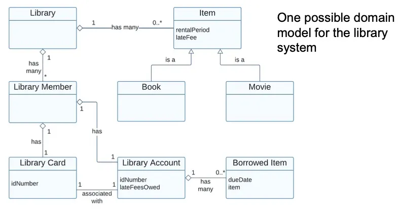
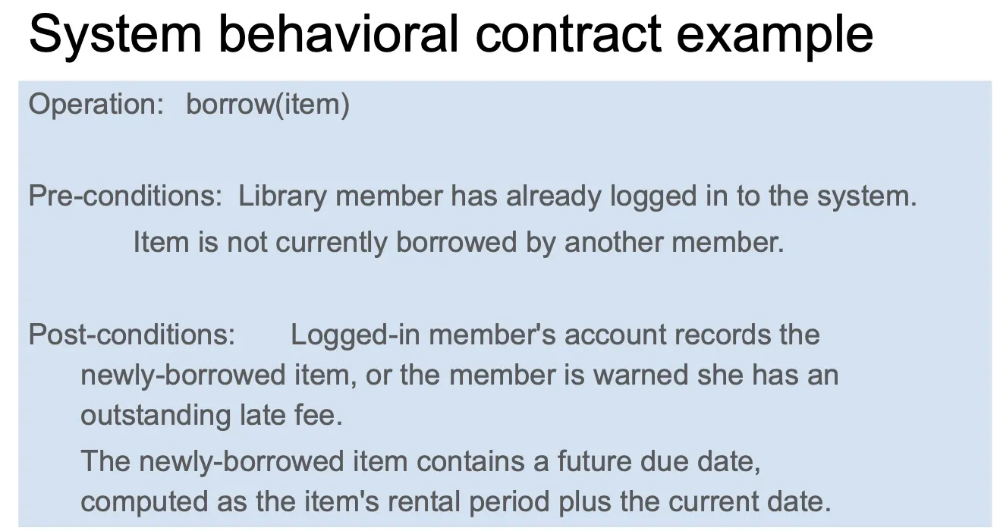
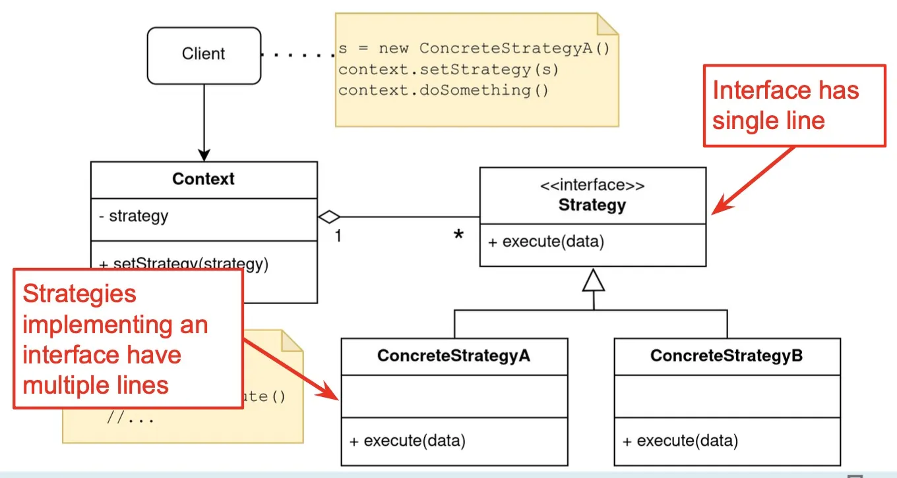
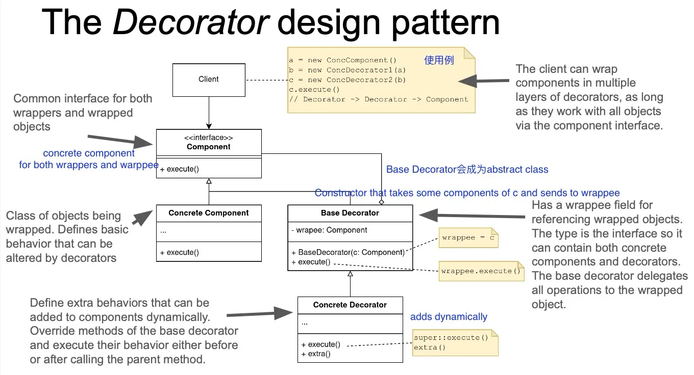
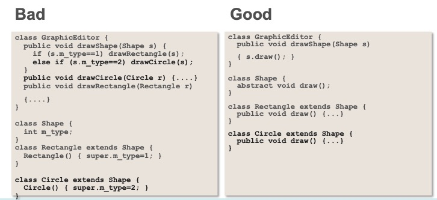

# Lec 2. Object-Oriented Basics

Tradeoffs?

- Version 1

```java
void sort(int[] list, String order) {
	// ...
	boolean mustswap;
	if (order.equals("up")) {
		mustswap = list[i] < list[j];
	} else if (order.equals("down")) {
		mustswap = list[i] > list[j];
	}
}
```

- Version 2

```java
void sort(int[] list, Comparator cmp) {
	// ...
  boolean mustswap;
	mustswap = cmp.compare(list[i], list[j]);
}

interface Comparator {
	boolean compare(int i, int j);
}
class UpComparator implements Comparator {
	boolean compare(int i, int j) { return i < j; }
}
class DownComparator implements Comparator {
	boolean compare(int i, int j) { return i > j; }
}
```

Version 1: Shorter

Version 2: Expandable.


TypeScript is a **superset** of JavaScript because it allows for **gradual migration from JS to TS**


- Design for **Change** (flexibility, extensibility, modifiability)
- Design for Division of Labor
- Design for Understandability


Java **Primitives**: `int`, `long`, `byte`, `short`, `char`, `float`, `double`, `boolean`. 注意没有string！

JavaScript **Primitives**: `null`, `undefined`, `boolean`, `number`, `string`, `symbol`, `bigint`

- Primitives are **immutable**, and **passed by value**

`Object` is a **non-primitive** type.

----



以下是八股文，看完就忘



## Subtype Polymorphism / Dynamic Dispatch

An **interface** describes the API/way to interact with an object. It does NOT provide the implementation.

There can be **multiple implementations of one interface**. Multiple implementations can coexist.

Java: **Classes implicitly have Interfaces**. Prefer interfaces over class types

例如：`class PolarPoint implements Point`

**Dynamic dispatch** (in both Java and JavaScript): 用父类指针指向子类对象，调用方法, method is decided at runtime

Java: **Static** methods are global functions, only single copy exists; class provides only namespace. Java does not allow global functions outside of classes. Java中Static函数就是全局函数（java不允许class外的全局函数），class只作为命名空间。

**Dynamic dispatch的优点: Design for change**

- A user of an object does not need to know the object's implementation, only its interface. 用户不需要知道实现，只需要知道Interface
- All objects implementing the interface can be used interchangeably. 所有implement这个interface的Object可以互换使用
- Allows flexible change (modifications, extensions, reuse) later without changing the client implementation, even in unanticipated contexts. 方便修改和重构

**Why multiple implementations**

- Different performance: Choose implementation that works best for your use

- Different behavior:
  - Choose implementation that does what you want
  - Behavior must comply with interface spec (“contract”)

- Often performance and behavior both vary: Provides a functionality – performance tradeoff. Example: HashSet, TreeSet

## Encapsulation / Information hiding

**Information hiding的优点**

- **Decouples** the objects that comprise a system: Allows them to be developed, tested, optimized, used, understood, and modified in isolation

- **Speeds up** system development: Objects can be developed in parallel 
- Eases **maintenance burden**: Objects can be understood more quickly and debugged with little fear of harming other modules
- Enables effective **performance tuning**: “Hot” classes can be optimized in isolation

- Increases software **reuse**: Loosely-coupled classes often prove useful in other contexts

How to hide information?

- Java中使用`private`（注意interface method must be `public`)
- Declare variables using interface types, not class types
  - client can use only interface methods. Fields and implementation-specific methods are not accessible from client code.
- JavaScript中使用闭包 **closure**, TypeScript中能直接private。
- JavaScript中使用Modules能 information hiding at file level.

# Lec 3. Object-oriented Analysis

如何把用户需求转变成代码实现？

Problem Space (Domain Model) ---->  Solution Space (Object model)

| Problem Space (Domain Model) | Solution Space (Object Model)                        |
| ---------------------------- | ---------------------------------------------------- |
| Real-world things            | System Implementation                                |
| Requirements, concepts       | Classes, objects                                     |
| Relationships among concepts | References among objects and inheritance hierarchies |
| Solving a problem            | Computing a result                                   |
| Building a vocabulary        | Finding a solution                                   |

## Domain Models

**Object-Oriented Analysis**: understanding the problem

- **domain model**
- find key concepts in the problem domain
  - 找名词、动词、和concepts之间的relationships。避开不明确的词例如system。

- using **UML (Unified Modeling Language)** class diagrams as informal notation
- **glossary**
  - Identify and define key concepts. Ensure shared understanding between developers and customers.
  - 例如: "Library Item: Any item that is indexed and can be borrowed from library." 这句话对于可能有歧义的concepts给出了明确定义。

- **system sequence diagram**: a model that shows, for one usage scenario, sequence of events that occur on the system's boundary.
- system behavioral contracts

**OO Design**: Defining a solution

- object interaction diagrams
- object model


Domain Model长这样

- 空心菱形：aggregation 聚合关系，例如：`班级 ◇--- 学生`（学生可以存在于班级之外）
- 实心菱形：composition 组合关系，例如：`人 ♦--- 心脏`（心脏不能离开人体独立存在）
- 三角形：inheritance/generalization 继承/泛化关系，例如：`狗 ---△ 动物`（狗继承自动物）



UML Sequence Diagram 长这样


Behavioural Contract 长这样




完成了Domain Model, System Sequence Diagram 和 Behavioural Contract 之后，就是从Problem Space到Solution Space的转换。希望能low representational gap


# Lec 4. Responsibility Assignment

Problem Space (Domain model) ---> Solution Space (Object model)

Representational gap


## Design Principle

- **Low representational gap**

  Domain concepts provide inspiration for software classes.

  Classes for domain concepts intuitive to understand, rarely change.

  为什么要low representational gap? 你可以建立一个class LibrarySystem然后把所有东西放在单个巨大的class里，但是这样不好做后续修改（我们需要 **design for change**）

  Benefits

  - facilitates understanding of design and implementation
  - facilitates traceability from problem to solution
  - facilitates evolution (**design for change**)

- **Low coupling**

  A model should depend on as few other modules as possible

  一个module要和尽量少的module之间有依赖关系

  Benefits

  - Enhances understanability
  - Reduce the cost of change (如果每个module最多只和另外两个module有关系，那么改变module时最多只需要修改两个module，不需要牵一发而动全身)

  - Enhances reuse (fewer dependencies, easier to adapt to a new context)

  A related design heuristic: **law of demeter**: **each module should have only limited knowledge about other units**

  `a.getB().getC().foo` is a bad practice !!! This means you are not distributing knowledge correctly !!!

  **Prefer coupling to interfaces** over coupling to implementations (interface相比implementation改变得更少) 

- **High cohesion** (or **single-responsibility principle**)

  Each component should have a small set of closely-related responsibilities
  
  每个component（每个class/object）只负责较少的职责
  
  Benefits:
  
  - facilitates understandability
  - facilitates reuse
  - eases maintenance

**Coupling vs Cohesion**

把所有代码写在一个class里：very low coupling, but very low cohesion.

把每个模块都分开来：very high cohesion, but very high coupling.

Find a good tradeoff!


# Lec 5. Inheritance and Delegation

Java中class的继承关系，所有class都继承自 `class Object`

Java编译期判断which class to look in, method signature to be executed，运行时判断class的动态类型，对于动态class判断到底执行哪个method。

JavaScript运行时解析methods。


- Inheritance vs Subtyping

  **Inheritance**: `class A extends B`

  **Subtyping**: `class A implements B`, `class A extends B`


# Lec 6. Design Patterns

"Each pattern describes a problem which occurs over and over again in our environment, and then describes the core of the solution to that problem, in such a way that you can use this solution a million times over, without ever doing it the same way twice."

Design pattern是针对软件开发中反复出现的问题，总结出可复用、灵活解决方案的一种经验方法

## Strategy Pattern

**Problem**: Clients need different variants of an algorithm

**Solution**: Create an interface for the algorithm, with an implementing class for each variant of the algorithm

**Consequences**

- Easily extensible for new algorithm implementations.
- Separates algorithm from client context
- Introduces an extra interface and many classes: (1) code can be harder to understand, (2) lots of overhead if the strategies are simple.




## Template Method Design Pattern

- Applicability

  - When an algorithm consists of varying and invariant parts that must be customized

  - When common behavior in subclasses should be factored and localized to avoid code duplication

  - To control subclass extensions to specific operations

- Consequences

  - Code reuse

  - Inverted “Hollywood” control: don’t call us, we’ll call you

  - Ensures the invariant parts of the algorithm are not changed by subclasses

Abstract class 抽象类，指一个class有些方法implement了有些方法没有implement


**Template Method vs Strategy Pattern**

- Template method uses **inheritance** to vary part of an algorithm
- Strategy pattern uses **delegation** to vary the entire algorithm

**Inheritance vs. Composition + Delegation**

- Inheritance can enable **substantial** reuse when strong coupling is reasonable

  - Sometimes a natural fit for reuse -- look for “is-a” relationships.
  - Does not mean “no delegation”

- That said, good design typically favors composition + delegation

  - Enables reuse, encapsulation by programming against interfaces

  - Delegation supports information hiding; inheritance violates it
  - Usually results in more *testable* code.
  - Composition facilitates adding multiple behaviors, much less messily than multiple inheritance.

## Composite Design Pattern

- Applicability

  - You want to represent part-whole hierarchies of objects

  - You want to be able to ignore the difference between compositions of objects and individual objects

- Consequences

  - Makes the client simple, since it can treat objects and composites uniformly

  - Makes it easy to add new kinds of components

  - Can make the design overly general

    - Operations may not make sense on every class

    - Composites may contain only certain components


## Module Pattern

Hide internals in closure

# Lec 7. Design Practice

One more pattern called **decorator pattern**.

## Decorator Pattern

Inheritance的局限性：

e.g. 需要写一个`Stack`，有`UndoStack`, `SecureStack / LockedStack`（需要密码才能读stack）, `SynchronizedStack` （concurrent-safe）

还要能将上面这些结合起来，有`SecureUndoStack`, `SynchronizedUndoStack`, `SecureSynchronizedStack`等等 （arbritrarily composable extensions）

Decorator Pattern: **add functionality at runtime**

Decorator Pattern is good if you want to **arbitrarily combine/add features to a class**.





以下是八股



Problem: Responsibilities should be added to an object dynamically at runtime.

Solution: Defines a Decorator object that implements the interface of an extended object, optionally performing additional functionality before/after forwarding the request.

- Applicability
  - add responsibilities to individual objects dynamically and transparently
  - for responsibilities that can be withdrawn
  - when extension by subclassing is impractical
- Consequences
  - more flexible than static inheritance
  - avoids large classes in the hierarchy
  - lots of little objects

# Lec 8. Refactoring antipattern

Detour: object equality

- 比较primitive object (`Object.isPrimitives`) 可以使用 `==`. 

- 比较其它object需要使用 `.equals` 不能使用 `==`

- `Object.equals()`可以永远返回false，这是合法的，`null`和所有东西equal都是false

Hashcode

- equal的object必须有equal hashcode。否则会出现奇怪的bug，例如Hashmap, Hashset无法正常运行
- generally necessary to override the `hashCode` method whenever this method is overridden.
- hashcode 可以返回0，但会让搜索变得很低效

Override `Object` implementations

- No need to override `equals` and `hashCode` if you want identity semantics
- Nearly always override `toString`

## Refactoring: Functionality-preserving rewriting

Functionality-preserving restructuring: **semantics** of the program **do not change**, but the **syntax change**

通常来说如果functionality is correct, but organization is bad (e.g. high coupling, high redundancy, poor cohesion, god classes...) 则需要refactoring

## Anti-Patterns

Anti-patterns are common forms of bad design

Two common causes

- design issues that manifest as bad/unmaintainable code
- poorly written/evolved code that leads to bad design

Code smells

- 不一定不好，但需要一些检查
- 例如
  - long methods, large classes. Suggests bad abstraction
  - inheritance despite low coupling ("refused bequest") --> replace with delegation or rebalance hierarchy
  - `instanceOf` or `switch` instead of **polymorphism**
    - **avoiding `instanceOf`**
    - Do not ask an object's type, ask an object to do something
    - 使用subtype polymorphism (interfaces)代替，因为这只需要改一处，instanceOf需要改很多处
    - 仅在不可避免时使用instanceOf, 例如 `equals()` 要求 Obejct type vs `Comparator<T>`
  - overly similar classes, hierarchies
  - any change requires lots of edits (high coupling across classes, or heavily entangled implementation)
  - excessive, unused hierarchies
  - operations posing as classes
  - data classes (not always bad, but ideally distinguish from regular classes (record), and assign responsibilities if any exist)
  - heavy usage of one class data from another (poor coupling)
  - long chains of calls
  - a class that only delegates work

## Fluent APIs / Builder Design Pattern

**Liquid APIs**: each method changes state, then returns `this`  (对于Immutable则return modified copy)

e.g. `Option find = OptionBuilder.withArgName("file").hasArg().withDescription("search...").create("find")`

Builder Pattern: 当创建一个complex object的许多个变种时，

e.g. `HouseBuilder.buildWalls().buildDoors().buildGarage().getResult()`

- assign assembling work to a builder object

  when cascading, builder returns itself, modified on every update

  offers a method that generates the resulting object

- 引导使用者 **only use the Builder**

  e.g. make the constructor private

Fludent APIs的优缺点

- Advantages
  - fairly readable code
  - can check individual arguments
  - avoid untyped complex arguments
- Disadvantages
  - runtime error checking of constraints and mandatory arguments
  - extra complexity
  - not always obvious how to terminate
  - possibly harder to debug

## Iterator Pattern & Streams

从Java 1.5开始

```java
interface Iterator<E> {
	boolean hasNext();
	E next();
	void remove();
}
```

可以显式使用iterator

```java
for (Iterator<String> it = a.iterator(); it.hasNext();) {
	String s = it.next();  // do something
}
```

也可以使用 `for (String s : arguments)` 

Iterators for everything, 例如

```java
public class Pair<E> implements Iterable<E> {
  private final E first, second;
  public Pair(E f, E s) { first = f; second = s; }
  public Iterator<E> iterator() {
    return new PairIterator();
  }
  private class PairIterator implements Iterator<E> {
    private boolean seenFirst = false, seenSecond = false;
    public  boolean hasNext() { return !seenSecond; }
    public  E next() {
      if (!seenFirst)  { seenFirst  = true; return first;  }
      if (!seenSecond) { seenSecond = true; return second; }
      throw new NoSuchElementException();
    }
    public void remove() {
      throw new UnsupportedOperationException();
  }
}
// Usage:
Pair<String> pair = new Pair<String>("foo", "bar");
for (String s : pair) { ... }
```

**Iterator design pattern**

- Problem: Client需要一个统一的访问container所有元素的strategy。顺序unspecified，但访问所有元素一次。
- Solution: A strategy pattern for iteration

Streams

- typically provide operations to produce new stream from old stream (e.g. map, flatMap, filter) and operations on all elements (fold, sum) 

- often has efficient/parallel implementations (subtype polymorphism)

- Java8开始自带

- e.g.

  ```java
  List<String>results = stream.map(Object::toString)
                  .filter(s -> pattern.matcher(s).matches())
                  .collect(Collectors.toList());
  int sum = numbers.parallelStream().reduce(0, Integer::sum);
  ```


# Lec 9. Specifications & Unit-testing

Contracts需要定义preconditions和postconditions

- 如果precondition未满足则client is to blame

- 如果postcondition未满足则service is to blame

- error behaviors (if preconditions is not met) should also be specified.

Most real-world code has a contract

- service implementation is hidden from service client
- client environment is hidden from service provider
- explicit is much better than implicit when it comes to quality assurance
  - exception handling, unit testing, specifications

## Exceptions

Separate all error handling away from the main code

Where do exceptions come from?

- program can raise them explicitly using throw
- underlying JVM can generate them

Exception handling: **undeclared** vs **declared** (`throws IOException`)

Checked exception

- Must be caught or propagated, or program won't compile
- exceptional condition that programmer must deal with

Unchecked exception

- no action is required for program to compile (but will cause runtime failure)
- usually indicates a programming error
- common: all exceptions in C++, JS

Error

- special unchecked exception typically thrown by VM
- recovery is usually impossible (e.g. `StackOverflowError`)

**Benefits of exceptions**

- easier to make sure you handle common failure modes
  - explicit, rather than implicit, error-handling
  - compare to using a flag or a special return value
- provide high-level summary of error
- improve code structure
  - separate normal code path from exceptional
  - error handling code is segregated in catch blocks
- ease task of writing robust, maintainable code

Guidelines for using exceptions

- document all exceptions thrown by each method. 包括unchecked和checked。 但不要declare unchecked exceptions
- include failure-capture info in detail message
- don't ignore exceptions
- clean up. Solution: **try-with-resources**


# Lec 10. Test case design

给定一个method, 我们需要test什么

- What it claims to do --> **specification testing** -- the contract
  - Test soly based on specification
  - Ignores implementation, use inputs/outputs only
  - Cover all specified behavior
  - Do not rely on code. Consider edge-cases of the specification, not the implementation. (Think like an attacker)
- What it does --> **structural testing**
  - explicitly consider the implementation
  - optimize for various kinds of code coverage (line, stmt, branch, etc)

怎么写specifications?

- Formal frameworks can be used to describe pre- and post-conditions
  - e.g. requires arr != null
  - rarely used
- More common: **textual specification**  contracts
- Preconditions
- Postconditions 
  - Exceptional behaviour: 如果违反preconditions会发生什么
- Document: every parameter, return value, every exception, what the method does
  - Do not document implementation details.

## Contracts

A contract is an agreement between an object and its user.

Defines the method's and caller's responsibilities.

What the method does, not how it does it (interface/API, not implementation)

## Specification-based Testing

When writing specification-based tests, ignore the implementation. 针对某个method写specification测试时要忽略method内部的实现。

**Boundary value testing**: select a nominal/normal case, a boundary value, and an abnormal case. 

**Equivalence class testing**: if you cannot try every single value, group them where you expect similarities, select one representative each. 

Decision Tables: we need a strategy to identify plausible mistakes. 

## Structural Testing

Use the code itself as a guide for writing tests.

**Path coverage** is impossible in the general case (当有loop的时候，有无穷中可能路径)

Instead, we approx by choosing sets of control flow paths through the program to cover instead. 

You typically have both code & (prose) specification. 

Coverage is useful, but 不能替代insight. 

## Test doubles

- Dummy (例子: 某个method什么都不做)
  - Objects needed by the program (e.g. parameters) but are never actually used.
  - Used to improve performance and test isolation, or remove the need for complicated test scaffolding
  
- Stub
  
  - Double for a real collaborator that gives predefined answers to calls during testing. 
  
  - Used to improve performance and test isolation, or to test the system under certain conditions (e.g., unauthenticated user, exceptional cases).
  
  - 人造的class返回预先规定好的数据
  
- Fake
  
  - Provides an optimized, thinned-down version of a collaborator that replicates the same behavior of the original object without certain side effects or consequences.
  - Fully functional class with simplified implementation e.g. 内存数据库
  
- Spy
  
  - Used to track and test the secret internal state of a collaborator. Monitors calls to the collaborator to track the internal state of that collaborator.
  - 用于跟踪对对象方法的调用，进而跟踪一个collaborator的internal state
  
- Mock
  
  - Used to test for **expected interactions** with a collaborator (i.e., method calls).
  
    Can behave like a *spy*, a *stub*, or both.
    
  - instrumented variant of real class with fine-grained control

How test doubles help

1. Speed: simulate response without going through the API

2. Stability: guaranteed deterministic return, reduces flakiness

3. Coverage: reliably simulate problems (e.g., return 404)

4. Insight: expose internal state

5. Development: presume functionality not yet implemented (e.g., test parts that

   rely on payment processing without implementing the payment system)

Test double cheatsheet

- **Dummy** isn’t used very often

- **Stub** if you just want collaborators to provide canned responses

- **Mock** if you want to test interactions

- **Spy** if you want to track the hidden internal state, or if mocks become too complex
- **Fake** if you test a complex scenario that relies on a service or component that’s unavailable or unusable for your test’s purposes, and stubbing does not do the job

# Lec 11. Testability

## Command query separation

Object methods可分为**commands**或**queries**

query返回关于system states的信息，没有side effects

commands会改变system的state，但不会返回结果

- **Testing queries is easy** because we only care about responses. 
  - Stubs and fakes often suffice 足够
- **testing commands is harder**: needs to verify expected outcome by looking for effects on the system
  - Spies and mocks

## Design principles for testable code: SOLID

- **Single responsibility principle (SRP)**
  - Tests should have only a single reason to fail. 

- **Open-closed principle (OCP)**
  - designs should open for extension but closed for modification.
  - 你的设计应该允许不改变源码的情况下extend一个class
  - generally, composition 比 inheritance要好
  - 

- **Liskov substitution principle (LSP)**

  - subclasses should always be substitutable for their base classes
  - 如果遵守LSP则 tests should not have unpleasant surprises resulting from abuse of inheritance. 
  - *Test doubles are created using LSP*
    - If the test double and real class implement or extend the same superclass, they can be substituted for superclass in any context that expects the superclass
  - Class hierarchies that follow LSP contribute to testability by enabling the use of contract tests
    - Tests written for an interface can be executed against all implementations of that interface

- **Interface segregation principle (ISP)**

  - small interfaces improve testability by making it easier to write and use test doubles

  - e.g. One test might want to stub collaborator A, fake collaborator B, and substitute a spy for collaborator C. With each collaborator having its own small interface, it’s straightforward to implement the test doubles!

- **Dependency inversion principle (DIP)**
  - Complex high-level elements should not directly depend on low-level elements that are likely to change: instead both should depend on abstractions.
  - Abstractions should not depend on details; details should depend on abstractions.

Invocation/Observation

- invocation: private方法，not accessible to test classes. 
- observation: void methods with no return value. Internal state not visible to clients. 内部state的变化，会有side effects但无法测试

# Lec 12. Intro to concurrency

Concurrency: 同一时刻多个threads一起运行 (not necessarily executing in parallel)

Asynchrony: computation happening outside the main flow

## Threads

Basic threading in java:

`java.lang.Runnable`表示一个task: `public interface Runnable { void run(); }`

`java.lang.Thread`能在一个thread里运行`task`

`public class Thread { public Thread(Runnable task); public void start(); public void join();}`

## Concurrency

multi-threading required for scalability and performance.

e.g Concurrency with file IO

Note: concurrency is not parallelism.

### Concurrency hazards

- **Safety hazards**
  
  - shared mutable state requires synchronization
  
  - **thread safe**: no assumptions required to operate correctly with multiple threads
  
  - Simple solution: Don't have state, Don't have shared state, Don't have shared mutable state.
  
    Ensure security of any mutable components
  
  - Immutability 有优点有缺点，缺点: trivial mutations might require copying a large object. 
  
- **Liveness** hazards

  - eventually make progress

- **Performance** hazards
  - quickly make progress

# Lec 13. Concurrency and Hazards

# Lec 14. Java Parallelism

## wait/notify

```java
class MyHouse {
    private boolean pizzaArrived = false;
    public void eatPizza(){
        synchronized(this){
            while(!pizzaArrived){
                wait();
						}
            System.out.println("yumyum..");
        }
		}
    public void pizzaPerson(){
        synchronized(this){
     			this.pizzaArrived = true;
     			notifyAll();
        }
    }
}
```

Never invoke `wait` outside of a loop!

- loop tests the condition before and after waiting.
- Before - skips wait if the condition already holds (needed to ensure liveness, otherwise thread can wait forever)
- After - ensures safety (condition may not be true once a thread wakes up)


# Lec 15. Concurrency & Asynchrony in TypeScript

**JavaScript Engine**: 两个主要组成部分: memory heap, call stack

**JavaScript Runtime**: Engine + **Web APIs, event loop, callback queue**

JavaScript is **single-threaded** (**single call stack**). Solution: **Callbacks**

**Callback Hell**: every callback takes an argument that is a result of the previous callbacks.

Solution: **Promises**, **Async functions**

The **Promise Pattern**:

- Problem: one or more values we need will arrive later. (某个时刻必须要等待)
- Solution: an abstraction for expected values
- promise内有一个函数, 会被constructor立即调用, 传入`resolve` 和 `reject` 两个callback函数
- 完成后才会执行 `then` 和 `catch` callback. Callback永远会被invoke. 

**async/await**

- `async` keyword can be placed before a `function`. 
- Async functions always returns a `Promise` (automatically). May return rejected promises on exceptions. 

Callback and Promises can make for messy exception handling and control flow

- multiple `catch`es and `then` s are hard to understand.
- completely different error handling for sync & async failures
- making control flow based on result of a callback ends up creating more nesting

# Lec 16. More Patterns

## Observer Pattern

**Publish/subscribe**: a new mechanism that allows objects to subscribe to events they are interested in. Allows the publisher to notify all subscribers when an event happens.

Observer Pattern:

- Problem: Clients need to be able to implement a publish/subscribe mechanism.
- Solution: Create a publisher class that maintains a list of Subscribers. This class should have methods to subscribe and unsubscribe, and also a method to notify all subscribers.
- Consequences:
  - Easy to add new subscriber classes without modifying the publishers code
  - Establishes relationships between objects at runtime
  - Subscribers are notified in a random order.

## Proxy Design Pattern

- Problem: You want to control client access to an object
- Solution: Create a new Proxy class with the same interface as the original object. Update your app to pass the proxy object instead of the original object.
- Consequences:
  - You can control the object without clients knowing about it
  - You can manage the lifecycle of an object if clients don't care
  - It can work even if the service isn't available anymore
  - You can introduce new proxies without changing client code
  - Code can become more complicated with the introduction of new classes.
- Example: caching; caching and failover; redirect to local service

## Adapter Design Pattern

Applicability

- You want to use an existing class, and its interface doesn't match the one you need
- You want to create a reusable class that cooperates with unrelated classes that don't necessarily have compatible interfaces
- You need to use several subclasses, but it's practical to adapt their interface by subclassing each one.

Consequences:

- exposes the functionality of an object in another form
- unifies the interfaces of multiple incompatible adaptee objects
- Lets a single adapter work with mutiple adaptees in a hierarchy
- ---> low coupling, high cohesion

# Lec 17. Intro to GUI

HTML

Static/Dynamic website

**Model-View-Controller (MVC)** pattern

- Model: manage data related to the application domain
- Controller: manage inputs from user: mouse, keyboard, menu, etc.
- View: manage display of information on the screen

# Lec 18. Libraries and Frameworks

Reuse at scale

**Terminology**

- **Library**: A set of classes and methods that provide reusable functionality
  - client controls library; library executes the call and returns data
- **Framework**: reusable skeleton code that can be customized into an application
  - Framework calls back into client code ==> The Hollywood principle: "Don't call use. We'll call you."
- **API**: Application Programming Interface, the interface of a library or framework
- **Client**: the code that uses API
- **Plugin**: client code that customizes a framework
- **extension point**: a place where a framework supports extension with a plugin
- **protocol**: the expected sequence of interactions between the API and the client
- **callback**: a plugin method that the framework will call to access customized functionality
- **lifecycle method**: a callback method that gets called in a sequence according to the protocol and the state of the plugin.

## White-box vs Black-box frameworks

**Whitebox (inheritance-based) frameworks**

- extension by **subclassing** and overriding methods. Subclass has main method but gives control to framework
- common design patterns: template method

**Blackbox (delegation-based) frameworks**

- extension by implementing a plugin interface. Plugin-loading mechanism loads plugins and gives control to the framework
- common design patterns: strategy, observer

Summary

- Whitebox frameworks use subclassing
  - allows extension of every (non-private) method
  - need to understand implementation of superclass
  - only one extension at a time
  - compiled together
  - often so-called developer frameworks
- Blackbox frameworks use composition
  - allows extension of functionality exposed in interface
  - only need to understand the interface
  - multiple plugins
  - often provides more modularity
  - separate deployment possible (.jar, .dll)
  - often so-called end-user frameworks, platforms


# Lec 19. API 1

**API Naming**

- makes client code: easy to read; mean what it says; easy to write
- names should: be self-explanatory; leverage existing knowledge; interact with both the traget language and other APIs

Names can be **literal** or **metaphorical**

- literal names have literal associations
- metaphorical names enable reasoning by analogy

Use **consistent terminology** throughout your API

- never use same word for multiple meanings; never use multiple words for the same meaning
- choose a structure and stick with it (e.g. createElement vs elementCreate)

Avoid abbreviations

Don't lie about what your methods do

- do not violate the **principle of least astonishment** (大多数人怎么认为)

**API Documentation**

Document every method/function, parameter, exception thrown by each thread, every type

How to **document a method**: preconditions, postconditions, side-effects, thread-safety

How to **document a parameter or field**: describe what the parameter represents (短名词句), units, form, restrictions

How to **document a method's exceptions**: say precisely when it is thrown. If not a precondition viiolation, say what the caller can do in response. Document all exceptions

# Lec 20. API 2

Hyrum's Law: with a sufficient number of users of an API, it does not matter what you promise in the contract: all observable behaviors of your system will be depended on by somebody. 

# Lec 21. Supply Chain Security and Sustainability

Think carefully about your dependencies

# Lec 22. Designing and Testing for Robustness in Large & Distributed System


# Lec 24. DevOps

