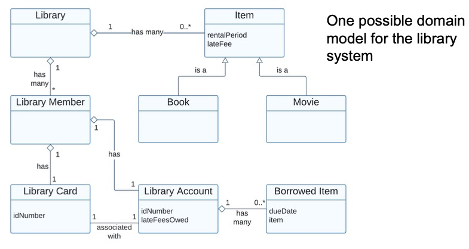
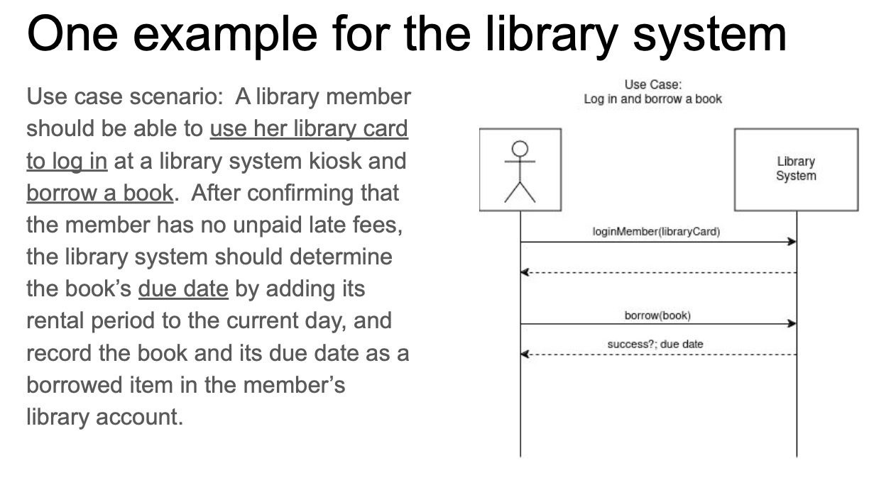
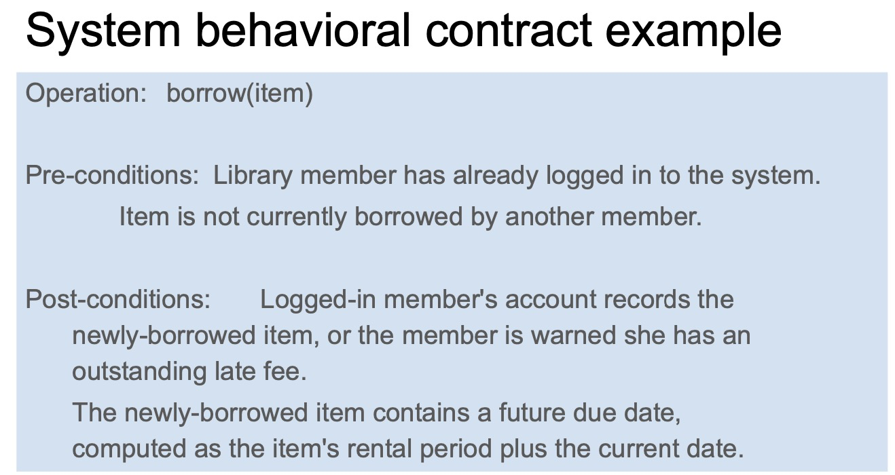
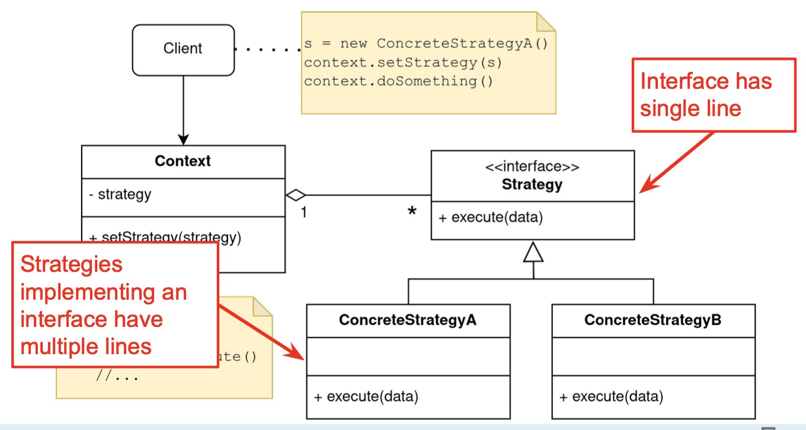
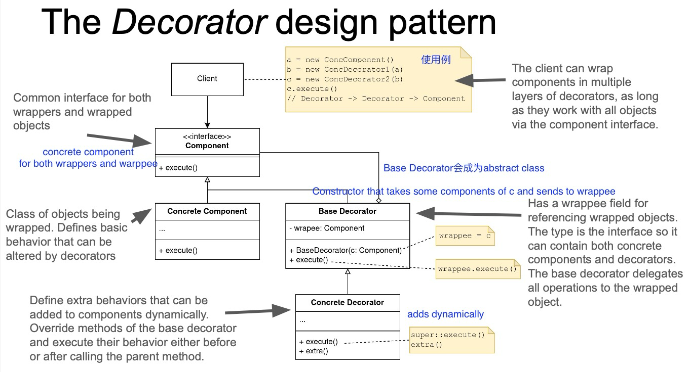

# Lec 2. Object-Oriented Basics

Tradeoffs?

- Version 1

```java
void sort(int[] list, String order) {
	// ...
	boolean mustswap;
	if (order.equals("up")) {
		mustswap = list[i] < list[j];
	} else if (order.equals("down")) {
		mustswap = list[i] > list[j];
	}
}
```

- Version 2

```java
void sort(int[] list, Comparator cmp) {
	// ...
  boolean mustswap;
	mustswap = cmp.compare(list[i], list[j]);
}

interface Comparator {
	boolean compare(int i, int j);
}
class UpComparator implements Comparator {
	boolean compare(int i, int j) { return i < j; }
}
class DownComparator implements Comparator {
	boolean compare(int i, int j) { return i > j; }
}
```

Version 1: Shorter

Version 2: Expandable.


TypeScript is a **superset** of JavaScript because it allows for **gradual migration from JS to TS**


- Design for **Change** (flexibility, extensibility, modifiability)
- Design for Division of Labor
- Design for Understandability


Java **Primitives**: `int`, `long`, `byte`, `short`, `char`, `float`, `double`, `boolean`. 注意没有string！

JavaScript **Primitives**: `null`, `undefined`, `boolean`, `number`, `string`, `symbol`, `bigint`

- Primitives are **immutable**, and **passed by value**

`Object` is a **non-primitive** type.


# Lec 3. Object-oriented Analysis

如何把用户需求转变成代码实现？

**OO Analysis**: understanding the problem

- **domain model**
- find key concepts in the problem domain
- using **UML (Unified Modeling Language)** class diagrams as informal notation
- **glossary**
- **system sequence diagram**: a model that shows, for one usage scenario, sequence of events that occur on the system's boundary.
- system behavioral contracts

**OO Design**: Defining a solution

- object interaction diagrams
- object model


Domain Model长这样

- 空心菱形：aggregation 聚合关系，例如：`班级 ◇--- 学生`（学生可以存在于班级之外）
- 实心菱形：composition 组合关系，例如：`人 ♦--- 心脏`（心脏不能离开人体独立存在）
- 三角形：inheritance/generalization 继承/泛化关系，例如：`狗 ---△ 动物`（狗继承自动物）



UML Sequence Diagram 长这样



Behavioural Contract 长这样




完成了Domain Model, System Sequence Diagram 和 Behavioural Contract 之后，就是从Problem Space到Solution Space的转换。希望能low representational gap


# Lec 4. Responsibility Assignment

Problem Space (Domain model) ---> Solution Space (Object model)

Representational gap


Design Principle

- **Low representational gap**

  为什么要low representational gap? 你可以建立一个class LibrarySystem然后把所有东西放在单个巨大的class里，但是这样不好做后续修改（我们需要 **design for change**）

  Benefits

  - facilitates understanding of design and implementation
  - facilitates traceability from problem to solution
  - facilitates evolution (**design for change**)

- **Low coupling**

  一个module要和尽量少的module之间有依赖关系

  Benefits

  - Enhances understanability
  - Reduce the cost of change (如果每个module最多只和另外两个module有关系，那么改变module时最多只需要修改两个module，不需要牵一发而动全身)

  A related design heuristic: law of demeter: **each module should have only limited knowledge about other units**

  `a.getB().getC().foo` is a bad practice !!! This means you are not distributing knowledge correctly !!!

  **Prefer coupling to interfaces** over coupling to implementations (interface相比implementation改变得更少) 

- **High cohesion** (or single-responsibility principle)

  每个component（每个class/object）只负责较少的职责

**Coupling vs Cohesion**

把所有代码写在一个class里：very low coupling, but very low cohesion.

把每个模块都分开来：very high cohesion, but very high coupling.

Find a good tradeoff!


# Lec 5. Inheritance and Delegation

Java中class的继承关系，所有class都继承自 `class Object`

Java编译期判断which class to look in, method signature to be executed，运行时判断class的动态类型，对于动态class判断到底执行哪个method。

JavaScript运行时解析methods。


- Inheritance vs Subtyping

  **Inheritance**: `class A extends B`

  **Subtyping**: `class A implements B`, `class A extends B`


# Lec 6. Design Patterns

## Strategy Pattern




## Composite Pattern


## Module Pattern


# Lec 7. Design Practice

One more pattern called **decorator pattern**.

## Decorator Pattern

Inheritance的局限性：

e.g. 需要写一个`Stack`，有`UndoStack`, `SecureStack / LockedStack`（需要密码才能读stack）, `SynchronizedStack` （concurrent-safe）

还要能将上面这些结合起来，有`SecureUndoStack`, `SynchronizedUndoStack`, `SecureSynchronizedStack`等等 （arbritrarily composable extensions）

Decorator Pattern: **add functionality at runtime**




- Applicability
  - add responsibilities to individual objects dynamically and transparently
  - for responsibilities that can be withdrawn
  - when extension by subclassing is impractical
- Consequences
  - more flexible than static inheritance
  - avoids large classes in the hierarchy
  - lots of little objects
