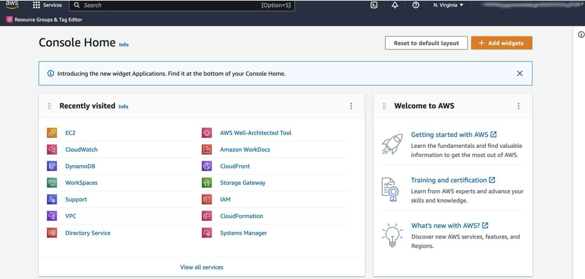
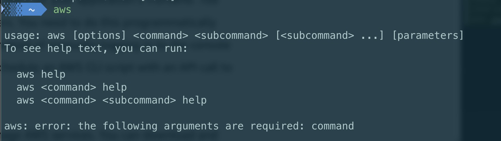
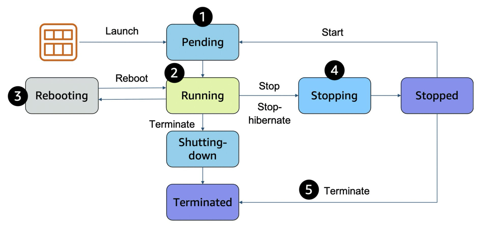
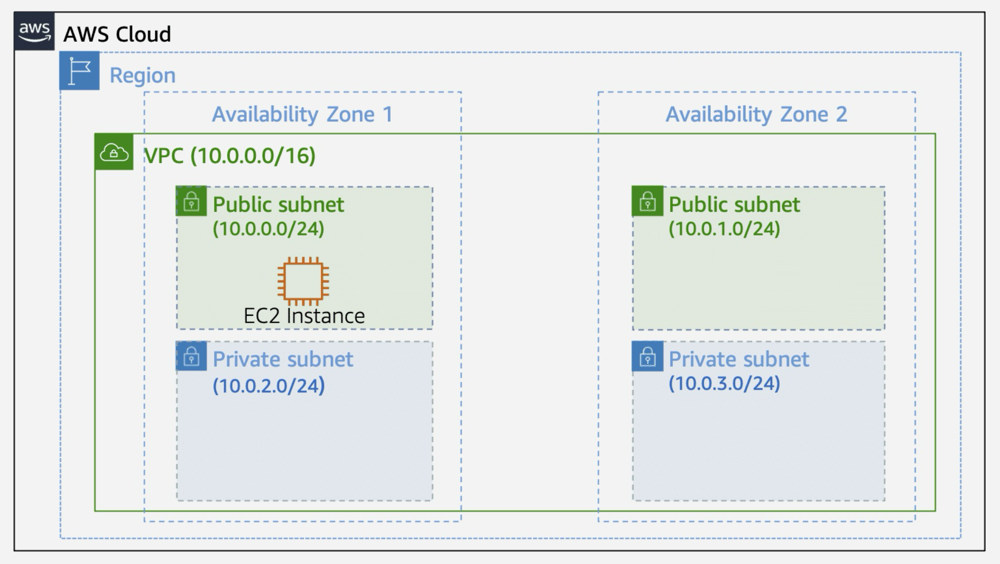
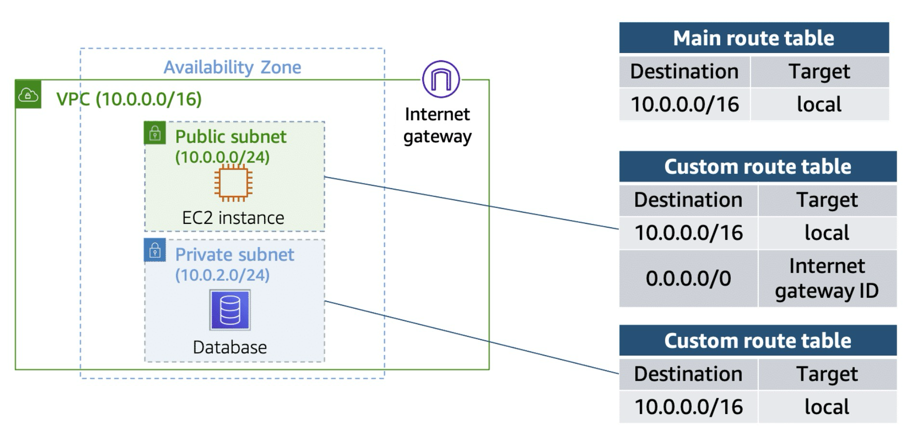

---
title: "AWS Basics"
date: 2025-06-14 19:17:06
description: "AWS Onboarding Notes"
categories:
- Cross Platform
- AWS
tags:
- Cross Platform
- Linux
- AWS
---

# AWS Technical Essentials

## AWS Intro

- AWS Cloud Computing不仅仅有云服务器这么简单

- AWS **Regions**: 常说的 us-west-2 (Oregon), us-east-1 (N Virginia) 就是region

  - **us** (United States), **ca** (Canada), **af** (Africa), **ap** (Asia Pacific), **eu** (Europe), **me** (Middle East), **sm** (South America)

- 每一个region有多个**availability zone** (e.g. us-east-1a), 每一个availability zone有多个data centers，提供redundancy

- **Edge locations**: 类似于CDN，类似于global cache。**AWS CloudFront**提供了使用edge location的服务

- 三种与AWS交互的方法：**AWS Management Console, AWS CLI, AWS SDK**

  - AWS Management Console就是网页版

    

  - AWS CLI就是在终端输入aws命令。aws web console上能完成的事情也可以使用终端命令或脚本完成。aws console右上角的终端图标是**cloudshell**，等同于aws cli

    

    or

    

  - AWS SDK: 支持多种语言(C++, Java, js, py, ...) 可集成在不同语言的应用里

- AWS Shared Responsibility Model

  - **customer** is responsible for **security in the cloud** (IAM, data encryption, ...)
  - **aws** is responsible for **security of the cloud** (redundancy of data centers, ...)

- AWS **IAM (Identity and Access Management)**

  - 使用邮箱和密码创建aws账号后，默认会得到**root user**，root user具有访问和操作aws资源的完整权利

  - root user有两种**credentials**，一种是邮箱+密码，另一种是**Access key ID + Secret access key**，后者会用于aws cli和aws api的鉴权

  - 可以创建不同的**IAM user**，根据**IAM policy**指定其只拥有指定的aws资源的访问或操作权限

    - IAM policy的示例

      ```json
      {
      	"Version": "2012-10-17",   // keep 2012-10-17, no need to change it
        "Statement": [{
          "Sid": "AllowS3Operations",  // brainstorm a name here
          "Effect": "Allow",   // Either Allow or Deny
          "Action": [
            "s3:*"
          ],
          "Resource": "*"
        }]
      }
      ```

  - 可以创建IAM group, IAM group内的所有IAM user会inherit group的权限。group可拥有多个user, 一个user可属于多个group, 但group不能从属于group
  
  - IAM role也被用来规定哪些aws服务能够访问哪些资源. 例如, 赋予一个aws lambda访问aws s3的权限. 

## AWS Compute

- **AWS EC2** (Elastic Compute Cloud)

  - 就是我们常说的云服务器，指定硬件资源和操作系统，能够ssh远程访问

  - **AMI (Amazon Machine Image)**: 指定软件镜像/操作系统，有官方镜像和社区镜像可选

  - 需要指定**instance type**, 例如`t3.2xlarge`

  - **EC2 instance states** (lifecycle)

    

    - Stop指关机, Stop-hibernate类似于睡眠

    - 仅Running和Stopping状态会被收费

- **Container**

  - **Container**: code + dependencies 打包成一个容器，是一种轻量级虚拟机(不包含guest OS, 与宿主机操作系统共享内核)
  - **Amazon ECS (Elastic Container Service)**: 管理containers的服务. 用户在task中定义container，可使用**AWS Fargate**等serverless infrastructure运行这些tasks.
  - **Amazon EKS (Elastic Kubernetes Service)**:
    - **Kubernetes/K8S**: open-source platform for managing containerized workloads and services
    - EKS: 无需手动管理Kubernetes control plane, 直接运行Kubernetes

- **Serverless**

  - Serverless: 让用户专注于写业务逻辑的代码，无需管理硬件资源，如何部署，如何保证可用性，如何scale up等。serverless服务按照实际运行时长收费，pay as you go
  - **AWS Fargate**: 针对containers的serverless compute engine. 
  - **AWS Lambda**: 上传代码，在发生指定events时自动调用执行，自动scale up，不需管理硬件计算资源

## AWS Networking

- **Amazon VPC (Virtual Private Cloud)**: isolated network in AWS cloud.

  - 创建VPC时需要指定：**Name**, **Region** (VPC能够横跨Region内的所有availability zones), **IP range** (使用CIDR notation,例如10.0.0.0/16)

  - 创建VPC后需要在VPC内创建**subnets**. 创建subnets需要指定**VPC**, **AZ**, **IPv4 Range** (subnets只能存在于一个availability zone内)

    

- **Gateway**

  - **Internet Gateway**: 给予VPC连接到外部互联网的能力
  - **Virtual Private Gateway**: 将VPC通过互联网连接到另一个customer gateway (private network). 可使用VPN加密

- Amazon VPC Routing

  - 创建VPC时, aws会创建**main route table**, 默认允许local network下所有subnets之间的互相通信

  - 可以自定义route table, 决定subnets访问别的IP地址时会定向到哪里

    

## AWS Storage

Storage types

- **File storage**: 类似于windows和macOS的文件系统. 文件按照tree-like结构排列(文件夹的概念), 每个文件有metadata (文件名, 大小, 修改日期等)
  - **Amazon EFS** (Elastic File System), **Amazon Fsx**
- **Block storage**: 不同于file storage将文件看成整体, block storage中文件会被split成fixed-size chunks
  - **Amazon EC2 instance store**: EC2实例上自带的硬盘
  - **Amazon EBS** (Elastic Block Store): 可以attach / detach在EC2实例上的云硬盘
- **Object storage**: 文件存储成objects, object整体就是一个单位. 如果修改1GB文件中的1个字节, 则需要更新整个object
  - **Amazon S3** (Simple Storage Service): standalone storage solution that isn't tied to compute. S3是一种object storage, 但必须要先创建**bucket**之后才能将object存储在bucket中

## AWS Database

- **Amazon RDS** (Relational Database Service): managed database service. 用于创建relational databases. 支持大部分流行的RDBMS (Oracle, SQL Server, MySQL, PostgreSQL, MariaDB等)
  - Amazon RDS由**compute**和**storage**构成
    - compute叫做**DB instance**, DB instance的底层是EC2 instance, 但是这些EC2由RDS console而非EC2 console进行管理
    - storage使用**Amazon EBS**
- **Amazon DynamoDB**: fully managed NoSQL database
- **Amazon ElastiCache**: fully managed, in-memory caching 内存数据库. 支持Redis和Memcached.
- **Amazon MemoryDB for Redis**: 兼容Redis的内存数据库, 且有multi-AZ durability
- **Amazon DocumentDB** (with MongoDB compatibility): fully managed document database. 用于存储富文本
- **Amazon Keyspaces** (for Apache Cassandra)
- **Amazon Neptune**: fully managed graph database. 适合highly connected data (relationship错综复杂的数据), 用于推荐系统, 诈骗检测, 思维导图等
- **Amazon Timestream**: 一种serverless time series database service. 可用于记录随时间不断变化的数据, 例如股票变化, 温度变化等

## AWS Monitoring

- metrics: 监测的指标, 例如EC2 CPU utilization
- metrics over time → **Statistics**
- **Amazon Cloudwatch**: 许多aws服务会自动定期向cloudwatch发送日志. 可以查看cloudwatch logs. 
  - 可以创建alarms, 在指定的metrics超出告警阈值时发出alarm, 
  - Alarm有三种状态: In alarm, OK, insufficient data. 在状态转换时执行指定的actions (例如auto scaling, 或使用**Amazon SNS (Simple Notificaton Service)**向指定邮箱发送警告)
- **ELB (Elastic Load Balancing)**: Application LB (http/https), Network LB (tcp/udp/tls), Gateway LB (IP)
  - **ALB**的组成部分: **listener** (e.g. listen to port 443), **target group**, **rule** (可指定哪些流量映射到哪些target group)