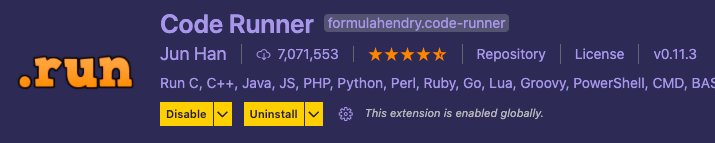
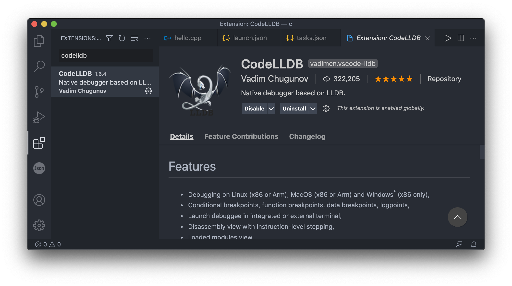
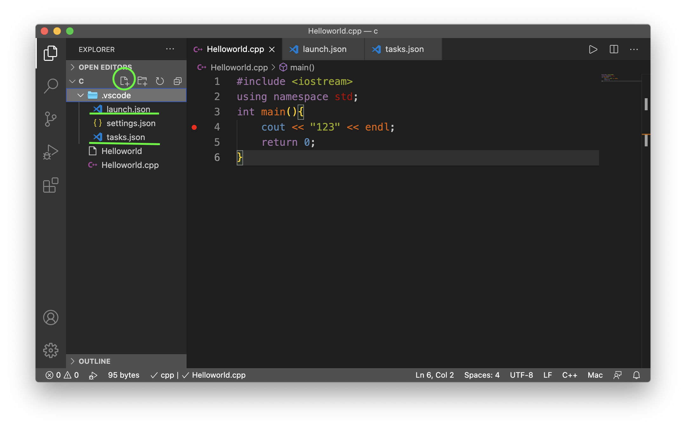
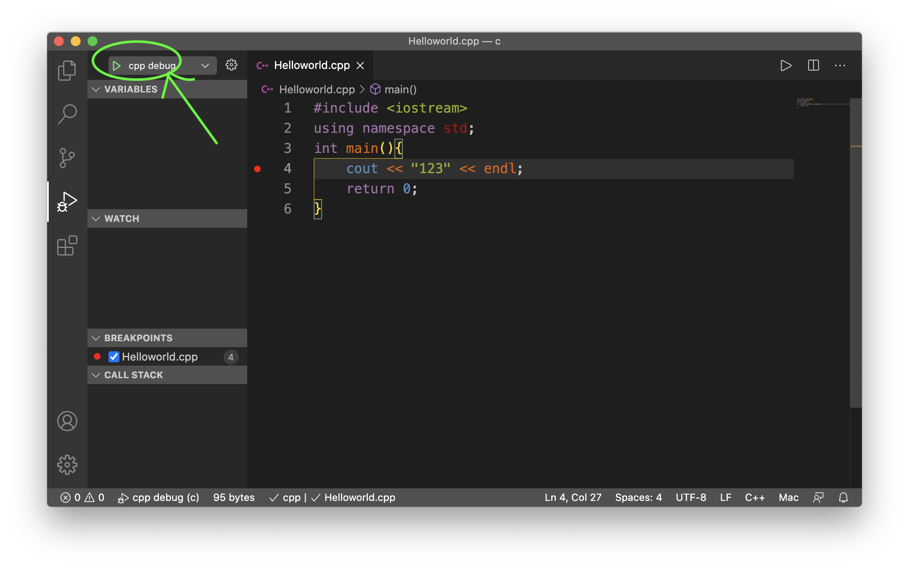
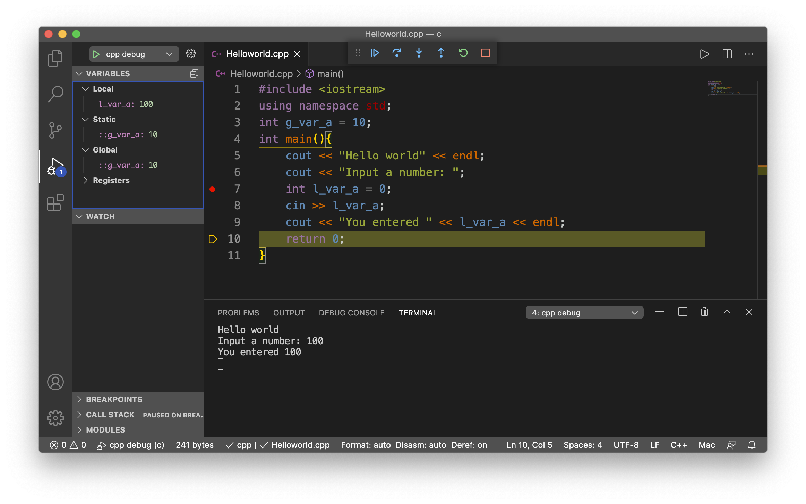

## macOS 上用 VSCode 运行调试单文件 C(++) 的环境配置


#### 1. 编译运行：Coderunner配置

下载插件`coderunner`即可。




在`settings.json`中可以自定义编译程序的命令。

我的自定义`coderunner`命令：

```json
{
    "code-runner.executorMap": {
        "cpp": " cd $dir && g++ \"$fileName\" -o $fileNameWithoutExt -W -Wall -std=c++17 &&  ./$fileNameWithoutExt",
        "c"  : " cd $dir && gcc \"$fileName\" -o $fileNameWithoutExt -W -Wall -std=c17   &&  ./$fileNameWithoutExt",
        "s"  : " cd $dir && gcc \"$fileName\" -o $fileNameWithoutExt && ./fileNameWithoutExt"
    },
    "code-runner.clearPreviousOutput": true,
    "code-runner.saveAllFilesBeforeRun": false,
    "code-runner.saveFileBeforeRun": true,
    "code-runner.showExecutionMessage": true,
    "code-runner.runInTerminal": true,
    "code-runner.preserveFocus": false,
    "code-runner.ignoreSelection": true,
    "launch": {
        "configurations": [],
        "compounds": []
    }
}

```

可以将此段内容插入到 `~/Library/ApplicationSupport/Code/User/settings.json`中。


#### 2. 调试：launch.json 和 tasks.json 配置

先安装插件 `CodeLLDB`。



在工作区的`.vscode`文件夹内（如果没有的话就新建一个），新建两个名为 `tasks.json` 和 `launch.json` 的文件。



文件内填写以下内容：

`launch.json`

```json
{
    "version": "0.2.0",
    "configurations": [
        {
            "type": "lldb",
            "request": "launch",
            "name": "cpp debug",
            "preLaunchTask": "g++ compile",
            "program": "${fileDirname}/${fileBasenameNoExtension}",
            "args": [],
            "cwd": "${workspaceFolder}",
        }
    ]
}
```

`tasks.json`

```json
{
    "version": "2.0.0",
    "tasks": [
        {
            "label": "g++ compile",  
            "type": "shell", 
            "command": "cd $dir && g++ $fileName -g -o $fileNameWithoutExt -W -Wall -std=c++17 &&  ./$fileNameWithoutExt",
            "group": {
                "kind": "build",
                "isDefault": true
            },
            "presentation": {
                "echo": true, 
                "reveal": "silent",
                "focus": false, 
                "panel": "shared", 
                "showReuseMessage": true, 
                "clear": false
            },
            "options": {
                "cwd": "${workspaceFolder}" 
            },
            "problemMatcher": {
                "owner": "cpp",
                "fileLocation": "absolute",
                "pattern": {
                    "regexp": "^(.*):(\\d+):(\\d+):\\s+(warning|error):\\s+(.*)$",
                    "file": 1,
                    "line": 2,
                    "column": 3,
                    "severity": 4,
                    "message": 5
                }
            }
        },
    ]
}
```

保存好这两个json配置文件之后，在vscode左边边栏的“调试”中，应该就能看到cpp debug的字样。

这个时候打上断点，点击cpp debug旁边的运行按钮，就可以调试了。



#### 备注：

更详细的教程，可以移步本人在CSDN上的文章： [网页链接](https://blog.csdn.net/Kirin_865/article/details/115772784?spm=1001.2014.3001.5501)


