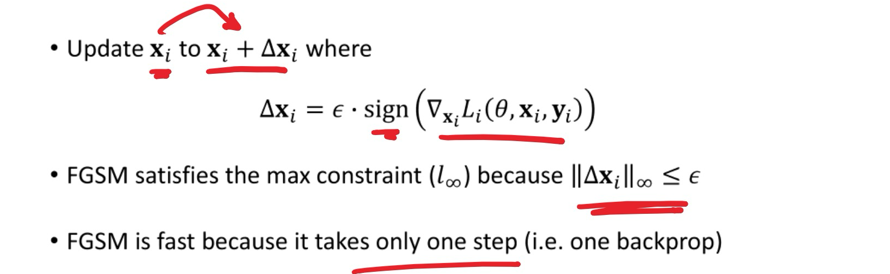

# Lec 1. Intro

**Mean, Std and Var**

- Mean (`np.mean()`)
  $$
  \mathrm{mean}(\{x_i\}) = \frac{1}{N} \sum_{i=1}^N x_i
  $$

- Standard deviation (`np.std()`)
  $$
  \mathrm{std}(\{x_i\}) = \sqrt{\frac{1}{N-1}\sum_{i=1}^N(x_i - \mathrm{mean}(\{x_i\}) )^2}
  $$
  
- Variance
  $$
  \mathrm{var}(\{x_i\}) = \frac{1}{N-1}\sum_{i=1}^N(x_i - \mathrm{mean}(\{x_i\}) )^2 =\mathrm{std}(\{x_i\})^2
  $$

**Standardizing data**: 使平均数为0，标准差为1

- 将dataset $\{x\}$ standardize 成 $\{\hat{x}\}$:
  $$
  \hat{x_i} = \frac{x_i - \mathrm{mean}(\{x\})}{\mathrm{std}(\{x\})}
  $$

**Median**: 50th percentile 中位数

**Interquartile range**: 中间50%的值范围，即 (75th percentile) - (25th percentile)

**Correlation coefficient** 相关系数

- 给定数据集 $\{(x,y)\}$, 先将 $\{x\}$ 和 $\{y\}$ 分别标准化，则
  $$
  \mathrm{corr}(\{(x,y\}) = \frac{1}{N-1} \sum_{i=1}^N \hat{x_i} \hat{y_i}
  $$

- `np.corrcoef()`, `pd.corr()`

- 相关系数取值范围为 $[-1,1]$

- positive correlation, negative correlation, zero correlation

# Lec 2. Probability

**Outcome**: a possible result of a random experiment

**Sample space** $\Omega$: the set of all possible outcomes

**Event**: an event $E$ is a subset of the sample space $\Omega$

**Probability function**: any function $P$ that maps events to real numbers and satisfies:

- $P(E) \geq 0$
- $P(\Omega) = 1$
- Probability of disjoint events is additive: $P(E_1 \cup E_2 \cup \cdots \cup E_N) = \sum_{i=1}^N P(E_i)$ if $E_i \cap E_j = \empty$ for all $i\neq j$

**Independence**: 当且仅当以下条件时，两个event独立

- $$
  P(E_1 \cap E_2) = P(E_1) P(E_2)
  $$

- 如果已知 $E_1$ 发生，$E_2$ 的概率不会改变

**Conditional Probability** 条件概率

- $$
  P(E_2 | E_1) = \frac{P(E_1 \cap E_2)}{P(E_1)}
  $$

- 如果两个event independent，则$P(E_2 | E_1) = P(E_2)$

**Bayes Rule** 贝叶斯公式
$$
P(E_2|E_1) = \frac{P(E_1|E_2)P(E_2)}{P(E_1)}
$$

**Total Probability** 全概率公式
$$
P(E_1) = P(E_1 \cap E_2) + P(E_1 \cap E_2^c) = P(E_1|E_2)P(E_2) + P(E_1|E_2^c)P(E_2^c)
$$
**Conditional Independence** 条件独立
$$
P(E_1 \cap E_2 | A) = P(E_1 | A) P(E_2 | A)
$$
**Random Variable**: a random variable is a function that maps outcomes to real numbers.

**Probability distribution**: $P(X=x)$ is called the probability distribution of $X$. Also denoted as $P(x)$ or $p(x)$.

Joint probability distribution: $P(\{X=x\} \cap \{Y=y\})$, also denoted as $P(x,y)$ or $p(x,y)$

**Independence** of random variables: 如果随机变量 $X$, $Y$ 满足以下条件，则独立: $P(x,y) = P(x)P(y)$ for all $x$ and $y$

**Conditional probability distribution**: 
$$
P(x|y)= \frac{P(x,y)}{P(y)}
$$
Bayes rule
$$
P(x|y)= \frac{P(y|x)P(x)}{P(y)} =  
\frac{P(y|x)P(x)}{\sum_x P(y|x)P(x)}
$$
**Expected value** of a random variable 期望
$$
E[X] = \sum_x xP(x)
$$
**Variance** of a random variable
$$
\mathrm{var}[X] = E[(X - E[X])^2]
$$
**Standard deviation** of a random variable
$$
\mathrm{std}[X] = \sqrt{\mathrm{var}[X]}
$$

## Useful probability distributions

- **Bernoulli distribution**

  - $P(X=1) = p$, $P(X=0) = 1-p$
  - $E[X] = p$
  - $\mathrm{var}[X] = p(1-p)$

- **Dinomial distribution**

  - $P(X = k) = \binom{N}{k} p^k (1-p)^{N-k}$ for integer $0 \leq k \leq N$
  - $E[X] = Np$
  - $\mathrm{var}[X] = Np(1-p)$

- **Multinomial distribution**

  - $P(X_1 = n_1, X_2 = n_2, \dots, X_k = n_k) = \frac{N!}{n_1! n_2! \dots n_k!} p_1^{n_1} p_2^{n_2} \dots p_k^{n_k}$

    where $N = n_1 + n_2 + \cdots + n_k$

- **Poisson distribution**

  - A discrete random variable $X$ is **poisson** with **intensity** $\lambda$ if 
    $$
    P(X=k) = \frac{e^{-\lambda}\lambda^k}{k!}
    $$
    for integer $k\geq 0$

  - $E[X] = \lambda$

  - $\mathrm{var}[X] = \lambda$

# Lec 3. Classification and Naive Bayes

**Binary classifier**

**Multiclass classifier**

**Nearest neighbors classifier**

- variants: **k-nearest neighbors**, $(k,l)$**-nearest neighbors** (找k个最近的点的label，如果至少$l$个同意则给label)

Performance of a binary classifier

- **false positive** (truth is negative, but classifier assigns positive), **false negative** (the other way)
- **class confusion matrix**: 2x2的矩阵，True Positive (TP), FN, FP, TN

**Cross-validation**: 分成训练集和测试集

**Naive Bayes classifier**: a probabilistic method:

- Training: 使用训练数据 $\{(\mathbb{x}_i, y_i)\}$ 估计概率模型 $P(y|\mathbb{x})$
- Classification: 给定feature vector $\mathbb{x}$, 预测 label = $\arg \max_y P(y|\mathbb{x})$
- Naive bayes assumption: 给定 class label $y$ 时 $\mathbb{x}$ 条件独立

# Lec 4. Adversarial Spam Filtering

**Building a spam filter**

- 消息(**messages**)由单词(**words**, or **tokens**)组成

- 将每一条message表示为 **token indicator vector**。因为电脑并不直接理解单词是什么，所以将每个单词/token都转换为一个数字，从而将整句话表示为一个由一排数字组成的 token indicator vector. 
- Train: 对于每一个单词，计算这个单词在垃圾信息(spam)和正常信息(ham)中出现概率的比率的对数值。
  - 记 $p_i$ 为单词出现在垃圾信息的概率，$q_i$ 为单词出现在正常信息的概率，我们关注 $\log (p_i / q_i)$.
  - 例如，单词 "money" 在所有的骚扰信息中总共出现6次，且所有的骚扰信息加起来一共有13个单词，则$p_i$ 为 6/13。
  - $\log (p_i / q_i)$ 的值大于0代表 $p_i > q_i$, 代表单词更常出现在垃圾信息中；小于0则代表单词更常出现在正常信息中
- Test: 对新信息进行分类时，将所有单词的 $log(p_i / q_i)$ 乘上单词的出现次数，然后再相加，最后再加上一项 $\log$ 训练数据中垃圾信息条数/正常信息条数的比值。这个值大于0则归类为垃圾信息，小于0则归类为正常信息
  - 为什么要相加？因为如果不取对数，直接算 $p_i$, $q_i$ 的乘积，则这个数值(例如0.1, 0.05)可能会很小，小到计算机会把它们当做0来处理 (floating-point underflow)。为了解决这个问题，可以利用对数的特性: $\log (a \times b) = \log(a) + \log(b)$, 将乘法转换为加法
  - 为什么最后还要加上一项？例如训练数据中有300条正常信息，500条垃圾信息，则分类器会有一个更倾向于将信息判断为垃圾信息的初始偏好。加入 $\log(500/300)$ 可以抵消这个初始偏好
- **Laplace smoothing**: 如果有一个单词从未在垃圾信息中出现过，那么模型会认为任何包含这个单词的信息均为正常信息，导致出错。为了解决这个零概率问题，计算概率时给每个单词的计数都+1，确保没有任何单词的概率为0.
  - 上面的例子：例如，单词 "money" 在所有的骚扰信息中总共出现6次，且所有的骚扰信息加起来一共有13个单词，则$p_i$ 为 6/13。经过laplace smoothing后这个概率会变为 7/(13+词汇表中不同单词的总数) 

**Taxonomy of attacks on ML models**

攻击方式: 

- **Poisioning**: 攻击者污染训练数据。分为两种
  - Targeted (定点投毒): 让模型对某一封特定的邮件产生误判
  - Reliability (可靠性投毒): 降低模型的整体性能和准确率
- **Evasion**: 攻击者给已经训练好的模型发送信息
  - 在open-box设定下，攻击者可以判断最spammy和hammy的单词（最像骚扰邮件或正常邮件的单词），然后构造特定的输入让模型产生错误的分类结果
- Reverse Engineering attack: 攻击者在不了解模型内部结构的情况下（black-box），通过发送大量探测邮件并观察分类结果，来推断和窃取模型的决策逻辑

# Lec 5. Support Vector Machine (SVM)

SVM: 在数据点之间划一条线 $\mathbb{\mathrm{a}}^T \mathbb{\mathrm{x}} + b = 0$ 用作 **decision boundary**

对 $\mathbb{\mathrm{x}}_i$分类时计算 $\mathbb{\mathrm{a}}^T \mathbb{\mathrm{x}}_i + b$ 的数值是大于0还是小于0，来决定 class label $y_i \in \{+1, -1\}$分类成1还是-1.

**Loss Function**的发展

- Loss function 1: 
  - 如果 $\mathbb{\mathrm{x}}_i$ 分类正确, 则loss为零，如果分类错误则loss为 $\mathrm{sign}(\mathbb{\mathrm{a}}^T \mathbb{\mathrm{x}}_i + b)$
  - 问题：只要求分类正确，但并没有要求decision boundary这根线离两边的数据点都更远，没有考虑margin, 导致鲁棒性不够
- Loss function 2: **Hinge loss**
  - 不仅惩罚对错误分类的点，还对虽然被正确分类但离边界太近的点施加惩罚 (这个惩罚不会大于1），“逼迫”决策边界远离所有数据点，形成更大的margin
  - hinge loss: $\max(0, 1 - y_i (\mathbb{\mathrm{a}}^T \mathbb{\mathrm{x}}_i + b))$
  - 问题：模型可以通过无限制增大 $\mathbb{\mathrm{a}}$ 来使loss最低
- Loss function 3: **Hinge loss with regularization penalty**
  - 在Hinge loss的基础上，增加 regularization penalty 项 $\lambda \cdot (\mathbb{\mathrm{a}}^T\mathbb{\mathrm{a}} / 2)$ 来避免 $\mathbb{\mathrm{a}}$ 太大
  - $\lambda$ 是 **regularization parameter**, 通常取值在 0.001 - 0.1 左右

**Gradient descent**

有了最终的loss function后，接下来需要找到能让这个函数值最小的参数 `a` 和 `b`

由于函数复杂，无法直接解方程，所以采用随机梯度下降 (**Stochastic Gradient Descent, SGD**)

SGD的具体步骤：

- 随机选择一个数据点: $(\mathbb{\mathrm{x}}_k, y_k)$, 根据当前的a和b计算 $y_k \cdot (\mathbb{\mathrm{a}}^T \mathbb{\mathrm{x}} + b)$ 的值
- 如果 $\geq 1$, 则已被正确分类且离decision boundary足够远（在margin之外），此时只考虑正则化项，让a小一点，b保持不变
  - $\mathbb{\mathrm{a}} \leftarrow a - \eta \lambda \mathbb{\mathrm{a}}$
- 如果 $< 1$, 则说明分类错误或分类正确但离decision boundary太近。此时需要同时考虑正则化项和hinge loss项
  - $\mathbb{\mathrm{a}} \leftarrow \mathbb{\mathrm{a}} - \eta(\lambda \mathbb{\mathrm{a}} - y_k \cdot \mathbb{\mathrm{x}}_k)$. 这一步既有让a变小的趋势，又有将决策边界推得远离$x_k$的趋势
  - $b \leftarrow b + \eta \cdot y_k$
- 上面的 $\eta$ 称为学习率或者步长 (step length)，通常随着训练的进行会越来越小
- **Epoch**: 通常指将训练集中的所有样本都过一遍。在SGD中，一个Epoch约等于N次迭代（N是训练集的大小）.模型训练通常需要进行很多个Epoch.

- 为了防止过拟合，需要将数据划分为 **training, validation** 和 **test**

- 对于每个 $\lambda$ 的可能取值，在training set上运行SGD找到最合适的a和b (decision boundary), 然后看哪组能让 validation set 上表现最好，选择最好的 a, b, $\lambda$ 放到 test set 上测试

**Extension to multiclass classification**

上面的SVM为二分类问题，扩展成多分类问题有两种主流方法，实践中表现都很好

- **All vs All** (一对一)
  - 对于每个class pair (一组为两个class，两两组合)训练一个binary classifier，判断时运行所有binary classifier看哪个label被选的最多
  - 复杂度与class的数量成平方关系，例如需要分类4个class，则需要训练6个二分类器
- **One vs All** (一对余)
  - 对于每个class，训练一个是/不是这个class的二分类器。分类时看哪个class得到的分数最高
  - 复杂度与class的数量成线性关系

# Lec 6. Adversarial Linear Classification

**Linear vs. Nonlinear classifiers**

- SVM, Naive Bayes 都属于线性分类器

- kNN (k-nearest neighbor), 神经网络 都属于非线性分类器

  

Constrained **adversarial attack** against nonlinear classifiers 针对非线性分类器的对抗性攻击

- **Noise attacks** 噪声攻击：向图片添加人眼无法察觉的微小噪声

- **Patch attacks** 补丁攻击：在图片上（或 现实世界中的STOP sign）添加小贴纸，就能让自动驾驶系统产生误判

  

  

虽然高级模型是非线性的，研究以上的adversarial attack比较困难，但我们可以通过研究攻击简单的线性模型来获得理解

- 攻击的本质：在原始数据点 $x$ 的基础上添加 **attack vectors** (微小扰动) $x + \Delta x$ 让其跨越 decision boundary, 产生错误分类结果
- Constraint的类型：这个 $\Delta x$ 不能太大 (must be **constrained**)
  - $l_2$ 范数（**Euclidean constraint** 欧几里得距离）：扰动的几何长度最小。对于线性分类器，最有效的攻击方向是垂直于决策边界的方向
  - $l_{\infin}$（**max constraint** 最大值）：扰动被分散到许多像素上，但保证对单个像素的最大改动值非常小（nose attack）
  - $l_1$（**absolute sum constraint** 绝对值和）：扰动集中在少数像素上，大部分像素保持不变 (patch attack)

**Mathematical framework for defense**

训练时，想要找到模型参数，使得loss function最小化；

攻击时，想要在 $\Delta x$ constrained (受约束) 的情况下，找到能使loss function最大化的改动

一种防御策略: **Retraining**

- 先在原始数据 $\{(x, y)\}$ 上训练一个分类器，然后针对这个分类器生成一批攻击性样本 $\{x+ \Delta x\}$, 将原始数据与新生成的攻击样本合并，创建一个更强大的新训练集，重新训练
- 由于新模型“见过”攻击样本，所以防御能力更强

# Lec 7. Random forest classifiers

**Decision tree** 决策树：像流程图一样的分类器

**Training a decision tree**

- 如何构建/训练决策树？在每一步，我们应该问哪个“问题”（选择哪个特征 (dimension) 和分割点 (split)）才是最好的？

  

- **Entropy** 熵: 量化 **uncertainty** 的方法

  - 将 **uncertainty** 量化成为需要多少bit的信息才能区分一个数据集的所有类别

    - 例如，需要 1 bit 来区分两种class，需要 2 bits 来区分四种class

  - 如果某一种 class 有数据集中一部分比例 $P(i)$ 的数据，则需要对于这个class需要 $\log_2 \frac{1}{P(i)}$ 个 bits.

  - 整个数据集 $D$ 的 Entropy $H(D)$ 等于所有 class 需要多少bits取平均
    $$
    H(D) = \sum_{i=1}^c P(i) \log_2 \frac{1}{P(i)}   \mathrm{bits}
    $$

- 选择最佳的划分: **Information gain** 信息增益

  - 信息增益：原始数据集的熵与划分之后两个子集的加权平均熵之差

  - 选择split时，信息增益越大，代表这次split之后uncertainty降低得越多，越好

    

- 建树过程：从所有数据开始，找到一个具有最大 information gain 的划分，递归重复，直到停止（停止条件一般有：节点已经纯净、数据太少、达到预设的最大深度，等）

From **decision trees** to **Random Forests (RF)**

- Decision tree 具有缺点：容易过拟合
- Random Forests 通过集成学习 (**ensemble**) 的思想来解决这个问题：如果一棵树可能判断错，那就建立很多棵略有不同的树，投票决定最终结果
- RF通过两种随机方式来保证每棵树都略有不同
  - 数据随机 (**Bagging**): 每棵树都随机抽取一部分样本来进行训练（而不使用全部样本）
  - 特征随机：选择划分时，不从所有特征中选取最佳划分，而是从一个随机选择的特征子集中寻找

# Lec 8. Neural Networks (NN)

NN由一大堆小的单元组成，每个单元叫做 **artificial neuron**，类似于SVM，单元之间互相连接，一起用SGD训练

A **neuron**

- 每一个neuron执行 $o = F(\mathbb{\mathrm{w}}^T \mathbb{\mathrm{x}} + b)$ 的计算，通常 $F$ 为**ReLU (rectified linear unit)** 函数 $F(u) = \max(0, u)$

Extensions of the binary classifier

- 用K个neuron把二分类器升级为K-class分类器
- 用 **softmax function** $s(o)$ 代替最后一层神经元取max后的唯一结果，来得到概率分布（而不是具体的分类输出）

**Minibatch stochastic gradient descent**

- 数据集 $\{(\mathbb{\mathrm{x}}_i, y_i)\}$, 共有 $N$ 个，需要分类成 $K$ 个classes，**cost function** 为
  $$
  S(\theta, \mathbb{\mathrm{x}}; \lambda) = \frac{1}{N} \sum_{i=1}^N \left[
  	\mathbb{\mathrm{y}}_i^T \log\frac{1}{s(o(\mathbb{\mathrm{x}}_i, \theta))}
  \right]
  + \frac{\lambda}{2} \sum_{k=1}^K 
  (\mathbb{\mathrm{w}}^{(k)})^T \mathbb{\mathrm{w}}^{(k)}
  $$

- 其中 $\theta$ 是 parameter vector，包含所有 $\{(\mathbb{\mathrm{w}}_i, b_i)\}$. (每个神经元的参数)

- 后半项 $\frac{\lambda}{2} \sum_{k=1}^K 
  (\mathbb{\mathrm{w}}^{(k)})^T \mathbb{\mathrm{w}}^{(k)}$ 类似于 SVM loss function最后的regularization penalty $\lambda a^Ta / 2$, 用于防止 $a$ 的值过大

- 前半项是 cross-entropy loss $L$

- 训练的过程中，使用数据集的一个**minibatch** (e.g. 64) 和随机梯度下降来最小化 $S(\theta, \mathbb{\mathrm{x}}; \lambda)$

多层神经网络

- input layer, hidden layers, output layer

- **Forward pass**: 给定参数 $\theta$, 算出结果 $s$

- **Backpropagation**

  

# Lec 9. Convolutional Neural Networks (CNNs)

最早的神经网络：**Fully Connected Network (FCN)** 全连接网络

- 由输入层，若干隐藏层，输出层组成
- 缺点：参数太多；忽略了空间结构信息，对图像任务不适用，因为相同的图案会出现在图像的不同位置

Training trick 1: **Dropout to avoid overfitting**

- 训练的时候，用固定概率随机drop掉一些neuron，防止高层的layer过分依赖一小部分低层layer的数值

- 在最终运行的时候不进行dropout

  

Training trick 2: **Gradient scaling**

- 使用动量 **momentum**, 来使每次的步长更加柔和。每次移动的步长为过去几次步长的平均值
- 也有别的 gradient scaling techniques，例如 Adagrad, RMSprop, Adam

**CNN**

- 什么时候不使用全连接的输入层 (**fully connected** input layer)?
  - 在图像分类中，fully connected input layer以像素为中心，但重要的特征并不会出现在同一个像素上
- **Stacking convolutional layers**
  - 每一个convolutional layer都是一个pattern detector，串联起来能检测patterns of patterns...
  - **receptive field** (感受野): 某一个layer在原始输入图像上对应的区域大小
    - 例如，假设输入28x28的图像，第一个卷积层采用3x3的kernel，第二个卷积层为2x2的kernel，则卷积层1的receptive field = 3x3，而卷积层2每个输出点依赖上一层的3x3区域，所以代表的输入区越大
    - 随着卷积层数增加，receptive field越来越大，越高层越知道“物体形状、语义、图里是什么东西”，越不知道“具体的像素位置”
    - 计算方法: $R_l = R_{l-1} + (k_l -1)\times \prod_{i=1}^{l-1}s_i$
      - 其中 $R_l$ 为第$l$层的receptive field大小，$k_l$为卷积核大小，$s_l$为步长（stride）

  - 为了防止不同神经元的receptive field重叠太多（导致信息冗余），需要适度减小特征图尺寸（通过池化层 polling layer 或者大于1的stride）

Pattern detection by **image convolution**

- 给定黑白图像 $I$ 和一个小的kernel $M$, 卷积构建一个新的图像 $N = \mathrm{conv}(I, M)$
- **stride** 步长
- **padding**: 如果没有padding则会有一些边角上的像素被扔掉
- 扩展到彩色图像：图像为3D的矩阵（因为有RGB三种颜色），kernel也为3D，不同的3Dkernel组合成 4D kernel block

Shrinking blocks using **pooling layers**

- 可以使用stride大于1的卷积层来使block更小，也可以使用pooling
- pooling需要指定window size, stride, 和一个函数（例如max, average等）

# Lec 10. Evasion attacks on neural network classifiers

针对神经网络分类器的规避攻击

## 分类：

- 按照影响方式(**influence**)分类
  - **Prediction** 阶段攻击：修改输入让模型预测错误（最常见）
  - **Training** 阶段攻击：篡改训练数据，数据投毒
- 按照安全目标(**security violation**)分类
  - **Integrity** 完整性攻击：制造false positive、false negative
  - **Availability** 可用性攻击：让模型完全失效
  - **Privacy & Reverse Engineering**: 提取、泄露模型或训练数据的信息
- 按照信息可见度(**information**)分类
  - **open-box**攻击：攻击者知道模型的参数与结构
  - **closed-box**攻击：攻击者只能观察输入输出
- 按照攻击特定性(**specificity**)分类
  - **targeted**攻击：让样本被误分类为特定目标类别
  - **indiscriminate**攻击：只要误分类即可

## **Intuition about evasion attacks**

- 有一个分类器 $a^T x + b = 0$, 攻击这个分类器

- 原始样本为 $x_i$, 攻击后为 $x_i + \Delta x_i$, 设计合适的干扰向量 $\Delta x_i$ 让样本可以跨越分类边界，但又不会太大以至于被人察觉

  

## Patch Attack

- Patch attack 只作用在输入的特定维度上，例如图像中的一部分像素区域
- 约定 $|\Delta x_i^{(1)}| \leq C$ 且 $|\Delta x_i^{(2)}| = 0$  （对输入样本的一部分进行有限修改，剩下的区域保持不变）
- 

## Noise Attack with Euclidean constraint (L2)

- 限制扰动的欧几里得长度不能超越阈值C: $\sqrt{ |\Delta x_i ^{(1)}|^2 + |\Delta x_i ^{(2)}|^2 } \leq C$, 或者说， $||\Delta x_i||_2 \leq C$
  - 整个扰动向量的能量有限
- 扰动的方向与决策边界法向量平行（最近的跨越决策边界的方向）
- $\Delta x_i = \pm k a$

## Noise Attack with Max constraint (L$\infty$)

- 限制每个维度的最大改变量有限，即每个像素单点变化小于一个阈值

  - $\max( |\Delta x_i^{(1)}|, |\Delta x_i ^{(2)}| \leq C )$, 或者说 $||\Delta x_i||_{\infty} \leq C$

- $\Delta x_i = \pm k \cdot \mathrm{sign}(a)$

  

## 扩展到神经网络攻击

以上的patch attack, noise attack都是针对线性分类器（如SVM）的攻击，如果想要扩展到神经网络攻击，会面临两大挑战

- Problem 1: **Nonlinearity**
  - 神经网络具有activation functions（例如ReLU）、Softmax等非线性组件
  - 但是ReLU是piecewise linear (分段线性), 因此在局部仍可视为线性，可在局部线性近似下进行攻击
- Problem 2: **Finding the direction** to attack
  - 对于线性模型，攻击方向非常明确 (Euclidean constraint L2方向为$\pm a$, Max constraint L无穷 方向为$\pm \mathrm{sign}(a)$)
  - 对于神经网络，给定一个datapoint $x_i$, 并不能直接找到最近的线性边界
  - 使用backpropagation（反向传播）计算梯度，找到能使loss增加的方向

## Backpropagation, Fast Gradient Sign Method

- 模型 $f(x, \theta)$, 其中$x$为输入样本，$\theta$为固定的模型参数，真实标签为$y$

- loss function 为 $L(\theta, x, y)$

- 现在要构造共计样本 $x' = x+\Delta x$, 使得 $f(x', \theta)$ 出错（最大化loss），同时 $||\Delta x||$ 很小（最小化输入改变）

- 希望最大化loss最小化输入改变量，可以写成优化问题: $\max_{||\Delta x||\leq \epsilon} L(\theta, x+\Delta x, y)$

- 当 $\epsilon$ 很小时，可以近似为使线性函数 $\Delta x^T \nabla_x L$ 最大化

- 对于$L_{\infty}$ 约束，最优解是 $\Delta x^* = \epsilon \cdot \mathrm{sign}(\nabla_x L)$

- **Fast Gradient Sign Method (FGSM)** 的过程

  
  
- FGSM攻击让数字识别产生错误的示例（使用不同$\epsilon$）:

  

## Iterative method 迭代攻击

- 反复进行多次微小步长的更新 $\alpha << \epsilon$, 这个“微小步长”比可允许的改变量$\epsilon$还要更小

- $x_i = x_i + \alpha \cdot \mathrm{sign}(\nabla_{x_i}L_i(\theta, x_i, y_i))$
- 最终限制一下更新的幅度，clip一下让$x_i$的变化量小于 $\epsilon$
- 在loss function为nonconvex（非凸）的情况下比FGSM更有效

## Targeted Iterative Method 定向迭代攻击

- 目标是让样本误分类为指定的类别 （而不是仅仅误分类）
- 之前的FGSM和iterative method都是indiscriminate，而这个是**targeted**

## From Open to Closed box attacks

- 上面讲的都是open box攻击，即你可以看到模型的结构与内部参数
- closed box攻击则不能看到模型细节，只能通过模型的输入和输出猜测模型行为
- 但是实验发现adversarial examples是 **transferable**，即在一个模型上生成的攻击样本通常在另外一个模型上也适用
- 另外，可以使用 **reverse engineering attack**, 通过probe(探测)模型输入输出猜测模型的内部参数，训练一个本地的模型副本

## Defense against evasion attacks 防御方法

- **Iterative training**
  - 在训练中不断加入对抗样本重新训练（使用FGSM快速生成攻击样本），提高鲁棒性
- **Incorporate FGSM into loss function** 在训练时将FGSM融入训练目标
  - 也就是说在训练中混合原始样本与攻击样本的loss，例如权重 0.9, 0.1, 代表主要优化真实样本，同时兼顾攻击样本

# Lec 11. Image and Malware Classification

Image

- **ImageNet** (2006)

  - 1400万已标注的图片数据，20000多种类别

- **AlexNet** (2012)

  - 使用了非常激进的 **data augmentation** (数据增强)：采用图像平移、随机裁剪、反转、色彩光照扰动（模拟不同光照条件），等方法，极大增加数据集多样性，减少过拟合

  - 在两个GPU上训练（当时的GPU显存有限，单卡无法容纳全部参数，所以作者设计了 **model parallelism**），前五个卷积层互相独立，到第五层再合并
  - **Response normalization layer**: 在ReLU后引入的局部竞争机制，某通道的强烈响应会抑制邻近通道，促使模型在局部特征通道间产生竞争，提升泛化能力

- **VGGNet** (2014)

  - 理念：保持卷积核小（3x3），但增加卷积层的数量
  - 更深的网络带来更强的特征提取能力，且可迁移性高，常用于别的任务的feature stack（用于迁移学习）
  - 缺点：参数太多，计算量大

- **GoogLeNet** (2014)

  - inception模块：同一层中并行使用多种卷积核和pooling (1x1, 3x3, 5x5)，最后拼接
  - 在中间层插入额外的 auxiliary classifier (辅助分类器)
  - 参数量远比VGGNet小

- **ResNet** (2015)

  - 解决太深的神经网络反而变差的现象
  - 一个layer的input可以绕过许多layer

Malware

- **MalConv** (2017)

  - 流程：Raw Byte → Embedding → 1D Convolution → Temporal Max-Pooling → Fully Connected → Softmax。该模型把字节视作“token”，先 embedding 映射到向量空间，再用 1D conv 检测位置不变的字节模式。

  - Embedding 层：借鉴 NLP，将 byte（0–255）映射为向量，以避免不同但相近的 raw byte 值造成原始数值差异问题（类似 word2vec 的思想：相似输入映射到相近向量）。

  - **1D convolution + gating**: 目的：检测**位置不变**的字节模式（比如某段常见恶意指令序列），用大滤波器（比如 500 字节）与大步幅（stride）来控制内存消耗

    
