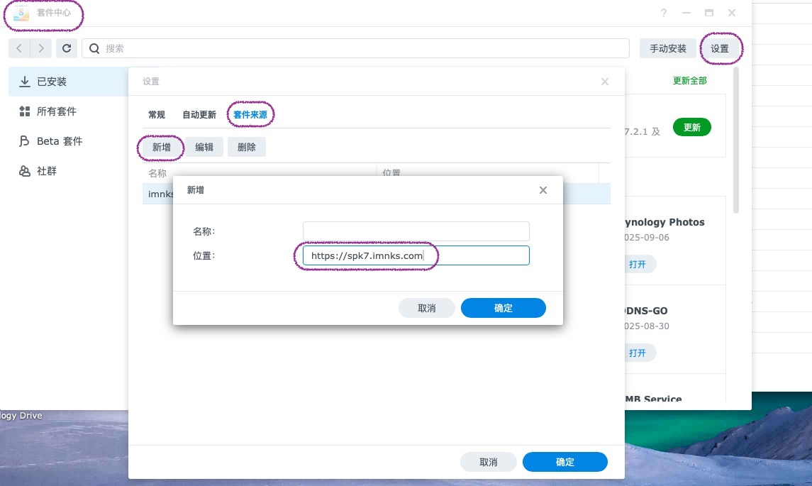

## 安装Docker CLI

在一台ubuntu实体机上，安装docker cli（注意必须是docker cli，不能是docker desktop）

安装docker cli的方法可以参考docker官方文档: [link](https://docs.docker.com/engine/install/ubuntu/#install-using-the-repository)

## 运行virtual-dsm容器

Github: https://github.com/vdsm/virtual-dsm. 这个GitHub项目是一个可以在docker里安装黑群晖的项目。

创建并运行上面这个容器即可

创建 `docker-compose.yml`, 文件内容为:

```yaml
services:
  dsm:
    container_name: dsm
    image: vdsm/virtual-dsm
    environment:
      DISK_SIZE: "160G"
    devices:
      - /dev/kvm
      - /dev/net/tun
    cap_add:
      - NET_ADMIN
    ports:
      - 60022:22
      - 5000:5000
      - 5001:5001
      - 5005:5005
      - 5006:5006
      - 80:80
      - 443:443
      - 9876:9876
    volumes:
      - ./dsm:/storage
    restart: always
    stop_grace_period: 2m
```

注：`container_name`, 硬盘大小（环境变量`DISK_SIZE`）、映射的端口号等可以根据需求修改

然后启动这个容器

```sh
sudo docker compose up -d
```

过一段时间后访问 http://localhost:5000 即可看到熟悉的群辉登录界面

## 功能配置

### DDNS

黑群晖一般没有正常的序列号，会无法登录群晖账号、无法使用QuickConnect，无法使用DDNS等。

可以使用DDNS-Go这个套件配置DDNS

进入“套件中心”，“设置”，“套件来源”，新增一个源，系统是DSM6.x的填写 https://spk.imnks.com/, 系统是DSM7.x的填写 https://spk7.imnks.com. 



然后搜索 "DDNS-GO" 并安装


安装完成之后访问nas ip地址的9876端口即可进入DDNS-GO的设置界面，用户名与密码与群辉账户的密码相同。


### 外网访问与HTTPS

如果路由器具有公网ip，则直接设置dmz主机或端口转发即可。

注意外网80端口必须映射到docker容器的80端口，否则群晖无法“自动从Let's Encrypt"获取证书


如果路由器没有公网ip，则需要内网穿透。可以使用Cloudflare tunnel等工具。

 

### 将默认5000,5001端口修改为80,443端口

进入“控制面板”，“登录门户”，“DSM”栏，会发现无法将默认的5000和5001端口修改为80和443端口，会弹出错误提示“您所输入之端口编号已被系统保留”


解决办法是手动修改配置文件。首先确保ssh功能已经启用，并将docker容器内ssh的22端口映射到60022端口（防止和宿主机的22端口冲突，当然也可以选择别的端口号）。进入“控制面板”，“终端机和SNMP”，启用ssh功能。


然后就可以ssh连接进入群晖系统了。群晖自带的nginx默认会把80和443端口进行占用，所以先修改nginx的配置文件解除占用。配置文件在 `/usr/syno/share/nginx/server.mustache`, `/usr/syno/share/nginx/DSM.mustache`, `/usr/syno/share/nginx/WWWService.mustache`, 将里面的80和443端口替换掉，例如替换成79和442端口。可以使用如下命令

```sh
cd /usr/syno/share/nginx
sudo sed -i "s/80/79/g" server.mustache
sudo sed -i "s/80/79/g" DSM.mustache
sudo sed -i "s/80/79/g" WWWService.mustache
sudo sed -i "s/443/442/g" server.mustache
sudo sed -i "s/443/442/g" DSM.mustache
sudo sed -i "s/443/442/g" WWWService.mustache
```

然后执行以下命令停止nginx，停止后等待几分钟nginx会自行启动。或者重启docker容器也可。

```
sudo /usr/bin/nginx -s stop
```

这样80和443端口就被解除占用了。接下来修改 `/usr/syno/etc/www/DSM.json`, 修改端口号

```sh
cd /usr/syno/etc/www
sudo sed -i "s/5000/80/g" DSM.json
sudo sed -i "s/5001/443/g" DSM.json
```

然后同样执行以下命令停止nginx，或者重启docker容器也可。

```shell
sudo /usr/bin/nginx -s stop
```

完成

