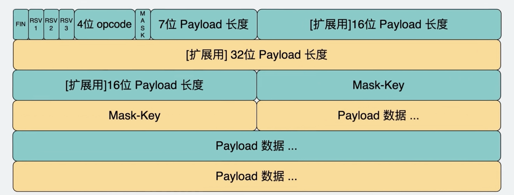

# Websocket

客户端(网页)和服务器使用websocket进行通信前，首先会使用**HTTP协议**完成**Websocket握手**

客户端请求的地址格式为

- HTTP: `ws://example.com/path`
- HTTPS: `wss://example.com/path`

注意虽然是 `ws`, `wss://`开头，但这个握手仍是HTTP/HTTPS协议

HTTP/HTTPS的请求头固定为 (只能使用HTTP1.1或更高版本，不能用HTTP1.0)

```http
GET /path HTTP/1.1
Connection: Upgrade
Upgrade: websocket
Sec-WebSocket-Version: 13
Sec-WebSocket-Key: dGhlIHNhbXBsZSBub25jZQ==
```

服务器同意后，会响应

```http
HTTP/1.1 101 Switching Protocols
Connection: Upgrade
Upgrade: websocket
Sec-WebSocket-Accept: s3pPLMBiTxaQ9kYGzzhZRbK+xOo=
```

客户端请求中header的 `Sec-WebSocket-Key` 是一段随机字符串的base64编码

服务器返回的`Sec-WebSocket-Accept` 是随机字符串拼接上 "`258EAFA5-E914-47DA-95CA-C5AB0DC85B11`" 再做SHA1的结果

握手完成之后就升级为websocket协议了，之后的通信阶段不再需要“请求-响应”，而是可以直接发送消息（**全双工通信 Full-Duplex communication**）

Websocket协议基于TCP协议（不基于HTTP协议）

## Websocket数据包格式

Websocket数据包格式如下，相当于TCP的payload



- 4位`opcode` 代表payload的格式，`1`代表UTF-8格式的纯文本, `2` 代表二进制文件
- 7位payload长度如果<=126, 则数字就代表长度；如果=126, 则需读第一个16位payload长度；如果=127，则需读接下来64-bit的payload长度

## 使用方法

浏览器端:

```javascript
let ws = new WebSocket("ws://example.com:9527/path");
```

通信:

```javascript
ws.onopen = () => {...};

ws.onmessage = function(event) {
	console.log(event.data);
};

ws.onclose = () => {...};

ws.onerror = () => {...};

ws.send("Message");
ws.close();
```

- `onopen`在连接成功之后(握手完成之后)触发.
- `onmessage`: 服务器发送消息时执行的操作. 可以是文本、二进制文件等任何内容
- `onclose`: 连接关闭时触发。客户端、服务器都可以关闭连接，客户端调用`ws.close()` 或者浏览器标签页被关闭都会关闭连接.
- `onopen`, `onmessage`, `onclose`, `onerror` 也可写成`ws.addEventListener("open", () => {...})` 

服务器端：服务器端可以使用任何语言，此处以nodejs为例

```javascript
const express = require('express')
const http = require('http')
const WebSocket = require('ws')

const app = express()
const port = 3000
const server = http.createServer(app)
const wss = new WebSocket.Server({ server: server })

wss.on('connection', (ws) => {
    console.log('New client connected')

    setInterval(() => {
        ws.send(`Server time: ${new Date().toLocaleTimeString()}`)
    }, 1000)
    
    ws.on('message', (message) => {
        console.log(`Received message: ${message}`)
        ws.send(`Server received: ${message}`)
    })
    ws.on('close', () => {
        console.log('Client disconnected')
    })
})

server.listen(port, () => {
    console.log(`Server is listening on http://localhost:${port}`)
})

```


# Server-Sent Events (SSE)

SSE是当client和server建立连接后，server单向传输数据到client的机制

SSE是单向的（不同于websocket双向）

SSE使用标准的HTTP，因此浏览器原生自带自动重连的机制

## Server

Server必须要加上以下的header

```http
Content-Type: text/event-stream
Cache-Control: no-cache
```

发送的数据必须以 `data: ` 开头，以`\n\n`结尾

只能发送UTF-8文本

- 如果需要发送JSON，需要使用`JSON.stringify()`, `JSON.parse()`
- 无法发送二进制数据，如果需要发送，可使用base64编码

nodejs示例

```javascript
const express = require('express');
const path = require('path');
const app = express();
const port = 3000;

app.get('/stream', (req, res) => {
    res.setHeader('Content-Type', 'text/event-stream');
    res.setHeader('Cache-Control', 'no-cache');
    res.setHeader('Connection', 'keep-alive');

    res.write('data: Connection established! This is the first message. \n\n');

  	// Example: send a new message every 1 second
    const intervalId = setInterval(() => {
        res.write(`data: ${new Date().toLocaleTimeString()}\n\n`);
    }, 1000);

    req.on('close', () => {
        console.log('Client disconnected');
        clearInterval(intervalId);
        res.end();
    });
});

app.listen(port, () => {
    console.log(`SSE Server running on http://localhost:${port}`);
});
```

## Client

```javascript
const evtSource = new EventSource("//api.example.com/path")

evtSource.onmessage = (event) => {
  console.log(event.data);
}

evtSource.onerror = (err) => {console.log(err);}

evtSource.close();
```

除了`message`之外，也可自定义event的类型，例如

```javascript
evtSource.addEventListener("ping", (event) => {
  console.log(event.data)
});
```

