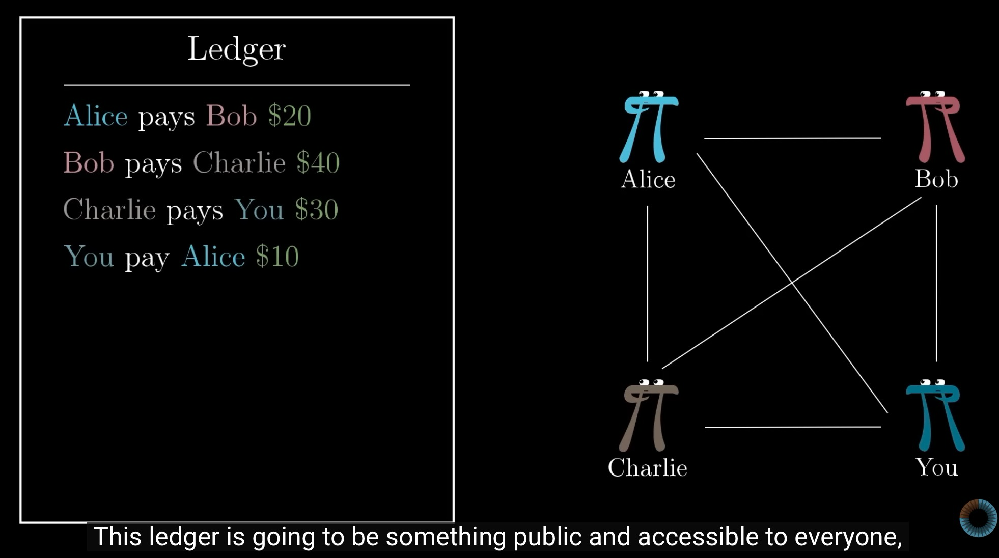
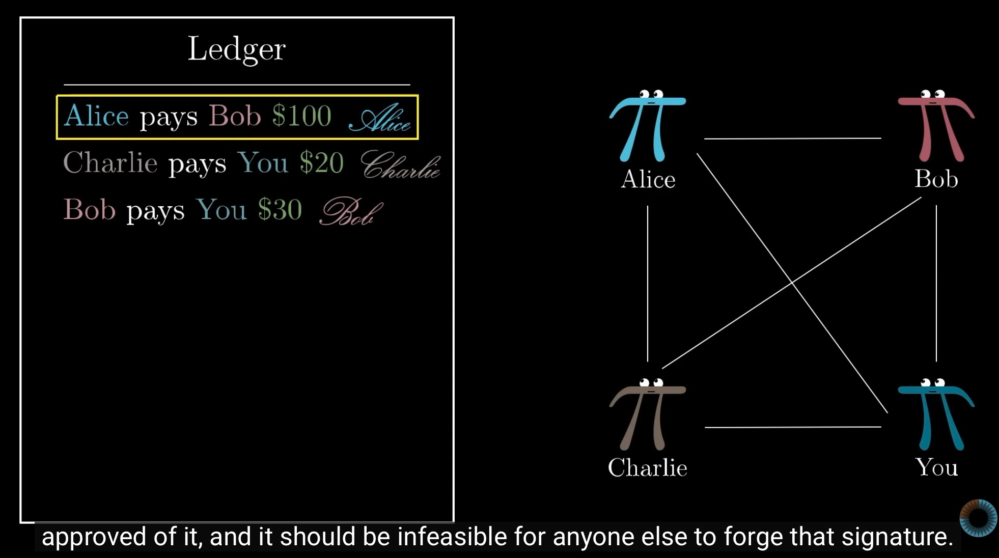
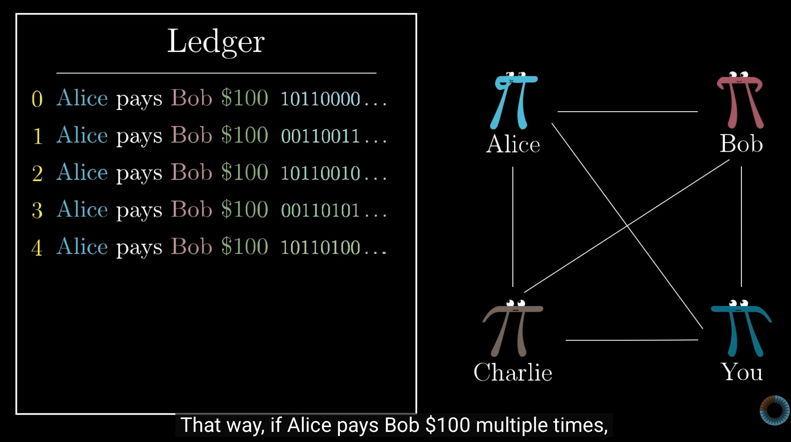
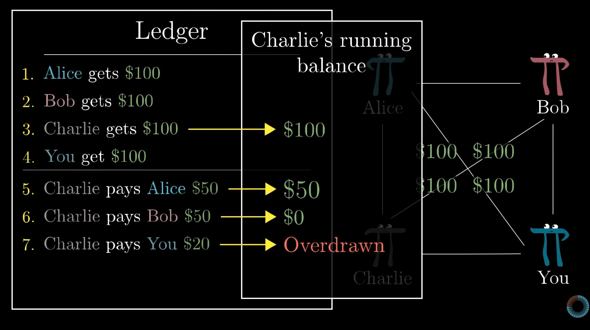
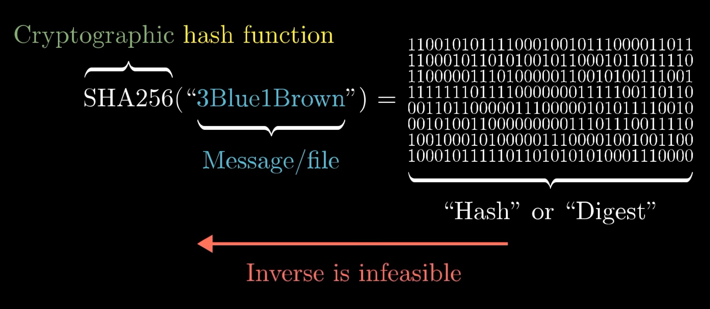
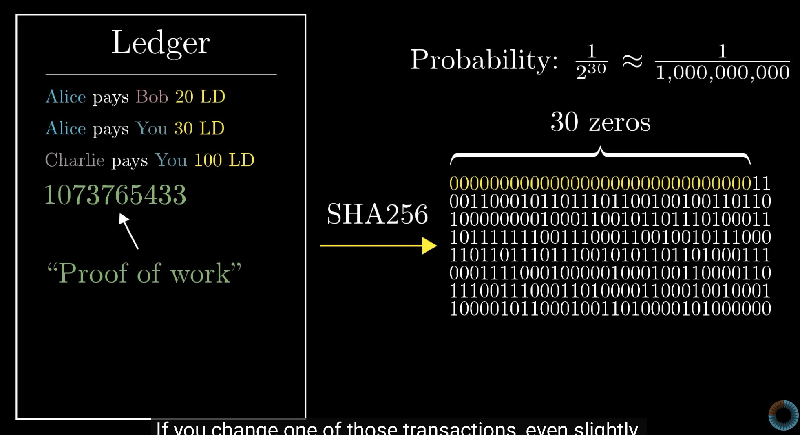
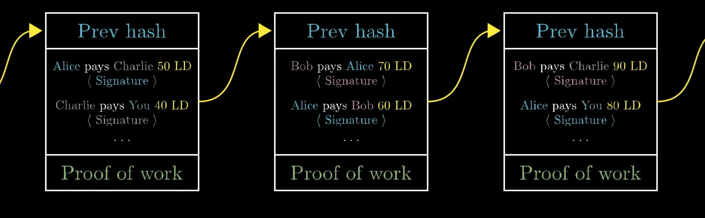
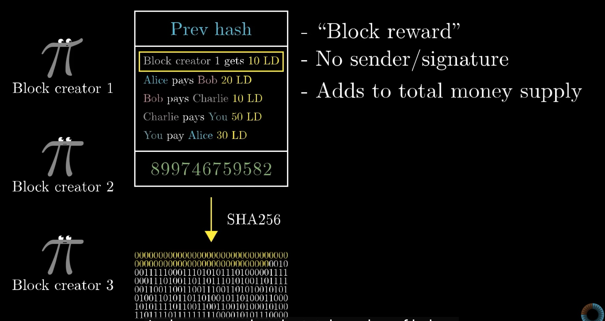

# 比特币的原理

比特币是第一个**去中心化**(**decentralized**)的**加密货币**(**cryptocurrency**). 

2008年有一名未知人士Satoshi Nakamoto发表了比特币白皮书：https://bitcoin.org/bitcoin.pdf. 

尝试手搓比特币:

## 第一次尝试：**公共账本来记账**

- 如果你和朋友间总是交易，例如A钱等，每次都使用现金交易太麻烦

- 所以你们发明了一个公共账本，任何人都可以往里记账，任何人都可以查看账本。并且约定，每月底需要使用美元现金settle up.

  

- 问题：任何人都可以添加记录，导致账本可以造假

- 解决方法: **digital signature**. 付款方需要添加对交易记录的电子签名，别人无法伪造. 签名由私钥(**sk**)生成，可以由公钥(**pk**)验证真伪. 签名有256bit，由于$2^{256}$ 太大，几乎无法伪造. 

- 为了防止签名被复制，签名由私钥和交易记录本身生成，这样每次不同的交易记录生产出的签名都不一样. 

- Sign (Message, sk) = Signature

- Verify (Message, Signature, pk) = T/F

  

- 第二个问题: "Alice pays Bob $100 + Signature" 这条记录可以被复制多次，因为消息一样签名也会一样.

- 解决办法：每次交易记录前需要加上一个unique ID, 这样即使内容一样，每次签名也不同

  

## 2. 防止有人跑路(不允许超前消费)

- 上面的账本约定好了，欠钱的人需要使用现金settle up，但如果有人欠了很多钱直接跑路，就会产生问题

- 解决办法: 不允许超前消费(**no overspending**)，否则该交易记录无效

- 验证交易需要读取所有交易历史，确认该人是否有足够多的钱转账 

  

## 去中心化

- 去中心化，没有中心，那么公共账本放在哪里？

- 比特币是去中心化的货币，并不能建立一个公共网站放入账本

- 因此需要一个P2P的网络，每个人都在本地存储一份完整账本. 有新的交易记录时，广播给所有人. 

- 问题：如何确保每个人手中的完整账本都是相同的？如何决定正确的ledger? 如何确保每个人接收到的来自全世界的交易记录顺序一致？

- 比特币的协议约定：谁的算力最强，就信谁的账本

- **Cryptographic Hash Function 密码散列函数**

  - 单向性 **one-way**: 容易计算哈希值，但极难从哈希值反推回原始数字(几乎只能靠盲猜)
  - 雪崩效应 **avalanche effect**: 输入数据微小的改变会导致输出的哈希值发生巨大电话
  - 抗碰撞性 **collision resistance**: 极难找到两个不同输入产生哈希碰撞
  - 确定性: 相同输入总是产生相同输出
  - MD5, SHA1, SHA2 (包含SHA256, SHA512等), SHA3 都是cryptographic hash function的例子。其中MD5已被证明不安全，SHA1已被弃用，比特币采用的是SHA256.

  

- **Proof of Work** 工作量证明

  - 如果要求找到一个数字，把这个数字加到账本的后面时，整个账本SHA256的前30位是0的概率是 $1 / 2^{30}$.
  - 你发现这个数字平均需要进行 $2^{30}$ 次计算，但是你广播出去这个数字时，别人只需要计算一下哈希就能验证你做了大量的计算，这就是工作量证明

  

- **Blocks 区块**

  - 比特币的协议约定：谁的算力最强，就信任谁的账本
  - 上面每一个账本称为区块(block)，由 前一个block的哈希、transactions、proof of work三部分组成.
  - 包含前一个区块的哈希值可固定block的顺序，防止顺序颠倒或之前的block被更改. 这样形成**区块链** (**blockchain**)
  - 

  - 网络中的每个人都在不断的监听全世界发来的交易记录，添加到区块中，并尝试找出一个proof of work值让哈希值的前若干位为0. 一旦发现新的区块，就会将这个区块广播出去.

  - 接收到新区块后，将新区块接到自己本地存储的区块链中。如果接收到有冲突的区块，则继续监听，以监听到的最长的区块为准.

  - 为了奖励发现区块的矿工，区块发现者允许在区块内插入一条特殊的交易记录，他能凭空获得一些比特币作为奖励，称为 **block reward**, block reward因为没有发送者，所以不需要签名。这些奖励会增加整个比特币网络的比特币数量.

  - 找区块的过程称为“挖矿”，因为需要做海量的运算.

    

  - 也就是说，新接收到的区块不能立即相信，要等继续接收到几个区块，确认它在最长的区块链上，才能相信.

  - 如果有人需要攻击比特币系统，添加假冒的区块，则他需要拥有全网算力的51%（51%算力攻击）。这在一个decentralized的系统中很难做到，因为大家的算力都是分散的. 以另一种方式来理解的话，正是因为全世界有数不胜数的矿工在做计算，才保证了比特币系统的安全性.

## 动态调节

- 比特币的区块的难度（哈希值需要有多少个前导零）会根据全网算力动态调节（根据过去几个区块的发现时间可以反推出全网算力估计值），使得平均每10分钟会出一个区块.
- 发现新区块的奖励会每隔210000个区块减半(约四年时间). 2009-2012年，发现新区块奖励50BTC，2012-2016年发现新区块奖励25BTC，等等. 因此全网的比特币总量是有限的，最多出现2100万枚比特币.
- 但这并不意味着矿工无法获得新钱. 在交易的时候，发送方会添加一笔较小的手续费(transaction fee)，用于激励矿工将此条交易记录插入到区块中. 
- 比特币的每个区块限制最多只能添加2400条左右的交易记录。很多人批评这个限制过于restrictive。也是因此，比特币交易手续费较高.

# 矿池

矿池是人们组成的，将算力聚集起来的组织或群体. 矿池由一组矿工组成.

由于比特币（和很多其它加密货币）的全网算力过大，难度过高，单一用户的算力微不足道，可能需要几个月、几年、甚至几个世纪才能挖到一个区块，通常矿工无法忍受很长时间没有收益

因此矿工会选择加入矿池聚集算力，这样矿池会有更大的机会找到区块。矿池发现区块时，会扣除手续费后，将奖励按照工作量大小分配给所有参与挖矿的矿工。矿池会提供稳定的回报，因此大量矿工都会在矿池挖矿，而不会solo挖矿.

矿池发工资有几种不同的分配方法: PPS, PPS+, PPLNS, PROP等

- **PPLNS (Pay Per Last N Shares)** 最常见
  - 矿池不垫付任何资金。只有当矿池挖到区块时，才回溯过去一段时间（PPLNS Window Size即这段时间的长度，常见有2小时、6小时等）里谁贡献了多少share，并按比例分钱
  - 如果矿池很长时间没有挖到区块，则矿工都没有收益
  - 如果矿工贡献的share还没等到矿池挖到区块就过期了，则也没有收益，因此有“忠诚度”要求
  - 大多数矿池(P2Pool, C3Pool, hashvault等)都采用PPLNS
- **PPS (Pay Per Share)**
  - 矿工所提交的每一个share，矿池会立即按理论值算钱，不论矿池是否挖到区块获得收益
  - 优点：收益极其稳定
  - 缺点：手续费通常较高，因为矿池承担了亏本风险（如果矿池没有挖到区块，则矿池老板需要自掏腰包发工资）
  - 纯PPS模式通常不包含区块中的交易手续费，这部分被矿池私吞了；PPS+会把区块里的手续费按照PPLNS分给矿工。对于BTC、ETH等交易手续费较贵的币种，PPS+相当于PPS的升级版。对于XMR等交易手续费很低的网络，区别不大。
- **PROP (Proportional)**
  - 矿池挖到区块时，把从上一次挖到区块到现在的所有人的share加起来，按照矿工占总share的占比给钱
  - 相当于窗口大小可变的PPLNS，窗口大小等于本次矿池挖到区块所用的时间
  - 缺点：容易被吸血，某些矿工(pool hoppers)会在发现某个区块快要被挖出时突然切进来算力，分到钱之后离开，导致普通矿工的收益被稀释。也正是因此，主流矿池很少采用PROP.
