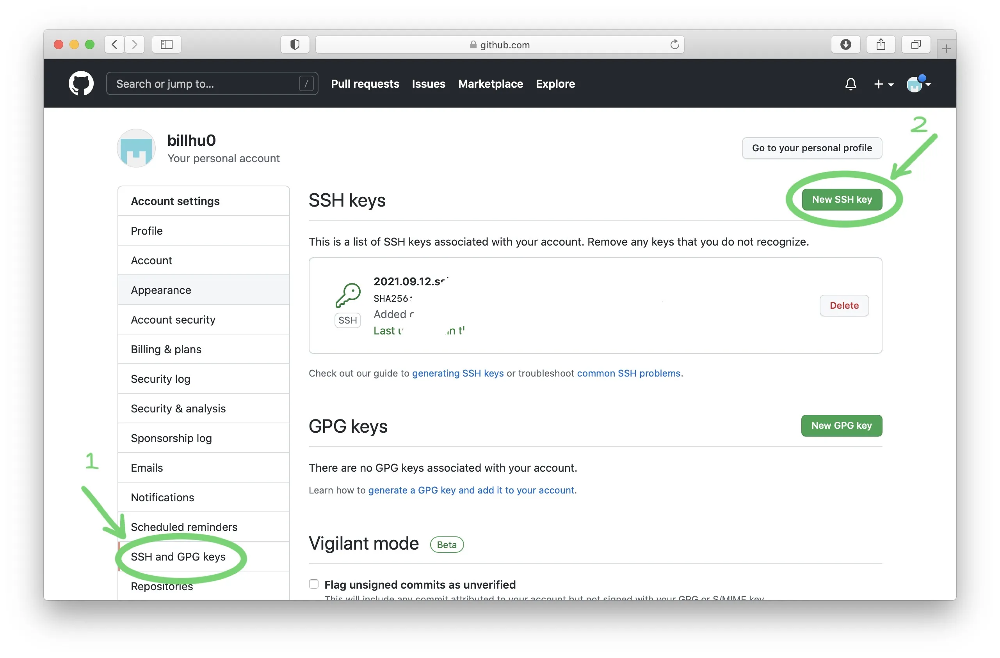
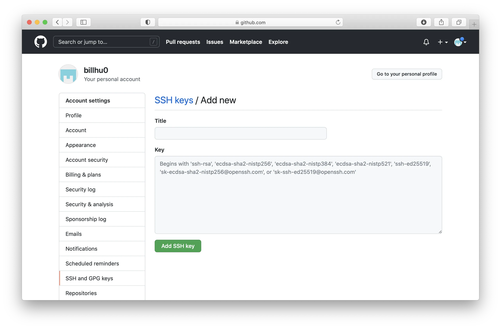
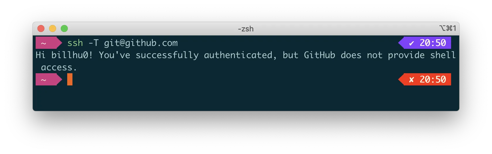
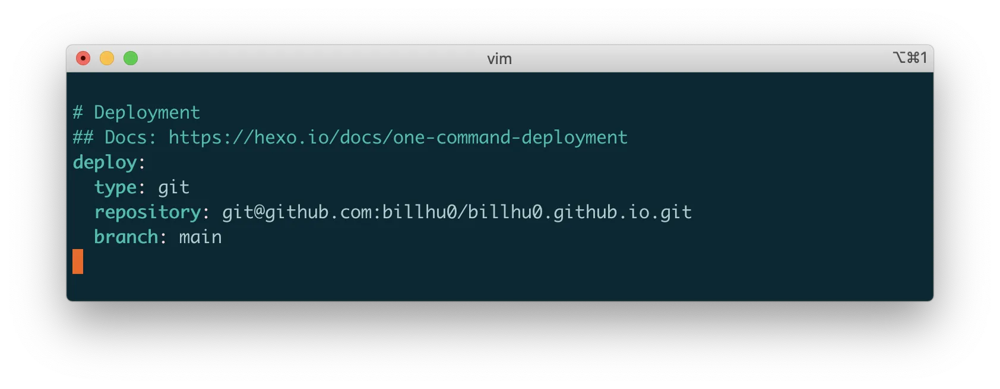

# Build your blog with `hexo` and deploy it to GitHub Pages

## Preamble

Maybe you want to have your own website and your own blog, but don't want to start from the beginning?  Well, you can build your blog with  `hexo`  and  `github pages`, which is free and easy to use! 

Follow these steps and you can have your own blog!

## Step 1. Install  `node.js` and  `git`

On macOS, `git` should be preinstalled as long as you have Xcode downloaded, while
`nodejs` can be installed with `brew`:
```shell
brew install node
```
You can execute `node -v` , `npm -v` , `git --version` to check if you have correctly installed these.

## Step 2. Prepare your GitHub Account.

### Register and set username & email

First, of course, you need to register a GitHub account (with your email). Note that the username will be your prefix of the website, so choose the username carefully. For instance, my username is `billhu0` and my website domain will be `billhu0.github.io`.

Then, go to terminal and run the following:

```shell
git config --global user.name "<Your_github_name>"
git config --global user.email "<Your_github_email>"
```

Replace `<Your_github_name>` and `<Your_github_email>` with your github name and github email. 

### Add an SSH public key

First, create an SSH key. In terminal, 
```shell
ssh-keygen -t rsa -C "Your_github_email"
```
You may need to type `y` or `yes` according to the prompts. 

Then, copy the text in file `~/.ssh/id_rsa.pub`.

Go to GitHub website, Settings, select `SSH and GPG keys` on the left sidebar, and click `New SSH key`.



Choose a title (any title is OK), and paste the text into `Key`, after that click `Add SSH key` to complete the process.



Finally, in terminal, run

```shell
ssh -T git@github.com
```
type `yes` when seeing 'Are you sure .... ', and wait for responce.

`Hi, xxx! You've successfully authenticated, ...` means that the connection is successful.




## Step 3. Create Github Pages Repository

On Github website, click the '+' icon on the top-right of the toolbar, and select 'new repository'.

Repository name:  `your_username.github.io`, e.g, `billhu0.github.io`.

Mark the checkbox 'initialize this repository with a README'.

Description: No need to write.

Your blog address is `https://your_username.github.io`.

## Step 4. Build Hexo on your local environment

### Install hexo with npm

In terminal, execute 
```shell
sudo npm install -g hexo
```

If you are in China and experience the low network speed, you can use tencent mirror source by entering 
```shell
npm config set registry http://mirrors.cloud.tencent.com/npm/
```

### Initalize hexo

Choose a local directory on your computer. In the future, almost every operation will be done in this folder, so you may backup it regularly.

In terminal, 'cd' to this directory, and run 
```shell
hexo init
npm install
```
and wait until complete.

### Preview your blog.

Now your blog has been created by hexo. Run the following command in terminal 
```shell
 hexo g   # this is the same as 'hexo generate'
 hexo s   # this is the same as 'hexo server'
```

The `hexo g` command transfers your raw data (including posts, pages in markdown and other formats) into html, css and js files that can be viewed on web. 

And `hexo s` can let you preview the website by visiting `localhost://4000` with your browser. If the command fails, enter `npm install hexo-server --save` and try again.

## Step 5. Deploy your local hexo to GitHub Pages

After testing your blog locally, you can now deploy it to the github repository you have just created, making it visiable to others.
In terminal, run 

```shell
npm install hexo-deployer-git --save
```

and go to the end of file `./_config.yml'`, modify the `deploy` part to the following 

```yml
deploy:
	type: git
	repository: git@github.com:your_username/your_username.github.io.git
	branch: main  # or master, according to your repository.
```




And then run the following command in terminal
```shell
hexo clean
hexo g
hexo d  # alia of 'hexo deploy'
```
Note that you can directly run a single `hexo d`, but to reduce the possibility of some small errors, you are suggested to run `hexo clean && hexo g` everyone before you want to `hexo d`.

Well Done! Now visit `your_username.github.io` and you can see your blog !
