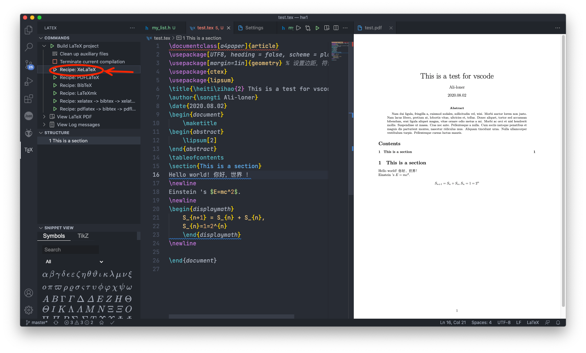
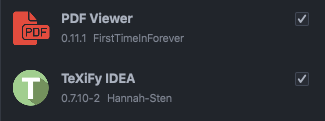
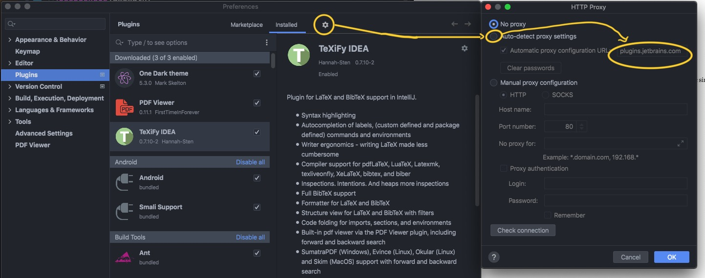
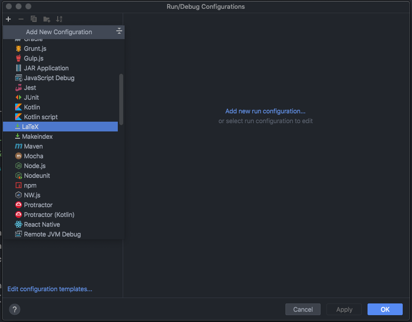
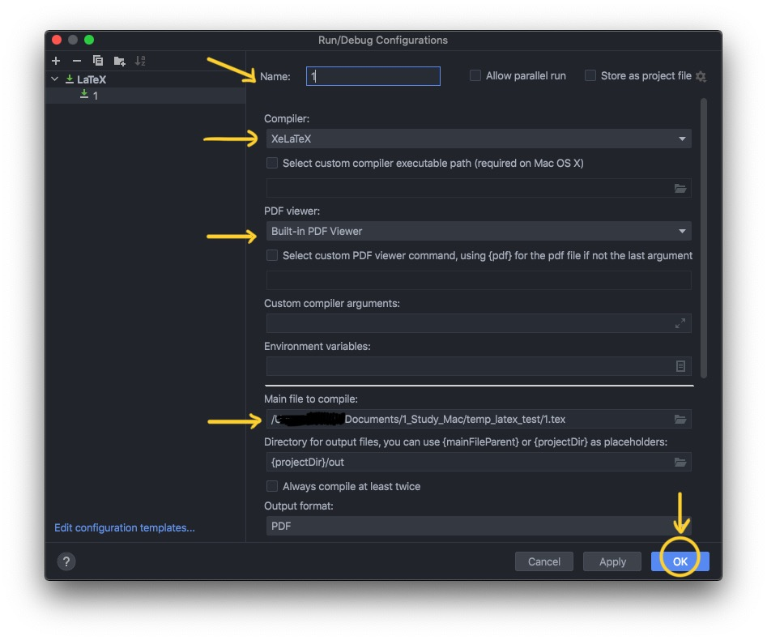
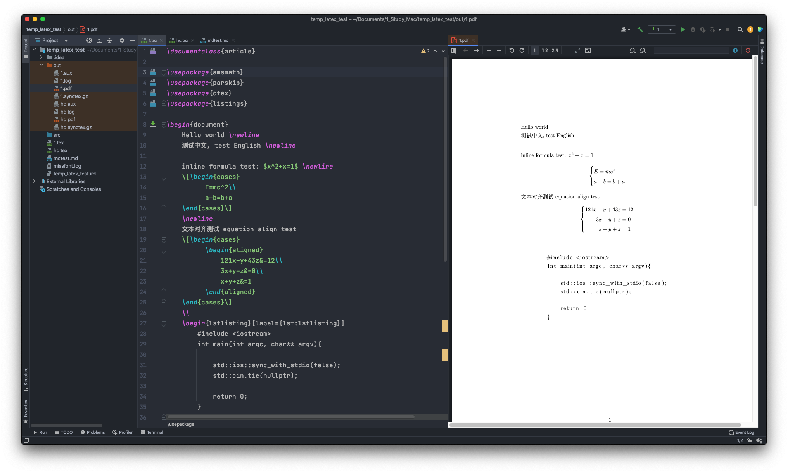
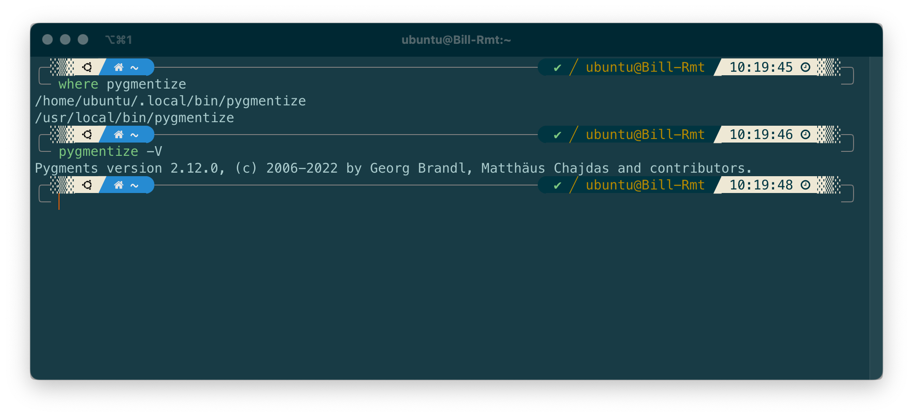
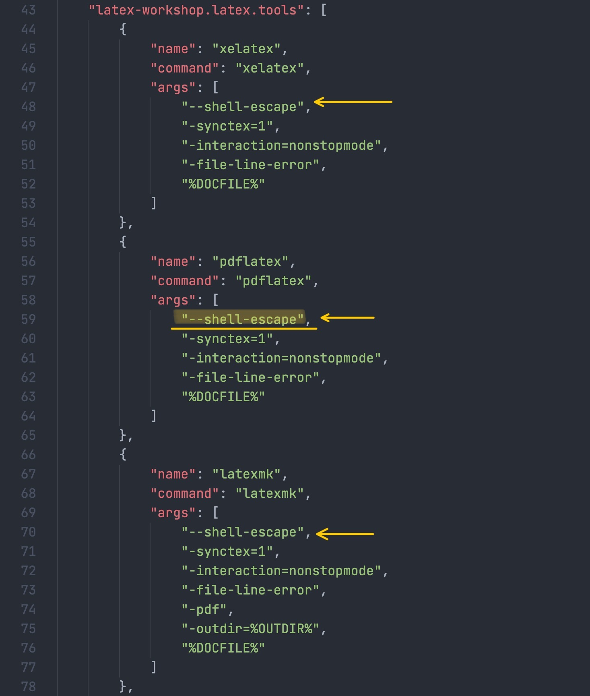
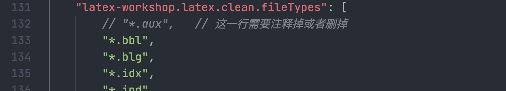
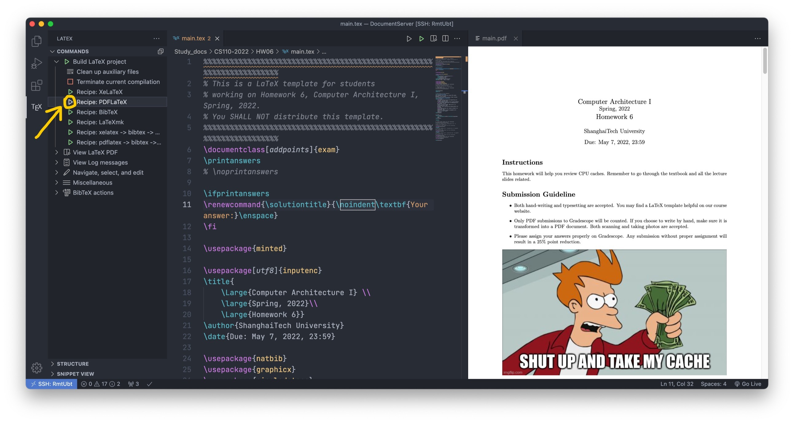

# [Mac/Linux/Win] Write LaTeX with VSCode or Jetbrains IDE

## Part 1. Install LaTeX

### macOS: Install MacTex （TexShop）

​	Link: [https://www.tug.org/mactex/](https://www.tug.org/mactex/)



Note: there are two versions. The larger one takes approximately 4G, and the smaller one is 100M. The larger one is highly recommended unless your computer is really short of storage, otherwise, you may encounter problems like the loss of ctex package.



### Linux: Install texlive

​	Install  `texlive-full` with your package manager. For example, install with  `sudo apt install texlive-full` on ubuntu or debian.

### Windows: 

​	Link: [https://tug.org/texlive/windows.html](https://tug.org/texlive/windows.html)

​	Find "Easy install" on the webpage and download `install-tl-windows.exe`, then open it and install.	


## Part 2. VSCode comfiguration

### 1.Install plugin

​		Install plugin `LaTeX WorkShop`  and  `LaTeX Lauguage Support` in vscode.

### 2. Modify `settings.json`

​		Add the following:

```json
	  "latex-workshop.latex.autoBuild.run": "onSave",
    "latex-workshop.showContextMenu": true,
    "latex-workshop.intellisense.package.enabled": true,
    "latex-workshop.message.error.show": false,
    "latex-workshop.message.warning.show": false,
    "latex-workshop.latex.tools": [
        {
            "name": "xelatex",
            "command": "xelatex",
            "args": [
                "-synctex=1",
                "-interaction=nonstopmode",
                "-file-line-error",
                "%DOCFILE%"
            ]
        },
        {
            "name": "pdflatex",
            "command": "pdflatex",
            "args": [
                "-synctex=1",
                "-interaction=nonstopmode",
                "-file-line-error",
                "%DOCFILE%"
            ]
        },
        {
            "name": "latexmk",
            "command": "latexmk",
            "args": [
                "-synctex=1",
                "-interaction=nonstopmode",
                "-file-line-error",
                "-pdf",
                "-outdir=%OUTDIR%",
                "%DOCFILE%"
            ]
        },
        {
            "name": "bibtex",
            "command": "bibtex",
            "args": [
                "%DOCFILE%"
            ]
        }
    ],
    "latex-workshop.latex.recipes": [
        {
            "name": "XeLaTeX",
            "tools": [
                "xelatex"
            ]
        },
        {
            "name": "PDFLaTeX",
            "tools": [
                "pdflatex"
            ]
        },
        {
            "name": "BibTeX",
            "tools": [
                "bibtex"
            ]
        },
        {
            "name": "LaTeXmk",
            "tools": [
                "latexmk"
            ]
        },
        {
            "name": "xelatex -> bibtex -> xelatex*2",
            "tools": [
                "xelatex",
                "bibtex",
                "xelatex",
                "xelatex"
            ]
        },
        {
            "name": "pdflatex -> bibtex -> pdflatex*2",
            "tools": [
                "pdflatex",
                "bibtex",
                "pdflatex",
                "pdflatex"
            ]
        },
    ],
    "latex-workshop.latex.clean.fileTypes": [
        "*.aux",
        "*.bbl",
        "*.blg",
        "*.idx",
        "*.ind",
        "*.lof",
        "*.lot",
        "*.out",
        "*.toc",
        "*.acn",
        "*.acr",
        "*.alg",
        "*.glg",
        "*.glo",
        "*.gls",
        "*.ist",
        "*.fls",
        "*.log",
        "*.fdb_latexmk"
    ],
    "latex-workshop.latex.autoClean.run": "onFailed",
    "latex-workshop.latex.recipe.default": "lastUsed",
    "latex-workshop.view.pdf.internal.synctex.keybinding": "double-click",
    "latex-workshop.view.pdf.viewer": "tab"
```


Note: You can use Command + Shift + P ( Ctrl + Shift + P )  and search for 'settings', and select  `Preferences: Open Settings (JSON)` 



Click "tex" in the left column bar, and inside `Build LaTeX Project` menu, choose one at your need. Usually `PDFLatex` or  `XeLaTeX` is fine.



Now the latex will automatically compile every time you save the file. (`CMD+S` to save)

### 3. How to support Chinese

Make sure the latex file encoding is 'UTF-8', and add a package at the top:

```latex
\usepackage{ctex}
```


## Part 3. JetBrains IDE configuration

​		(Intellij IDEA is taken as an example. Same for others like PyCharm, CLion, ...)

### 1. Install plugin

​	In Preference -> Plugins, download and install  `TeXiFy IDEA` and `PDF Viewer.	



​	If it cannot find anything and warns a network issue, try settings -> Auto-detect proxy settings -> Fill in `plugins.jetbrains.com`




### 2. Edit Configurations

​	Create a file with `.tex` extension, and click  `Add Configuration` at the top-right corner


​	Click the + Button at top-left, and select LaTeX



​	'Name' can be anything (e.g. the tex file name); 

​	'Compiler': choose  `XeLaTeX`;

​	'PDF Viewer': Choose  `Built-in PDF Viewer`；

​	'Main File to compile': Choose the tex file you want to compile.



### 3. Compile LaTeX

​	Click the green 'run' button on the top-right corner, or use `Control + R` to compile LaTeX and get PDF. At this time, the plugin will toggle a split-screen (left side is LaTeX, and right side is the PDF viewer). If it does not automatically split-screen, drag the pdf in `./out` folder to create a split-screen.

​	Each time you use`Control + R`, the latex will compile and the PDF will be updated.



​	
## How to use `minted` package in latex

In short, `minted` can highlight codes with the help of `pygments`. It can be used with
```latex
\usepackage{minted}
......
\begin{minted}{<YOUR_PROGRAMMING_LANGUAGE>}
    <YOUR_CODE_HERE>
\end{minted}
```

It cannot be use directly. You need to install `python3` and `pygments` first.

```sh
pip3 install pygments
```

And you have to make sure `pygmentize` is in your PATH.



Modify corresponding configuration in VSCode `settings.json`, add  `--shell-escape` to the args in PDFLatex, like the following:



Then remove `.aux` files from auto-clean file types. (`.aux` file records all the reference numbers, without which references `\ref` may be compiled to `??`)




Then you should be able to use `minted`!


