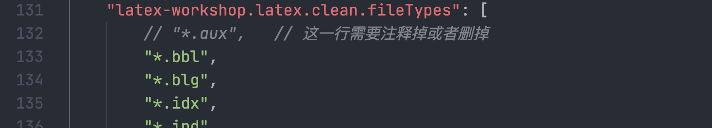

# [Mac/Linux/Win] 用 VSCode 或 Jetbrains IDE 写 LaTeX 


## 一. 安装 LaTeX 环境

### macOS: 安装 MacTex （TexShop）

​	链接： [https://www.tug.org/mactex/](https://www.tug.org/mactex/)


注意：有两个版本，”完整版“大约4G，”精简版“大约100M。除非实在是电脑存储空间不足，否则强烈建议下载那个大的，否则可能出现ctex等package缺失的问题。



### Linux: 安装texlive

​	使用你的包管理器安装 `texlive-full` ，比如 Ubuntu / Debian 可以使用 `sudo apt install texlive-full`

### Windows: 

​	链接：[https://tug.org/texlive/windows.html](https://tug.org/texlive/windows.html)

​	从网页上「Easy install」的地方下载「install-tl-windows.exe」，并打开进行安装。

​	

## 二. VSCode 配置方法

### 1.在VSCode中安装插件

​		`LaTeX WorkShop` 和 `LaTeX Lauguage Support`

### 2. 修改 `settings.json`

​		添加以下内容：

```json
	"latex-workshop.latex.autoBuild.run": "onSave",
    "latex-workshop.showContextMenu": true,
    "latex-workshop.intellisense.package.enabled": true,
    "latex-workshop.message.error.show": false,
    "latex-workshop.message.warning.show": false,
    "latex-workshop.latex.tools": [
        {
            "name": "xelatex",
            "command": "xelatex",
            "args": [
                "-synctex=1",
                "-interaction=nonstopmode",
                "-file-line-error",
                "%DOCFILE%"
            ]
        },
        {
            "name": "pdflatex",
            "command": "pdflatex",
            "args": [
                "-synctex=1",
                "-interaction=nonstopmode",
                "-file-line-error",
                "%DOCFILE%"
            ]
        },
        {
            "name": "latexmk",
            "command": "latexmk",
            "args": [
                "-synctex=1",
                "-interaction=nonstopmode",
                "-file-line-error",
                "-pdf",
                "-outdir=%OUTDIR%",
                "%DOCFILE%"
            ]
        },
        {
            "name": "bibtex",
            "command": "bibtex",
            "args": [
                "%DOCFILE%"
            ]
        }
    ],
    "latex-workshop.latex.recipes": [
        {
            "name": "XeLaTeX",
            "tools": [
                "xelatex"
            ]
        },
        {
            "name": "PDFLaTeX",
            "tools": [
                "pdflatex"
            ]
        },
        {
            "name": "BibTeX",
            "tools": [
                "bibtex"
            ]
        },
        {
            "name": "LaTeXmk",
            "tools": [
                "latexmk"
            ]
        },
        {
            "name": "xelatex -> bibtex -> xelatex*2",
            "tools": [
                "xelatex",
                "bibtex",
                "xelatex",
                "xelatex"
            ]
        },
        {
            "name": "pdflatex -> bibtex -> pdflatex*2",
            "tools": [
                "pdflatex",
                "bibtex",
                "pdflatex",
                "pdflatex"
            ]
        },
    ],
    "latex-workshop.latex.clean.fileTypes": [
        "*.aux",
        "*.bbl",
        "*.blg",
        "*.idx",
        "*.ind",
        "*.lof",
        "*.lot",
        "*.out",
        "*.toc",
        "*.acn",
        "*.acr",
        "*.alg",
        "*.glg",
        "*.glo",
        "*.gls",
        "*.ist",
        "*.fls",
        "*.log",
        "*.fdb_latexmk"
    ],
    "latex-workshop.latex.autoClean.run": "onFailed",
    "latex-workshop.latex.recipe.default": "lastUsed",
    "latex-workshop.view.pdf.internal.synctex.keybinding": "double-click",
    "latex-workshop.view.pdf.viewer": "tab"
```


备注：可以使用 Command + Shift + P ( Ctrl + Shift + P ) 并搜索settings就能跳出来 `Preferences: Open Settings (JSON)` 这一项



然后再VSCode左侧边栏 "Tex" 中的`Build LaTeX Project`选项中，根据需要选择，如果你不知道选哪个，建议选择 `XeLaTeX`。


这样即可实现 保存时自动编译的功能。（`CMD+S`保存）

### 3. 如何支持中文

确保latex文档编码为'UTF-8'，在文档开头添加一句代码：

```latex
\usepackage{ctex}
```

## 三. JetBrains IDE 配置方法

​		（以Intellij IDEA为例，PyCharm、CLion等其它JetBrains IDE配置方法相同）

### 1 安装plugin

​	在 Preference -> Plugins 中下载安装 `TeXiFy IDEA`和`PDF Viewer`插件。	


​	如果出现死活搜索不出东西，提示网络问题的话，可以试试 设置 -> Auto-detect proxy settings -> 填入 `plugins.jetbrains.com`


### 2 Edit Configurations

​	创建一个tex后缀的文件，点击右上角的 `Add Configuration`


​	左上角添加 -> 选择LaTeX


​	Name随便填（建议填tex文件名）； 

​	Compiler 选 `XeLaTeX`；

​	PDF Viewer 选 `Built-in PDF Viewer`；

​	Main File to compile 选择你写的tex文件


### 3  编译LaTeX

​	点击右上角的运行按钮，或使用快捷键`Control + R`即可编译LaTeX生成PDF文件。此时插件应该会自动分屏（左侧为LaTeX源码，右侧为PDF阅读器）。如果没有自动分屏，就手动把`out`文件夹里的pdf文件拖出来分屏。

​	每次使用快捷键`Control + R`时都会自动编译并更新PDF，实现实时预览。


​	

## 如何编译 CA 2022 HW6 的那一堆latex？

首先，你要编译的是main.tex，但是直接编译可能会报错，报错内容与 `Package minted` 有关。按照下面的来。


## Latex 中 minted 包的使用

简单来说，minted可以借助pygments库进行代码的高亮，用法是
```latex
\usepackage{minted}
......
\begin{minted}{<YOUR_PROGRAMMING_LANGUAGE>}
    <YOUR_CODE_HERE>
\end{minted}
```

它不能直接使用，需要先安装python3和pygments库

```
pip3 install pygments
```

并且pygmentize必须要在环境变量中


修改 settings.json 中 latex 的相关配置，添加 pdflatex 编译命令的参数 `--shell-escape`


然后在自动清理的文件类型中，取消 .aux 文件（这个文件记录了所有的引用编号，如果还没编译完成就删除，可能出现 `\ref` 的引用编译出 `??` 的问题）



编译时使用pdflatex编译`main.tex`即可。


