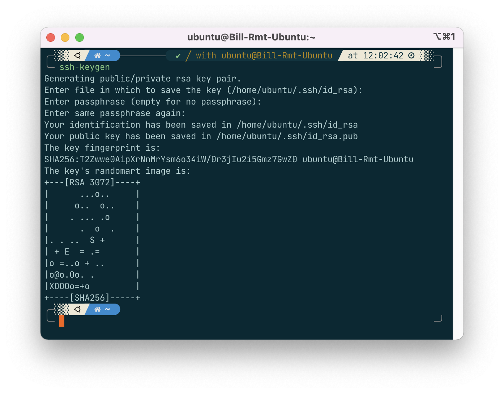
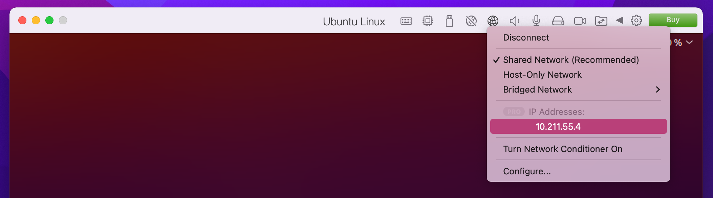
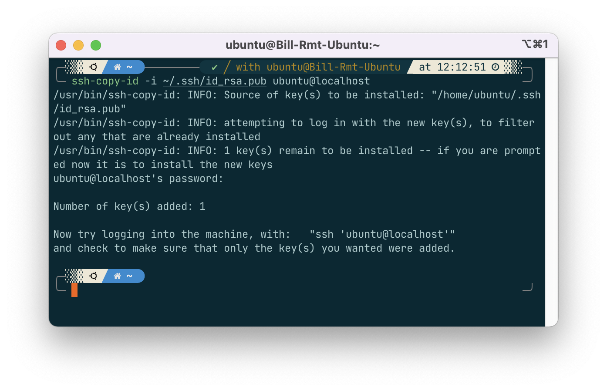

## VSCode Remote-SSH如何保存密码（以PD虚拟机ubuntu为例）

前言：在VSCode中可以使用'Remote: SSH'插件远程连接到服务器来进行开发，但是可能会遇到每次都需要输入`username@hostname`以及密码的情况。一个常见的场景是：使用macOS主系统上的Vscode 连接到Parallels Desktop的ubuntu虚拟机中，获得一个Linux开发环境。

通过以下步骤可以将服务器（本地虚拟机）的SSH配置“保存”起来，省去每次输入的繁琐。


### Step1. 本地 `ssh-keygen`生成rsa key pair 并把公钥拷贝到远程主机

关于`ssh-keygen`的使用，可以参考： .

或者也可以这样做：

#### 1. 在本地生成key pair

Note: 如果你之前做过这一步（`~/.ssh`目录下已有`id_rsa.pub`文件），可以跳过这一步。

在**本地**机器的终端，直接执行这个`ssh-keygen`命令即可

```shell
ssh-keygen  # 可以一路回车
```

系统会询问你要把文件保存在哪里，**可以直接一路回车**，默认位置是 `~/.ssh`，会在这个目录下生成两个文件: `id_rsa` (private key) 和 `id_rsa.pub` (public key)。




> 大部分网上的教程会让你执行这个命令
>
> ```shell
> ssh-keygen -t rsa -C "xxx@xxxx.com"
> ```
>
> 其实这和直接`ssh-keygen`是一样的，`"xxxx@xxxx.com"`只是生成的ssh key的名称，为了方便辨识的字符串，并非要求或规定一定是某个邮箱地址。
>


#### 2. 把生成的公钥拷贝过去

```shell
ssh-copy-id -i ~/.ssh/id_rsa.pub USERNAME@HOSTIP 
```

其中`USERNAME`是linux的用户名，`HOSTIP`是host的ip地址，对于PD虚拟机，可以点击顶栏上的网络图标看到这个地址，一般是10.211.55.x。比如我连接自己的ubuntu虚拟机，可以将`USERNAME@HOSTIP`换成`bill@10.211.55.4`.



这个命令会自动给远程主机的`~/.ssh`, `~/.ssh/authorized_keys`设置合适的权限并把本地公钥复制过去。

执行这个命令的过程中系统会询问远程服务器的密码，正常输入即可，整个过程会提示以下内容：



#### 3. 尝试在终端中ssh到服务器，应该就不需要输入密码就能连接了。

```shell
ssh username@10.211.55.4    # 此时应该不会提示输入密码
```


### Step2. 配置Vscode的Remote:SSH

确保Vscode中已经安装了`Remote-SSH`插件，然后点击Vscode左下角的箭头打开远程连接，选择`open configuration file`; 或者也可以按下`Command + Shift + P`并搜索进入`Remote-SSH: open SSH configuration file`进入设置。

在打开的config文件中输入以下内容

```yml
Host 2.22_username
  HostName 10.211.55.4
  User bill
  PreferredAuthentications publickey
  IdentityFile "~/.ssh/id_rsa"
```

注意将其中的`10.211.55.4`和`bill`换成你自己服务器的地址和用户名。

保存后，再次使用vscode时即可直接登录到服务器，无需任何输入主机名或密码的操作。
