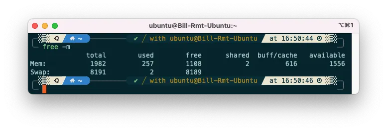
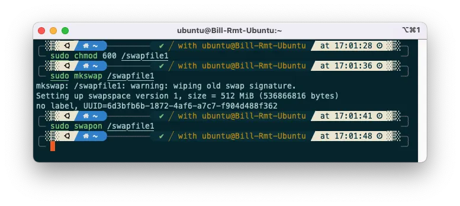
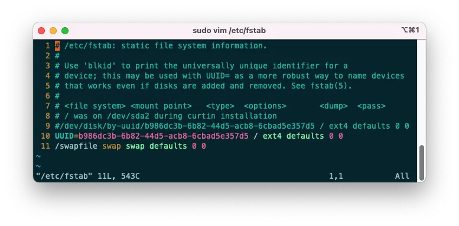

## What is 'swap'?

Linux devides its physical RAM into chunks of memory called **pages**. **Swapping** is the process whereby a page of memory is copied to the preconfigured space on the hard disk called **swap space**, to free up that page of memory. 

The compined sizes of the physical memory and swap space is the amount of virtual memory available.


In brief, swap is to cut some space on the hard disk to be used as an extended memory. When almost running out of physical memory, Linux system will move some relatively inactive memory to swap, in order to relieve the memory pressure.


Usually, raspi or some lightweight server have only a small physical memory (1-2 Gigabytes). Should you encounter problems because of exhausted memory, you can use swap to 'enlarge' it.

## Part 1. Turn on or enlarge swap

### Step0. See the current size of swap

Use `free` in shell can let you see your memory usage, including the size of physical memory and swap. Usually we use `free -m` to let it display numbers in unit 'MB'.

```shell
free -m
```

If the row 'swap' shows zero, it indicates you does not have swap currently.



### Step1. Create a swap file

In terminal, execute

```shell
sudo dd if=/dev/zero of=/swapfile bs=1M count=4096
```

where `bs=1M count=4096` means the unit is 1M, and create 4096 units (which equals 4 Gigabytes) of virtual memory. You can change the size based on your need. 

This command writes an empty file of a specified size named and located at `/swapfile`. Since it requires hard disk IO, it might take some time.

### Step2. Change the permission of swapfile and activate the swap

Then we need to change the permission (`chmod`) of the swapfile we have just created to 600.

You can still use the swap later if you skip this step, but the following operations may throw you a warning. For safety issues, you are NOT RECOMMENDED to skip this.

```shell
sudo chmod 600 /swapfile
```

After that, we need to make this normal file a swapfile. In terminal, execute

```shell
sudo mkswap /swapfile
sudo swapon /swapfile
```

If succeeds, you can see the fillowing prompt




Now you can use `free -m` command again to check whether the swap is successfully turned on.



### Step3. Turn on the swap automatically at system startup

Despite that we have configured swap now, it cannot live after a restart. To let it start automatically at booting, we have to modify `/etc/fstab` file.

```shell
sudo vim /etc/fstab
```

Add the following line at the end of file, save, and exit.

```
/swapfile swap swap defaults 0 0
```

The contents of this file should look similar to the following



Now you have successfully configured swap and make it start automatically at boot.

### (Optional) Step4. Change swapiness

Swapiness's value controls the system's likelihood to use virtual memory. A higher value indicates using the swap partition more frequently, and a lower value means using physical memory more likely.

The default value of swappiness is usually `60`, and there's usually **no need to modify it**. 

The following command can let us know the current swapiness

```shell
cat /proc/sys/vm/swappiness
```

- Modify the swappiness temporily (restart will restore the original value)

```shell
sudo sysctl vm.swappiness = 10  # Change 10 to your needed value
```

- Modify the swappiness permanently

```shell
sudo vim /etc/sysctl.conf
```

Add to (or modify) the end of the file: 

```sh
vm.swappiness=10  # Change 10 to your needed value
```

Save and exit, then execute

```shell
sudo sysctl -p
```

and you can change the swappiness successfully.

## Part 2: Turn off and delete swap

### Step1. Stop using swapfile

If you want to cut down the swap size or removing the swap, you have to find the location of swapfile first. If you added the swap by the above steps, the swapfile should be located in the root directory `/swapfile`. Otherwise, find the location first by using the following command

```sh
cat /proc/swaps
```

After finding the location, execute the following to disable the swap:

```shell
sudo swapoff -v /swapfile 
```

### Step2. Delete the configuration in `/etc/fstab`

Modify `/etc/fstab` file:

```shell
sudo vim /etc/fstab
```

and remove the line corresponding to the swapfile.

### Step3. Remove swapfile

Execute

```shell
sudo rm /swapfile
```

to delete the swapfile and free up space on the hard disk.
