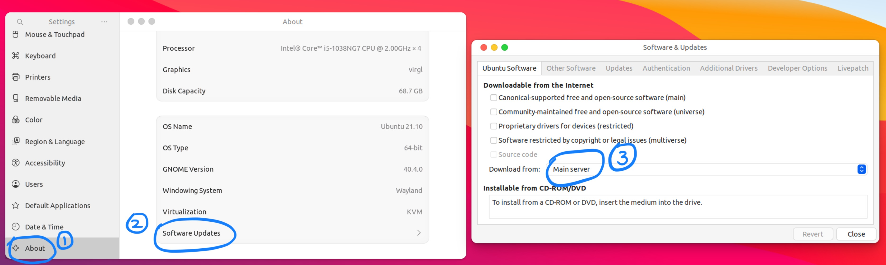
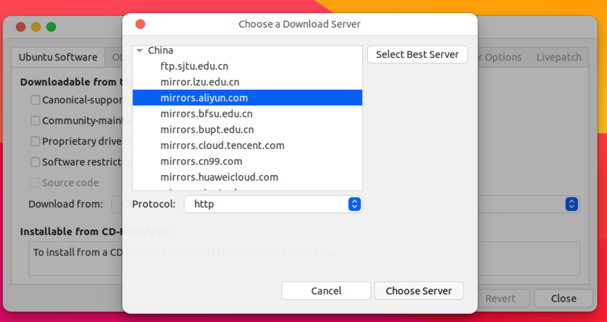


本文适用于 `x86_64` 的 Ubuntu Desktop 或 Ubuntu Server



## apt 换源


不建议用清华源，建议中科大源、阿里源等


如果是有图形界面的ubuntu，可以直接进入设置换源，如图：





或者手动修改 `/etc/apt/sources.list` 换源。以中科大源为例：

对于 ubuntu 20.04（版本号focal），可使用下面的源

```
deb https://mirrors.ustc.edu.cn/ubuntu/ focal main restricted universe multiverse
deb-src https://mirrors.ustc.edu.cn/ubuntu/ focal main restricted universe multiverse
deb https://mirrors.ustc.edu.cn/ubuntu/ focal-updates main restricted universe multiverse
deb-src https://mirrors.ustc.edu.cn/ubuntu/ focal-updates main restricted universe multiverse
deb https://mirrors.ustc.edu.cn/ubuntu/ focal-backports main restricted universe multiverse
deb-src https://mirrors.ustc.edu.cn/ubuntu/ focal-backports main restricted universe multiverse
deb https://mirrors.ustc.edu.cn/ubuntu/ focal-security main restricted universe multiverse
deb-src https://mirrors.ustc.edu.cn/ubuntu/ focal-security main restricted universe multiverse
deb https://mirrors.ustc.edu.cn/ubuntu/ focal-proposed main restricted universe multiverse
deb-src https://mirrors.ustc.edu.cn/ubuntu/ focal-proposed main restricted universe multiverse
```

对于其它ubuntu版本，更改上面的`focal`为版本代号即可，例如ubuntu 21.10，代号为impish. 也可以使用这个链接： [https://mirrors.ustc.edu.cn/repogen/](https://mirrors.ustc.edu.cn/repogen/)

然后修改相应的配置文件：

```
# 备份原有文件，你也可以跳过这一步
sudo mv /etc/apt/sources.list /etc/apt/sources.listbak  
sudo nano /etc/apt/sources.list  
# 往里面填入内容.....,  [ctrl + X]保存并退出

sudo apt update    # 从源获取软件安装列表
sudo apt upgrade   # 更新所有旧版本软件包，可能需要一点时间
```

## 配置zsh+oh_my_zsh  

<div class="note note-info">
<p>Oh My Zsh will not make you a 10x developer...but you may feel like one!</p>
</div>

（参考 [mintimate](https://mintimate.cn) 的教程）

### Step 1 安装zsh并设置为默认终端

通常Linux默认的shell是bash，且不会自带zsh，需要手动安装zsh。可通过 `echo $SHELL` 查看你现在正在用什么shell。

通常macOS默认的shell是zsh，可以跳过这一步。

```shell
sudo apt install zsh  # 安装zsh
chsh -s /bin/zsh      # 设置为默认shell，重启终端或者重启系统生效
```

### Step 2 安装oh my zsh

一键安装脚本

```shell
sudo apt install git curl unzip -y   # 这个脚本需要先安装git, curl, unzip
zsh -c "$(curl -fsSL 'https://api.host.mintimate.cn/fileHost/public/download/1P0R')"
```

切换主题：

```shell
vim ~/.zshrc

# 找到 ZSH_THEME="robbyrussel"这句话，修改成你想要的主题。

exec zsh  # 重启终端或执行这条命令（重新启动zsh），才会看到效果
```

### 安装 `powerlevel10k` 主题

先记得安装 `MesloLGS NF`字体，下载链接： [https://gitee.com/keyboardkiller/MesloLGS_NF](https://gitee.com/keyboardkiller/MesloLGS_NF)

然后，执行：

```shell
git clone --depth=1 https://gitee.com/romkatv/powerlevel10k.git ${ZSH_CUSTOM:-$HOME/.oh-my-zsh/custom}/themes/powerlevel10k
```

在 `~/.zshrc` 中，设置`ZSH_THEME` 为 `powerlevel10k/powerlevel10k`

```
vim ~/.zshrc

# 找到ZSH_THEME，修改成下面这句
ZSH_THEME="powerlevel10k/powerlevel10k"
```

最后

```shell
exec zsh       # 或重启终端
```

可以使用 `p10k configure` 命令自定义配置这个主题。

### 安装 `zsh-syntax-highlighting` 插件

执行

```shell
git clone https://github.com/zsh-users/zsh-syntax-highlighting.git ${ZSH_CUSTOM:-~/.oh-my-zsh/custom}/plugins/zsh-syntax-highlighting
```

在`~/.zshrc`中，在`plugins`中添加`zsh-syntax-highlighting`。

添加后你的`zshrc`应该类似这样（多个插件使用空格分隔，omz自带了`git`插件，在其后添加即可）：
```
plugins=(git zsh-syntax-highlighting)
```


## vim代码高亮、显示行号等设置

（不涉及vim-plug等vim插件，只用到了vim的自带功能）

```shell
vim ~/.vimrc 

# 在里面添加这些内容————————————————————————————————————————————

syntax on         " 语法高亮
set tabstop=4     " Tab键的宽度
set softtabstop=4
set shiftwidth=4  "  统一缩进为4
set nu            " 显示行号
colorscheme pablo " 设置颜色主题
set ruler         " 在编辑过程中，右下角显示光标位置行数及状态

# 保存并退出，下次进入vim会自动生效—————————————————————————————————

```


## 一些需要安装的东西

git 及 git-lfs:

```
sudo apt install git git-lfs -y
```

C语言:

```shell
sudo apt install gcc g++ gcc-multilib make cmake gdb cgdb valgrind -y
```

Jre (Java runtime environment)，用于运行logisim软件：

虽然我们不需要jdk (java development kit) ，但还是安装一下比较好（jdk包含jre）

```
sudo apt install openjdk-11-jdk -y
```


