# Part 1. Systems

## 1.2 Transformation of Indepedent Variable 自变量的变换

### 1.2.1 自变量变换举例

- **Time reflection 时间反转**: $x(t) \stackrel{}{\longleftrightarrow} x(-t)$, $x[n] \stackrel{}{\longleftrightarrow} x[-n]$
  
- **Time scaling 时间尺度变换**: $x(t) \stackrel{}{\longleftrightarrow} x(ct)$

- **Time shift 时移**: $x(t) \stackrel{}{\longleftrightarrow} x(t-t_0)$, $x[n] \stackrel{}{\longleftrightarrow} x[n-n_0]$

To perform transformation $x(t) \rightarrow x(\alpha t + \beta)$, you have to **do time-shifting and then scaling 先时移再时间尺度变换**.

E.g. $x(t) \rightarrow x(t + \beta) \rightarrow x(\alpha t + \beta)$

### 1.2.3 Even and odd func 偶信号与奇信号

$$
    Ev\{x(t)\} = \frac{1}{2} \left(
        x(t) + x(-t)
    \right)
$$
$$
    Od\{x(t)\} = \frac{1}{2} \left(
        x(t) - x(-t)
    \right)
$$

## 1.3 Exponential and sinusoidal Signal 指数信号与正弦信号



- **Euler's formula**: $e^{j\omega t} = \cos(\omega_0 t) + j\cdot \sin(\omega_0 t)$

- **Sinusoidal signal**: $x(t) = A\cos(\omega_0 t + \phi)$

- Sinusoidal signal can be written in terms of periodic complex exponentials with the same fundamental frequency:

$$
A\cos(\omega_0 t + \phi) = \frac{A}{2} e^{j\phi} e^{j\omega_0 t} + \frac{A}{2} e^{-j\phi} e^{-j\omega_0 t}
$$



### 1.3.1 连续时间复指数信号与正弦信号

- $x(t) = e^{j\omega_0 t}$
- $T_0 = 2\pi / \lvert\omega_0\rvert$

### 1.3.2 离散时间复指数信号与正弦信号

- $x[n] = e^{j\omega_0 n}$
- 仅当 $\omega_0 / 2\pi$ 是有理数的时候才是周期信号 ($\omega_0 N$ 必须是 $2\pi$ 整数倍, 下式 $m$ 和 $N$ 不能有公约数)
  $$
    \frac{\omega_0}{2\pi} = \frac{m}{N}
  $$
- **Fundamental Period** $N = m\left(\frac{2\pi}{\omega_0}\right)$

## 1.4 Unit Impulse and Unit Step function 

### 1.4.1 DT Unit impulse & Unit step

- Unit impulse function $\delta[n]$ and $u[n]$
  $$
  \delta[n] = \begin{cases}
      0, & n\neq 0\\
      1, & n = 0
  \end{cases}, \ \ \ \ 
  u[n] = \begin{cases}
      0, & n<0\\
      1, & n\geq 0
  \end{cases}
  $$

- $\delta[n] = u[n] - u[n-1]$

### 1.4.2 CT Unit impulse & Unit step

- Unit impulse function $\delta(t)$ and $u(t)$
  $$
  u(t) = \begin{cases}
      0, & t < 0\\
      1, & n > 0
  \end{cases}, \ \ \  
  \delta(t) = \frac{d}{dt}u(t)
  $$

## 1.6 Properties of System 基本系统性质

**1. Memoryness**: output only depends on input at the same time 当前输出仅依赖当前输入

**2. Invertibility and Inverse System**: distinct inputs lead to distinct outputs 不同输入导致不同输出，输入和输出一一对应

**3. Causality**: output doesn't depend on future 不依赖未来的输入，仅依赖过去和现在的输入

  现实中的系统都是因果系统

  All memoryless are casual ! 无记忆系统都是因果系统

**4. Stability**: bounded input gives bounded output 输入有界则输出有界

**5. Time-invariance**: a time shift in the input only causes a time shift in the output

  If $x[n] \to y[n]$, then $x[n-n_0] \to y[n-n_0]$

**6. Linearity**: a system is linear if (1)additivity and (2)scaling

  - **Additivity 可加性**: $x_1(t) + x_2(t) \to y_1(t) + y_2(t)$
  
  - **Scaling/Homogeneity 比例性/齐次性**: $a x_1(t)\to a y_1(t)$

# Part 2: LTI system

## 2.1 DT LTI System 离散时间线性时不变系统:卷积和

- **Sifting Property 筛选性质**
$$
    x[n] = \sum_{k=-\infty}^{\infty} x[k] \delta[n-k]
$$

- 对于任意LTI,只需知道输入信号和单位冲激响应,求卷积和,就能得到输出
$$
    y[n] = x[n] * h[n] = \sum_{k=-\infty}^{\infty}x[k]h[n-k]
$$

## 2.2 CT LTI System 连续时间线性时不变系统:卷积积分

- **Sifting Property 筛选性质**
$$
    x(t) = \int_{-\infty}^{\infty} x(\tau) \delta(t-\tau)\mathrm{d}\tau
$$

- 卷积积分
$$
    y(t) = x(\tau) * h(\tau) = \int_{-\infty}^{\infty} x(\tau) h(t-\tau)\mathrm{d}\tau
$$

## 2.3 LTI system properties 线性时不变系统的性质

  1. **Commutative 交换律**: $x(t) * h(t) = h(t) * x(t)$ (离散同理)
   
  2. **Bi-linear? 分配律**: $(a x_1(t) + b x_2(t)) * h(t) = a(x_1 * h) + b(x_2 * h)$, $x * (ah_1 + bh_2) = a(x*h_1) + b(x*h_2)$
   
  3. **Shift**: $x(t-\tau) * h(t) = x(t) * h(t-\tau)$  ( 例如$x(t-2)*h(t+2)=x(t)*h(t)$ )
   
  4. **Identity**: $\delta(t)$ is the identity signal, $x*\delta = x = \delta * x$

  5. **Associative**: $x_1 * (x_2 * x_3) = (x_1 * x_2) * x_3$

### 2.3.4 Memoryless LTI systems

- $h[n] = 0$ for $n\neq 0$

### 2.3.5 Invertibility of LTI systems

A system is invertible only if an inverse system exists

$$
    h(t) * h_1(t) = \delta(t)
$$

### 2.3.6 Casuality of LTI systems

- $h[n] = 0$ for $n<0$

### 2.3.7 Stability of LTI systems

- If $\sum_{k=-\infty}^{\infty} \lvert h[k] \rvert < \infty$ **(绝对可和)**  /  $\int_{-\infty}^{\infty} \lvert h(\tau) \rvert d\tau < \infty$, then $y[n]$ is bounded, and the system is stable. 


$$
    \delta(t) * \delta(t) = \delta(t)
$$



Derivatives 
$$
    y'(t) = x'(t) * h(t) = x(t) * h'(t)
$$
$$
    y^{(k+r)}(t) = x^{(k)}(t) * h^{(r)}(t)
$$


# Part 3: Fourier series 



**Euler's Formula**
$$
    e^{jx} = \cos(x) + j\sin(x)
$$
$$
	\sin(x) = \frac{e^{jx} - e^{-jx}}{2j}
$$
$$
	\cos(x) = \frac{e^{jx} + e^{-jx}}{2}
$$



## 3.2 Eigenfunction of LTI system

（线性时不变系统对复指数信号的响应）

如果有一个函数进入系统后，系统的输出是函数的常数倍（可能是复数），那么这个函数就是这个系统的特征函数 **eigenfunction** 

### CT

$$
x(t) = e^{st} \rightarrow 
\begin{aligned}
y(t) &= e^{st} \int_{-\infty}^{\infty} h(\tau)e^{-s\tau}\mathrm{d}\tau 
&= e^{st} \cdot H(s)
\end{aligned}
$$
- Eigenfunction: $e^{st}$
- Eigenvalue: $H(s) = \int_{-\infty}^{\infty} h(\tau)e^{-s\tau}\mathrm{d}\tau$

### DT

$$
x[n] = z^n \rightarrow y[n] = z^n \sum_{k=-\infty}^{\infty} h[k] z^{-k} = z^{n} \cdot H(z)
$$
- Eigenfunction: $z^n$
- Eigenvalue: $H(z) = \sum_{k=-\infty}^{\infty} h[k] z^{-k}$

### Usefulness

如果 $x(t)$ 能写成一堆eigenfunction的加权之和，那么我们就能很容易知道 $x(t)$ 的输出。

$$
\begin{aligned}
    \textnormal{CT: \ \ \ } &x(t) = \sum_{k} a_k e^{s_k t} &\Rightarrow
    y(t) = \sum_{k} a_k H(s_k) e^{s_k t}\\
    \textnormal{DT: \ \ \ } &x[n] = \sum_{k} a_k z_{k}^{n} &\Rightarrow 
    y[n] = \sum_k a_k H(z_k) z_k^n
\end{aligned}
$$

### Fourier Analysis

For fourier analysis, we consider:

- CT: pure imaginary exponential: $e^{st} = e^{j\omega t}$
  
  Input: $e^{j\omega t}$, Output: $H(j\omega) e^{j\omega t}$ 

- DT: Unit: $z^{n} = e^{j\omega n}$

  Input: $e^{j\omega n}$, Output: $H(e^{j\omega}) e^{j\omega n}$. 

## 3.3 连续时间周期信号的Fourier级数表示

### 3.3.1 An orthonormal set 成谐波关系的复指数信号的线性组合

- $S = \{x(t) | x(t) = x(t+T_0), \forall n\}$, $T_0 = \frac{2\pi}{\omega_0}$

- **Dot product (Inner product)**: $<x_1(t), x_2(t)> = \frac{1}{T} \int_{-\frac{T}{2}}^{\frac{T}{2}} x_1(t) x_2^{*} (t)$
  
- **Harmonically related complex exponential**: $B = \{\phi_{k(t)} | \phi_{k(t)} = e^{jk\omega_0 t}, k \in Z \}$

- **Observe that they are orthonormal**:
    $$
        \frac{\omega_0}{2\pi} \int_{-\frac{\pi}{\omega_0}} ^ {\frac{\pi}{\omega_0}} e^{jk_1\omega_0t} e^{-jk_2\omega_0t} = \delta[k_1 - k_2] = \begin{cases}
            0 & k_1 \neq k_2\\
            1 & k_1 = k_2
        \end{cases}
    $$

### 3.3.2 Fourier Series Expansion 连续时间周期信号傅里叶级数表示的确定

- **Theorem**: $x(t)$ may be expressed as a Fourier series and $a_k$ can be obtained by
    $$
    x(t) = \sum_{k=-\infty}^{\infty} a_k e^{jk\omega_0t}, \ 
    a_k = \frac{1}{T_0} \int_{T_0} x(\tau) e^{-jk\omega_0\tau} \mathrm{d}\tau
    $$

    $a_0$ 可以直接用面积除以周期计算：
    $$
            a_0 = \frac{1}{T_0} \int_{T_0} x(\tau) \mathrm{d}\tau
    $$


**方波的Fourier Series**
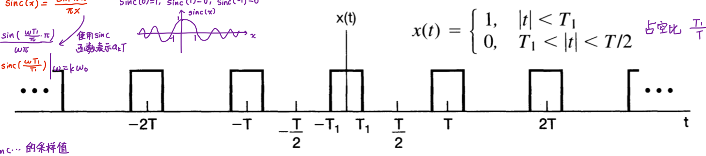
$$
    a_0 = \frac{2T_1}{T}, a_k = \frac{sin(k\omega_0 T_1)}{k\pi}
$$


### Decomposition of Even and Odd

In general, $a_k$ is complex, therefore this is not read and imaginary decomposition. However, this is the **even and odd decomposition**.

不是实部和虚部的分解，而是偶函数与奇函数的分解。

$$
\begin{aligned}
    x(t) &= \sum_{k=-\infty}^{\infty} a_k e^{jk\omega_0 t}\\
    &= \sum_{k=-\infty}^{\infty} (a_k \cos(k\omega_0 t) + j a_k \sin(k\omega_0 t))\\
    &= a_0 + \sum_{k>0} ((a_k + a_{-k}) \cos(k\omega_0 t) + j (a_k - a_{-k}) \sin(k \omega_0 t))
\end{aligned}
$$

$x(t)$ even $\rightarrow$ all sine terms vanish $\rightarrow$ $a_k = a_{-k}$

$x(t)$ odd $\rightarrow$ all cosine terms vanish $\rightarrow$ $a_k = -a_{-k}$

## 3.5 Properties of CT Fourier Series 连续时间傅里叶级数的性质

$$
x(t) \stackrel{FS}{\longleftrightarrow} a_{k}
$$

1. **Linearity**: $z(t) = \alpha x(t) + \beta y(t) \stackrel{FS}{\longleftrightarrow} \alpha a_k + \beta b_k$
2. **Time-shift**: $x(t-t_0) \stackrel{FS}{\longleftrightarrow} e^{-jk\omega_0 t_0} a_k$
3. **Time-Reverse**: $x(-t) \stackrel{FS}{\longleftrightarrow} a_{-k}$
4. **Time-scaling**: $x(\alpha t) = \sum_{k=-\infty}^{\infty} a_k e^{jk(\alpha \omega_0 t)}$
5. **Multiplication**: $x(t)y(t) \stackrel{FS}{\longleftrightarrow} h_k = \sum_{l=-\infty}^{\infty} a_l b_{k-l}$
6. **Conjugation & conjugate Symmetry** : $x^* \stackrel{FS}{\longleftrightarrow} a^*_{-k}$
   
    - If $x(t)$ is real, then $x(t) = x^*(t)$, $a_k^* = a_{-k}$

    - If $x(t)$ is real and even, $a_k = a_{-k} = a_k^*$, FS coefficients are real and even. 

    - If $x(t)$ is real and odd, $a_k = -a_{-k} = -a_k^*$, FS coefficients are purely imaginary and odd.

7. **Derivative and integral**: $\frac{\mathrm{d}x(t)}{\mathrm{d}t} \stackrel{FS}{\longleftrightarrow} jk\omega_0 a_k$, $\int_{-\infty}^{t} x(\tau) \mathrm{d}\tau \stackrel{FS}{\longleftrightarrow} \frac{a_k}{jk\omega_0}$

8. **Parseval's Identity**: $\frac{1}{T} \int_{T} \lvert x(t) \rvert^2 = \sum_{k=-\infty}^{\infty} \lvert a_k \rvert^2$

## 3.6 Fourier series for DT Periodic signal 离散时间周期信号的傅里叶级数表示

与连续时间周期信号的区别：有限项级数；不存在收敛问题

### 3.6.1 An orthonormal set 成谐波关系的复指数信号的线性组合

- The set $T$ of $x[n]$ satisfying $x[n] = x[n+N]$
- Dot product (inner-product) defined as
    $$
        <x_1[n], x_2[n]> \ = \frac{1}{N} \sum_{n=0}^{N-1} x_1[n] x_2^*[n]
    $$
- The set $C$ of $N$ functions in T
    $$
    \mu_k[n] = e^{jk\omega_0 n}; 0\leq k \leq N-1
    $$
- Observe that they are orthonormal:
    $$
        \frac{1}{N} \sum_{m=0}^{N-1} e^{jk\omega_0 m}e^{-jk_2\omega_0m} = \begin{cases}
        0, k_1\neq k_2\\
        1, k_1=k_2
        \end{cases}
    $$

### 3.6.2 Fourier Series for DT Periodic signal

Theorem:
$$
x[n] = \sum_{k=0}^{N-1} a_k e^{jk\omega_0 n}, a_k = \frac{1}{N}\sum_{m=0}^{N-1} x[m] e^{-jk\omega_0 m}
$$

## 3.7 Properties of DT Fourier Series 离散时间傅里叶级数性质

$$
x(t) \stackrel{FS}{\longleftrightarrow} a_{k}
$$

1. **Linearity**: $A x[n] + B y[n] \stackrel{FS}{\longleftrightarrow} A a_k + B b_k$
2. **Time-shift**: $x[n-n_0] \stackrel{FS}{\longleftrightarrow} a_k e^{-jk\omega_0 n_0}$
3. **Frequency Shifting**: $e^{jM\omega_0 n}x[n] \stackrel{FS}{\longleftrightarrow} a_{k-M}$
4. **Conjugation**: $x^*[n] \stackrel{FS}{\longleftrightarrow} a^*_{-k}$
5. **Time reversal**: $x[-n] \stackrel{FS}{\longleftrightarrow} a_{-k}$
6. **Periodic convolution**: $\sum_{r=<N>} x[r]y[n-r] \stackrel{FS}{\longleftrightarrow} Na_kb_k$
7. **Multiplication**: $x[n]y[n] \stackrel{FS}{\longleftrightarrow} \sum_{l=<N>} a_l b_{k-l}$
8. **First difference**: $x[n] - x[n-1] \stackrel{FS}{\longleftrightarrow} (1-e^{-jk\omega_0})a_k$
9. **Parseval's relation**: $\frac{1}{N}\sum_{n=<N>} \lvert x[n] \rvert^2 = \sum_{k=<N>} \lvert a_k \rvert^2$

## 3.8 Fourier Series and LTI system 傅里叶级数与线性时不变系统

### CT

- **System function 系统函数**
  
    (Recall) **Eigenfunction**: $x(t) = e^{st} \rightarrow y(t) = H(s) e^{st}$

    where $H(s) = \int_{-\infty}^{\infty} h(\tau) e^{-s\tau} \mathrm{d}\tau$ is called **system function**

- **Frequency response 频率响应**

    Consider the special case when $Re\{s\} = 0$

    $s = j \omega \rightarrow 
    e^{st} = e^{j\omega t} \rightarrow$ 
    $$H(j\omega) = \int_{-\infty}^{\infty} h(t) e^{-j\omega t} \mathrm{d}t$$ 
    is called **frequency response**

- **Output**
    $$
    x(t) = \sum_{k=-\infty}^{\infty} a_k e^{jk\omega_0 t} \\
    y(t) = \sum_{k=-\infty}^{\infty} a_k H(jk\omega_0) e^{jk\omega_0 t}
    $$

# Part 4. CTFT 连续时间傅里叶变换

## 4.1 非周期信号的傅里叶变换

**Fourier transform pair**

- **Inverse Fourier Transform**

$$
    x(t) = \frac{1}{2\pi} \int_{-\infty}^{\infty} X(j\omega) e^{j\omega t} d\omega
$$

- **Fourier transform** / Spectrum density function 频谱密度函数
  
    $$
        X(j\omega) = \int_{-\infty}^{\infty} x(t) e^{-j\omega t} dt
    $$

    频谱密度函数一般是复数，所以一般用模长和相位两部分来表示

**Duality property of Fourier Transform 对偶性质**

$$
    F\{F\{ x(t) \}\} = 2\pi x(-t)
$$

$$
    \delta (t) \stackrel{FT}{\longleftrightarrow} 1
$$

时间域越宽，频域越窄


**方波的Fourier Transform**
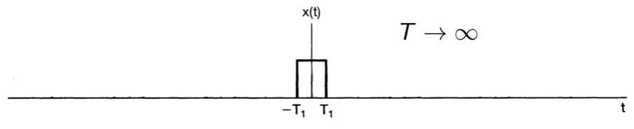
定义$sinc(x) = \frac{sin(\pi x)}{\pi x}$

$$
    X(j\omega) = \frac{2sin(\omega T_1)}{\omega} = 2T_1sinc(\frac{\omega T_1}{\pi})
$$


## 4.2 Fourier Transform for Periodic Signal 周期信号的傅里叶变换

$$
x(t) \stackrel{FS}{\longleftrightarrow} a_k 
\text{ }\Rightarrow \text{ }
X(j\omega) = \sum_{k=-\infty}^{\infty} 2\pi \cdot a_k \cdot \delta(\omega - k\omega_0)
$$

## 4.3 Properties of Fourier Transform 连续时间傅里叶变换的性质

Notation:

$$
X(j\omega) = \mathcal{F}\{ x(t) \} 
\text{ or }
x(t) \stackrel{FT}{\longleftrightarrow} X(j\omega)
$$

1. **Linearity:**  $ax(t) + by(t) \stackrel{FT}{\longleftrightarrow} aX(j\omega) + bY(j\omega)$
2. **Time-shift:** $x(t-t_0) \stackrel{FT}{\longleftrightarrow} e^{-j\omega t_0} X(j\omega)$
3. **Conjugation:** $x^{*}(t) \stackrel{FT}{\longleftrightarrow} X^{*}(-j\omega)$
   
   **Conjugation symmetry:** if $x(t)$ is real, $X(-j\omega) = X^{*}(j\omega)$

   **If** $x(t)$ is real and even, $X(j\omega)$ is also real and even.

   **If** $x(t)$ is real and odd, $X(j\omega)$ is purely imaginary and odd.

4. **Differentiation & Integration**: 
   
   $$
    \frac{dx(t)}{dt} \stackrel{FT}{\longleftrightarrow} j\omega X(j\omega)
   $$
   $$
   \int_{-\infty}^{t} x(\tau) d\tau \stackrel{FT}{\longleftrightarrow} \frac{1}{j\omega} X(j\omega) + \pi X(0) \delta(\omega)
   $$

5. **Time and Frequency Scaling**:

    $$
    x(at) \stackrel{FT}{\longleftrightarrow} \frac{1}{\lvert a\rvert} X(\frac{j\omega}{a})
    $$

    $$
    x(-t) \stackrel{FT}{\longleftrightarrow} X(-j\omega)
    $$

6. **Duality:** $\mathcal{F}\{ \mathcal{F} \{ x(t) \} \} = 2\pi x(-t)$
7. **Parseval's Relation:** $\int_{-\infty}^{\infty} \lvert x(t) \rvert^2 dt = \frac{1}{2\pi} \int_{-\infty}^{\infty} \lvert X(j\omega) \rvert^2 d\omega$

## 4.4 Convolution Property 卷积性质

$$
y(t) = x(t) * h(t) \stackrel{FT}{\longleftrightarrow}
Y(j\omega) = H(j\omega) \cdot X(j\omega)
$$

## 4.5 Multiplication 相乘性质

Multiplication in time $\stackrel{FT}{\longleftrightarrow}$ Convolution in frequency

时间域上的相乘，等于频域上的卷积

$$
r(t) = s(t) p(t) \stackrel{FT}{\longleftrightarrow} 
R(j\omega) = \frac{1}{2\pi} \left[ S(j\omega) * P(j \omega) \right]
$$



## 4.6 CTFT pairs

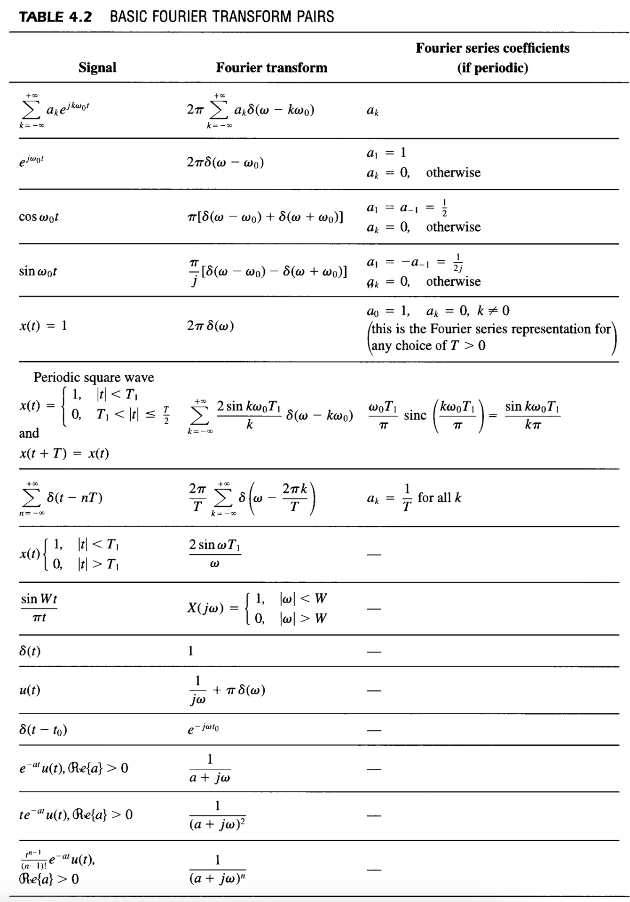



# Part 5. DTFT 离散时间傅里叶变换

## 5.1 DT fourier transform

- **DTFT**
  $$
    X(e^{j\omega}) = \sum_{n=-\infty}^{\infty} x[n] e^{-j\omega n}
  $$

  $X(e^{j\omega})$ is periodic with period $2\pi$.

- **Inverse DTFT**
  $$
    x[n] = \frac{1}{2\pi} \int_{-\pi}^{\pi} X(e^{j\omega}) e^{j\omega n} d\omega
  $$

Convergence Issues of DTFT 收敛性条件
1. $x[n]$ is absolutely summable 绝对可和: $\sum_{-\infty}^{\infty} \lvert x[n] \rvert < \infty$
2. **OR** $x[n]$ has finite energy 有限能量: $\sum_{-\infty}^{\infty} \lvert x[n] \rvert^2 < \infty$

## 5.2 DTFT for periodic signals

$$
    x[n] \stackrel{FS}{\longleftrightarrow} a_k 
    \text{ }\Rightarrow \text{ }
    X(e^{j\omega}) = \sum_{-\infty}^{\infty} 2\pi a_k \delta(\omega - \frac{2\pi k}{N})
$$

## 5.3 Properties of DTFT

Notation:

$$
x[n] \stackrel{FT}{\longleftrightarrow} X(e^{j\omega})
$$

1. **Periodicity**: DTFT is always periodic in $\omega$ with period $2\pi$, $X(e^{j(\omega+2\pi)}) = X(e^{j\omega})$
   
2. **Linearity**: $ax_1[n] + bx_2[n] \stackrel{FT}{\longleftrightarrow} aX_1(e^{j\omega}) + bX_2(e^{j\omega})$
   
3. **Time shifting**: $x[n-n_0] \stackrel{FT}{\longleftrightarrow} e^{-j\omega n_0} X(e^{j\omega})$
   
4. **Frequency shifting**: $e^{j\omega_0 n} x[n] \stackrel{FT}{\longleftrightarrow} X(e^{j(\omega - \omega_0)})$
   
5. **Conjugation and conjugate symmetry**: $X^*[n] \stackrel{FT}{\longleftrightarrow} X^* (e^{-j\omega})$
   
   **If** $x[n]$ is real, then $X(e^{j\omega}) = X^*(e^{-j\omega})$

6. **Differencing**: $x[n] - x[n-1] \stackrel{FT}{\longleftrightarrow} (1 - e^{-j\omega}) X(e^{j\omega})$

7. **Accumulation**: $y[n] = \sum_{m=-\infty}^{n} x[m]$, 
   
   $$
    \sum_{m=-\infty}^{n} x[m] \stackrel{FT}{\longleftrightarrow} \frac{1}{1-e^{-j\omega}} X(e^{j\omega}) + \pi X(e^{j0}) \sum_{k=-\infty}^{\infty} \delta(\omega - 2\pi k)
   $$

8. **Time reversal**: $x[-n] \stackrel{FT}{\longleftrightarrow} X(e^{-j\omega})$

9. **Differentiation in frequency**: $nx[n] \stackrel{FT}{\longleftrightarrow} j \frac{dX(e^{j\omega})}{d\omega}$
   
10. **Parseval**: $\sum_{n=-\infty}^{\infty} \lvert x[n] \rvert^2 = \frac{1}{2\pi} \int_{2\pi} \lvert X(e^{j\omega}) \rvert^2 d\omega$

11. **Time expansion**: $x_{(k)} [n] \stackrel{FT}{\longleftrightarrow} X(e^{jk \omega})$

## 5.4 Convolution Property

$$
y[n] = x[n] * h[n]  
\stackrel{FT}{\longleftrightarrow}
Y(e^{j\omega}) = X(e^{j\omega}) H(e^{j\omega})
$$

## 5.5 Multiplication Property

$$
y[n] = x[n] \cdot h[n]
\stackrel{FT}{\longleftrightarrow}
Y(e^{jv}) = \frac{1}{2\pi} \int_{-\pi}^{\pi} X(e^{j\omega}) H(e^{j(v-\omega)}) d\omega
$$

## 5.7 Duality 对偶性

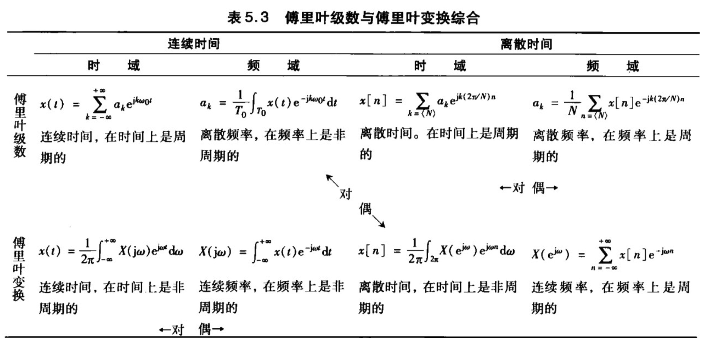



## 5.6 DTFT pairs

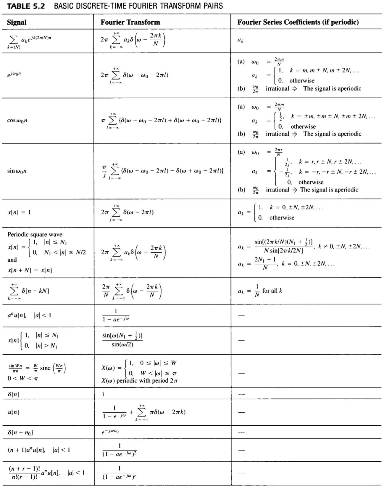



# Part 6 Time & Freq characterization of signals and systems

To be continued....

# Part 7. Sampling

## 7.1 用信号样本表示连续时间信号:采样定理

### 7.1.1 Impulse-Train Sampling 冲激串采样

- **Sampling function**: $p(t) = \sum_{n=-\infty}^{\infty} \delta(t-nT)$
- **Sampling period**: $T$
- **Sampling frequency**: $\frac{2\pi}{T}$

$$
    x_p(t) = x(t) p(t) = \sum_{n=-\infty}^{\infty} x(nT) \delta(t - nT)
$$

$$
X_p(j\omega) = \frac{1}{2\pi} \left[ X(j\omega) * P(j\omega) \right]
= \frac{1}{T} \sum_{k=-\infty}^{\infty} X(j(\omega - k\omega_s))
$$

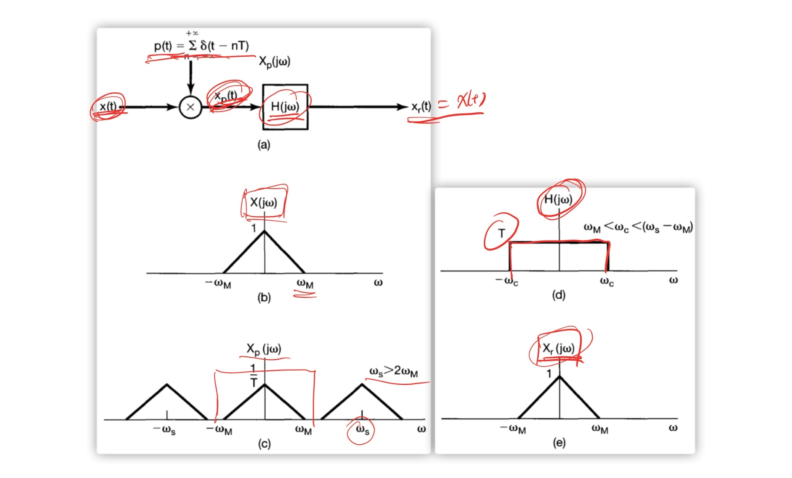

**Sampling Theorem**: 

- Let $x(t)$ be a band-limited signal with $X(j\omega) = 0$ for $\lvert \omega \rvert > \omega_M$. Then $x(t)$ is uniquely determined by its samples $x(nT)$ if $\omega_s > 2\omega_M$, where $\omega_s = \frac{2\pi}{T}$
  
- **Nyquist rate 奈奎斯特率**: $2\omega_M$

### 7.1.2 Zero-order Hold Sampling 零阶保持采样

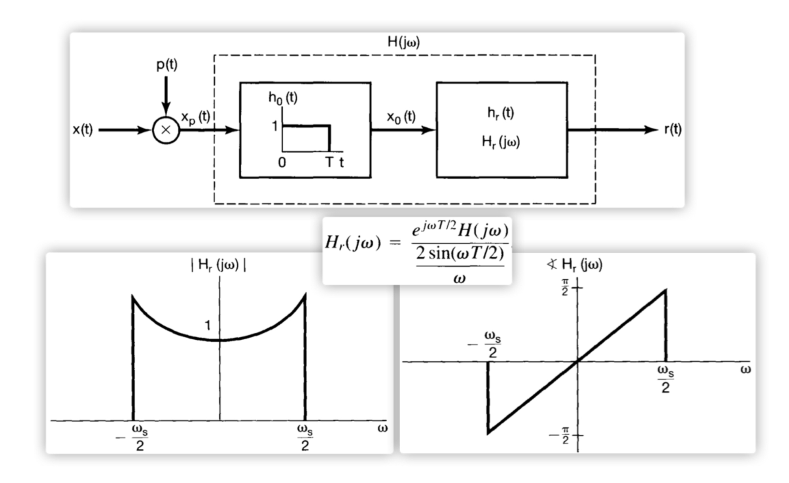

## 7.2 Signal reconstruction using Interpolation 利用内插重建信号

To be continued...

## 7.3 Effect of Undersampling: Aliasing 混叠

## 7.4 Discrete-Time Processing of Continous-Time Signals

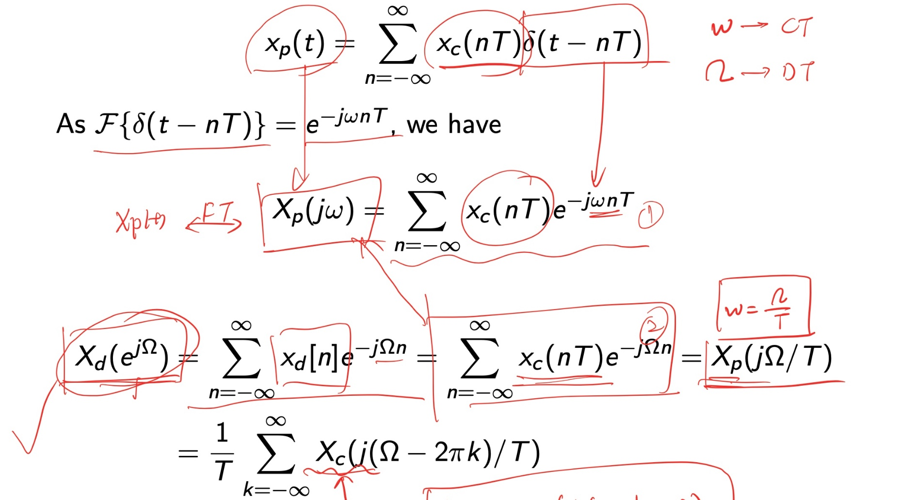

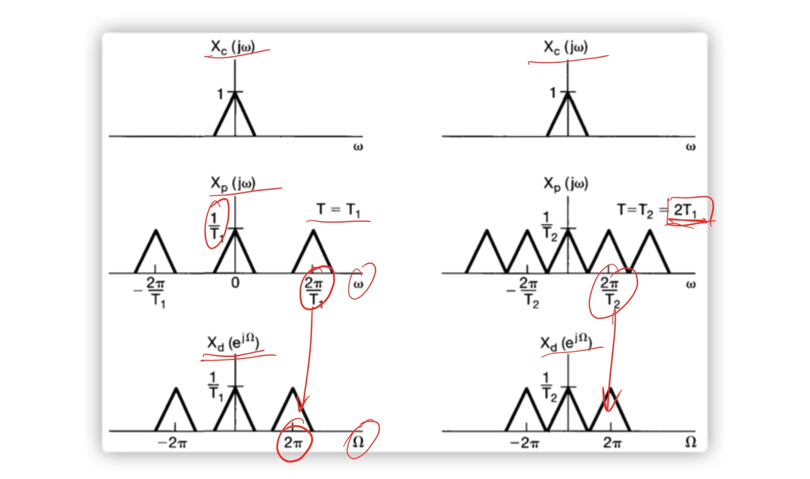

# Part 8. The Laplace Transform (LT)

## 8.1 Laplace transform

- Eigenfunction $e^{st}$:  $H(s) = \int_{-\infty}^{\infty} h(\tau) e^{-s\tau} d\tau$
  
- **Laplace Transform (LT)** of $x(t)$: complex $s=\sigma + j\omega$
  $$
    x(t) \stackrel{\mathcal{L}}{\longleftrightarrow}
    X(s) = \int_{-\infty}^{\infty} x(t) e^{-st} dt
  $$

- $$
    X(s) = FT\{x(t)e^{-\sigma t} \}
  $$

- $$
    X(s) \vert_{s=j\omega} = FT\{x(t)\}
  $$

## 8.2 Region of Convergence (ROC)

- Region of (conditional) convergence 条件收敛: region of $s$ for which 
  $\int_{-\infty}^{\infty} x(t) e^{-st}dt$ converges.

- Region of (absolute) convergence 绝对收敛: region of $s$ for which 
  $\int_{-\infty}^{\infty} \lvert x(t) e^{-st}\rvert dt$ converges. 

- 通常使用绝对收敛域

### Properties of ROC

1. ROC consists of strips parallel to the $j\omega$-axis.

2. ROC of rational $X(s)$ does not contain any pole.

3. If $x(t)$ is of finite duration and absolutely integrable, then ROC is the entire s-plane.

4. If $x(t)$ is right-sided, and if a line $Re(s) = \sigma_0$ is in ROC, then ROC contains all $s$ such that $Re(s) \geq \sigma_0$.

5. If $x(t)$ is left-sided, and if a line $Re(s) = \sigma_0$ is in ROC, then ROC contains all $s$ such that $Re(s) \leq \sigma_0$.

6. If $x(t)$ is two-sided, ROC is a strip (can be empty).

7. Rational $X(s)$, ROC is bounded by poles or extends to infinity.

8. (1). If $x(t)$ right-sided and $X(s)$ rational, then ROC is the region to the right of the rightmost pole

    (2). If $x(t)$ left-sided and $X(s)$ rational, then ROC is the region to the left of the leftmost pole

    (3). If $x(t)$ two-sided and $X(s)$ rational, then ROC is a strip between two consecutive poles.

## 8.3 Inverse LT

$$
    x(t) = \frac{1}{2\pi j} \int_{\sigma - j \infty}^{\sigma + j \infty} X(s) e^{st} ds
$$

## 8.5 Properties of LT

| Property     | Signal                | LT                   | ROC                |
| ------------ | --------------------- | -------------------- | ------------------ |
| Linearity    | $a x_1(t) + b x_2(t)$ | $a X_1(s) + bX_2(s)$ | at least $R_1 \cap R_2$ |
| Time-shift   | $x(t-t_0)$            | $e^{-s t_0} X(s)$    | $R$                |
| Shift in $s$ | $e^{s_0 t}x(t)$                      |     $X(s-s_0) $                 | $R + Re(s_0)$ |
| Time scaling | $x(at)$ | $\frac{1}{\lvert a \rvert} X(\frac{s}{a})$ | $aR$ |
| Time reversal | $x(-t)$ | $X(-s)$ | $-R$ |
| Conjugation | $x^*(t)$ | $X^*(s^*)$ | $R$ |
| Convolution | $x_1(t) * x_2(t)$ | $X_1(s) X_2(s)$ | at least $R_1 \cap R_2$ |
| Differentiation in $t$ | $\frac{dx(t)}{dt}$ | $sX(s)$ | at least $R$ |
| Differentiation in $s$ | $-tx(t)$ | $\frac{dX(s)}{ds}$ | $R$ |
| Integration in $t$ | $\int_{-\infty}^{t} x(\tau) d\tau$ | $\frac{1}{s}X(s)$ | at least $R \cap \{  Re(s) > 0 \}$ |

If $x(t) < 0$ for $t<0$ and $x(t)$在$t=0$不包括任何冲激或高阶奇异函数，

**Initial-value theorem**: $x(0^+) = \lim_{s\to\infty} sX(s)$

**Final-value theorem**: $\lim_{t\to\infty} x(t) = \lim_{s\to 0} X(s)$

### Unilateral LT

ROC for a unilateral LT must be a right-half plane, hence ROC is usually omitted.

$$
    ULT\{x(t)\} = LT\{ x(t) u(t) \}
$$

### Properties of Unilateral LT

$$
    \frac{d}{dt} x(t) \stackrel{\mathcal{L}}{\longleftrightarrow} sX(s) - x(0^{-})
$$
$$
    \frac{d^n}{dt^n} x(t)\stackrel{\mathcal{L}}{\longleftrightarrow}
    s^n X(s) - \sum_{r=0}^{n-1} s^{n-r-1} x^{(r)}(0^{-})
$$



## 8.6 Some LT pairs

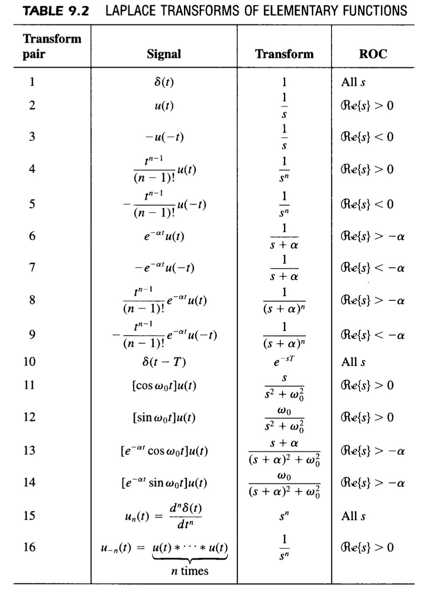



## 8.7 LTI system and system function

### 8.7.1 Casuality

For an LTI system, $y(t) = x(t) * h(t)$, $Y(s) = X(s) \cdot H(s)$

**LTI system with $H(s)$**:  Casual $\Rightarrow$ ROC is a right-half plane.

**LTI system with rational H(s)**:  Casual $\Leftrightarrow$ ROC to the right of the rightmost pole

### 8.7.2 Stability

**LTI system with $H(s)$**: Stable $\Leftrightarrow$ ROC includes $j\omega$-axis

**LTI system with rational H(s)**: Casual and stable if and only if all poles lie in the left-half of the s-plane.

### 8.7.3 LTI system characterized by LCC differential Eqn

To be continued.

# Part 9. Z transform

## Z

$$
    X(z) = \sum_{n=-\infty}^{\infty} x[n] z^{-n} 
$$

- $$
    X(z) = FT\{x[n] r^{-n}\}
    $$
- $$
    X(z) \lvert_{z=e^{j\omega}} = FT\{x[n]\}
    $$

- ROC: The set of $z$ such that $\sum_{n=-\infty}^{\infty} \lvert x[n] z^{n} \rvert$ converges

### Properties of ROC

1. ROC is a ring in the z-plane centered about origin
   
2. ROC does not contain any pole.
   
3. If $x[n]$ has finite duration, then ROC is the entire z-plane, except possibly $z=0$ and/or $z=\infty$
   
4. (1) If $x[n]$ is right-sided, and if $\lvert z\rvert = r_0$ is in ROC, then all finite values $\lvert z\rvert \geq r_0$ will also be in the ROC.
   
   (2) If $x[n]$ is right-sided, then ROC takes the form $c < \lvert z \rvert < \infty$.

5. (1)If $x[n]$ is left-sided, and if $\lvert z\rvert = r_0$ is in ROC, then all finite values $\lvert z\rvert \leq r_0$ will also be in the ROC.
   
   (2) If $x[n]$ is left-sided, then ROC takes the form $0 < \lvert z \rvert < c$.

6. (1) If $x[n]$ is two-sided, and if $\lvert z\rvert = r_0$ is in ROC, then ROC is a ring that includes $\lvert z\rvert = r_0$.
   
   (2) If $x[n]$ is two-sided, then ROC takes the form $c_1 < \lvert z \rvert < c_2$.

7. If $X(z)$ is rational, then ROC is bounded by poles or extends to infinity.

8.  (1) If $x[n]$ is right-sided and $X(z)$ is rational, then ROC is outside the outermost finite pole (may not include $z=\infty$). 
    
    Especially, if $x[n]$ is casual, then ROC contains $z=\infty$

    (2) If $x[n]$ is left-sided and $X(z)$ is rational, then ROC is inside the innermost nonzero pole (may not include $z=0$).

    Especially, if $x[n]$ is anticasual, then ROC contains $z=0$

    (3) If $x[n]$ is two-sided and $X(z)$ is rational, then ROC is a ring between two consecutive poles.



## Properties of ZT

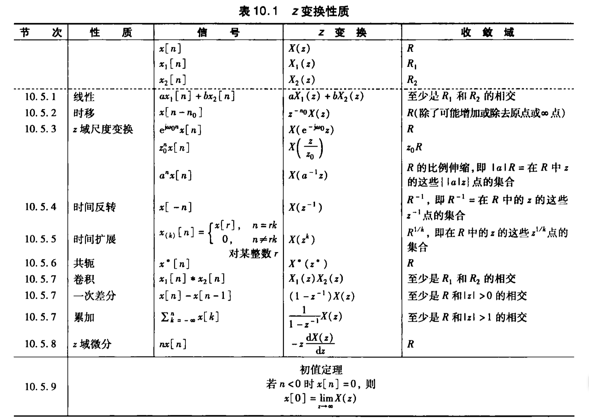





## ZT pairs

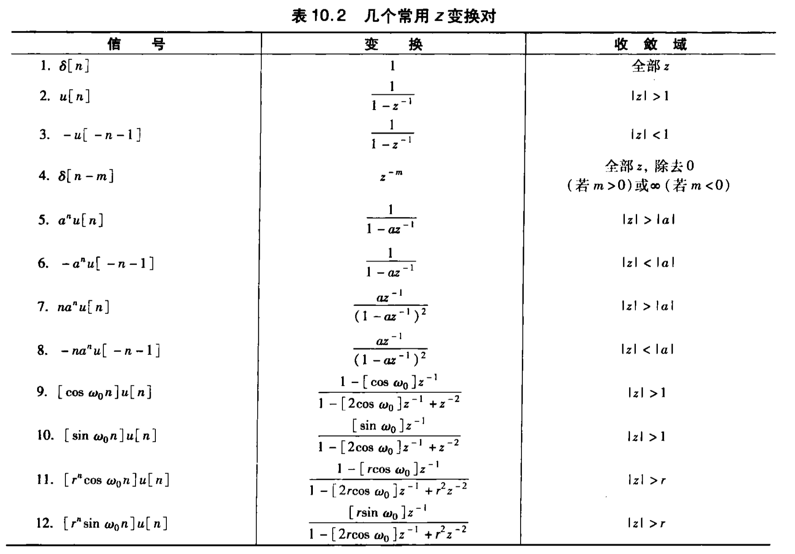

