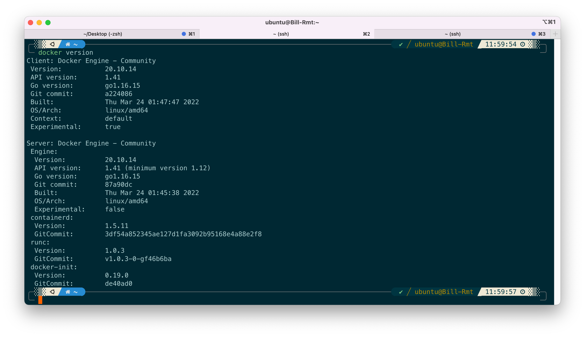
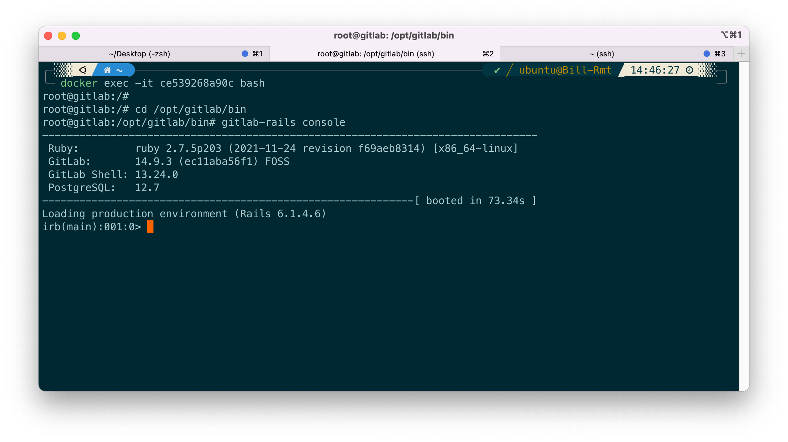
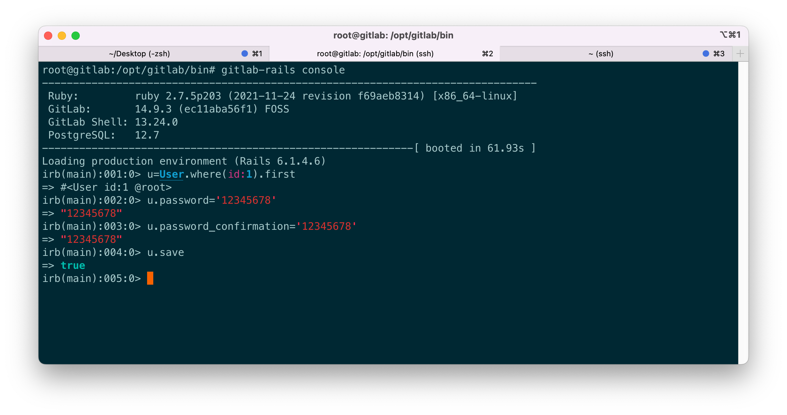

## Docker official website and docs

[https://docs.docker.com](https://docs.docker.com)

## Install docker

There're several ways to install docker. You can install it via `apt`, or a `deb` file, or the script.

### Install using the convenience script

```
curl -fsSL https://get.docker.com -o get-docker.sh
sudo sh get-docker.sh
```


To use Aliyun mirror, execute `sudo sh get-docker.sh --mirror Aliyun`


Wait until the installation finishes. On debian or ubuntu, the docker service is automatically started after the installation. To make it start at system boot, use the following;

```
sudo systemctl enable docker.service
sudo systemctl enable containerd.service
```

### (Optional) Manage docker as a non-root user

The docker daemon requires to be run as root because it binds a Unix socket instead of a TCP port, which is only owned by user root. That's why the installation script and docker itself needs to be executed by `sudo`. If you don't want to preface the docker command with sudo, you can create a usergroup called docker and add users to it.

```
sudo groupadd docker
sudo usermod -aG docker $USER
```

Log out and log in to make sure the group membership is re-evaluated. You can also try `newgrp docker` to activate the changes to groups.

### 换国内源

首先执行以下命令，查看是否在 docker.service 文件中配置过镜像地址

```shell
sudo systemctl cat docker | grep '\-\-registry\-mirror'
```

如果有输出，执行 `sudo systemctl cat docker` 查看 `ExecStart=` 出现的位置，修改对应的文件内容去掉 `--registry-mirror` 参数及其值。

如果没有输出，在 `/etc/docker/daemon.json` 中写入以下内容

```json
{
  "registry-mirrors": [
    "https://hub-mirror.c.163.com",
    "https://mirror.baidubce.com"
  ]
}
```

然后重新启动docker服务

```shell
sudo systemctl daemon-reload
sudo systemctl restart docker
```

### Verify that docker is installed and functioning 

```
docker --version
```
The output should look similar to 



Then, 
```
docker run hello-world
```

If you see the output of hello-world, the docker is functioning well. This command does the following steps:

- First, check if you have an image called `hello-world` locally. No local image was found. 
- Then it looks the docker hub (the default source is 'hub.docker.com') to see if there's an online image called `hello-world`. It found that image, and pull (download) it, equivalent to `docker pull hello-world`.
- Finally it starts a container with the image, and the executable files inside the container produces the output what you see on the terminal screen.

### Install gitlab using docker

**Step1**: pull gitlab's docker image

```
docker pull gitlab/gitlab-ce
```
**Step2**: run gitlab

```
docker run --detach \
  --hostname gitlab.example.com \
  --publish 443:443 --publish 80:80 --publish 22:22 \
  --name gitlab \
  --restart always \
  --volume /srv/gitlab/config:/etc/gitlab \
  --volume /srv/gitlab/logs:/var/log/gitlab \
  --volume /srv/gitlab/data:/var/opt/gitlab \
  gitlab/gitlab-ce:latest
```

The meaning of the command is as follows:

- `--name gitlab `: the container name 
- `--restart always`: always let the container running, to let the container start at system boot
- `--publish 443:443 --publish 80:80 --publish 22:22`: Map network ports
    You may want to use another port than 80, 443, as it might be occupied by another service like nginx or apache. Change to `--publish HOST_PORT:CONTAINER_PORT` to map port HOST_PORT of the host to CONTAINER_PORT in the container (e.g. `--publish 20080:80`).
- `--volume /srv/gitlab/config:/etc/gitlab`: map gitlab config, log, and data directories
- `gitlab/gitlab-ce:latest`: the image you need to run

**Step3**: Check the container status 

Use
```
docker container ls
```
to list all containers, which should have the gitlab container you have just created. The status `starting` means it is initializing. Wait it until the status become `healthy`.

After the initialization is complete, visit `http://your_ip:HOST_PORT` and you should see the gitlab login page.

**Step 4**: Modify user root's password

The default (and the admin) user is 'root' in gitlab, and the default password is a randomly generated long string. We have to go into the gitlab container and modify the password.

Use `docker ps` to see the gitlab container ID, and use (replace `ce539268a90c` with the container ID)
```
docker exec -it ce539268a90c bash
```
to enter the terminal of the container.

Then, inside the container, execute
```sh
cd /opt/gitlab/bin
gitlab-rails console  # this may take some time
```
and you should see the following


After that, find the root user by entering
```
u=User.where(id:1).first
```
and change its password by entering
```sql
u.password='12345678'
u.password_confirmation='12345678'
u.save
```
and the password is changed.


