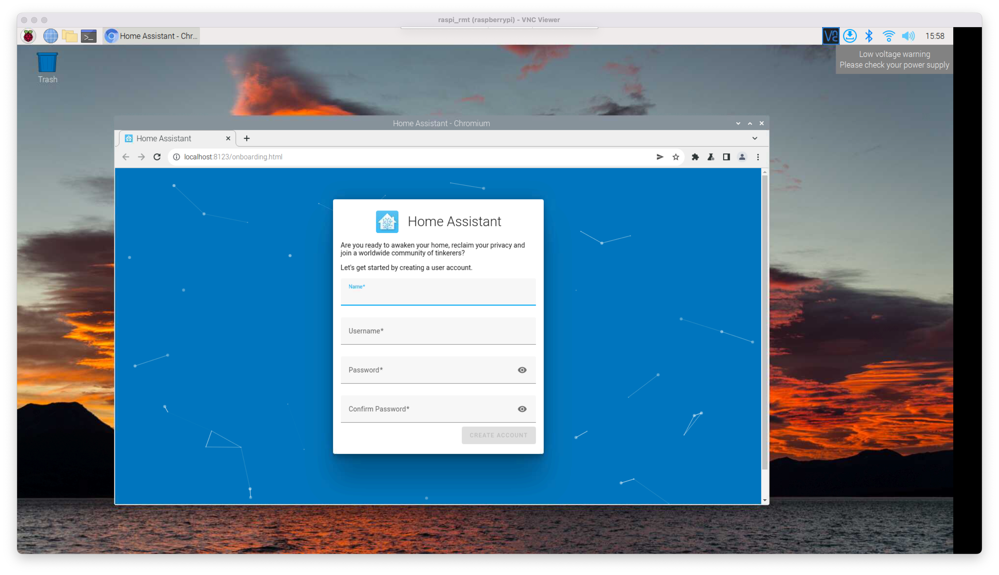

## Installation (using pyenv)

### Step1. Create a pyenv

First, we need to make sure `python3` is installed. It's recommended to set the pip registery to a domestic source.

```sh
pip config set global.index-url https://pypi.tuna.tsinghua.edu.cn/simple
```

Then, create a python3 virtual environment, or `pyenv`, at `/opt/homeassistant`

```sh
sudo mkdir -p /opt/homeassistant
sudo chown pi:pi /opt/homeassistant
cd /opt/homeassistant/
python3 -m venv .       # create venv (may take some time)
```

### Step2. Enter pyenv and install homeassistant

We can enter into the venv by 

```sh
source ./bin/activate
```

If you use 'oh-my-zsh', you can see a prefix named `(homeassistant)` in the interactive shell.

Then, inside the venv, execute

```sh
cd /opt/homeassistant/
pip3 install homeassistant
source /opt/homeassistant/bin/activate
```

The above may take some time, depending on your network condition.

After that, execute `hass` to start homeassistant service. It may take tremendous time at first executation. On raspi 3B, it takes about 20 to 30 minutes.

```sh
hass
```


You can visit `homeassistant.local` or  `<IP>:8123` (replace `<IP>` with your raspberry pi's ip addr), and wait until the homeassistant welcome page appears.



### Step3. Autostart

```sh
sudo vim /etc/systemd/system/homeassistant.service
```

Inside it, enter the following:

```ini
[Unit]
Description=Home Assistant
After=network-online.target

[Service]
Type=simple
User=pi
ExecStart=/opt/homeassistant/bin/hass -c "/home/pi/.homeassistant"

[Install]
WantedBy=multi-user.target
```

Save and exit, and then

```sh
sudo systemctl enable homeassistant
sudo systemctl start homeassistant
```


## Install HACS

### Step1. Download hacs plugin from github

The github address is [https://github.com/hacs/integration/releases/tag/1.24.5](https://github.com/hacs/integration/releases/tag/1.24.5)

Make two folders `custom_components` and `www` inside the homeassistant's root folder

```sh
cd ~/.homeassistant
mkdir custom_components
mkdir www
cd custom_components
mkdir hacs
```

And extract the hacs you downloaded to the `custom_components/hacs` folder.

Restart the homeassistant service, and you should see 'HACS' in the left sidebar. 

You may need to authorize github for the first time you launch HACS.


> Reference:
>
> https://post.smzdm.com/p/av7z7mvm/
>
> https://zhuanlan.zhihu.com/p/341394317
