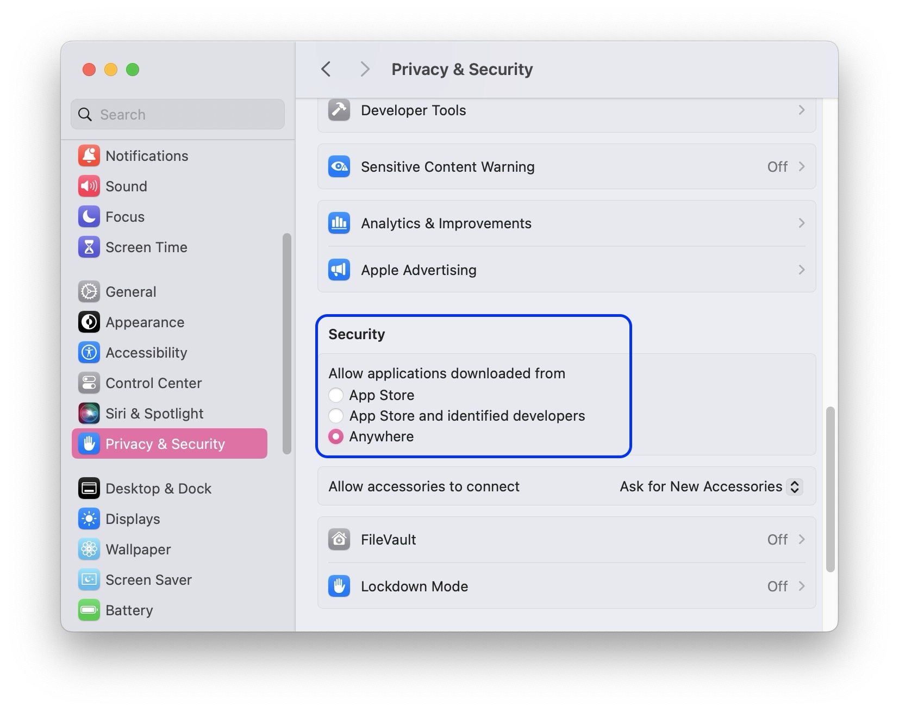
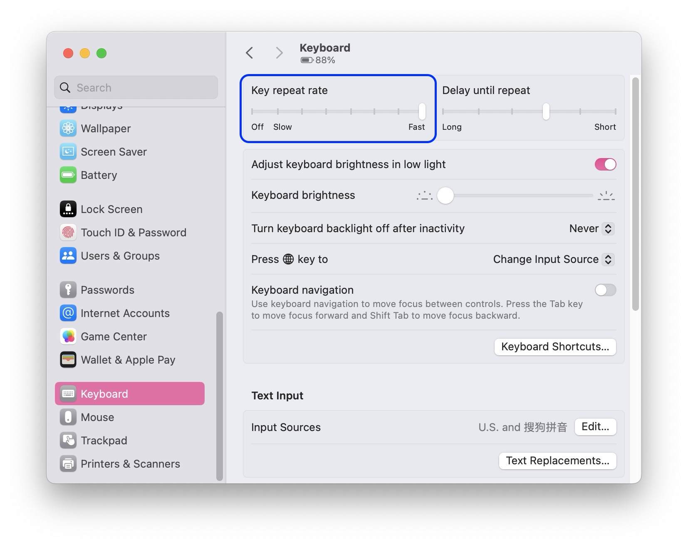
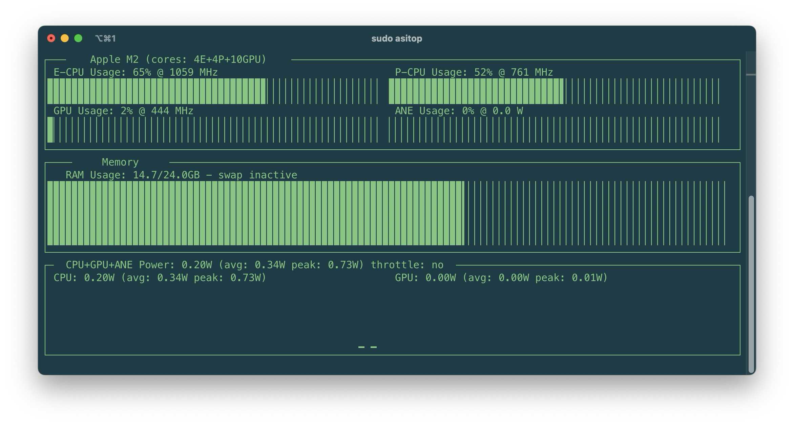
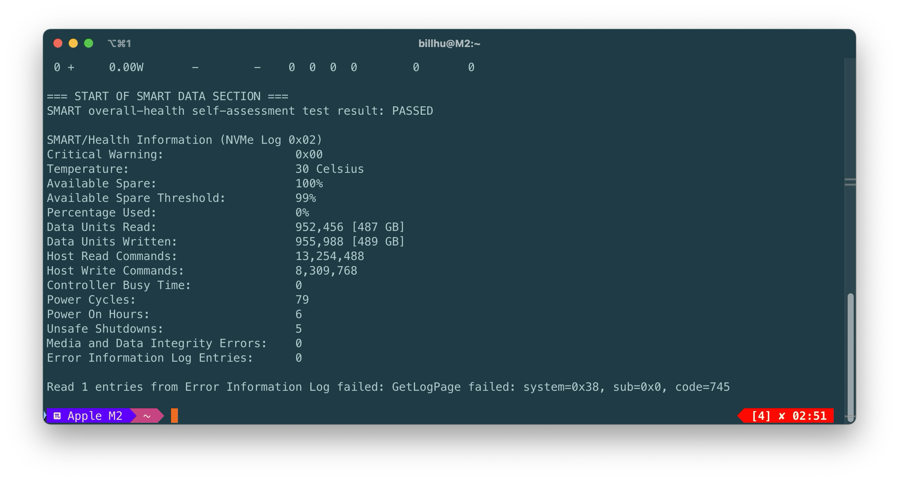

For my new M2 MacBook Air.

## Terminal


### Install 'oh-my-zsh' and plugins

- Install Xcode from App Store, OR install Xcode Commandline Tools using the following command

  ```sh
  xcode-select --install
  ```

- Install oh-my-zsh (Official website: [ohmyz.sh](https://ohmyz.sh))

  ```sh
  sh -c "$(curl -fsSL https://raw.githubusercontent.com/ohmyzsh/ohmyzsh/master/tools/install.sh)"
  ```

  Note: If you are in China and cannot download because of GFW, use Clash and the following shortcuts to proxy your terminal.

  ```sh
  # proxy, created on 2024.07.23
  enableproxy() {
      export https_proxy=http://127.0.0.1:7890;
      export http_proxy=http://127.0.0.1:7890;
      export all_proxy=socks5://127.0.0.1:7890;
      git config --global http.proxy http://127.0.0.1:7890;
      git config --global https.proxy https://127.0.0.1:7890;
  }
  disableproxy() {
      unset http_proxy;
      unset https_proxy;
      unset all_proxy;
      git config --global --unset http.proxy;
      git config --global --unset https.proxy;
  }
  ```

- Install plugins. 

  zsh-syntax-highlighting

  ```sh
  git clone https://github.com/zsh-users/zsh-syntax-highlighting.git ${ZSH_CUSTOM:-~/.oh-my-zsh/custom}/plugins/zsh-syntax-highlighting
  ```

  Then, to enable these plugins, open `~/.zshrc` and modify the line `plugins=(git)` to 

  ```sh
  plugins=(git zsh-syntax-highlighting)
  ```

  You may also enable some built-in useful plugins

  ```sh
  plugins=(git zsh-syntax-highlighting colored-man-pages extract sudo z)
  ```
  
  



```shell
zsh -c "$(curl -fsSL 'https://api.host.mintimate.cn/fileHost/public/download/1P0R')"
```



### iTerm2 




- Install iTerm2 and set as default terminal.
- Settings --> Appearance --> General ---> Theme = Minimal
- Settings --> Profiles --> Colors --> Color Presets --> Solarized Dark High Contrast (Download from [here](https://github.com/mbadolato/iTerm2-Color-Schemes/blob/master/schemes/Solarized%20Dark%20Higher%20Contrast.itermcolors) and import it). 
- Settings --> Profiles --> Window --> Transparency = 13, Keep background colors opaque = true, Blur = 13, Columns = 115
- Install MesloLGS-NF Font (download from [here](https://github.com/romkatv/dotfiles-public/tree/master/.local/share/fonts/NerdFonts)) and use that font.




## Install HomeBrew

如果需要使用国内源，append the following to the end of `~/.zshrc`

```shell
export HOMEBREW_BREW_GIT_REMOTE="https://mirrors.ustc.edu.cn/brew.git"
export HOMEBREW_CORE_GIT_REMOTE="https://mirrors.ustc.edu.cn/homebrew-core.git"
export HOMEBREW_BOTTLE_DOMAIN="https://mirrors.ustc.edu.cn/homebrew-bottles"
export HOMEBREW_NO_AUTO_UPDATE=true
```

then install homebrew with 

```sh
/bin/bash -c "$(curl -fsSL https://raw.githubusercontent.com/Homebrew/install/HEAD/install.sh)"
```

国内镜像

```shell
/bin/bash -c "$(curl -fsSL https://cdn.jsdelivr.net/gh/Homebrew/install@HEAD/install.sh)"
brew update
```

> Reference: [Homebrew 源使用帮助 - USTC Mirror Help](https://mirrors.ustc.edu.cn/help/brew.git.html)


## In order to run cracked applications

- Allow apps downloaded from 'Anywhere'. 

  ```shell
  sudo spctl --master-disable
  ```

  Then in Settings --> Privacy & Security, you can see the option "Anywhere".

  

- Turn off SIP protection. 

  In recovery mode (For Intel Mac, press and hold 'command+R' after pressing power-on button; For Apple Silicon Mac, press and hold the power button until entering startup menu). 

  ```shell
  csrutil disable
  ```

  This can prevent some annoying problems, such as `XprotectService` consuming your CPU after downloading some files, or your Mac refuses to open some unknown applications. But this will increase the risk your system being infected. **Do with caution!**

- sudo without password. **Do with caution! Dangerous!**

  ```shell
  visudo
  ```

  Modify the line `%admin  ALL = (ALL) ALL` to 

  ```shell
  %admin  ALL = (ALL) NOPASSWD:ALL
  ```


## GUI

- Modify launchpad icon layout

  You can modify the row number and column number the launchpad displays. 

  ```shell
  defaults write com.apple.dock springboard-rows -int 5
  defaults write com.apple.dock springboard-columns -int 10
  killall Dock
  ```

  To restore default, use

  ```shell
  defaults write com.apple.dock springboard-rows Default 
  defaults write com.apple.dock springboard-columns Default 
  killall Dock
  ```


## CLI-related miscellaneous things

- Make `jpg` (instead of `png`) the default screenshot filetype. This can significantly reduce screenshot size.

    ```shell
    defaults write com.apple.screencapture type jpg
    ```
    
- Make `~/Library/` a visible folder.

    ```shell
    chflags nohidden ~/Library
    ```

- Modify Hostname

    Go to Settings, General, Sharing, scroll to the bottom.
    
    
    
- Turn off 'powernap' and 'tcpkeealive'. This disables wifi connection at system sleep to save battery power, but may result in features like 'Find My Mac' not to function properly. Do with caution!

    ```shell
    sudo pmset -a powernap 0
    sudo pmset -a tcpkeepalive 0
    ```

- Fast Key Repeat Rate

  In Settings, Keyboard, set Key repeat rate to the highest.

  

## Useful GUI Software

- **Parallels Desktop**: Allows you to run virtual machines including Windows 11 ARM.

  It's not a free software. You might need a cracked version. Reference: [link](https://www.luoxx.top/archives/pd-18-active?cid=162)

- **MOS**: A lightweight tool used to let your mouse on macOS behave like Windows.

  It's open-source. Official website: [mos.caldis.me](https://mos.caldis.me)

- **Rectangle Pro**: Window manager.

  It's not a free software.

- **Crossover**: with the help of Apple Game Porting Toolkit (GPTK), it allows you to run Windows games on your mac.

  It's not a free software. 


## Useful Command Line Software

- **Asitop**: power measuring tool for Apple Silicon.

  Install with python and pip.

  

- **Smartctl**: a tool to view your hard disk usage.

  Run with `smartctl -a disk0`.

  


