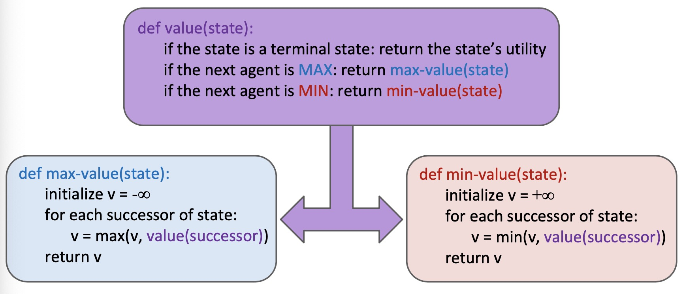
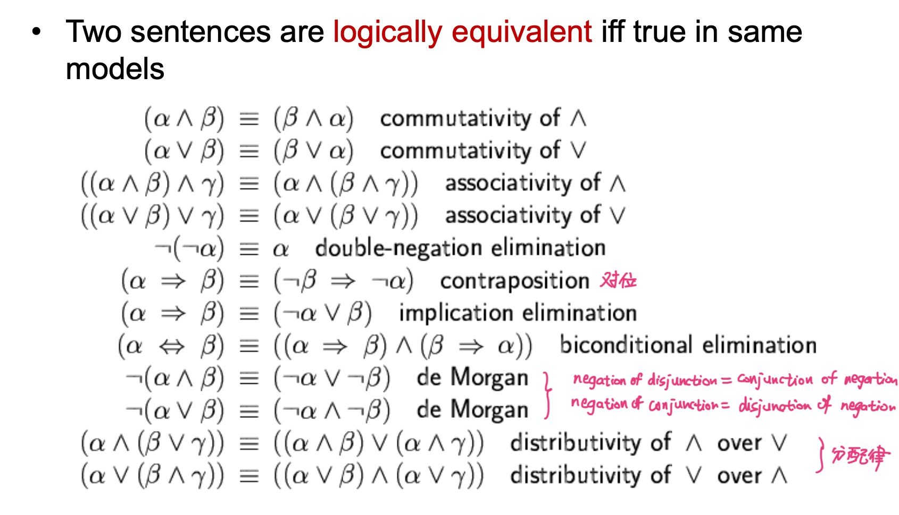
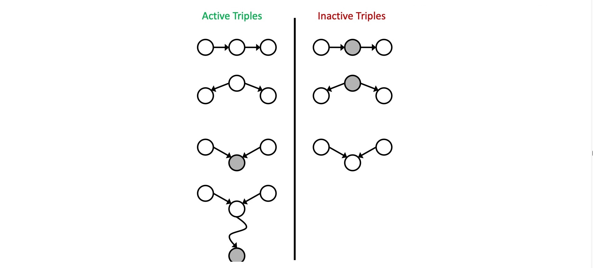

# Lecture 1. Intro

## Three types of approaches

### **1. Symbolism 符号**

Representing knowledge with: **symbols and their compositions (expressions)**. 用离散符号的组合表示knowledge.

Inference and learning: manipulating symbols.

Advantages: expressive; interpretable; rigorous. 表达能力强; 可解释,人可读; 有严密数理逻辑基础

Disadvantages: hard to learn; rigid. 难以学习; 脆弱.

### **2. Connectionism 连接主义**

Representing knowledge with: **interconnected networks of simple units** (e.g. neural networks). 用大量简单计算单元的加权连接 (典型:神经网络)

Inference: follow the computation specified by the network.

Learning: optimization of connection weights.

Advantages: good performance; flexible. 表现好; 灵活

Disadvantages: black-box; data-hungry; hard to incorporate knowledge. 黑盒,人不可读,不可解释; 需大量训练数据; 难以融入先验知识

### **3. Statistical Approaches 基于统计的方法**

Representing knowledge with: probabilistic models.

Inference and learning: probabilistic inference.

Advantages: interpretable; rigorous; learnable. 可解释; 严密; 可学习.

Disadvantages: less expressive; less flexible. 表达能力不如符号; 灵活性不如连接主义.

## Course Overview

- Search
- Constraint satisfaction problems
- Game
- Propositional logic
- First-order predicate logic
- Probabilistic graphical models
- Probabilistic temporal models
- Probabilistic logics
- Markov decision processes
- Reinforcement learning
- Machine learning
- Introduction to natural language processing
- Introduction to computer vision

# Lecture 2. Search

## Search Problems

A Search problem consists of:

- A state space
- A successor function
- A start state and a goal test

**World state**: every detail of the environment

**Search state**: only the details needed for planning



$b$ is the branching factor (maximum number of child nodes).

$m$ is the max depth.

$s$ is the depth of the shallowest solution.

Num of nodes: $1 + b + b^2 + \cdots = O(b^m)$



## Depth-First Search

Strategy: **expand deepest node first**.

Implementation: Fringe (a **stack**).

Time: $O(b^m)$ if $m$ is finite

Space: $O(bm)$ (because only has siblings on path to root) 

Not complete (unless we prevent cycles).

Not optimal.

## Breadth-First Search

Strategy: **expand shallowest node first**.

Implementation: fringe (a **queue**).

Time: $O(b^s)$.

Space: $O(b^s)$.

Complete.

Optimal only if all costs are $1$.

## Iterative Deepening

Idea: get **DFS's space advantage** with **BFS's time advantage**.

Space: $O(bm)$

Time: $O(b^s)$

Complete and optimal (unit cost).

## Uniform Cost Search

Strategy: **expand cheapest node first**.

Implementation: fringe (a priority queue, priority = cumulative cost).

Complete and optimal, but slow.

## Greedy Search

Strategy: **expand a node with smallest heuristic** (estimate of distance to goal)

Fast, but not optimal, not complete.

## A* search

Combine UCS with Greedy.

Optimal when heuristic is **admissable** (heuristic cost $\leq$ actual cost).

时空复杂度不会比UCS差.

- **admissible**: 估计的cost小于实际cost
- **consistent**: 相邻节点的heuristic之差小于这两个节点的距离

Tree search: admissible 则最优

Graph search (避免重复visit): consistent 则最优

# Lecture 3. Constraint Satisfaction Problems 约束满足问题

## Two types of search problems

- Planning = standard search problems
- Identification = constraint satisfaction problems (CSPs)

## Backtracking Search 回溯搜索

Backtracking = DFS + variable-ordering + fail-on-violation

## Filtering: Forward checking

Keep track of domains for unassigned variables and cross off bad options.

## Filtering: constraint propagation

- **Node consistency (1)**: Each node has valid value.

  任何一个节点有可选值

- **Arc consistency (2)**: $X\to Y$ is **consistent** IFF for every $x$ in the tail there is some $y$ in the head which could be assigned without violating a constraint.

  $X\to Y$: 在X中随便选一个，Y仍然有得选

- **K-consistency**: For each $k$ nodes, any consistent assignment to $k-1$ can be extended to the $k^{th}$ node.

  对于任意$k$个点，不论$k-1$个点怎么选择，最后第$k$个点都有得选

- **Strong k-consistency**: also $k-1$, $k-2$, ..., $1$-consistent.

Claim: **Strong n-consistency** means we can **solve without backtracking**.

## Ordering: MRV (Min Remaining Value 最少剩余值)

Also called **Most constrainted variable**

Choose the variable with fewest legal left values in its domain

优先选择最少剩余量的选项 (选可选颜色数最少的点涂色)

## Ordering: LCV (Least Constraining Value 最少约束值)

Choose the least constraining value (variable that rules out the fewest values in the remaining values)

优先排除掉可能让邻居可选值最少的值，给相邻变量的赋值留下最大的灵活性   

## Tree-structured CSPs

Theorem: If the constraint graph has **no loops**, the CSP can be solved in $O(nd^2)$ time.

Algorithm:

1. Order: parents precede children
2. Remove backward: `for i in (n,2) removeInconsistent(Parent(Xi), i)`
3. Assign forward: `for i in (1,n) assign Xi consistently with Parent(Xi) `

## Nearly tree-structured CSPs

Cutset conditioning ?

# Lecture 4. Adversarial search

## Concepts

**Value** of a state: best achievable outcome (utility) from that state 能获得的最好成绩

**Minimax value**: best achievable utility against an optimal adversary 对手最优时可能获得的最好成绩

## Minimax search

- Compute each nodes's **minimax value**

- Implementation:

  

- Efficiency:

  Just like exhaustive DFS   （相当于彻底的DFS搜索）

  Time: $O(b^m)$, Space: $O(bm)$

## Depth-limited search (evalution functions)

- Search a limited depth.
- Replace terminal utilities with an **evaluation function** for non-terminal positions.
- **Ideal evalution function**: actual minimax value of the state
- **Simple evalution function**: weighted linear sum of features

- Idea: limit branching factor by considering only good moves

## Alpha-Beta pruning

- Implementation

  

- $\alpha$-$\beta$ pruning 受到展开顺序的影响

## Expectimax Search

- Compute average score under optimal play (expected utilities = weighted avg of children)

## Mixed layer types

- Enviroment is an extra agent. 
- E.g. You, a random ghost, and an optimal ghost

## Multi-Agent Utilities

- Multiple players. Each player takes care of only his utility.

# Lecture 5. Propositional Logic

## Logic-based Symbolic AI

- **Knowledge base**

  contains sentences representing knowledge

  domain-specific

- **Inference engine**

  can answer questions by following the knowledge base

  domain-independent

## Formal Language

Components of a formal language:

- **Syntax**: 语法
- **Semantics**: 语义  specifies the sentences is true/false in each model

## PL (propositional logic)

- **Negation**: $\neg S$
- **Conjunction**: $S1 \land S2$   (and)
- **Disjunction**: $S1 \lor S2$   (or)
- **Implication**:  $S1 \Rightarrow S2$
- **Biconditional**:  $S1 \Leftrightarrow S2$

## Logical equivalence

## Validity and satisfiability

- **valid**: true in all models
- **satisfiable**: true in some models
- **unsatisfiable**: false in all models

## Entailment

-  $\alpha \vert= \beta$  
-  $models(\alpha) \subseteq models(\beta)$  
-  In every world where $\alpha$ is true, $\beta$ is also true.
-  False entails everything.

## Proof of entailment

A proof $A |= B$ is a demonstration of entailment from $A$ to $B$.

- Method 1: **model checking** 模型检验

  ​	通过枚举所有可能得模型来检验。复杂度高。

- Method 2: **application of inference rules**

  - Search for a finite sequence of sentences each of which is an **axiom** or follows from preceding sentences by a rule of **inference**
    - **axiom**: 公理  a sentence known to be true
    - **rule of inference**: a function that takes one or more sentences (premises) and returns a sentence (conclusion)
  - **Sound inference**:  能证明出来的一定是entailed的
  - **Complete inference**:  entailed的一定能被证明出来
  - 对于 Horn logic, Resolution 是 sound 和 complete 的

## CNF (conjunctive normal form)

- conjunction of disjunctions of literals (clauses)
  - **literal**: a simple symbol or its negation:  $A$ or $\neg A$
  - **clause**: disjunction of literals :  $A\lor B$
  - **CNF**:  conjunction of literals:  $A \land B$

- conversion to CNF
  - 1: 把 $A\Leftrightarrow B$ 换成 $(A\Rightarrow B) \land (B\Rightarrow A)$
  - 2: 把 $A \Rightarrow B$ 换成  $\lnot A \lor B$
  - 3: 把 $\lnot (A\lor B)$换成 $\lnot A \land \lnot B$ ; $\lnot(A\land B)$ 换成 $\lnot A \lor \lnot B$
  - 4: 用分配律 ($\land$ over $\lor$) 

## Resolution

为了证明 $A|=B$, 我们去证明 $A \land \lnot B$ unsatisfiable.

- Step 1. Start from $A \land \lnot B$

- Step 2. Build a set $S$ of sub-formulas

  - Write $A \land \lnot B$ in CNF (写成 $P_1 \land P_2 \land \cdots \land P_k$ 形式)
  - Let $S = {P_1, \cdots, P_k}$

- Step 3. 对 $S$ 做 resolution: $(X\lor Y)\land (\lnot X \lor Z) \Rightarrow Y \lor Z$

  注: 不能说 $(X\lor Y)\land (\lnot X \lor Z) \equiv Y \lor Z$

- Reach an empty clause

## Horn Logic

普通 propositional logic 的 Inference 通常NPC复杂.

Horn logic 用 forward / backward chaining 可实现线性复杂度.

- **形式**: $P_1 \land P_2 \land \cdots \land P_n \Rightarrow Q$  或  $\lnot P_1 \lor \lnot P_2 \lor \cdots \lor \lnot P_n \Rightarrow Q$ 
- Modus Ponens (MP规则):  所有前提fixed, 则结论 fixed

- **Forward chaining**: 从facts入手, 加入新fact直到得到query
- **Backward chaining**: 从query入手, 为证明query找前提条件

Forward chaining 对于 PL, FOL, Horn Logic 都是 sound 和 complete 的.

Backward chaining 对于 PL, FOL 是 sound 但 incomplete 的, 对于Horn是complete的.

# Lecture 7. Bayesian Networks

- 概率

  条件概率: $P(a|b) = \frac{P(a, b)}{P(b)}$
  
  $p(y) p(x|y) = p(x,y)$
  
  Bayes rule: $p(x|y) = \frac{p(y|x) p(x)}{p(y)}$
  
  Chain rule: $p(a,b,c) = p(a) p(b|a) p(c|a,b)$

## Syntax

贝叶斯网络语法: 

- **DAG** (directed, acyclic graph) **有向无环图**
- **CPT (conditional probability table)**
- **CPT for each node** given its parents (每个节点存有 给定父节点的条件概率分布)

## Semantics

### Global semantics

所有CPT相乘

### Conditional independence semantics

给定父节点, 则该节点与非子孙节点独立

**Independence 符号**
$$
X \perp\!\!\!\perp Y | Z
$$

### Markov blanket

Markov blanket consists of **parents, children, children's other parents** (父,子,配偶) 

Every variable is conditionally independent of all other variables given its Markov blanket.

**给定markov blanket, 与所有其它变量条件独立**

**Common cause**: 给定父节点(cause), 两个child(effects)独立

**Common effect**: 给定子节点(effect), 两个父节点(cause)不独立 (v-structure)

### D-separation

If all paths from X to Y are blocked (at least 1 inactive triple), then X is d-separated from Y by Z ($X \perp\!\!\!\perp Y | Z$)

## Markov networks

undirected graph(无向图+clique全相连子图) + potentials 势函数(为每个clique的打分, 未经normalize, 不是概率)

- **Undirected graph + potential functions**
  - Undirected graph 无向图 
  - For each **clique** or **max clique**, a **potential function** is defined

- 联合概率 正比于 势函数乘积

  $$
  p(x) = \frac{1}{Z} \prod_C \psi _C (\mathbf{x}_C)\\
  
  Z = \sum_{\mathbf{x}} \prod_C \psi_C (\mathbf{x}_C)
  $$

  $\psi_C (\mathbf{x}_C)$ is the potential over clique $C$
  
  $Z$ is the **normalization coefficient** (**partition function**)

- **Conditional Independence** in Markov networks

  要判断$A\perp\!\!\!\perp B |C$, 只需判断从A到B的所有path是否都被C挡住了

- **Markov blanket**

  Markov blanket 就是这个节点的所有neighbor

## Bayesian networks inference

## Exact inference

### Inference by enumeration

CPT相乘得联合概率, sum out 掉 hidden variables 

- **Evidence** variables: $E_1, \cdots, E_k = e_1, \cdots, e_k$
- **Query** variable: $Q$   (我们想求: 给定$E$时$Q$的条件概率, 即 $P(Q|e_1, \cdots, e_k)$)
- **Hidden** variables: $H_1, \cdots, H_r$

Steps:

- Select the entries consistent with the evidence

- Sum out $H$ to get joint distribution of $Q$ and $E$

  $P(Q, e_1\cdots e_k) = \sum_{h1\cdots h_r} P(Q, h_1\cdots h_r, e_1\cdots e_k)$

- Normalize 

  $Z = \sum_q P(Q, e_1,\cdots e_k)$

  $P(Q|e_1\cdots e_k) = \frac{1}{Z} P(Q, e_1\cdots e_k)$

### Variable elimination

对每个 hidden variable 做 join and eliminate 

指数复杂度, 但当贝叶斯网络为 poly tree 时, 为线性复杂度

### Efficient inference on polytrees

## Approximate Inference

### Prior sampling

自顶向下采样

### Rejection sampling

当采样与evidence不一致时丢弃

### Likelihood weighting

只对non-evidence采样, 为每个样本计算weight (weight为所有evidence var条件概率的乘积)
$$
\mathrm{weight} = \sum_{\mathrm{evidences}} p(\mathrm{evidence} | \mathrm{parent\ of\ evidence})
$$

### Gibbs sampling

顺序采样, 每个样本由之前样本修改而来, 得到序列

-------

# Lecture 12. Probabilistic temporal models

## Markov models

(Assume discrete variables that share the same finite domain).

Values in the domain is called **states**.

The **transition model** $P(X_t|X_{t-1})$ specifies how the state evolves over time.

**Stationarity assumption**: same transition probabilities at all time steps.

**Markov assumption**: 给定$X_t$, $X_{t+1}, \cdots$ 与 $X_0, \cdots, X_{t-1}$ 条件独立

- 给定现在，过去与未来独立
- 每个时间点只与前一个有关
- **First-order Markov Model**
- A **k-th order model** allows dependencies on $k$ earlier steps

Joint distribution: $P(X_0, \cdots, X_t) = P(X_0) \prod_t P(X_t | X_{t-1})$

Markov models 是不是 Bayes nets 的特例? Yes and No.

- Yes: 有向无环图, 联合概率 = 条件概率乘积
- No: 无限多变量, 重复的transition model 不符合 标准Bayes net syntax.

## Forward algorithm

Given initial distribution $P(X_0)$
$$
\begin{aligned}
	P(X_t) &= \sum_{x_{t-1}} P(X_t, X_{t-1} = x_{t-1})\\
	&= \sum_{x_{t-1}} P(X_{t-1} = x_{t-1}) P(X_t|X_{t-1} = x_{t-1})
\end{aligned}
$$
递归更新

对于大多数markov chain, 最初的分布带来的影响越来越小, converge到的 stationary distribution 与最初分布无关.

**Stationary distribution**: $P_\infty(X)$
$$
P_{\infty}(X) = P_{\infty+1}(X) 
= \sum_x P(X|x) P_\infty (x)
$$

## Hidden markov models (HMM)

Only observe evidence $E$. Underlying markov chain over states $X$.

An HMM is defined by 

- **Initial distribution** $P(X_0)$
- **Transition model** $P(X_t | X_{t-1})$
- **Emission model** $P(E_t | X_t)$

Joint distribution
$$
P(X_0, \cdots, X_T, E_1, \cdots, E_T)
= P(X_0) \prod_{t=1}^T P(X_t|X_{t-1})P(E_t|X_t)
$$
Notation: $X_{a:b} = X_a, X_{a+1}, \cdots, X_b$

## Filtering

Infer current state given all evidence: $P(X_t | e_{1:t})$
$$
P(X_{t+1} | e_{1:t+1})
= \alpha \cdot P(e_{t+1}|X_{t+1})\cdot \sum_{x_t}P(X_t | e_{1:t})P(X_{t+1}|x_t)
$$
May skip normalization $\alpha$.

## Most likely explanation

$\arg\max_{X_{0:t}} P(X_{0:t}|e_{1:t})$

The product of weights on a path is proportional to that state sequence's probability.

**Viterbi algorithm**

For each state at time $t$, keep track of (unnormalized) maximum probability of any path to it.
$$
m_{1:t+1} = \text{Viterbi}(m_{1:t}, e_{t+1})
= P(e_{t+1}|X_{t+1})\max_{x_t}P(X_{t+1}|x_t)m_{1:t}[x_t]
$$
时间空间复杂度与 forward algorithm 相同.

## Dynamic Bayes Nets (DBNs)

Every HMM is a DBN.

Every discrete DBN can be represented by a HMM.

**Exact inference**: variable elimination

**Approximate inference** by particle filtering

propagate forward -> weight -> resample

# Lecture 13. Markov decision processes

## MDP

An MDP is defined by 

- **State** $S$
- **Actions** $A$
- **Transition function** $T(s,a,s')$  or  $P(s'|s,a)$ 
- **Reward function** $R(s,a,s')$  and  **discount** $\gamma$ 
- Start state, terminal state

MDPs are **non-deterministic** search problems. 

(In deterministic single-agent search problems, we want a **plan**, a sequence of actions)

For MDPs, we want an optimal **policy** $\pi^*: S \rightarrow A$

**utility**: sum of rewards

Optimal quantities

- **value / utility** of a **state** $s$

  $V^*(s)$ is the expected utility starting in $s$ and acting optimally

- **value / utility** of a **q-state** $(s,a)$

  $Q^*(s,a)$ = expected utility starting out having taken action $a$ from state $s$ and thereafter acting optimally

## Bellman equation

Value of states  (recursive definition)
$$
V^*(s) = \max_a Q^*(s,a)
$$

$$
Q^*(s,a) = \sum_{s'} T(s,a,s')\left[R(s,a,s') + \gamma V^*(s')\right]
$$

**Bellman equation**
$$
V^*(s) = \max_{a} \sum_{s'} T(s,a,s')\left[R(s,a,s') + \gamma V^*(s')\right]
$$

## Value iteration

**Time limited values**: $V_k(s)$ 是如果 $k$ 步之内结束, $s$ 的最佳值

### **Value iteration**

- Starting with $V_0(s) = 0$
  $$
  V_{k+1}(s) = \max_a \sum_{s'} T(s,a,s')\left[R(s,a,s') + \gamma V_k^*(s')\right]
  $$

- Policy extraction (单步 expectimax)
  $$
  \pi^*(s) = \arg\max_a \sum_{s'} T(s,a,s')\left[R(s,a,s') + \gamma V^*(s')\right]
  $$

每一次迭代的复杂度: $O(S^2 A)$

Theorem: 一定会收敛到唯一的最佳值

### **Q-value iteration**

- Starting with $Q_0(s, a) = 0$
  $$
  Q_{k+1}(s,a) = \sum_{s'} T(s,a,s')\left[R(s,a,s') + \gamma Q_k^*(s', a')\right]
  $$

- Policy extraction
  $$
  \pi^*(s) = \arg\max_a Q^*(s,a)
  $$

## Policy iteration

**Step 1: Policy evaluation**

- Calculate utilities for some fixed (not optimal) policy

- Start with $V_0^\pi(s) = 0$

- Given $V_k^\pi$, calculate 
  $$
  V_{k+1}^\pi(s) = \sum_{s'}T(s, \pi(s), s') \left[
  	R(s, \pi(s), s') + \gamma V_k^\pi(s')
  \right]
  $$

- Repeat until convergence

**Step 2: Policy improvement**

- Update policy using one-step look-ahead with resulting converged (not optimal) utilities as future values.

- One-step look-ahead
  $$
  \pi_{i+1}(s) = \arg \max_a \sum_{s'} T(s,a,s') \left[
  	R(s,a,s') + \gamma V^{\pi_i}(s')
  \right]
  $$
  

Repeat until policy converges

# Lecture 14. Reinforcement Learning

## Model based learning

Learn an approximate model based on experiences. 

Solve for values as if the learned model is correct.

**Step 1**. Learn empirical MDP model

- 对于每个 $s,a$ 记住(当前state, 采取action之后的结果 $s'$) 
- Normalize 学习出 transition model $\hat{T}(s,a,s')$
- 遇到 $s,a,s'$ 时记下 reward $\hat{R}(s,a,s')$ 

**Step 2**. Solve the learned MDP

- e.g. Use value iteration

## Passive reinforcement learning

给定固定的 policy $\pi(s)$, 但不知道 $T$, $R$. 

Execute the policy and learn from experience to get state values.

**Direct evaluation**: 直接估计未来 reward 之和, 不记录 transition model

- 按照给定的 policy 去做
- 每次访问一个 state 时, 记下 sum of discounted rewards
- 取平均

Direct evaluation 好处:

- Easy to understand
- Does not require knowledge of $T$, $R$
- Can compute correct average values using just state transitions

缺点

- Wastes information about state connections
- Each state must be learned separately
- Take a long time to learn

**Sample-based policy evaluation**
$$
V_{k+1}^\pi(s) = \sum_{s'} T(s, \pi(s), s') \left[R(s,\pi(s), s') + \gamma V_k^\pi(s')\right]
$$
此处不知道T和R, 所以采用sample的方式
$$
sample_1 = R(s,\pi(s), s_1') + \gamma V_k^\pi (s_1')\\
sample_n = R(s,\pi(s), s_n') + \gamma V_k^\pi (s_n')
$$

$$
V_{k+1}^\pi(s) = \frac{1}{n} \sum_i sample_i
$$

**Temporal Difference Learning**

Idea: update $V(s)$ each time we experience a transition $(s,a,s',r)$

Sample of $V(s)$ is 
$$
sample = R(s, \pi(s), s') + \gamma V^\pi(s')
$$
Update:
$$
V^\pi(s) = (1-\alpha)V^\pi(s) + \alpha \cdot sample
$$
(越新的sample越重要, forget about the past)

## Q-learning

Sample-based Q-value iteration 
$$
Q_{k+1}(s,a) = \sum_{s'} T(s,a,s') \left[R(s,a,s') + \gamma \max_{a'}Q_k(s', a')\right]
$$
Sample $(s,a,s',r)$ is 
$$
sample = R(s, \pi(s), s') + \gamma \max_{a'} Q(s', a')
$$
Update new estimate 
$$
Q(s,a) = (1-\alpha) Q(s,a) + \alpha \cdot sample
$$

## 

Reinforcement learning

​	MDP without knowing T and R

​	Offline planning VS online learning

Model based learning

Model free learning

​	Policy evaluation: Temporal Difference Learning

​		Exponential moving average

​	Computing q-values / policy: Q-learning

Exploration vs exploitation

​	random exploration, exploration function

Approximate Q-learning

​	Feature-based representation of states

# Lecture 15. Supervised machine learning

Supervised learning

- Input: 有标注的训练集 $(x_j, y_j)$, $y_j = f(x_j)$
- Output: 尽可能接近 target function $f$ 的函数 $h$ (hypothesis)

Types of supervised learning

- Classification 
- Regression
- Structured
