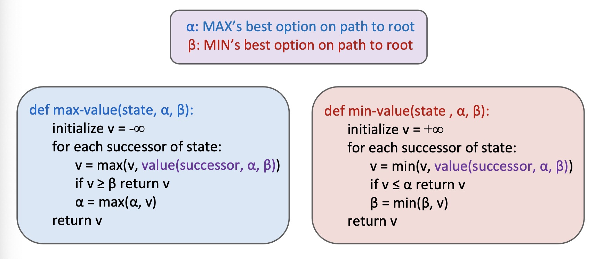
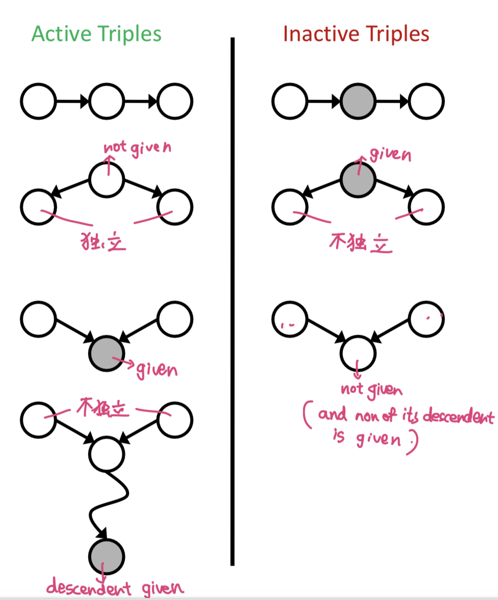

# Lecture 1. Intro

## Three types of approaches

### **1. Symbolism 符号**

Representing knowledge with: **symbols and their compositions (expressions)**. 用离散符号的组合表示knowledge.

Inference and learning: manipulating symbols.

Advantages: expressive; interpretable; rigorous. 表达能力强; 可解释,人可读; 有严密数理逻辑基础

Disadvantages: hard to learn; rigid. 难以学习; 脆弱.

### **2. Connectionism 连接主义**

Representing knowledge with: **interconnected networks of simple units** (e.g. neural networks). 用大量简单计算单元的加权连接 (典型:神经网络)

Inference: follow the computation specified by the network.

Learning: optimization of connection weights.

Advantages: good performance; flexible. 表现好; 灵活

Disadvantages: black-box; data-hungry; hard to incorporate knowledge. 黑盒,人不可读,不可解释; 需大量训练数据; 难以融入先验知识

### **3. Statistical Approaches 基于统计的方法**

Representing knowledge with: probabilistic models.

Inference and learning: probabilistic inference.

Advantages: interpretable; rigorous; learnable. 可解释; 严密; 可学习.

Disadvantages: less expressive; less flexible. 表达能力不如符号; 灵活性不如连接主义.

## Course Overview

- Search
- Constraint satisfaction problems
- Game
- Propositional logic
- First-order predicate logic
- Probabilistic graphical models
- Probabilistic temporal models
- Probabilistic logics
- Markov decision processes
- Reinforcement learning
- Machine learning
- Introduction to natural language processing
- Introduction to computer vision

# Lecture 2. Search

## Search Problems

A Search problem consists of:

- A state space
- A successor function
- A start state and a goal test

**World state**: every detail of the environment

**Search state**: only the details needed for planning



$b$ is the branching factor (maximum number of child nodes).

$m$ is the max depth.

$s$ is the depth of the shallowest solution.

Num of nodes: $1 + b + b^2 + \cdots = O(b^m)$



## Depth-First Search

Strategy: **expand deepest node first**.

Implementation: Fringe (a **stack**).

Time: $O(b^m)$ if $m$ is finite

Space: $O(bm)$

Not complete (unless we prevent cycles).

Not optimal.

## Breadth-First Search

Strategy: **expand shallowest node first**.

Implementation: fringe (a **queue**).

Time: $O(b^s)$.

Space: $O(b^s)$.

Complete.

Optimal only if all costs are $1$.

## Iterative Deepening

Idea: get **DFS's space advantage** with **BFS's time advantage**.

Space: $O(bm)$

Time: $O(b^s)$

## Uniform Cost Search

Strategy: **expand cheapest node first**.

Implementation: fringe (a priority queue, priority = cumulative cost).

Complete and optimal, but slow.

## Greedy Search

Strategy: **expand a node with smallest heuristic** (estimate of distance to goal)

Fast, but not optimal.

## A* search

Combine UCS with Greedy.

Optimal when heuristic is **admissable** (heuristic cost $\leq$ actual cost).

Fast and optimal.

# Lecture 3. Constraint Satisfaction Problems 约束满足问题

## Two types of search problems

- Planning = standard search problems
- Identification = constraint satisfaction problems (CSPs)

## Backtracking Search 回溯搜索

Backtracking = DFS + variable-ordering + fail-on-violation

## Filtering: Forward checking

Keep track of domains for unassigned variables and cross off bad options.

## Filtering: constraint propagation

- **Node consistency (1)**: Each node has valid value.

  任何一个节点有可选值

- **Arc consistency (2)**: $X\to Y$ is **consistent** IFF for every $x$ in the tail there is some $y$ in the head which could be assigned without violating a constraint.

  $X\to Y$: 在X中随便选一个，Y仍然有得选

- **K-consistency**: For each $k$ nodes, any consistent assignment to $k-1$ can be extended to the $k^{th}$ node.

  对于任意$k$个点，不论$k-1$个点怎么选择，最后第$k$个点都有得选

- **Strong k-consistency**: also $k-1$, $k-2$, ..., $1$-consistent.

Claim: **Strong n-consistency** means we can **solve without backtracking**.

## Ordering: MRV (Min Remaining Value 最少剩余值)

Also called **Most constrainted variable**

Choose the variable with fewest legal left values in its domain

优先选择最少剩余量的选项 (选可选颜色数最少的点涂色)

## Ordering: LCV (Least Constraining Value 最少约束值)

Choose the least constraining value (variable that rules out the fewest values in the remaining values)

优先排除掉可能让邻居可选值最少的值，给相邻变量的赋值留下最大的灵活性   

## Tree-structured CSPs

Theorem: If the constraint graph has **no loops**, the CSP can be solved in $O(nd^2)$ time.

Algorithm:

1. Order: parents precede children
2. Remove backward: `for i in (n,2) removeInconsistent(Parent(Xi), i)`
3. Assign forward: `for i in (1,n) assign Xi consistently with Parent(Xi) `

## Nearly tree-structured CSPs

# Lecture 4. Adversarial search

## Concepts

**Value** of a state: best achievable outcome (utility) from that state 能获得的最好成绩

**Minimax value**: best achievable utility against an optimal adversary 对手最优时可能获得的最好成绩

## Minimax search

- Compute each nodes's **minimax value**

- Implementation:

  

- Efficiency:

  Just like exhaustive DFS   （相当于彻底的DFS搜索）

  Time: $O(b^m)$, Space: $O(bm)$

## Depth-limited search (evalution functions)

- Search a limited depth.
- Replace terminal utilities with an **evaluation function** for non-terminal positions.
- **Ideal evalution function**: actual minimax value of the state
- **Simple evalution function**: weighted linear sum of features

- Idea: limit branching factor by considering only good moves

## Alpha-Beta pruning

- Implementation

  

## Expectimax Search

- Compute average score under optimal play (expected utilities = weighted avg of children)

## Mixed layer types

- Enviroment is an extra agent. 
- E.g. You, a random ghost, and an optimal ghost

## Multi-Agent Utilities

- Multiple players. Each player takes care of only his utility.

# Lecture 5. Propositional Logic

## Logic-based Symbolic AI

- **Knowledge base**

  contains sentences representing knowledge

  domain-specific

- **Inference engine**

  can answer questions by following the knowledge base

  domain-independent

## Formal Language

Components of a formal language:

- **Syntax**: 语法
- **Semantics**: 语义  specifies the sentences is true/false in each model

## PL (propositional logic)

- **Negation**: $\neg S$
- **Conjunction**: $S1 \and S2$   (and)
- **Disjunction**: $S1 \or S2$   (or)
- **Implication**:  $S1 \Rightarrow S2$
- **Biconditional**:  $S1 \Leftrightarrow S2$

## Logical equivalence

## Validity and satisfiability

- **valid**: true in all models
- **satisfiable**: true in some models
- **unsatisfiable**: false in all models

## Entailment

-  $\alpha \vert= \beta$  :   $models(\alpha) \subseteq models(\beta)$  : in every world where $\alpha$ is true, $\beta$ is also true

## Proof of entailment

- Method 1: **model checking** 模型检验

  ​	通过枚举所有可能得模型来检验。复杂度高。

- Method 2: **application of inference rules**

  - Search for a finite sequence of sentences each of which is an **axiom** or follows from preceding sentences by a rule of **inference**
    - **axiom**: 公理  a sentence known to be true
    - **rule of inference**: a function that takes one or more sentences (premises) and returns a sentence (conclusion)
  - **Sound inference**:  能证明出来的一定是entailed的
  - **Complete inference**:  entailed的一定能被证明出来

## CNF (conjunctive normal form)

- conjunction of disjunctions of literals (clauses)
  - **literal**: a simple symbol or its negation:  $A$ or $\neg A$
  - **clause**: disjunction of literals :  $A\or B$
  - **CNF**:  conjunction of literals:  $A \and B$

- conversion to CNF
  - 1: 把 $A\Leftrightarrow B$ 换成 $(A\Rightarrow B) \and (B\Leftarrow A)$
  - 2: 把 $A \Rightarrow B$ 换成  $\lnot A \or B$
  - 3: 把 $\lnot (A\or B)$换成 $\lnot A \and \lnot B$ ; $\lnot(A\and B)$ 换成 $\lnot A \or \lnot B$
  - 4: 用分配律 ($\and$ over $\or$) 

## 证明 $KB \vert= \alpha$

- 反证:  证明 $KB \and \lnot \alpha$  unsatisfiable
  - 1 . 将 $KB \and \lnot \alpha$ 转换成CNF
  - 2 . 

# Lecture 7. Bayesian Networks

- 概率

  条件概率: $P(a|b) = \frac{P(a, b)}{P(b)}$

## Syntax

贝叶斯网络语法: 

- **DAG** (directed, acyclic graph) **有向无环图**
- **CPT (conditional probability table)**
- **CPT for each node** given its parents (每个节点存有 给定父节点的条件概率分布)

## Semantics

### Global semantics

所有CPT相乘

### Conditional independence semantics

给定父节点, 则该节点与非子孙节点独立

**Independence 符号**
$$
X \perp\!\!\!\perp Y | Z
$$

### Markov blanket

Markov blanket consists of **parents, children, children's other parents** (父,子,配偶) 

Every variable is conditionally independent of all other variables given its Markov blanket.

**给定markov blanket, 与所有其它变量条件独立**

**Common cause**: 给定父节点(cause), 两个child(effects)独立

**Common effect**: 给定子节点(effect), 两个父节点(cause)不独立 (v-structure)

### D-separation

If all paths from X to Y are blocked (at least 1 inactive triple), then X is d-separated from Y by Z ($X \perp\!\!\!\perp Y | Z$)

## Markov networks

undirected graph(无向图+clique全相连子图) + potentials 势函数(为每个clique的打分, 未经normalize, 不是概率)

- **Undirected graph + potential functions**
  - Undirected graph 无向图 
  - For each **clique** or **max clique**, a **potential function** is defined

- 联合概率 正比于 势函数乘积

  $$
  p(x) = \frac{1}{Z} \prod_C \psi _C (\mathbf{x}_C)\\
  
  Z = \sum_{\mathbf{x}} \prod_C \psi_C (\mathbf{x}_C)
  $$

  $\psi_C (\mathbf{x}_C)$ is the potential over clique $C$
  
  $Z$ is the **normalization coefficient** (**partition function**)

- **Conditional Independence** in Markov networks

  要判断$A\perp\!\!\!\perp B |C$, 只需判断从A到B的所有path是否都被C挡住了

- **Markov blanket**

  Markov blanket 就是这个节点的所有neighbor

## Bayesian networks inference

## Exact inference

### Inference by enumeration

CPT相乘得联合概率, sum out 掉 hidden variables 

- **Evidence** variables: $E_1, \cdots, E_k = e_1, \cdots, e_k$
- **Query** variable: $Q$   (我们想求: 给定$E$时$Q$的条件概率, 即 $P(Q|e_1, \cdots, e_k)$)
- **Hidden** variables: $H_1, \cdots, H_r$

Steps:

- Select the entries consistent with the evidence

- Sum out $H$ to get joint distribution of $Q$ and $E$

  $P(Q, e_1\cdots e_k) = \sum_{h1\cdots h_r} P(Q, h_1\cdots h_r, e_1\cdots e_k)$

- Normalize 

  $Z = \sum_q P(Q, e_1,\cdots e_k)$

  $P(Q|e_1\cdots e_k) = \frac{1}{Z} P(Q, e_1\cdots e_k)$

### Variable elimination

对每个 hidden variable 做 join and eliminate 

指数复杂度, 但当贝叶斯网络为 poly tree 时, 为线性复杂度

### Efficient inference on polytrees

## Approximate Inference

### Prior sampling

自顶向下采样

### Rejection sampling

当采样与evidence不一致时丢弃

### Likelihood weighting

只对non-evidence采样, 为每个样本计算weight (weight为所有evidence var条件概率的乘积)

### Gibbs sampling

顺序采样, 每个样本由之前样本修改而来, 得到序列

