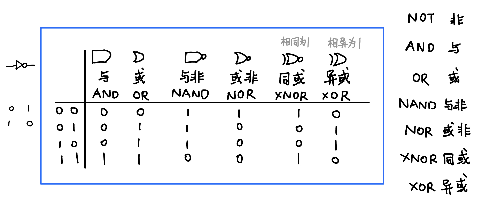
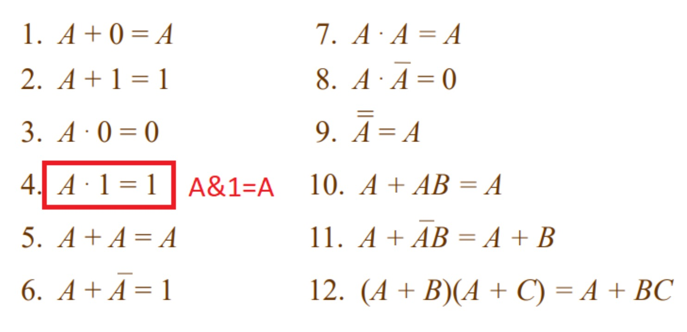
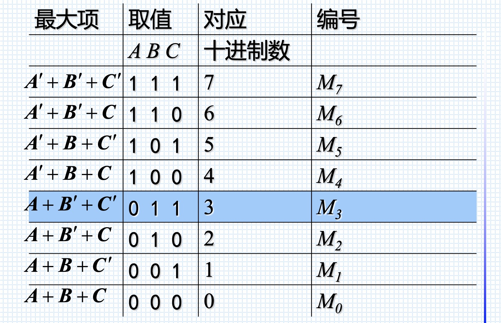

# Topic1. Intro to digital fundamentals

Asynchronous(异步) / Synchronous(同步) circuits

本课不涉及异步电路, handshaking 非常复杂.

# Topic 2. Number systems, operations and codes

## BCD (binary coded decimal)

- represents **each decimal digit with a 4-bit code**
- commonly used when it's necessary to show decimal numbers like clocks

- 

## Gray code

- **only a single bit change** between one code world
- can avoid problems in where an error may occur when >1 bit changes at a time
- (from right) 1st digit: 0110; 2nd digit: 00111100, ......
- **Race condition (竞争-冒险现象)**

# Topic3. Logic gates

# Topic5. Bool algebra & logic simplification

## Boolean Algebra

- **Commutative laws**: $A+B = B+A$  ;  $AB=BA$

- **Associative laws**:  $A+(B+C) = (A+B) + C$  ;  $A(BC) = (AB)C$

- **Distributive law**:  $AB+AC = A(B+C)$

- **Rules of boolean algebra**

  

- **DeMorgan's 1st Theorem**: $\overline{AB} = \overline{A} + \overline{B}$
- **DeMorgan's 2nd Theorem**:  $\overline{A+B} = \overline{A} \cdot \overline{B}$

## SOP & POS

- **SOP (sum-of-products)** 

  In SOP, every variable must appear in each term. (每个变量在每一项中都必须出现)

  e.g. $X(A,B,C) = \overline{A}\cdot \overline{B}\cdot C + \overline{A}\cdot \overline{B}\cdot \overline{C} + ABC$

- **最小项(之和)**

  $m$是乘积项，$n$是变量个数

  对于$n$变量函数，有$2^n$个最小项

  

  性质：

  - 任意输入变量的取值，仅有一个最小项值为1
  
  - 全体最小项之和为1
  
  - 任意两最小项之积为0
  
  - 利用$A+A'=1$，两个**相邻(adjacent)**最小项之和可以合并 
  
    e.g. $ABC'+ABC=AB$

- **最大项(之积)**

  $M$ 是相加项，包含$n$个因子

  对于$n$变量函数，有$2^n$个最大项

  

  性质:

  - 任意输入变量的取值，仅有一个最大项值为1
  - 全体最大项之积为0
  - 任意两最大项之和为1
  - 只有一个变量不同的最大项的乘积等于各相同变量之和

