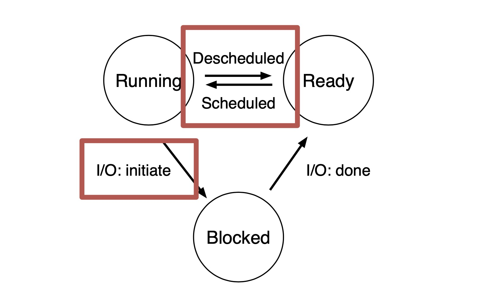

# Lec 2. Processes

## What is a process

- **Execution stream** (thread of control)
- **Process state**: everything code can affect or be affected
  - including: PC, registers, memory, opened files, opened OS resources...


**Process VS Program**

- **Program**: static data, code
  - global or initialized variables

- **Process**: dynamic instance of code + data
  - registers, stack, heap, address space, all memory that is accessible

1 copy of program can have many copies of processes.


## Virtualizing CPU

Goal: give each process the idea that it is running alone 

How to do: **share resources**

- For CPU: **time sharing** (save/restore process state)
  - reason we can do time sharing: small CPU/register state goes to memory
- For Memory: **space sharing**


## Getting good performance

**Direct execution**: run directly on hardware. OS loads program, jumps to `main`.

### Problem 
- process could do something restricted -- access another process or user file
- process could run forever -- need to stop + take control
- process could do something slow -- I/O... We want to use CPU for something else.

### Solution: Limited Direct Execution(LDE)

Let OS+hardware have some control.


### Problem 1: restricted operations

### Solution: System calls


### Solution: **hardware privilege levels**

user processes runs in restricted level ('unprivileged' or 'user mode')

OS runs in privileged level ('kernel level' or 'kernel mode')

**What privileges?**

- interact with devices (e.g. keyboard)
- interact with memory permissions (e.g. can access whole memory and control permissions in kernel mode)

**How does a process do IO?**

By **System call**: 

- controlled transfer into OS
- change privilege levels
- implemented via **Trap** (to control where to jump)


**How to take CPU away?** (take CPU away from a process / control how long a program can run)

Mechanism: trap to OS + registers save/restore

OS dispatch loop:

```
while (1) {
    run process A for some period
    stop A, save context
    load content of another process B
}
```

**Regain control**

Option 1: **Cooperative multitasking**: 

- Trust process to relinquish CPU 
  - automatic on syscall
  - extra syscall to `yield()`

- Benefits: no new OS mechanism
- Drawbacks: lame programmers; not responsive

Option 2: **Timer-based multitasking**

- Guarantee OS runs periodically

- Set an alarm (timer)
  - program timer to interrupt every 3ms
  - interrupt causes trap + handler, invoke dispatch (dispatch can choose to switch process)

**Save state**

what: **register state** (including: GPR, PC, stack, frame(ebp))

where: **process control block (PCB)** (including: PID, process state, priority, register state, address space) 


# Lec 3. CPU Scheduling

## Dispatcher - Switches between processes

- cooperative multitasking
- preemptive/true multitasking (has a timer)

saving state - called '**context switching**'

loading state


(During context switching, save process's register to **PCB**)

(During system call, save to **kernel stack**)

(When process is descheduled, it's moved to READY state)

fa19mid1

(The **scheduler** determines the policy for which process should be run when. The **CPU dispatcher** implements the mechanism)

fa16mid1

(On a system call trap, the **hardware** looks up the **trap table**. **OS** looks up the address of the system call handler in **system call table**.)

sp22mid1


## Slow operations

I/O operations can take a long time. We should run other processes when one process is doing reading/writing files.

Idea: track **state** of processes

- **Running**: on CPU
- **Ready**: can run at any time
- **Blocked / Waiting**: Asleep, waiting for I/O.



(When a job is descheduled by scheduler, it's moved to **READY**)

(fa19mid1)


## Policy

**Workload**: set of jobs and tasks: (**arrival time**, **run time**)

**Job**: current execution of a process. Alternates between CPU and IO.

**Scheduler**: decides which ready job to run

**Metric**: measurement of scheduling quality

**Overhead** 是什么? TODO

### Metrics

**Turnaround time** = Completion time - arrival time

**Response time** = First run time - arrival time

**Wait time** = Time not scheduled between arrival and completion (fa19mid1)

Starvation: a process is prevented from making progress


### Policies

- **FIFO / FCFS** (First in first out / First come first serve)
  - Run jobs in the order they arrive
  - Turnaround time suffers when short jobs must wait for long jobs

- **SJF** (Shortest job first)
  - Run remaining job with shortest run time next. 不会打断当前job.
  - Optimal for **min turnaround time**.
  - 缺点: 新来的 short process 会被正在运行的 long process 挡住很长时间 (**starvation**) (**convoy effect** (fa16mid1))

FIFO and SJF are **non-preemptive**: only schedule new job when prev job voluntarily relinquishes CPU.

(If all jobs have same length, FIFO = SJF) (fa19mid1)

(将长job移到短job之后能降低turnaround time, 所以SJF能有更短的turnaround). (fa16mid1)


**preemptive**: schedule different jobs by taking CPU away from the running job

- **STCF** (Shortest Time-to-Completion First)
  - Always run job that will complete the quickest. 可能打断当前job.
  - 如果不断有 short jobs arriving, 则当前的 long job 会 **starve**.
  
- **RR** (Round Robin)
  - Idea: switch more often to reduce response time
  - RR **降低 response time**, 但会**增加 turnaround**. 
  - (如果所有job长度相同, 则RR的turnaround time最差, 因为所有job都在最后才完成) (fa16mid1)
  - (Increase the time slice of RR can decrease the overhead imposed by scheduling. 因为 context switch 的次数更少.) (fa19mid1)

The above are not IO aware (jobs hold on CPU while blocked on disk).

- **I/O aware scheduling**
  - Treat job A as separate CPU bursts. When A completes IO, another job A is ready.

- **MLFQ** (Multi level feedback queue)
  
  - Support both
  
    - **interactive** programs that care about **response time** 
    - **batch** programs care about **turnaround time**
  - multiple levels of round-robin
  - priority levels
  - can preempt them
  - Rules:
    - 1. If priority A > B, A runs.
    - 2. If priority A = B, A&B run in RR.
    - 3. Processes start at top priority.
    - 4. If job uses whold slice, demote process (longer time slices, lower priorities).
    - 5. CPU **Burst**: After some time period S, move all jobs to the topmost queue (avoid starvation).
    - 6. **Lottery scheduling**:
      - give processes lottery tickets
      - whoever wins runs
      - higher priority → more tickets
  
  - (One of the goals is to support batch and interactive jobs) (sp22mid1)
  


(**Gantt chart** shows timeline of job scheduling)


# Lec 4. Virtualization: CPU to Memory

## Multicore scheduling

- **Single Global Queue**

  Advantages:

  - **Low response time** - new tasks can run on any CPU

  - **Global priorities** - new task can perrmpt any CPU running lower priority

  Drawbacks:

  - **Expensive communication**
  - Loss of cache locality when job moves between CPUs

- **Multi-queue Scheduling** (Per-CPU Queue)

  Give each CPU core its own ready quene.

  Tasks assigned to a CPU core when creation.

  Placement policy: **pick the core with shortest queue**

  Advantages: No cross-core migration & communication

  Drawbacks: Load imbalance

- **Per-CPU queue with migration**

  **Periodic rebalancer**: move jobs from cores with many jobs to those with a few jobs

  Run every few seconds (much less frequent as time slice) when load imbalance > 25%


## Process Creation

Two ways to create a process

### Option 1: **New process from scratch** (Windows)

Steps

- Load specified code and data into memory; Create empty call stack
- Create and initialize PCB (like context-switch)
- Put process on ready list

Advantages: no wasted work

Disadvantages: configuration complicated

### Option 2: Copy an existing process and change it appropriately (*nix)


# Lec 5. Segmentation and Paging

## Static relocation


## Dynamic relocation

Goal: protect processes from one another

Requires hardware support: **Memory Management Unit (MMU)**


Dynamic relocation by changing value of base register!

During context switch, add base and bound registers to PCB.


**Base and bound disadvantages**:

- must be allocated contiguously in physical memory
- must allocate memory that may not be used
- no partial sharing


(在dynamic relocation中, OS manages the mapping between virtual and physical memory. The OS allocates space in physical memory for each address space.) (fa16mid1)

(操作系统在物理内存中 allocate space, 编译器在虚拟内存中选择 virtual address) (fa19mid1)

(**logical address = virtual address**)

(fa15mid1)


## Segmentation

Divide address space into logical segments, each segment corresponds to logical entity in address space (code, stack, heap)

Each segment has separate base + bound register.


MMU contains **Segment Table** (per process).

Advantages:

- sparse allocation.
- (stack and heap can grow independently)

Disadvantages:

- externel fragmentation


(Segmentation 不会增加额外的 memory references. ) (fa19mid1)


# Lec 6. Paging - TLBs

## Paging:

- **Goal**: **eliminate** requirement that address space is **contiguous**

- Idea: divide address spaces and physical memory into fixed-sized pages.

- For each memory reference (steps):

  - 1. Extract **VPN** from **VA** (virt addr)

    2. Calculate addr of **PTE** (page table entry)

       PTE address = VPN * PTE size + PTBR (page table base register)

    3. Read **PTE** from memory

    4. Extract **PFN** (page frame num / physical page number)

    5. Build **PA** (phys addr)

    6. Read contents of **PA**

- Every instruction fetch/load/store takes 2 mem references. Slow!

- **Pros:**

  - **No external fragmentation**: any page can be placed in any phys addr
  - **Fast to allocate and free**: No need to search for suitable free space; doesn't need adjacent free space

- **Cons**:

  - **Additional memory reference**
  - **Storage for page tables may be substantial** （PTE needed even if page not allocated)

## TLB

**Translation Lookaside Buffer (TLB)**

TLB != PTE (In PTE, we don't need VPN. In TLB we need.)

TLB is fully associative.


Locality


### TLB replacement policies

- **LRU**: least recently used
- **Random**:
  - sometimes random is better


### On context switches

- Option 1: **Flush TLB** on context switch
- Option 2: Track which entries are for which process
  - Tag each TLB entry with **Address Space Identifier (ASID)**


Hardware or OS handles TLB misses.

In practice we use hardware. Pagetable structure fixed and agreed between HW and OS. Hardware 'walks' pagetable and fills TLB. OS plays no role in TLB miss.


(**page fault** 的时候: **present bit** 是0)

(**TLB Miss**的时候是: 找不到entry或者entry的 **valid bit** 是0)

(fa16mid1)

(LRU多加一个page 表现会 equal or better)

(FIFO多加一个page 表现可能会更差: **Belady's anomaly**) 

(fa19mid1)


(Page table 里 valid but not present 是说page存在但是被swap到了硬盘上, 需要 trap OS to read disk)


# Lec 7. Smaller pagetables

## Multi-level page tables

Goal: allow page table to be allocated non-contiguously

Idea: page the page tables (multiple levels)

Each inner page table fits within a page.


### Other approaches

- Inverted Page tables


# Lec 8. Swapping
