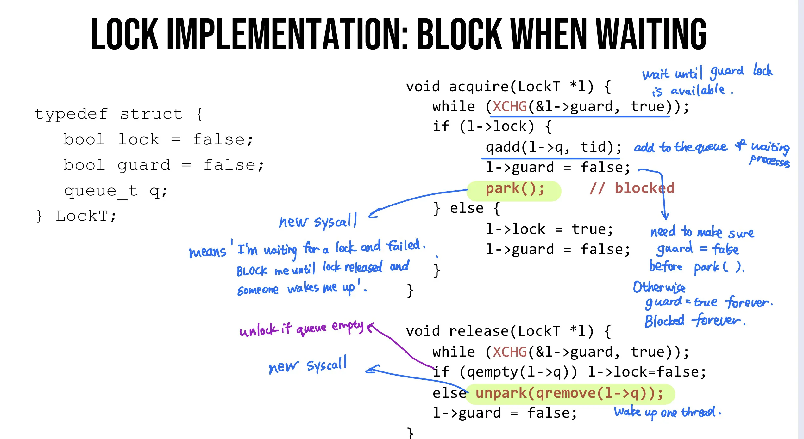

# Lec 2. Processes

## What is a process

- **Execution stream** (thread of control)
- **Process state**: everything code can affect or be affected
  - including: PC, registers, memory, opened files, opened OS resources...


**Process VS Program**

- **Program**: static data, code
  - global or initialized variables

- **Process**: dynamic instance of code + data
  - registers, stack, heap, address space, all memory that is accessible

1 copy of program can have many copies of processes.


## Virtualizing CPU

Goal: give each process the idea that it is running alone 

How to do: **share resources**

- For CPU: **time sharing** (save/restore process state)
  - reason we can do time sharing: small CPU/register state goes to memory
- For Memory: **space sharing**


## Getting good performance

**Direct execution**: run directly on hardware. OS loads program, jumps to `main`.

### Problem 
- process could do something restricted -- access another process or user file
- process could run forever -- need to stop + take control
- process could do something slow -- I/O... We want to use CPU for something else.

### Solution: Limited Direct Execution(LDE)

Let OS+hardware have some control.


### Problem 1: restricted operations

### Solution: System calls


### Solution: **hardware privilege levels**

user processes runs in restricted level ('unprivileged' or 'user mode')

OS runs in privileged level ('kernel level' or 'kernel mode')

**What privileges?**

- interact with devices (e.g. keyboard)
- interact with memory permissions (e.g. can access whole memory and control permissions in kernel mode)

**How does a process do IO?**

By **System call**: 

- controlled transfer into OS
- change privilege levels
- implemented via **Trap** (to control where to jump)


**How to take CPU away?** (take CPU away from a process / control how long a program can run)

Mechanism: trap to OS + registers save/restore

OS dispatch loop:

```
while (1) {
    run process A for some period
    stop A, save context
    load content of another process B
}
```

**Regain control**

Option 1: **Cooperative multitasking**: 

- Trust process to relinquish CPU 
  - automatic on syscall
  - extra syscall to `yield()`

- Benefits: no new OS mechanism
- Drawbacks: lame programmers; not responsive

Option 2: **Timer-based multitasking**

- Guarantee OS runs periodically

- Set an alarm (timer)
  - program timer to interrupt every 3ms
  - interrupt causes trap + handler, invoke dispatch (dispatch can choose to switch process)

**Save state**

what: **register state** (including: GPR, PC, stack, frame(ebp))

where: **process control block (PCB)** (including: PID, process state, priority, register state, address space) 


# Lec 3. CPU Scheduling

## Dispatcher - Switches between processes

- cooperative multitasking
- preemptive/true multitasking (has a timer)

saving state - called '**context switching**'

loading state


(During context switching, save process's register to **PCB**)

(During system call, save to **kernel stack**)

(When process is descheduled, it's moved to READY state)

fa19mid1

(The **scheduler** determines the policy for which process should be run when. The **CPU dispatcher** implements the mechanism)

fa16mid1

(On a system call trap, the **hardware** looks up the **trap table**. **OS** looks up the address of the system call handler in **system call table**.)

sp22mid1


## Slow operations

I/O operations can take a long time. We should run other processes when one process is doing reading/writing files.

Idea: track **state** of processes

- **Running**: on CPU
- **Ready**: can run at any time
- **Blocked / Waiting**: Asleep, waiting for I/O.


(When a job is descheduled by scheduler, it's moved to **READY**)

(fa19mid1)


## Policy

**Workload**: set of jobs and tasks: (**arrival time**, **run time**)

**Job**: current execution of a process. Alternates between CPU and IO.

**Scheduler**: decides which ready job to run

**Metric**: measurement of scheduling quality

**Overhead** 是什么? TODO

### Metrics

**Turnaround time** = Completion time - arrival time

**Response time** = First run time - arrival time

**Wait time** = Time not scheduled between arrival and completion (fa19mid1)

Starvation: a process is prevented from making progress


### Policies

- **FIFO / FCFS** (First in first out / First come first serve)
  - Run jobs in the order they arrive
  - Turnaround time suffers when short jobs must wait for long jobs

- **SJF** (Shortest job first)
  - Run remaining job with shortest run time next. 不会打断当前job.
  - Optimal for **min turnaround time**.
  - 缺点: 新来的 short process 会被正在运行的 long process 挡住很长时间 (**starvation**) (**convoy effect** (fa16mid1))

FIFO and SJF are **non-preemptive**: only schedule new job when prev job voluntarily relinquishes CPU.

(If all jobs have same length, FIFO = SJF) (fa19mid1)

(将长job移到短job之后能降低turnaround time, 所以SJF能有更短的turnaround). (fa16mid1)


**preemptive**: schedule different jobs by taking CPU away from the running job

- **STCF** (Shortest Time-to-Completion First)
  - Always run job that will complete the quickest. 可能打断当前job.
  - 如果不断有 short jobs arriving, 则当前的 long job 会 **starve**.
  
- **RR** (Round Robin)
  - Idea: switch more often to reduce response time
  - RR **降低 response time**, 但会**增加 turnaround**. 
  - (如果所有job长度相同, 则RR的turnaround time最差, 因为所有job都在最后才完成) (fa16mid1)
  - (Increase the time slice of RR can decrease the overhead imposed by scheduling. 因为 context switch 的次数更少.) (fa19mid1)

The above are not IO aware (jobs hold on CPU while blocked on disk).

- **I/O aware scheduling**
  - Treat job A as separate CPU bursts. When A completes IO, another job A is ready.

- **MLFQ** (Multi level feedback queue)
  
  - Support both
  
    - **interactive** programs that care about **response time** 
    - **batch** programs care about **turnaround time**
  - multiple levels of round-robin
  - priority levels
  - can preempt them
  - Rules:
    - 1. If priority A > B, A runs.
    - 2. If priority A = B, A&B run in RR.
    - 3. Processes start at top priority.
    - 4. If job uses whold slice, demote process (longer time slices, lower priorities).
    - 5. CPU **Burst**: After some time period S, move all jobs to the topmost queue (avoid starvation).
    - 6. **Lottery scheduling**:
      - give processes lottery tickets
      - whoever wins runs
      - higher priority → more tickets
  
  - (One of the goals is to support batch and interactive jobs) (sp22mid1)
  


(**Gantt chart** shows timeline of job scheduling)


# Lec 4. Virtualization: CPU to Memory

## Multicore scheduling

- **Single Global Queue**

  Advantages:

  - **Low response time** - new tasks can run on any CPU

  - **Global priorities** - new task can perrmpt any CPU running lower priority

  Drawbacks:

  - **Expensive communication**
  - Loss of cache locality when job moves between CPUs

- **Multi-queue Scheduling** (Per-CPU Queue)

  Give each CPU core its own ready quene.

  Tasks assigned to a CPU core when creation.

  Placement policy: **pick the core with shortest queue**

  Advantages: No cross-core migration & communication

  Drawbacks: Load imbalance

- **Per-CPU queue with migration**

  **Periodic rebalancer**: move jobs from cores with many jobs to those with a few jobs

  Run every few seconds (much less frequent as time slice) when load imbalance > 25%


## Process Creation

Two ways to create a process

### Option 1: **New process from scratch** (Windows)

Steps

- Load specified code and data into memory; Create empty call stack
- Create and initialize PCB (like context-switch)
- Put process on ready list

Advantages: no wasted work

Disadvantages: configuration complicated

### Option 2: Copy an existing process and change it appropriately (*nix)


# Lec 5. Segmentation and Paging

## Static relocation


## Dynamic relocation

Goal: protect processes from one another

Requires hardware support: **Memory Management Unit (MMU)**


Dynamic relocation by changing value of base register!

During context switch, add base and bound registers to PCB.


**Base and bound disadvantages**:

- must be allocated contiguously in physical memory
- must allocate memory that may not be used
- no partial sharing


(在dynamic relocation中, OS manages the mapping between virtual and physical memory. The OS allocates space in physical memory for each address space.) (fa16mid1)

(操作系统在物理内存中 allocate space, 编译器在虚拟内存中选择 virtual address) (fa19mid1)

(**logical address = virtual address**)

(fa15mid1)


## Segmentation

Divide address space into logical segments, each segment corresponds to logical entity in address space (code, stack, heap)

Each segment has separate base + bound register.


MMU contains **Segment Table** (per process).

Advantages:

- sparse allocation.
- (stack and heap can grow independently)

Disadvantages:

- externel fragmentation


(Segmentation 不会增加额外的 memory references. ) (fa19mid1)


# Lec 6. Paging - TLBs

## Paging:

- **Goal**: **eliminate** requirement that address space is **contiguous**

- Idea: divide address spaces and physical memory into fixed-sized pages.

- For each memory reference (steps):

  - 1. Extract **VPN** from **VA** (virt addr)

    2. Calculate addr of **PTE** (page table entry)

       PTE address = VPN * PTE size + PTBR (page table base register)

    3. Read **PTE** from memory

    4. Extract **PFN** (page frame num / physical page number)

    5. Build **PA** (phys addr)

    6. Read contents of **PA**

- Every instruction fetch/load/store takes 2 mem references. Slow!

- **Pros:**

  - **No external fragmentation**: any page can be placed in any phys addr
  - **Fast to allocate and free**: No need to search for suitable free space; doesn't need adjacent free space

- **Cons**:

  - **Additional memory reference**
  - **Storage for page tables may be substantial** （PTE needed even if page not allocated)

## TLB

**Translation Lookaside Buffer (TLB)**

TLB != PTE (In PTE, we don't need VPN. In TLB we need.)

TLB is fully associative.


Locality


### TLB replacement policies

- **LRU**: least recently used
- **Random**:
  - sometimes random is better


### On context switches

- Option 1: **Flush TLB** on context switch
- Option 2: Track which entries are for which process
  - Tag each TLB entry with **Address Space Identifier (ASID)**


Hardware or OS handles TLB misses.

In practice we use hardware. Pagetable structure fixed and agreed between HW and OS. Hardware 'walks' pagetable and fills TLB. OS plays no role in TLB miss.


(**page fault** 的时候: **present bit** 是0)

(**TLB Miss**的时候是: 找不到entry或者entry的 **valid bit** 是0)

(fa16mid1)

(LRU多加一个page 表现会 equal or better)

(FIFO多加一个page 表现可能会更差: **Belady's anomaly**) 

(fa19mid1)


(Page table 里 valid but not present 是说page存在但是被swap到了硬盘上, 需要 trap OS to read disk)


# Lec 7. Smaller pagetables

## Multi-level page tables

Goal: allow page table to be allocated non-contiguously

Idea: page the page tables (multiple levels)

Each inner page table fits within a page.


### Other approaches

- Inverted Page tables


# Lec 8. Swapping


--------


# Lec 10. Concurrency

Motivation: 多核

- Option 1: many communicating **processes**

- Option 2: **thread** (同一个 process 的多个 thread 共享 address space)

Multi-threaded programs tend to be structured as 

- **Producer / Consumer**
- **Pipeline**
- Defer work with background thread


## Thread vs Process

Multiple threads within a single process **share**:

- PID
- Address space: code, most data (heap)
- open file descriptors
- current working directory
- User and group ID

Each thread has **its own**

- TID
- set of registers, including ip (instruction pointer) and sp (stack pointer)
- stack


## OS support: approach

**User-level threads: many-to-one thread mapping**

- OS is not aware of user-level threads
- advantages: faster, does not require OS support
- disadvantages: cannot leverage multiprocessors; entire process blocks when one thread blocks

**Kernel-level threads: one-to-one thread mapping**

- OS provides each user-level thread with a kernel thread
- Each kernel thread scheduled independently.
- advantages: can run parallel on a multiprocessor; when one thread blocks, other threads can be scheduled
- disadvantages: higher overhead for thread operations; OS must scale well with increasing number of threads


# Lec 11. Locks

## Locks

- Allocate and **initialize**

​	`Pthread_mutex_t mylock = PTHREAD_MUTEX_INITIALIZER`

- **Acquire**
  - Acquire exclusion access to lock
  - wait if lock if not avaiable
  - **spin or block** while waiting
  - `Pthread_mutex_lock(&mylock)`
- **Release**
  - Release exclusive access to lock
  - `Pthread_mutex_unlock(&mylock)`


### **Lock implementation goals** 

- **Correctness**
  - **Mutual exclusion**: 同一时刻只能有一个thread在critical section中
  - **Progress (deadlock-free)**: 不能死锁(大家都无法lock的现象)
  - **Bounded (starvation-free)**: 不能一直占用着锁
- **Fairness**: Each thread waits for same amount of time
- **Performance**: don't waste CPU


### **Atomic operation**: 原子操作

Approaches

- Disable interrupts
  - Prevent dispatcher from running another thread
  - 仅可用于单核; Process可以永久占用CPU; 无法处理其它中断
  
- Locks using loads/stores
  - single shared lock variable, 不行 (memory access not atomic + race condition)
  
  - **XCHG (Atomic exchange or test-and-set)**
    - ```c
      int xchg(int *addr, int newVal) {
      	int old = *addr;
      	*addr = newVal;
      	return old;
      }
      ```
    
  - **CompareAndSwap**
    - ```c
      int compareAndSwap(int *addr, int expected, int new) {
      	int actual = *addr;
      	if (actual == expected)  *addr = new;
      	return actual;
      }
      ```


Fairness issue: scheduler is unaware of locks/unlocks


## **Ticket locks**

- Idea: reserve each thread's turn to use a lock. Each thread spins until their turn

- new atomic primitive, **fetchAndAdd** 

  ```c
  int fetchAndAdd(int *ptr) {
  	int old = *ptr;
  	*ptr = old + 1;
  	return old;
  }
  ```

- **Acquire**: grab ticket, spin while thread's ticket != turn

- **Release**: advance to next turn


- Ticket locks guarantee bounded waiting (bounded by the number of threads). (sp22mid2)


## Spinlock performance

- **Fast** when: 多核; critical section short (lock held a short time)
- **Slow** when: 单核; lock held a long time
- advantage: avoid context switch
- disadvantage: spinning is wasteful; fairness issue

**Waste of CPU cycles**:

- Without yield: O(threads * time_slice)
- With yield: O(threads * context_switch)

Even with yield, spinning is slow with high thread contention


ticket lock 也属于 spin lock (fa16mid2)


## **Blocking when waiting**

Remove waiting threads from scheduler runnable quene (避免调度正在等候的threads)




## Spin-waiting VS Blocking

**Uniprocessor** 单核 

- waiting process should always relinquish processor
- associate queue of waiters with each lock

**Multiprocessor** 多核

- spin or block **depends on how long** $t$ **before lock is released**
  - lock released quickly (t < C) --> spin-wait
  - lock released slowly (t > C) --> block
  - C is context-switch cost

### Two-phase waiting

Algorithm: **spin-wait for C then block**

Two cases:

- if $t$ actually < C, spin-wait for $t$, we are same as optimal
- if $t$ actually > C, we pay spin C then block (twice as bad as optimal)
- worst-case performance bounded

**2-competitive algorithm**


# Lec 12. Condition Variables

### **Concurrency objectives**

- **mutual exclusion** (A和B不能同时运行)
  - Solved with **locks**
- **Ordering** (B一定要在A之后运行)
  - Solved with **condition variables** and **semaphores**


### Condition variables

Condition variable: **queue of waiting threads**

$B$ waits for a signal on CV before running

$A$ sends signal to CV when time for B to run

- **wait(cv, lock)**
  - requires the lock is held when wait() called
  - sleep + release the lock (atomically)
  - when awoken, re-acquire the lock before returning
- **signal(cv)**
  - wakes a single waiting thread (if any)
  - if no waiting thread, do nothing

CV needs lock to prevent race conditions around shared state


### Rule of thumb 1 (经验法则)

**Keep state** in addition to CV(s).

CV's are used to signal threads when state changes. If state is already as needed, thread doesn't wait for a signal.


### Example: unix pipes

finite-sized buffer

Writers add data to the buffer (need to wait if buffer is full)

Readers remove data from the buffer (need to wait if buffer is empty)


### Rule of thumb 2

Always do wait/signal with lock held.

CV needs lock to prevent race conditions around shared state.

### Rule of thumb 3

Whenever a **lock** is **acquired**, **recheck assumptions** about state!

Another thread could grab lock in between signal and wakeup from wait.

### Rule of thumb 4

Have a separate CV for each condition

(Ensures waking up the right thread)


# Lec 13. Semaphores

CV have no **state** (other than the waiting queue)

Semaphores have **state**: track **integer value**

### Semaphore operations

- allocate and initialize
  - `sem_init(...) { s->value = initval; }`
  - User cannot R/W value directly
- **Wait or Test**: `sem_wait(sem_t *)`
  - value--; waits if value is negative (<0)
- **Signal or Post**: `sem_post(sem_t *)`
  - value++; wake a single waiter if exists

**Value of semaphore**:

- when >= 0: number of available slots
- when <0: number of waiting threads


# Lec 14. Deadlock

Deadlock: no progress can be made because >=2 threads are waiting for the other to take some action and thus neither ever does.

### Deadlock theory

Deadlocks can only happen with these 4 conditions

- **mutual exclusion**

  -  problem: threads claim exclusive control of resources that they acquire

  -  solution: try to replace locks with atomic primitive 用原子操作代替锁

- **hold-and-wait**

  - problem: threads hold resources allocated to them while waiting for additional resources

  - solution: acquire all locks atomically once (by using a **meta lock**)

    ```c
    lock(&meta);
    lock(&L1);
    lock(&L2);
    ...
    unlock(&meta);
    // critical section code here
    unlock(...);
    ```

- **no preemption**

  - problem: resources (e.g. locks) cannot be forcibly removed from threads

  - strategy: if thread cannot get what it wants, release what it holds

    ```c
    top:
    	lock(A);
    	if (trylock(B) fails) {
    		unlock(A);
    		goto top;
    	}
    ```

  - disadvantages: **livelock**

- **circular wait**

  -  problem: circular chain of threads such that each thread holds a resource (e.g. lock) being requested by next thread in the chain.
  -  strategy: 
     -  decide which locks should be acquired before others
     -  if A before B, never acquire A if B is already held
     -  document this


------


# Lec 15. IO

**Canonical device**


### Interrupts vs Pooling

Fast device: better to spin

Floods of interrupts arrive can lead to **livelock** (CPU always handling interrupts)

Pooling has lower latency.


# Lec 17. RAID & Files

Sometimes we want many disks: **capacity**. **reliability**, **performance**


## RAID-0: striping 切片

Optimize for **capacity**. 

No redundancy. Disk数量越多, 可靠性越低.

- capacity: $N\times C$
- no disks can we safely lose
- latency: $D$
- sequential throughput: $N\times S$
- random throughput: $N\times R$

## RAID-1: mirroring 镜像

- capacity: $N/2 * C$
- how many disks can fail: at least 1, at most $N/2$
- latency: $D$ (write to both disks)

## RAID-4: parity盘

- capacity: $(N-1)*C$
- how many disks can fail: $1$
- latency: $D$, $2D$ for random (read and write parity disk)

## RAID-5: 轮流承担parity盘

- capacity: $(N-1)*C$
- how many disks can fail: $1$
- latency: $D$, $2D$ (read and write parity disk)


# Lec 18. Files

## File descriptor (FD)

- `int`类型, points to inode
- FD中存了offset
- 每个process有自己的fd table
- 用dup创建的新file descriptor会复制同样的offset

## fsync(int fd)

- **write buffering** (file system keeps newly written data in memory for a while)
- fsync forces buffers to flush to disk from memory

## Deleting files

- There is no syscall for deleting files
- Inode and associated file is **garbage collected** when no references (no directory pointing to the inode)
- Paths are deleted when `unlink()` is called
- FDs are deleted when `close()` or process quits.
- What will happen if file is opened (has fd) when unlink() is called? : File automatically deleted after fd closes

## Rename

- `rename(char *old, char *new)`
- deletes an old link to a file, creates a new link to a file
- just changes filename, does not move data

## Links

### Hardlink

- Hardlink: both path names use the same inode number (two links for the same file)

- File does not disappear until all hard links removed
- **cannot hardlink directories**
- command: `ln <new filename> <current filename>`

### Softlink

- soft or symbolic links: point to second path name
- can softlink to directories
- command: `ln -s <oldfile> <softlink>`
- can point to anything, but the file you are pointing to may not exist
- confusing behavior: "file does not exist"
- confusing behavior: "cd linked_dir; cd .." in different parent


## FS structs


## Allocation strategies

### 1. contiguous allocation

(similar to base-and-bound) Allocate each file to **contiguous** sectors **on disk**.

**Fastest** file system, but

- horrible **external fragmentation**, and
- may not be able to write new data without moving


### 2. small (fixed) number of extents

Allocate multiple contiguous regions (extents) per file.

Still has **external fragmentation**.


### 3. linked allocation

Allocate linked-list of fixed-sized blocks (multiple sectors)

- **No external fragmentation**
- **Very poor random access**


### 4. indexed allocation

put all pointers together into index block; 

allocate space for pointers when creating files

- No external fragmentation
- good random access performance


### 5. multi-level indexing


# Lec 21. FFS (Fast file system)

## Disk-aware file system

**Groups**

- 

- key idea: keep inode close to data


- FFS policy summary


## FS consistency

Problem: interrupt (power loss ...) may leave data in inconsistent state


Solution

- **FSCK**
  - After crash, **scan whole disk for contradictions** and "fix" if needed
  - keep FS off-line until FSCK completes
  - Problem:
    - Not always obvious how to fix file system image
    - **Don't know correct state**, just consistent one (seemingly correct but may not be correct)
    - Slow
- **Journaling**- get correct state
  - TODO


# Lec 23. SSD


# Lec 24. Distributed Systems

Definition: more than 1 machine working together to solve a problem.

Challenges: **partial** failure; communication failure


## UDP (User Datagram Protocol)

Minimal reliability

Message might be **lost**, **reordered**, **duplicated**.

The **only protection** is that data **will not be corrupted**.

Advantages: lightweight


## TCP (Transmission Control Protocol)

Reliable logical connections over unreliable physical connections.

### Technique 1: ACK

Before sending data, establish connection


### Technique 2: Timeout

For each missing ack, wait longer between retries.

### Technique 3: receiver remembers messages

Solution: **sequence numbers**

- sender gives each message an **increasing** **unique** **sequence number**
- receiver suppress message if the message's seq number < N or it is already buffered
- buffers messages to ensure messages are handled in order


## RPC (Remote Procedure Call)

Approach: create wrappers so calling a function on another machine feels just like calling a local function.


Wrapper generation:

- wrappers must do conversions: uniform endianness (little endian/big endian), pointers, ...
- conversion is called **marshaling**/unmarshaling, or **serializing**/deserializing


## Distributed file systems

NFS (network file system)


**Strategy 1**: 

- open() on client calls open() on server, open() on server returns fd back to client;

  read(fd) on client calls read(fd) on server, ...

- Problem: server crashs during several client read(fd) operations

**Strategy 2**: put all info in requests

- Use **stateless** protocol: server maintains no state about clients

- Need api change. One possibility:

  - `pread(char *path, buf, size, offset)`

    `pwrite(char *path, buf, size, offset)`

- Advantage: server can crash and reboot transparently to clients.

- Disadvantage: too many path lookups

**Strategy 3**: inode requests

- `inode = open(char *path)`

  `pread(inode, buf, size, offset)`

  `pwrite(inode, buf, size, offset)`

- Good

- Disadvantage: if file deleted, inode could be reused

**Strategy 4**: file handles

- `fh = open(char *path)`

- File handle = <volume ID, inode number, **generation number**> (extended inode number)

- Opaque to client (client cannot see the internals)

- **Idempotent operations**: if f() is idempotent, then f() f() f() has the same effect as f()

  e.g. pwrite(fh, buf, size, offset) is idempotent; append(fh, buf, size) is not idempotent

**Strategy 5**: client logic

write buffering

