# Lec 2. SQL Basics I

## Relational model

A **database** is a collection of one or more **relations**.

**Relation**: a table with rows and columns.   (relation = table)

**table name**; **attribute/column**; **record/tuple/row**

**Domain**: (e.g. int, string. real...)

**Schema**: 
- The schema of a relation: **relation name** + **attribute names**.
- The schema of a database: a collection of relation schemas.


**Primary key**: a subset of attributes that is a unique identifier of tuples in a relation.

- A **primary key** can have 1 or **more attributes**
- Primary key must be unique.
- A relation can only have **1 primary key**, but can have **multiple unique keys**.


## Structured Query Language (SQL)

- **Data Definition Language (DDL)**
  - Creation, deletion, modification of definitions of tables
- **Data Manipulation Language (DML)**
  - Query; Insert, delete and update rows


### Basics (creating a table)

**Create a Table**
```sql
CREATE TABLE Product (
    pid INTEGER PRIMARY KEY,   -- 'only 1 primary key'
    name CHAR(30) UNIQUE,   -- like 'assert'
    category CHAR(20),
    price REAL,
    manufacturer CHAR(20)
);
```

**Insert to a Table**
```sql
INSERT INTO Product
VALUES 
    ('iPhone', 'phone', 999.00, 'Apple'),  -- use single quote!
    ('chromebook', 'laptop', 999.00, 'Google');
```

### Single-table queries

**Basic SQL Query**
```sql
SELECT [DISTINCT] <attributes>   -- use DISTINCT to remove duplicates
FROM <one table>
WHERE <conditions>
[ORDER BY] <attribute> DESC/ASC  -- default is ASC
[LIMIT] <number>  -- usually used with ORDER BY to get Top-K
```

`select *`: select all attributes of this relation.

`SELECT sname AS sailorName`: **rename** an attribute

`SELECT sname, (60-age) AS YearToRetire`: **arithmetic expression** (and rename)


**In WHERE clauses**:

- Attribute names
- Comparison operators: `=`, `<>`, `<`, `>`, `<=`, `>=`
- Arithmetic operations: `+`, `-`, `*`, `/`
- `AND`, `OR`, `NOT`
- Operations on strings (e.g. concatenation)
- Pattern matching: (e.g. `s LIKE '%madison%'`)
- Special functions for comparing dates and times

Pattern matching: 
- `%` = any sequence of characters
- `_` = any single character


# Lec 3. SQL Basics II

## Integrity Constraint

**Integrity Constraint (IC)**: a condition specified on a database scheme and restricts the data that can be stored in an instance of database.

IC are specified when the user defines a database schema. 用户定义DB时会指明IC.

DBMS checks for violations and disallows changes to the data that violates the specified ICs (or make conpensating changes to the data to ensure all ICs are satisfied). DB会保证这种IC.


## Foreign Keys

(Another way to declare primary key

```sql
CREATE TABLE Students (
  sid   CHAR(20),
  name  CHAR(30),
  age   INTEGER,
  gpa   REAL,
  UNIQUE (name, age),
  CONSTRAINT StudentsKey PRIMARY KEY (sid)
);
```

equivalent to 

```sql
CREATE TABLE Students (
  sid   CHAR(20) PRIMARY KEY,
  name  CHAR(30),
  age   INTEGER,
  gpa   REAL,
  UNIQUE (name, age)
);
```
)

**Referenced attributes** must be **PRIMARY KEY (default) or UNIQUE**. 被 foreign key 引用的属性必须是 primary key 或 unique (可以是多个属性的组合)

The foreign key in the referencing relation must match the primary key of the referenced relation. 

Must have **same number of columns and compatible data type**.

The column names can be different. (Foreign key 必须类型相同, column 数量相同, 但名字可以不同)

A foreign key **must reference a valid, existing key** in the referenced table. Foreign key 不能指向空的key。

Syntax
```sql
FOREIGN KEY <list of attributes>
REFERENCES <relation> <attributes>
```

Example:
```sql
CREATE TABLE Enrolled (
  studid  CHAR(20),
  cid     CHAR(20),
  grade   CHAR(20),
  PRIMARY KEY (studid, cid),   -- primary key contains two attributes
  FOREIGN KEY (studid) REFERENCES Students  -- foreign key that refers to another table (Students)
);
```

Foreign key constraint can be violated in:

- A new row is inserted to `Enrolled` and references nonexistant value in `Students. (Foreign key 没有对应的 record, 拒绝插入操作)
  - Operation will be **rejected**.


- A deletion or update to `Students` causes some tuples of `Enrolled` to dangle.

  - 不写默认是 NO ACTION
  
  - Solution 1: ON DELETE/UPDATE **NO ACTION** 不允许删除
    - **disallow (reject)** deletion of the Students row (default).
  
  - Solution 2: ON DELETE/UPDATE **CASCADE** 级联  连着一起删除或修改
    - delete/update rows in Enrolled that refer to the deleted Students row
  
  - Solution 3: ON DELETE/UPDATE **SET DEFAULT** 设成指定的默认值
    - Set `studid` to some **default value**
    - `City varchar(255) DEFAULT 'Sandnes'`
  
  - Solution 4: ON DELETE/UPDATE **SET NULL** 设成空
    - Set `studid` value to **null**
  

Can specify the actions on **DELETE** and **UPDATE** separately (differently).


## Multi-table queries

Semantics of SQL: Multuple Tables

```sql
SELECT a1, a2, ... -- <attributes>
FROM   R1, R2, ... -- <relations/tables>
WHERE  <conditions>
```

e.g. names of students who got A in EE101

```sql
SELECT s.name
FROM   Students S, Enrolled E
WHERE  S.sid = E.studid
  AND  E.grade = 'A'
  AND  E.cid = 'EE101'
```


# Lec 4. Advanced SQL I

## SQL: Aggregation

- **`SUM`, `AVG`, `COUNT`, `MIN`, `MAX`** can be applied to a column in a `SELECT` clause. 

- **`COUNT(*)`** counts the number of tuples

- **`COUNT (DISTINCT <attribute>)`** to remove duplicates before counting.

- If `SELECT` clause uses an aggregate operation, it must use only attribute operations unless the query contains a `GROUP BY` clause.

  Note: attribute and aggregated attribute cannot appear in `SELECT` at the same time.

  For example this is **incorrect**! `SELECT S.sname, MAX(S.age)`.


- Follow a `SELECT-FROM-WHERE` by **`GROUP BY`** and a list of attributes.

  The relation is then grouped according to the values of those attributes, and any aggregation is applied only **within each group**.

  E.g. 

  ```sql
  SELECT A, SUM(B*C)  
  FROM R 
  GROUP BY A;
  ```

  Restrictions: If any aggregation is used, each element in `SELECT` must be **either aggregated or an attribute in `GROUP BY` list**.

  

- The `HAVING` clause always follows a `GROUP BY` clause in a SQL query. 

  It **applies to each group**, and groups not satisfying the condition are removed.

  It can refer only to attributes of relations in the `FROM` clause.

  `HAVING` **applies only on aggregates**!


## SQL: NULLs

- When we do arithmetic operations using NULL, the result is NULL.

  e.g. `(10*x)+5` is NULL if `x` is NULL

- String concatenation is NULL if one of the operands is NULL

  e.g. `'wisconsin' || NULL` is NULL

- **3-valued logic**: TRUE=1, FALSE=0, UNKNOWN=0.5
  When any value is compared with a NULL, the result is **`UNKNOWN`**.

  - C1 **AND** C2:    **min**{value(C1), value(C2)}
  - C1 **OR** C2:    **max**{value(C1), value(C2)}
  - **NOT** C:   **1 -** value(C)

- Test for NULL explicitly:

  ```sql
  X IS NULL
  X IS NOT NULL
  ```

  

## SQL: Outer Joins

### Inner Joins

e.g.

```sql
SELECT   S.sid, COUNT(*)
FROM     Sailors S, Reserves R
WHERE    S.sid = R.sid        -- join 2 tables together
GROUP BY S.sid;
```

Alternative syntax:

```sql
SELECT   S.sid, COUNT(*)
FROM     Sailors S INNER JOIN Reserves R ON S.sid = R.sid
GROUP BY S.sid;
```


### Left Outer Join

includes tuples from the left relation even if there's no match on the right. Fills remaining attributes with NULL.


## View

**View**: a virtual table based on the ouput set of a SQL query.

A View can be used like a normal table.


# Lec 5. Advanced SQL II

## Set Operators

- **Intersection** 交集: $\cap$   `INTERSECT`
- **Union** 并集:   $\cup$   `UNION`

- **Difference**:   $-$  `EXCEPT`

- `IN` / `NOT IN`

- `EXISTS` / `NOT EXISTS`

- `ANY`  one of 

- `ALL`  all of

SQL 执行 Set operations 默认会去重. 加 `ALL` (e.g. `UNION ALL`) 可取消去重. 


## Nested Queries

`FROM` clause 和 `WHERE` clause 中可以使用 **subquery**.

Output of 1 query can be input to another query (**nesting**)

**unnesting**: find an equivalent SQL query that does not use nesting

### Set comparison Operators

- `IN`, `NOT IN`

- `EXISTS`, `NOT EXISTS`

- `op ANY`  (better than one of)

- `op ALL`  (better than everyone)

  (`op` is one of `<, <=, =, <>, >=, >`)


# Lec 6. ER Model I

## Database Design

- **Requirements** Analysis
- **Conceptual Database Design**
  - Model **high-level description** of data; constraints; ER model
- **Logical Database Design**
  - Choose a DBMS and design a scheme (How to map conceptual design to a schema)


## ER Model

- A **visual language** to specify
  - What **information** the DB must hold
  - What are the **relationships** among components of that information

### Concepts

**Entity**: distinguishable real-world object (a single object, e.g. one sailer).

**Entity Set**: A set of entities (all entities have same set of attributes, e.g. all sailors). Rectangles.

**Attribute**: attached to an entity set. Ovals.

(ER diagrams don't represent entities. They represent entity sets!)

### Relationship

**Key Constraints**:

- **one-one**: A and B are both keys to the relationship. Given an entity A (or B), can uniquely determine the relationship.
- **many-one**: Given an entity in B, can uniquely determine the relationship.
- **many-many**: 


# Lec 7. ER Model II

**Roles in relationship**

- Lable the edges to indicate roles if one entity set plays more than one role

  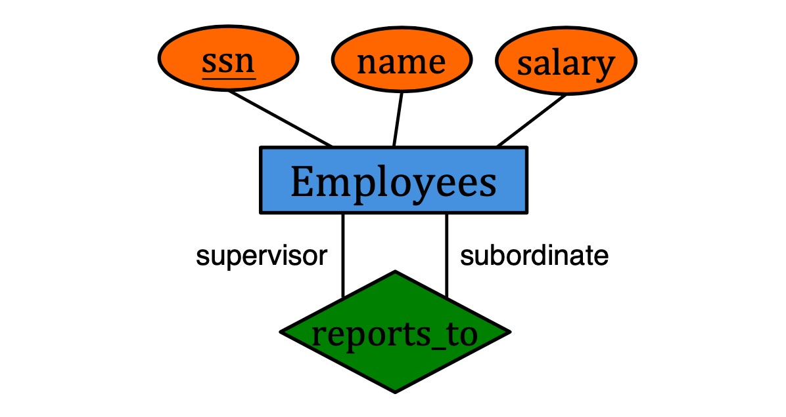

### **Participation constraint**

- **Key constraint**: (at most one) (represented by →)
- **Total participation**: (at least one) (represented by thick line)
- **Particial participation**: (participation that is not total)


### Weak Entities

A **weak entity** can only be identified uniquely by considering the primary key of another entity.

- Weak entity set must participate in **one-to-many** relationship set.
- Weak entity set must have **total participation**.

Example:

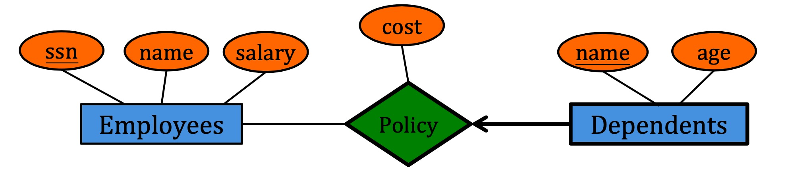

e.g. We cannot uniquely determine 'dependent' by 'name'. Only by considering 'employees' can we determine 'dependent'. Therefore 'dependents' is weak entity.


### Class Hierarchy

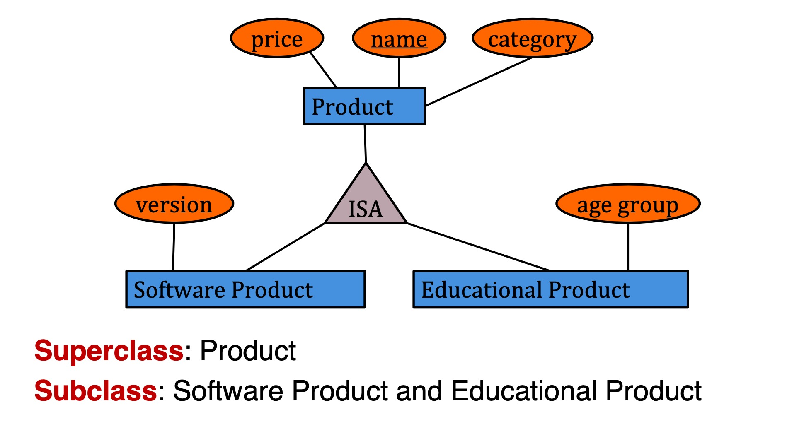

- Option 1: Don't care about subclass relationship. Build 3 tables.
- Option 2: Similar to option 1, except that all products will be in Product table. Will have duplicates
- Option 3: Only build one table. Judge type by checking whether attribute is null.


# Lec 9. Functional Dependencies

## Functional Dependency (FD)

**FD**s are a form of **constraint**

When two tuples have the same A attributes, their B attributes must be same.

We then say that

- A **functionally determines** B
- $A_1, A_2, \cdots, A_n \rightarrow B_1, B_2, \cdots, B_n$


Given a table with a set of tuples, we can confirm that a FD **seems to be valid**, **definitely invalid**, but we **cannot prove** that a FD is valid.


## Armstrong's Axioms

- **Reflexivity**: universal set can determine subset (e.g. $A,B,C\rightarrow A,B$)

- **Augmentation**: if $X\rightarrow Y$ then $X,Z \rightarrow Y,Z$  (add attrib on both sides) 
- **Transitivity**:  if $X\rightarrow Y$ and $Y \rightarrow Z$, then $X\rightarrow Z$


## Closure algorithm

**FD Closure**: if F is a set of FDs, the **closure** $F^+$ is the set of all FDs **logically implied** by F

Armstrong's axioms are:

- **sound**: any FD generated by an axiom $\in$ $F^+$
- **complete**: can generate all $F^+$

**Attribute Closure**: If X is an attribute set, the **closure** $X^+$ is the set of all attributes B that $X\rightarrow B$


## Keys and Superkeys

**superkey**: a set of attributes that can determine all other attributes.

**key** (candidate key): a minimal superkey.

If a relation has multiple keys, we specify one to be **primary key**.


If $X^+$ = all attributes, then X is a **superkey**.

If no subset of X is a superkey, then X is also a **key**.


# Lec 10. Decomposition & Normalization I

## Decomposition

Decompose a relation into multiple relations.


|      | Lossless Join | Dependency preserving |
| ---- | ------------- | --------------------- |
| BCNF | Yes           | Not always            |
| 3NF  | Yes           | Yes                   |

## Lossless-Join Decomposition

A **natural join** is a join on the same attribute names.

A schema decomposition is **lossless-join** if $R=R'$(natural join result) for any initial instance R.

**Theorem**: Let R be a relation and F be a sets of FDs that hold over R. The decomposition of R into R1 and R2 is lossless if and only if

- $F^+$ contains either $R1 \cap R2 \rightarrow R1$ or 
- $R1 \cap R2 \rightarrow R2$

(The common attributes must contain a key for / functionally determines either R1 or R2) 

If $X\rightarrow Y$ and $X\cap Y$ is empty, the decomposition into $R-Y$ and $XY$ is lossless.


## Boyce-Codd Normal Form (BCNF)

A relation R is in **BCNF** if whenever $X\rightarrow B$ is a non-trivial FD, $X$ is a superkey.

Equivalent Definition: For every attribute set $X$, the closure of it is itself or all attributes.

The only **nontrivial dependencies** are those in which a key determines some attributes.


## Normalization

Decompose into BCNF. (Keep decomposing until all relation is in BCNF).


**Dependency-preserving**: A decomposition is dependency preserving if by enforcing F1 over R1 and F2 over R2, we can enforce F over R.


# Lec 11. Decomposition & Normalization II

## Dependency-preserving decomposition

- The **Projection** of FD $F$ on attribute set $X$ is: the set of FDs in the closure $F^+$ that involve only attributes in $X$.
- The decomposition of R is **dependency-preserving** if $(F_X \cup F_Y)^+ = F^+$

## Third Normal Form (3NF)

A relation $R$ is in **3NF** if whenever $X\rightarrow A$, one of the following is true:

- $A \in X$ (i.e. trivial FD)
- $X$ is a superkey
- $A$ is part of some key in $R$

BCNF implies 3NF. (BCNF is more strict).


**Every relation** schema can be **decomposed into** a collection of **3NF relations** using only decompositions that are **lossless-join and dependency-preserving**.


## Minimal cover of FDs

A **minimal cover** for a set $F$ of FDs is $G$ such that

- every dependency in $G$ is the form $X\rightarrow A$ where A is a **single attribute**
- Closure $F^+$ = Closure $G^+$
- Deleting any dependency or attribute in $G$, $F^+ \neq G^+$

Calculate minimal cover:

- Step 1: Split the right hand side to single attributes
- Step 2: Remove redundant FDs
- Step 3: Clean up the left hand side


## Decomposition into 3NF

- Step 1: Compute a **minimal cover** $F$
- Step 2: Apply the algorithm for BCNF decomposition until all relations are in 3NF (early-stopping)
- Step 3: For each non-preserved FD $X\rightarrow A$ in $F$, add a new relation $R(X,A)$


# Lec 12. Relational Algebra I

## Relational Query Language

Allow the manipulation and retrieval of data from a database

Two types

- **Declarative**: describe what a user wants, rather than how to compute (SQL is declarative)
- **Procedural**: represent execution plan

## Relational Algebra

an algebra whose **operands** are **relations** or variables that represent relations


Two types of notation for attributes

- **positional** (e.g. 第几列)
- **named-field** (e.g. 列的名称 Person.id)

SQL uses **multisets**, but in Relational Algebra we will consider relations as **sets** (无重复, DISTINCT)


## Basic operations

### 1. Selection

$\sigma_C(R)$

- C是条件
- e.g. $\sigma_{rating>7 \land age < 45}(S1)$
- output schema = input schema

### 2. Projection

$\pi_{A_1, A_2, \cdots, A_n}(R)$

- 选择一部分columns, 且去除重复的tuples
- output schema: $R(A_1, \cdots, A_n)$
- e.g. $\pi_{sname, rating}(S1)$

### 3. Set union

$R_1 \cup R_2$

- $R_1$ and $R_2$ must be **union-compatible** (相同schema); 输出 schema 与输入相同
- output all tuples in $R_1$ **or** $R_2$, 且会去重

### 4. Set intersection

$R_1 \cap R_2$

- $R_1$ and $R_2$ must be **union-compatible**
- output all tuples in $R_1$ **and** $R_2$
- Can be defined by: $R_1 \cap R_2 = R_1 - (R_1 - R_2)$

### 5. Set difference

$R_1 - R_2$

- must be **union-compatible**
- output all tuples **in** $R_1$ **and not in** $R_2$

### 6. Cross product

$R_1 \times R_2$

- For every row in $R_1$, pair with every row in $R_2$
- Input $R_1(A_1, \cdots, A_n),R_2(B_1, \cdots, B_m)$, output $R(A_1, \cdots, A_n, B_1, \cdots, B_m)$

- attribute names 继承原来的名字, 但遇到 **naming conflict** 时会被 **unnamed** 并只能用position访问

### 7. Renaming

$\rho(S(F), R)$

- Rename relation $R$ to $S$, rename attributes according to $F$
- e.g. $\rho(C(1\rightarrow sid1, 5\rightarrow sid2), S1 \times R1)$


## Derived Operations

### 1. Join (Theta Join)

$R_1 \Join_{\theta} R_2 = \sigma_{\theta} (R_1 \times R_2)$

- can be defined by: cross product followed by a selection
- $\theta$ 可以是条件
- might have less tuples than the cross product
- e.g. $S_1 \Join_{S_1.sid < S_2.sid} R_1$

### 2. Equi-Join

$R_1 \Join_{\theta} R_2$

- Special case of Theta Join: condition $\theta$ contains only equalities between attributes (是theta join的特例, 条件必须是attribute相等的条件)
- Output schema: Fields of $R_1$ followed by fields of $R_2$ that do not appear in the join conditions (相同的attributes只会留一个)

### 3. Natural Join

$R\Join S$

- Special case of equi-join where equalities are specified on all fields having the same name in $R$ and $S$.
- 如果 $R$ 和 $S$ 无同名 attributes, 相当于 cross-product
- 如果 $R$ 和 $S$ 的 schema 完全相同，相当于 intersection


# Lec 13. Relational Algebra II

### Division

$R_1 / R_2$

- Suppose $R_1(A,B)$ and $R_2(B)$
- Output contains all values $a$ such that for every tuple $b$ in $R_2$ tuple $(a,b)$ is in $R_1$
- Output schema $R(A)$
- $A/B$ is the largest relation instance $Q$ such that $Q\times B \subseteq A$

TODO


# Lec 14. Data Storage

## DBMS architecture

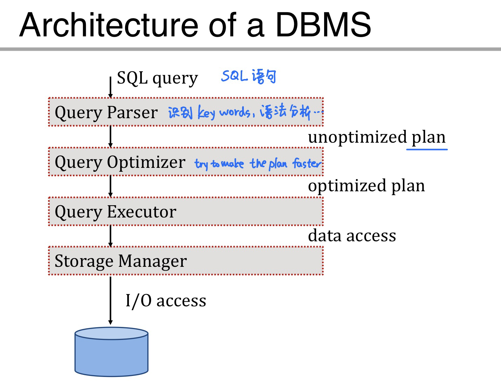

- **Primary storage**: main memory 内存 存储当前需要用到的data
- **Secondary storage**: disk 硬盘
- **Tertiary storage**: Tapes 用于 archive older versions of the data 

Use **buffer manager** to move data from disk to main memory


## Disk

Secondary storage

Data is stored and retrieved in units called **disk blocks**.

### Components of disks

- **Platter** 盘片 数据存在这里
- **Spindle** 旋转
- **Disk head** 磁头 读取数据
- **Disk arm**

Data is encoded in concentric circles of **sectors** called **tracks**.

**Block size**: multiple of sector size (fixed)

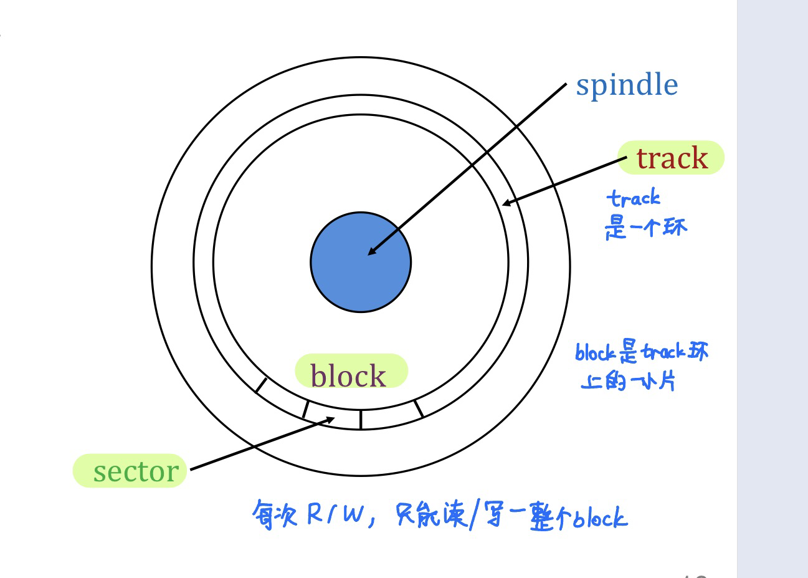

Access time = **seek time** + **rotational delay** + **transfer time**


## Other storage devices

- **SRAM**: static random-access memory (CPU内的高速缓存)
- **DRAM**: dynamic random-access memory 内存
- **SSD**: solid state drive 固态硬盘
- **NVM**: non-volatile memory 介于DRAM和SSD中间, non-volatile + byte addressable


# Lec 15. Buffer management

## Group by aggregation

$\gamma_{X, Agg(Y)}(R)$

- group by attributes in X
- aggregate by the attribute in Y
  - SUM, COUNT, AVG, MIN, MAX


## Buffer management

Buffer manager: DBMS中的一个模块, 负责处理在disk和memory中移动数据

TODO


--------

# Lec 16. File Organization

**DBMS vs. OS file system**

DBMS is better at predicting the reference patterns


The disk space is organized into **files**

- **File**: a collection of **pages**
- **Page**: a collection of **records**


## Heap files

**Unordered** (heap) files

contain the records in no particular order

As file grows/shrinks, disk pages are allocated/deallocated

To support **scan**: keep track of all pages in each heap file

To support **insertion**: keep track of pages that contain free space


### Heap file as linked list

Each page has 2 pointers + data (**pointer = page id**)

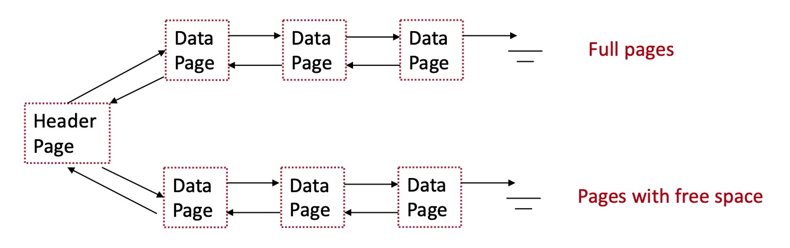

Limitation: may examine multiple pages to find enough free space (more IO cost)

### Heap file as page directory


# Lec 21. Hashing

## Static hashing

A **hash index** is a collection of **buckets**

- **bucket = primary page + overflow pages**
- each bucket contains index entries
- To find the bucket for each record, **apply a hash function** $h$
- $h$ **maps a search key to** one of the **buckets**

### Equality search (search key = value)

- apply hash function on search key to locate bucket
- scan through the bucket
- IO cost = 1 + number of overflow pages

### Insertion

- Find appropriate bucket, insert the record
- if no space, create an overflow page

### Deletion

- Find appropriate bucket, delete the record
- If it is the last record in an overflow page, remove the page

### Hash functions

A good hash function is **uniform** (each bucket is assigned same # of values) and **fast to compute**.

$h(value)=(a\times value + b)$ works well in practice.

### Limitations

- In static hashing, **fixed number of buckets**
- **Rehashing**
  - Problem 1: **expensive computation** and data movement
  - Problem 2: **block query execution** (cannot access hashtable during rehashing)


## Extendible hashing

**Intuition**: when a bucket overflows, **reorganize only the overflowing bucket** (rather than all buckets)

Extendible hasing is a type of dynamic hashing

- keeps **a directory of pointers to buckets**
- overflow, reorganizes index by **doubling the directory**

### Search

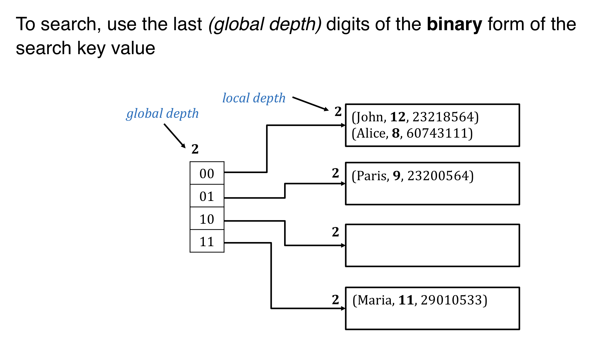

### Insertion and split

If the bucket is not full, directly add the record.

If the bucket is full:

- Step 1: allocate a new bucket and redistribute entries

  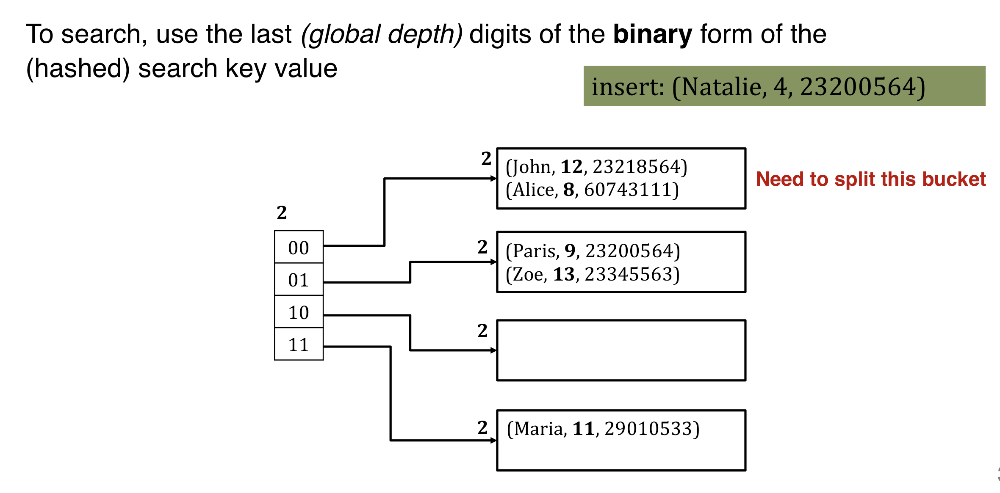

	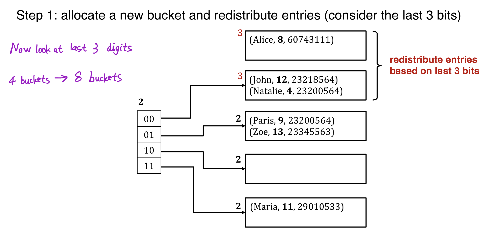
	
- Step 2: double the directory (global depth++)

  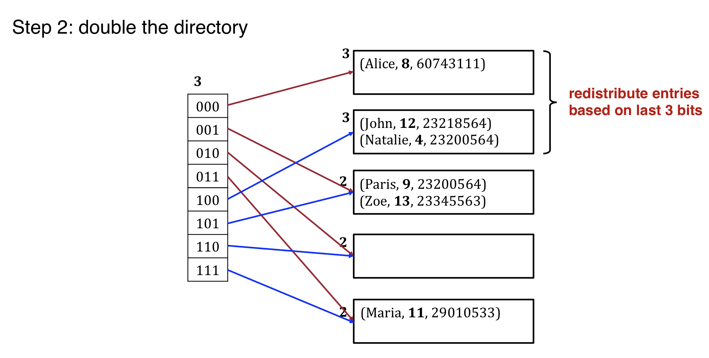

Global and local depth:

- **global depth**: how many bits to use to find the bucket
- **local depth**: incremented upon bucket split. 
- double directory if local depth = global depth and bucket is full.
- 在bucket split时, 增加local depth, 但 local depth 不能大于 global depth


The directory(指针集合) is much smaller than buckets and can typically fit in memory.


### Delete

Locate the bucket and remove the record.

If the bucket is empty, it can be removed (and update the directory)

2 buckets can coalesced together if sum of entries fit in a single bucket.

Decreasing the size of directory can also be done, but it is expensive.


# Lec 22. B+ Tree

Hash index accelerates **equality search**.

Tree-based index accelerates both **equality** and **range search**.

## B+ tree structure

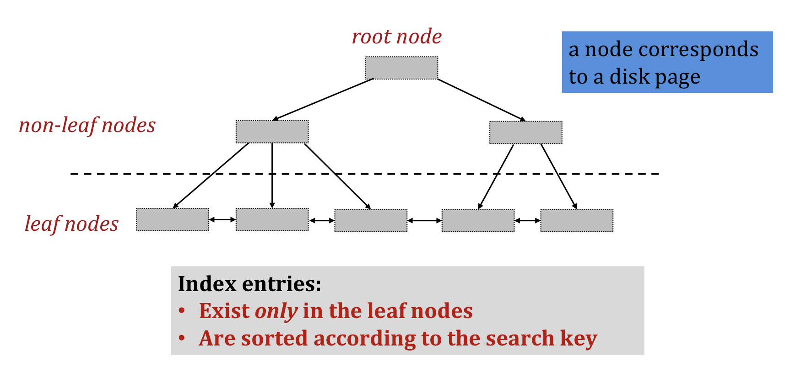

- The parameter $d$ is the **order** of the tree.

- Each node contains $[d, 2d]$ entries. (至少半满 50% occupancy, 否则浪费空间)

- But root node can have $[1, 2d]$ entries

- A **non-leaf (internal) node** with $m$ entries has $m+1$ pointers 

  

- A **leaf node** with $m$ entries has $m$ pointers to records, and ptrs to next and prev leaves


## B+ tree operations

### Search

- Start from root node
- Examine index entries in non-leaf nodes to find correct child
- traverse down until a leaf node reached
  - equality search: done
  - range search: traverse leaves sequentially

### Insertion

- Search: find the leaf node $L$ where the entry belongs

- Insert data entry in L

  - If L has enough space, Done
  - Otherwise, we must split $L$ (recursively)

  TODO:

### Deletion

- Find leaf node $L$
- Remove the entry
  - If $L$ is at least half-full, done
  - If $L$ has only $d-1$ entries
    - try to redistribute borrowing entries from a neighboring sibling
    - if redistribution fails, merge $L$ and sibling (must delete an entry from the parent of $L$)


# Lec 24. B+ Tree & Bitmaps

### Duplicate search keys in B+ Tree

**Solution #1**: use overflow pages

**Solution #2**: consider <key,rid> as the new unique key


### Fan-out 

Fan-out **f**: the **number of pointers to child nodes** coming out of a **non-leaf node**.

binary trees 的 fan-out 是 2; B+ tree 的 fan-out 是 ($d+1\leq f \leq 2d+1$)

### Fill-factor

Fill-factor **F**: the **percent of available slots** in the B+ tree that are **filled** ($0.5<F<1$)

通常 <1 这样方便插入

### Height

Height **H**: non-leaf nodes 的 level 数量 

- 如果只有root node则height=0
- IO requirement for each search = h


### Key compression

非叶子节点可以不存整个key, 只存key的前面一部分


## Bitmap index

..


## Bit-slice index

...


- Bitmap are better for **low cardinality** domains (e.g. 仅三种可能的值(true,false,null) 则bitmap更合适)
- Bit-slices are better for **high cardinality** domains
- Both are more space efficient than B+ tree.
- 缺点: 插入的时候要移动很多bit


# Lec 25. Advanced indexes

## Log-structured merge tree (LSM)

(对于log文件, 仅append到尾部, 复杂度O(1)并且是sequential IO)

**LSM tree**: optimizes for writes (by log structure) while maintaining good search performance.


### Simple version: 2-level LSM Tree

分C0 tree和C1 tree

- **Insert** into C0 tree
- **Lookup**: seach in both C0 and C1
- **Rolling merge**: when C0 is full, merge a portion of it to C1 (merge 之后数据是 sorted 的)

C1 tree中的B+tree可以100% full.


...


# Lec 27. Relational Operators I

## Selection operator

**Selectivity**: 满足条件的 tuple 数量占比

- **File scan**: 扫描全部 复杂度O(N)

- **Index scan**
  - Hash index: O(1) 但仅可用于 equality predicates
  - B+ tree index:   **(height + X) I/Os**
    - **clustered**: X = #selected records / records per page
    - **unclustered**: X = # selected tuples in the worst case

### **Conjunctive Normal Form (CNF)**

(不要与 BCNF, 3NF 混淆!)

CNF的形式: $(A\or B \or C) \and (D \or E)$ 

Every selection condition can be expressed in CNF.

### Index matching

Index matching: An index **matches a selection condition** if the index can be used to retrieve tuples that satisfy the condition.

Hash index match 的条件: equality predicate for each attribute in the search key

B+ tree index match: prefix of search key

(B+ tree index 不要求=, > < >= 等也可以; 不要求 each predicate, 是 prefix 即可)

### Selection with disjunction

- If a subset of terms in a disjunction has matching indexes
  - e.g. A=7 OR B=5, hash index on A 不行
- If every term in a disjunction has a matching index
  - e.g A=7 OR B>5, hash index on A & B+ tree on B,
  - take the union of rid


## Projection

SELECT DISTINCT

Two approaches to eliminate duplicates

- **sort based**
- **hash based**


# Lec 28. Relational Operators II

## Join

### Nested loop join

naive implementation

- **Tuple granularity**

  ```
  for each tuple t_r in R
  	for each tuple t_s in S
  		join t_r with t_s if condition satisfied
  ```

  IO cost = $M_R + M_S \cdot T_R$

  - $M_R$ = number of pages in R

  - $M_S$ = number of pages in S

  - $T_R$ = number of tuples in R

- **Page granularity**

  ```
  for each page P_r in R
  	for each page P_s in S
  		join tuples in P_r with tuples in P_s 
  ```

  IO cost = $M_R + M_S \cdot M_R$

  requires more CPU computation for each loop iteration

### Blocked nested loop join

B = number of pages in buffer pool

```
for each block of (B-2) pages in R
	for each page P_S in S
		join tuples in the block with tuples in P_S
```

(将B-2个page和另1个page作join, 而不是仅将2个page join)

IO cost = $M_R + M_S\cdot\lceil \frac{M_R}{B-2}\rceil$

​	if R fits in memory, IO cost = $M_R + M_S$

### Index nested loop join

```
for each tuple t_R in R
	probe the index of S to retrieve matching tuples
```

S has an index on the join attribute

好处: 不需要扫描整个S

IO cost = $M_R + |T_R| \cdot I^*$  

($I^*$ is the IO cost for searching an index)

### Sort merge join

- **Step 1**: Sort R and S on the join attribute using external merge sort (R和S都要按照join key排序)
- **Step 2**: Read the sorted relations in the buffer and merge
  - 用类似于 merge sort 中的 merge 方法
  - 对于 duplicates, 需要 **backup**
  - IO cost of read and merge = 
    - no backup: $M_R + M_S$
    - backup: $M_R \cdot M_S$ (最坏情况是所有的key都相同, 两两join)
- 如果R和S已经按照join attribute排序则可以跳过第一步


### Hash join


# Lec 30. Query Optimization I

Convention: left child is the outer table

**Materialize**: create a temporary table to hold the intermediate results


Joins are commutative (交换律) and associative (结合律)

Many databases consider only **left-deep plans**

# Lec 31. Query Optimization II

## System catalog

**Catalog tables**: special tables that store the descriptive information of every table and index

Information in the catalog:

- for each table: table name, file name, attribute name & type, index name, ...
- for each index: index name, structure, search key
- for each view: view name & definition

## Cost estimation

**Table cardinality**: the number of tuples **NTuples(R)** (unique rows) for each table R

**Table size**: **NPages(R)**

**Index cardinality**: the number of distinct key values **NKeys(I)** for each index I

**Index size**: the number of pages **INPages(I)** for each index I (for B+ tree index, INPages = number of leaf pages)

**Index height**: the number of nonleaf levels **IHeight(I)** for each index I

**Index range**: the min present key value **ILow(I)** and max **IHigh(I)** for each index I


### Computational cost estimation

**reduction factor**: ratio of the expected result size to the input size

**estimated output size** = max size * product of the reduction factors for the terms in the WHERE clause


### IO cost estimation


# Lec 32. Concurrency control

## Transaction basics

Transaction: a sequence of many actions considered to be one **atomic** unit of work

1 transaction can contain multiple actions

### ACID properties

- **Atomicity**: 所有的action要么全部发生要么全不发生

- **Consistency**: 经过 transaction 之后必须仍然consistent (合法, e.g 满足constraints)

- **Isolation**: transaction的执行相互隔离

  - Strong isolation level

    **Serializability**: Execution of transactions produces the same results as some serial execution

- **Durability**: once a transaction commits, its effects must persist


**Naive DB**

satisfies: atomicity, serializable, isolation, durability

disadvantage: performance


## Two-phase locking (2PL)

naive DB: DB-granularity exclusive locking

**2PL**: **fine-grained locking**

- A lock is in **shared (for read)** or **exclusive (for write)** mode
- growing phase: acquire but do not release locks
- shrinking phase: release but do not acquire locks
- 2PL is serializable
- Deadlock is a challenge

Deadlock 

- deadlock detection: DBMS维护waits-for graph并周期性检查是否有cycles, 如果有则强制abort一条transaction来破坏cycle
- **no-wait**: 一条transaction碰到conflict的时候自己主动abort
  - no wait, no deadline
  - disadvantage: **starvation**: one transaction always aborts
- **wait-die**: 遇到conflict时, 如果自己优先级更高则wait, 优先级低则self-abort
  - no deadlock, no starvation
- **wound-wait**: 遇到conflict时, 如果自己优先级更高则preemptively abort别人, 优先级低则自己等待
  - no deadlock, no starvation


# Lec 33. Optimistic concurrency control

## pessimistic concurrency control

**Strict 2PL**

- acquire the right type of locks (write data - exclusive lock, read data - shared lock)
- release all locks together only after the transaction commits or aborts (必须在commit或abort之后才能release锁, 且必须一次release完所有的锁, 不能gradually)

## Centralized OCC

key idea: ignore conflicts during transaction execution, resolve conflicts lazily only at a transaction's completion time

### Read phase

- twrite: write to local write set (no modification to the database)

- tread: read from either the local write set or the database
- tdelete: mark delete in local delete set (no modification to the database)

### Validation phase

transaction i 进入 validation phase 时会赋一个 transaction number $t(i)$

(transaction number 递增)

TODO

### Write phase

把local buffer中的东西写入database

(all written values become global; all created nodes become accessible; all deleted nodes become inaccessible)


## Parallel OCC 
