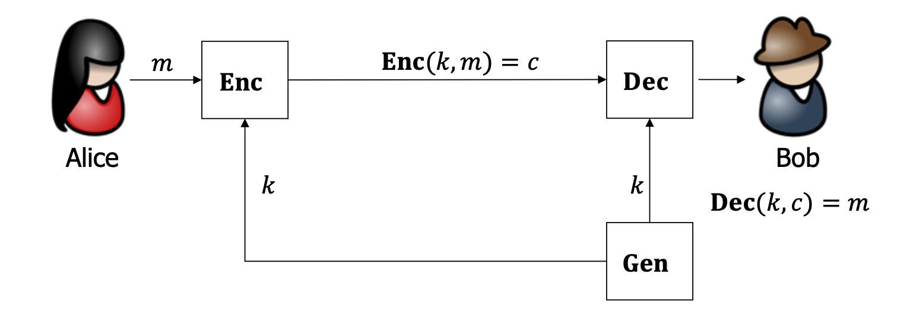
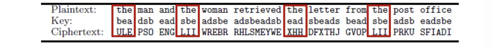
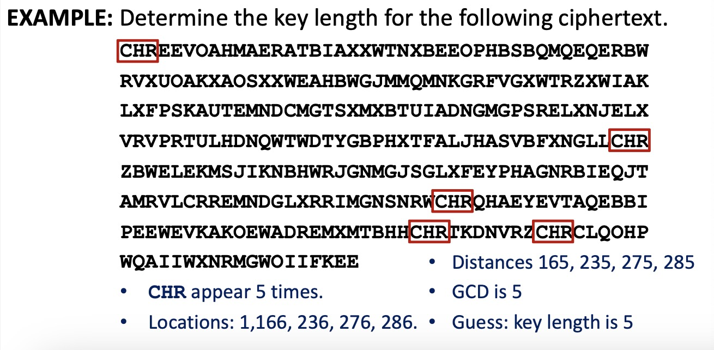

# Lecture 1

## Information security

The **protection** of information and information systems from unauthorized access, use, disclosure, disruption, modification, or destruction in order to provide **confidentiality, integrity, and availability**.

- **Confidentiality**: the property that sensitive information is **not disclosed** to **unauthorized** individuals, entities, or processes.

- **Integrity**: the property that sensitive data has **not been modified or deleted** in an **unauthorized and undetected** manner. 
- **Authentication**: the process of establishing confidence in the identity of users or information systems.
- **Non-Repudiation**: assurance that the sender of information is provided with proof of delivery and the recipient is provided with proof of the sender's identity, so neither can later deny having processed the information.

## Course outline

- classical cryptography
- private-key cryptography
- public-key cryptography
- advanced topics

# Lecture 2

## Private-key Encryption (PrivKE)

> - $\mathrm{Gen}$ = key generation, $\mathrm{Enc}$ = encryption, $\mathrm{Dec}$ = decryption
> - $k$ = secret key, $m$ = plaintext (message), $c$ = ciphertext
> - $\mathcal{K}$ = key space, $\mathcal{M}$ = plaintext space, $\mathcal{C}$ = ciphertext space

- $\mathrm{PrivKE} = (\mathrm{Gen, Enc, Dec}) + \mathcal{M}$
  - **Correctness**: $\mathrm{Dec(k, \mathrm{Enc}(k, m)) = m}$
  - **Security**: the adversary should not be able to learn $m$ from $c$

## Kerchkhoff's Principle

**Kerchkhoff's Principle**: The **cipher method must not be required to be secret**, and it must be able to fall into the hands of the enemy without inconvenience. 

Kerchkhoff原则: 加密算法应该公开, 唯一需要保密的是通信双方共享的秘密密钥.

## Shift Cipher 移位加密

Scheme: $c_i = m_i + k$

### Brute-force attack 穷举法攻击

**Brute-force attack / Exhaustive attack**: try all possible secret keys 

**Sufficient Key Space Principle**: key space $|\mathcal{K}|$ should be large enough

密钥空间充分性原则: 任何安全的加密方案必须拥有一个能够抵御穷举搜索的密钥空间

### Improved attack

Drawbacks of brute-force attack: difficult for a computer to check whether a given text "makes sense". => Improved and automated attack:

$p_i$ = the frequency of the $i$-th letter in a normal English text
$$
\sum_{i=0}^{25} p_i^2 \approx 0.065
$$
$q_i$ = the frequency of the $i$-th letter in the ciphertext

Idea: Find the secret key $k$ such that (the most closest to 0.065)
$$
\sum_{i=0}^{25} p_i q_{i+k} \approx 0.065
$$

## Substitution Cipher 单字母替换加密

Scheme: $c_i = \sigma(m_i)$

- Key space is large for brute-force attack.

- Still not secure! Can be broken letter frequency analysis. 可通过字母频率破解.

## Vigenere Cipher 多字母移位加密

Scheme: $c_i$ = the letter obtained by shifting $m_i$ forward $k_{(i\  \mathrm{mod}\  t) + 1}$ positions

- Key space is infinite in theory. In addition, same letter in plaintext can be mapped into different letters in ciphertext

- Still not secure! 

  - **Kasiski's method**: two identical segments of plaintext may be encrypted to same ciphertext if their distance is a multiple of key length $t$. 

    Search for pairs of identical segments → record distances → calculate GCD

    Find the key length $t$ and then break $t$ shift ciphers.

    

# Lecture 3.

## Classical & Modern Cryptograohy

- **Classical cryptography**: art, not science
  - no formal definition of security
  - no proof of security
  - all historical ciphers have been badly broken (ciphertext $c$ → adversary can recover both message $m$ and secret key $k$ )

- **Modern cryptography**: a science
  - Principles: 现代密码学的三个原则
    1. **Formal definitions of security** 形式化的安全定义
    1. **Precise assumptions** 准确的假设
    1. **Proofs of security** 严格的安全证明

## Formal definitions of security

Good definition: It should be impossible for an adversary to learn any additional information of $m$ from $c$.

Security Guarantee

如果没有敌手能够从密文中计算任何关于明文的函数，则加密方案是安全的.

**Threat model**: defines the power of the adversary

Typical threat models for private-key encryption (**COA, KPA, CPA, CCA**)

- **Ciphertext-only Attack (COA)** 密文攻击
  - Adversary observes ciphertext
  - It tries to determine the plaintext
  - 最基本的攻击方式: 敌手只能观察到密文, 试图确定对应的明文
- **Known-Plaintext Attack (KPA)** 已知明文攻击
  - Adversary learns pairs of plaintext and ciphertext generated using some key
  - It tries to determine information about the plaintext of some other ciphertext produced using the same key.
  - 敌手学习一个/多个使用相同密钥加密的明文/密文对, 目标是确定其它使用相同密钥加密的密文对应的明文
- **Chosen-Plaintext Attack (CPA)** 选择明文攻击
  - Adversary obtains plaintext/ciphertext pairs for plaintexts of its choice 
  - It tries to determine the plaintext of some other ciphertext produced using the same key.
  - 攻击者能够选择一段明文, 欺骗A或B帮他加密得到密文; 试图确定其它密文对应的明文
- **Chosen-ciphertext Attack (CCA)** 选择密文攻击
  - Adversary obtains plaintext/ciphertext pairs for plaintexts/ciphertexts of its choice. 
  - It tries to determine plaintext of some other ciphertext produced using the same key
  - 敌手不仅能做CPA, 还能选择一段密文欺骗A或B帮他解密

**A security definition looks like**: a cryptographic scheme for a given task is secure if no adversary of **a specific power** (指定攻击者的power) can achieve a **specified break** (指定攻击类型).

## Precise Assumptions

**Assumption** (假设): Statements that are not proven but conjectured to be true 未经证明但猜测为真的命题

E.g The integer factoring problem / discrete logarithm problem is hard.

(The integer factoring problem 大整数分解问题)

## Proofs of security

**Provable security**: If the designed cryptographic scheme can be broken by an adversary, then the underlying assumption is false. (类似于反证法: 假设方案不安全，adv能攻破，推出assumption不成立)

If the scheme is not secure, then a well-known hard problem can be solved in polynomial time.

# Lecture 4.

## Probability

概率论基本知识, 略

### Distributions on $\mathcal{K,M,C}$

- **Secret Key** $K$: output of $\mathrm{Gen}$, an r.v. taking values in $\mathcal{K}$
  - $\mathrm{Pr}[K=k]$, determined by **key generation** algorithm
  - e.g. $K$ is uniform (均匀分布) in shift cipher / substitution cipher
- **Plaintext** $M$: 
  - $\mathrm{Pr}[M=m]$, determined by sender's preference (明文的先验概率)
- **Ciphertext** $C$: output of $\mathrm{Enc}(K,M)$
  - $\mathrm{Pr}[C=c]$

**Fundamental assumption**: K,M are independent random variables.

基本假设: K M 独立

## Perfect Secrecy 完善保密性

- **Definition**: $\Pi = (\mathrm{Gen, Enc, Dec}) + \mathcal{M}$ is perfectly secret if

  - $\forall$ distribution $M$, $\forall m\in M$, $\forall c\in C$ with $\mathrm{Pr[C=c]} > 0$, 

    $\mathrm{Pr}[M=m|C=c] = \mathrm{Pr}[M=m]$

- Perfect secrecy requires $M,C$ to be independent

  明文的概率分布和密文概率分布无关

- For simplicity, assume $\mathrm{Pr[C=c]} > 0$

- Security guarantee: The adversary learns no additional information about $m$ given $c$. 

  敌手获得密文c之前和之后，对明文m的认识没有改变（对明文m的后验概率分布和先验概率分布一致）

- **Theorem**: $\Pi$ is perfectly secret if and only if 

  - $\forall m, m' \in \mathcal{M}, \forall c \in \mathcal{C}$

    $\mathrm{Pr}[\mathrm{Enc}(K,m) = c] = \mathrm{Pr}[\mathrm{Enc}(K,m') = c]$

## One-Time Pad

**Scheme**:

- $\mathrm{Gen}$: $k = {\{0,1\}}^n$
- $\mathrm{Enc}$: $c = k \oplus m$ (密文是明文和key逐位取**异或**)
- $\mathrm{Dec}$: $m = k \oplus c$

**Theorem**: one-time pad **is perfectly secret**.

- $\mathrm{Pr}[C=c|M=m] = \mathrm{Pr}[C=c|M=m'] = 2^{-n}$

**Drawbacks**:

- **long secret key** (as long as message) 密钥长度与明文长度相同, 太长了

  **Kerckhoffs** (是Kerckhoff提出的另一个原则): **It must be possible to communicate and remember the key without using written notes**, and correspondents must be able to change or modify it as will. 

- **one-time** security: same key cannot be used more than once

