# Lecture 1

## Information security

The **protection** of information and information systems from unauthorized access, use, disclosure, disruption, modification, or destruction in order to provide **confidentiality, integrity, and availability**.

- **Confidentiality**: the property that sensitive information is **not disclosed** to **unauthorized** individuals, entities, or processes. 

- **Integrity**: the property that sensitive data has **not been modified or deleted** in an **unauthorized and undetected** manner. 
- **Authentication**: the process of establishing confidence in the identity of users or information systems.
- **Non-Repudiation**: assurance that the sender of information is provided with proof of delivery and the recipient is provided with proof of the sender's identity, so neither can later deny having processed the information.

## Course outline

- classical cryptography
- private-key cryptography
- public-key cryptography
- advanced topics

# Lecture 2

## Private-key Encryption (PrivKE)

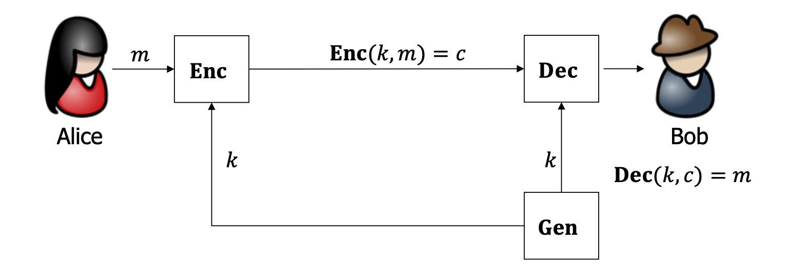

> - $\mathrm{Gen}$ = key generation, $\mathrm{Enc}$ = encryption, $\mathrm{Dec}$ = decryption
> - $k$ = secret key, $m$ = plaintext (message), $c$ = ciphertext
> - $\mathcal{K}$ = key space, $\mathcal{M}$ = plaintext space, $\mathcal{C}$ = ciphertext space

- $\mathrm{PrivKE} = (\mathrm{Gen, Enc, Dec}) + \mathcal{M}$
  - **Correctness**: $\mathrm{Dec(k, \mathrm{Enc}(k, m)) = m}$
  - **Security**: the adversary should not be able to learn $m$ from $c$

## Kerchkhoff's Principle

**Kerchkhoff's Principle**: The **cipher method must not be required to be secret**, and it must be able to fall into the hands of the enemy without inconvenience. 

Kerchkhoff原则: 加密算法应该公开, 唯一需要保密的是通信双方共享的秘密密钥.

## Shift Cipher 移位加密

Scheme: $c_i = m_i + k$

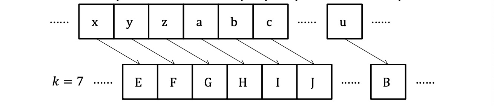

### Brute-force attack 穷举法攻击

**Brute-force attack / Exhaustive attack**: try all possible secret keys 

**Sufficient Key Space Principle**: key space $|\mathcal{K}|$ should be large enough

密钥空间充分性原则: 任何安全的加密方案必须拥有一个能够抵御穷举搜索的密钥空间

### Improved attack

Drawbacks of brute-force attack: difficult for a computer to check whether a given text "makes sense". => **Improved and automated attack**:

$p_i$ = the frequency of the $i$-th letter in a normal English text 英文中字母出现的频率
$$
\sum_{i=0}^{25} p_i^2 \approx 0.065
$$
$q_i$ = the frequency of the $i$-th letter in the ciphertext

Idea: Find the secret key $k$ such that (the most closest to 0.065)
$$
\sum_{i=0}^{25} p_i q_{i+k} \approx 0.065
$$

## Substitution Cipher 单字母替换加密

Scheme: $c_i = \sigma(m_i)$

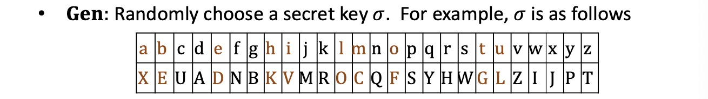

- Key space is large for brute-force attack.

- Still not secure! Can be broken letter frequency analysis. 可通过字母频率破解.

## Vigenere Cipher 多字母移位加密

Scheme: $c_i$ = the letter obtained by shifting $m_i$ forward $k_{(i\  \mathrm{mod}\  t) + 1}$ positions

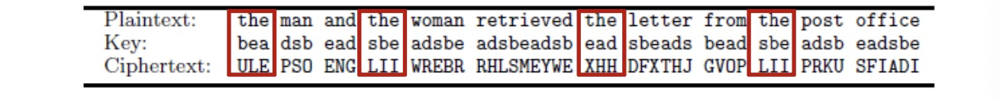

- Key space is infinite in theory. In addition, same letter in plaintext can be mapped into different letters in ciphertext

- Still not secure! 

  - **Kasiski's method**: two identical segments of plaintext may be encrypted to same ciphertext if their distance is a multiple of key length $t$. 

    Search for pairs of identical segments → record distances → calculate GCD

    Find the key length $t$ and then break $t$ shift ciphers.

    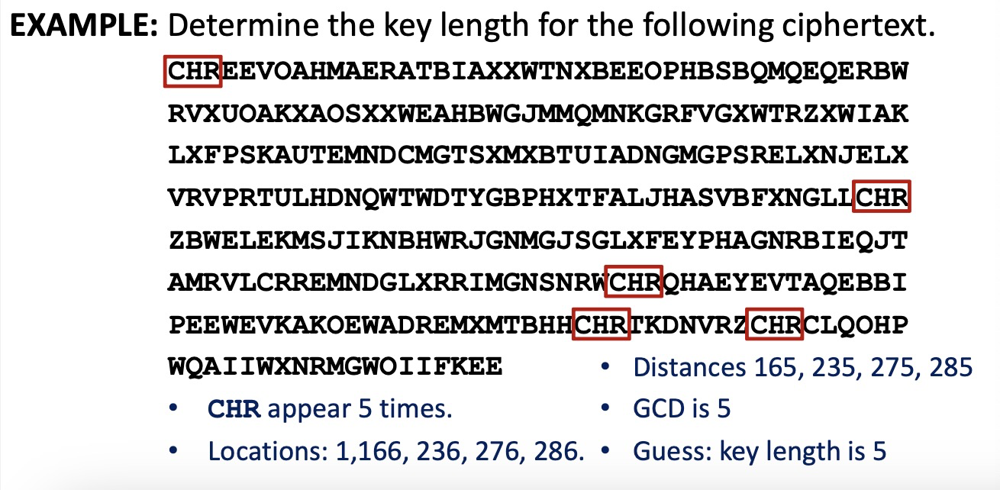

# Lecture 3.

## Classical & Modern Cryptograohy

- **Classical cryptography**: art, not science
  - no formal definition of security
  - no proof of security
  - all historical ciphers have been badly broken (ciphertext $c$ → adversary can recover both message $m$ and secret key $k$ )

- **Modern cryptography**: a science
  - Principles: 现代密码学的三个原则
    1. **Formal definitions of security** 形式化的安全定义
    1. **Precise assumptions** 准确的假设
    1. **Proofs of security** 严格的安全证明

## Formal definitions of security

Good definition: It should be impossible for an adversary to learn any additional information of $m$ from $c$.

Security Guarantee

如果没有敌手能够从密文中计算任何关于明文的函数，则加密方案是安全的.

**Threat model**: defines the power of the adversary

Typical threat models for private-key encryption (**COA, KPA, CPA, CCA**)

- **Ciphertext-only Attack (COA)** 密文攻击
  - Adversary observes ciphertext
  - It tries to determine the plaintext
  - 最基本的攻击方式: 敌手只能观察到密文, 试图确定对应的明文
- **Known-Plaintext Attack (KPA)** 已知明文攻击
  - Adversary learns pairs of plaintext and ciphertext generated using some key
  - It tries to determine information about the plaintext of some other ciphertext produced using the same key.
  - 敌手学习一个/多个使用相同密钥加密的明文/密文对, 目标是确定其它使用相同密钥加密的密文对应的明文
- **Chosen-Plaintext Attack (CPA)** 选择明文攻击
  - Adversary obtains plaintext/ciphertext pairs for plaintexts of its choice 
  - It tries to determine the plaintext of some other ciphertext produced using the same key.
  - 攻击者能够选择一段明文, 得到密文; 试图确定其它密文对应的明文
- **Chosen-ciphertext Attack (CCA)** 选择密文攻击
  
  - Adversary obtains plaintext/ciphertext pairs for plaintexts/ciphertexts of its choice. 
  - It tries to determine plaintext of some other ciphertext produced using the same key
  - 敌手不仅能做CPA(选择一段明文获得密文), 还能选择一段密文获得明文; 试图确定其它密文对应的明文
  
  

**A security definition looks like**: a cryptographic scheme for a given task is secure if no adversary of **a specific power** (指定攻击者的power) can achieve a **specified break** (指定攻击类型).

## Precise Assumptions

**Assumption** (假设): Statements that are not proven but conjectured to be true 未经证明但猜测为真的命题

E.g The integer factoring problem / discrete logarithm problem is hard.

(The integer factoring problem 大整数分解问题)

## Proofs of security

**Provable security**: If the designed cryptographic scheme can be broken by an adversary, then the underlying assumption is false. (类似于反证法: 假设方案不安全，adv能攻破，推出assumption不成立)

If the scheme is not secure, then a well-known hard problem can be solved in polynomial time.

# Lecture 4.

## Distributions on $\mathcal{K,M,C}$

- **Secret Key** $K$: output of $\mathrm{Gen}$, an r.v. taking values in $\mathcal{K}$
  - $\mathrm{Pr}[K=k]$, determined by **key generation** algorithm
  - e.g. $K$ is uniform (均匀分布) in shift cipher / substitution cipher
- **Plaintext** $M$: 
  - $\mathrm{Pr}[M=m]$, determined by sender's preference (明文的先验概率)
- **Ciphertext** $C$: output of $\mathrm{Enc}(K,M)$
  - $\mathrm{Pr}[C=c]$

**Fundamental assumption**: K,M are independent random variables.

基本假设: K M 独立 (密钥和明文是独立选择的)

## Perfect Secrecy 完善保密性

- **Definition**: $\Pi = (\mathrm{Gen, Enc, Dec}) + \mathcal{M}$ is perfectly secret if

  - $\forall$ distribution $M$, $\forall m\in M$, $\forall c\in C$ with $\mathrm{Pr[C=c]} > 0$, 

    $\mathrm{Pr}[M=m|C=c] = \mathrm{Pr}[M=m]$

- Perfect secrecy requires $M,C$ to be independent

  明文的概率分布和密文概率分布无关

- For simplicity, assume $\mathrm{Pr[C=c]} > 0$

- Security guarantee: The adversary learns no additional information about $m$ given $c$. 

  敌手获得密文c之前和之后，对明文m的认识没有改变（对明文m的后验概率分布和先验概率分布一致）

- **Theorem**: $\Pi$ is perfectly secret if and only if 

  - $\forall m, m' \in \mathcal{M}, \forall c \in \mathcal{C}$

    $\mathrm{Pr}[\mathrm{Enc}(K,m) = c] = \mathrm{Pr}[\mathrm{Enc}(K,m') = c]$

## One-Time Pad 一次一密

**Scheme**:

- $\mathrm{Gen}$: $k = {\{0,1\}}^n$（二进制比特串 例如10010101100101) 
- $\mathrm{Enc}$: $c = k \oplus m$ (密文是明文和key逐bit取**异或**)
- $\mathrm{Dec}$: $m = k \oplus c$

**Theorem**: one-time pad **is perfectly secret**.

- $\mathrm{Pr}[C=c|M=m] = \mathrm{Pr}[C=c|M=m'] = 2^{-n}$

**Drawbacks**:

- **long secret key** (as long as message) 密钥长度与明文长度相同, 太长了

  **Kerckhoffs** (是Kerckhoff提出的另一个原则): **It must be possible to communicate and remember the key without using written notes**, and correspondents must be able to change or modify it as will. 

  密钥不能太长, 太长了记不住, 不方便交换和更改密钥

- **one-time** security: same key cannot be used more than once

  两条消息使用同一个密钥加密, 敌手能算出两条消息异或的结果

## Limitations Of Perfect Secrecy 完善保密性的局限

**Theorem**: perfectly secret encryption, $|\mathcal{K}| \geq |\mathcal{M}|$

完善保密的加密方案，密钥空间$\geq$明文空间

## Perfect Indistinguishability 完美不可区分性

Let $\Pi = (\mathrm{Gen, Enc, Dec}) + \mathcal{M}$ be a private-key encryption. 

Define an **adversial indistinguishability experiment** $\mathrm{PrivK}_{\mathcal{A}, \Pi}^{eav}$ (敌手不可区分实验)

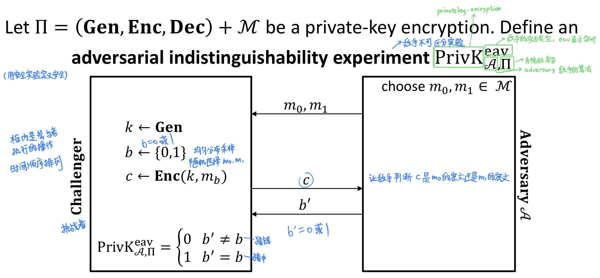

步骤:

- (1) 敌手输出一堆长度相等的消息 $m_0, m_1$
- (2) 选$m_0$或$m_1$进行加密, 让敌手判断这条密文$c$是$m_0$还是$m_1$加密得来的

**Definition**: $\Pi$ is perfectly indistinguishable if for every adversary $\mathcal{A}$,
$$
\mathrm{Pr}\left[
	\mathrm{Priv}_{\mathcal{A},\Pi}^{\mathrm{eav}} = 1
\right] = 1/2
$$
(完美不可区分的定义: 敌手不可区分实验中猜对的概率是1/2)

**Theorem**: $\Pi$ is perfectly secret iff $\Pi$ is perfectly indistinguishable.

完善保密 当且仅当 完美不可区分

# Lecture 5.

## Computational Security 计算安全

Computational security: **two relaxations** for practical encryption

- Security is only guaranteed against efficient **adversaries that run for some feasible amount of time**

  敌手的计算能力有限

- Adversaries can potentially succeed with some very **small probability**

  攻破的概率足够小即可

定义计算安全的两种方式：具体方式 **concrete approach**; 渐进方式 **asympotic approach**

## Concrete Approach

A scheme is $(t, \epsilon)$-secure if any adversary with running time $\leq t$ can succeed in breaking the scheme with probability $\leq \epsilon$.

运行时间最多为 $t$ 的敌手攻破的概率小于 $\epsilon$

### PPT and Negligible

**Polynomial-time algorithm** 多项式时间的算法

**PPT: probabilistic polynomial time** 概率多项式时间

**Negligible**: A function is negligible if for any polynomial function $p()>0$, there exists $N$ such that $f(n) < 1/p(n)$ for all $n>N$

函数可忽略的定义: 对于足够大的n, f(n)的值小于任何一个多项式函数

​	e.g. $f(n) = 2^{-n}$ is negligible

​    e.g. $f(n) = 1/n^{10000}$ is not negligible

等价表述: 对所有常量$c$, 存在一个 $N$ 使得对于所有 $n>N$, $f(n) < n^{-c}$.

**Theorem**: Let $f(n), g(n)$ be negligible and let $p(n)$ be a polynomial, then $f(n) + g(n)$, $p(n)\cdot f(n)$ are both negligible.

## Asymptotic Approach

A scheme is secure if any PPT adversary can succeed in breaking the scheme with at most negligible probability.

如果每个PPT敌手以可忽略函数的概率成功攻破，那么加密方案是安全的

# Lecture 6.

## IND-EAV 

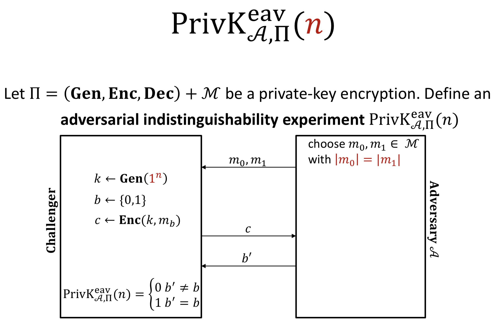

**Indistinguishable encryption in the presense of an eavesdropper (IND-EAV) 窃听者存在情况下的不可区分性**

**Definition** (IND-EAV1): for all PPT adversaries $\mathcal{A}$ there is a negligible function $\mathrm{negl(\cdot)}$ such that
$$
\mathrm{Pr}\left[
	\mathrm{Priv}_{\mathcal{A},\Pi}^{\mathrm{eav}} = 1
\right] \leq \frac{1}{2} + \mathrm{negl}(\cdot)
$$
**Definition**(IND-EAV2): for all PPT adversaries $\mathcal{A}$ there is a negligible function $\mathrm{negl(\cdot)}$ such that
$$
\left|
\mathrm{Pr}\left[out_{\mathcal{A}}(
	\mathrm{Priv}_{\mathcal{A},\Pi}^{\mathrm{eav}}(n,0) = 1
\right]- 
\mathrm{Pr}\left[out_{\mathcal{A}}(
	\mathrm{Priv}_{\mathcal{A},\Pi}^{\mathrm{eav}}(n,1) = 1
\right]
\right|
\leq  \mathrm{negl}(n)
$$

**Theorem**: IND-EAV1 if and only if IND-EAV2

## OTP is IND-EAV

One time padding 具有窃听者存在情况下的不可区分性

## Statistical distance

**Definition**: statistical distance between random variables $X,Y$ that take values in set $R$:
$$
\mathrm{SD}(X,Y) = \frac{1}{2} \sum_{r\in R}|\mathrm{Pr}[X=r] - \mathrm{Pr}[Y=r]|
$$

# Lecture 7. 

## Computational indistinguishability 计算不可区分性

**Definition**: for any PPT distinguisher $\mathcal{D}$, 
$$
|\mathrm{Pr}[\mathcal{D}(1^n, X_n) = 1] - \mathrm{Pr}[\mathcal{D}(1^n, Y_n) = 1]| 
\leq \mathrm{negl}(n)
$$
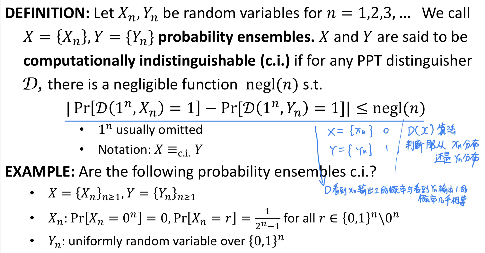

## Pseudorandomness 伪随机性

**Definition**: $U_n$ be uniformly distributed over $\{0,1\}^n$, $X$ is pseudorandom if $X$ and $U=U_n$ are computationally indistinguishable. 

伪随机性的定义: $X$的分布与均匀分布(随机比特串)计算不可区分. 

## PRG (Pseudorandom Generator)

**Definition**: A function $G: \{0,1\}^n \to \{0,1\}^{l(n)}$ is called a PRG if it satisfies the following:

- 1. **effiently computable**: 对所有$x\in \{0,1\}^n$, 多项式时间可以算出 $G(x)$

  2. **expansion**: $l(n) > n$

  3. **pseudorandomness**: $G(U_n)$ is pseudorandom

     ($G(U_n)$ 与真正的随机字符串 $U_{l(n)}$ 不可区分)

## Fixed-length encryption from PRG

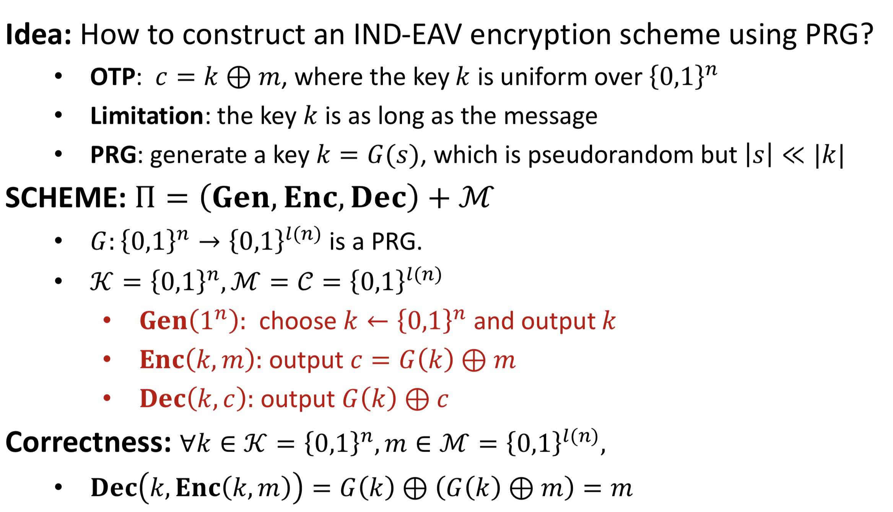

**Theorem**: If $G$ is a PRG, then IND-EAV secure. 

# Lecture 8.

## One-way function  (OWF)

**Definition**: easy to compute + hard to invert 正向容易计算, 反向求逆困难

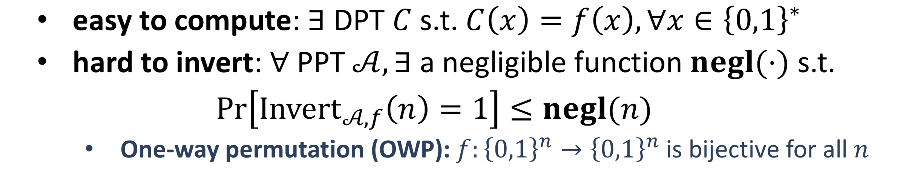

### Inverting experiment

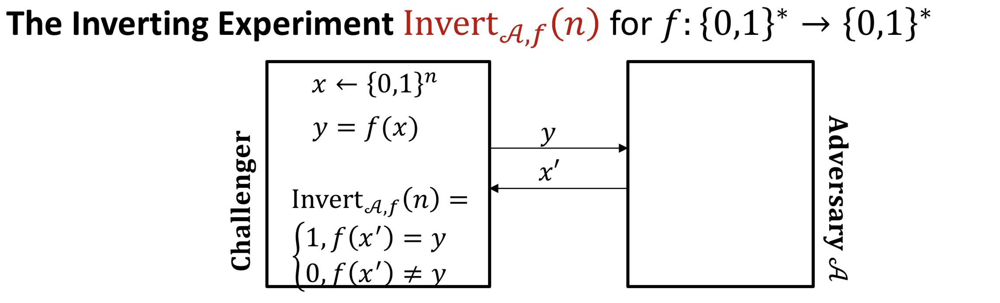

## Hard-Core Predicate (HCP)

**Definition**: 

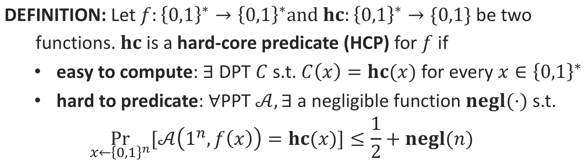

**Goldreich-Levin Theorem**: Assume that OWFs (OWPs) exist. Then there is a OWF (OWP) $g$ and a hard-core predicate $\mathbf{hc}$ for $g$.

**Theorem**: Let $f$ be a OWP and let $\mathbf{hc}(x)$ be a hard-core predicate for $f$. Then $G(x) = (f(x), \mathbf{hc}(x)): \{0,1\}^n \to \{0,1\}^{n+1}$ is a PRG.

## IND-m-EAV

- **Multiple-message eavesdropping experiment**

  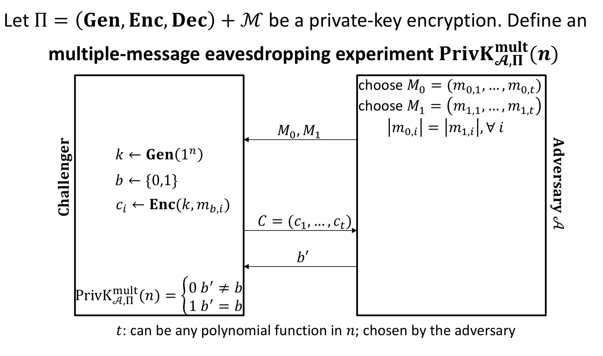

- **indistinguishable multiple encryptions in the presence of an eavesdropper** (IND-m-EAV)

  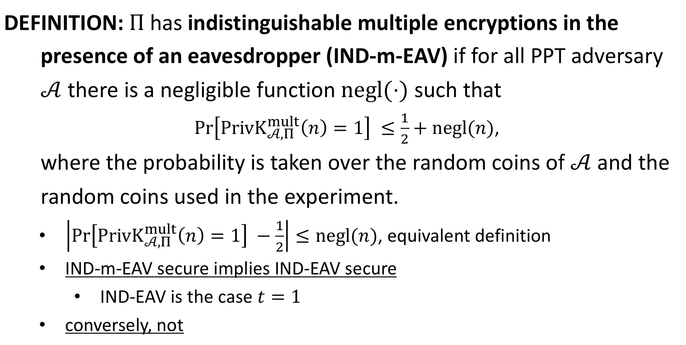

IND-m-EAV $\Rightarrow$ IND-EAV (IND-m-EAV是IND-EAV t=1时的特例)

**Theorem**: If $\Pi$ is stateless and $\mathbf{Enc}$ is deterministic, then not IND-m-EAV secure.

- **stateless**: each invocation of $\mathbf{Enc}$ and $\mathbf{Dec}$ is independent of all prior invocations
- **deterministic**: no random numbers used
- (To be IND-m-EAV secure, must either be stateful or probabilistic)

## IND-CPA

- **indistinguishable encryptions under a chosen-plaintext attack**

  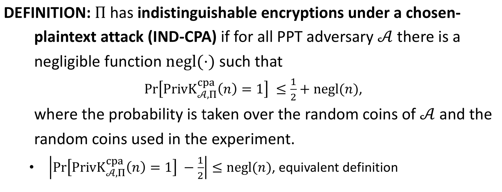



TODO: 这里好多个lecture笔记还没写



# Lecture 12.

## Message Authentication Code (MAC 消息鉴别码)

**Definition**: $\Pi$=(Gen, Mac, Vrfy)

- **Correctness**: Vrfy(k, m, Mac(k,m)) = 1

### Message Authentication Experiment: $\mathrm{Mac-forge}_{\mathcal{A}, \Pi}(n)$

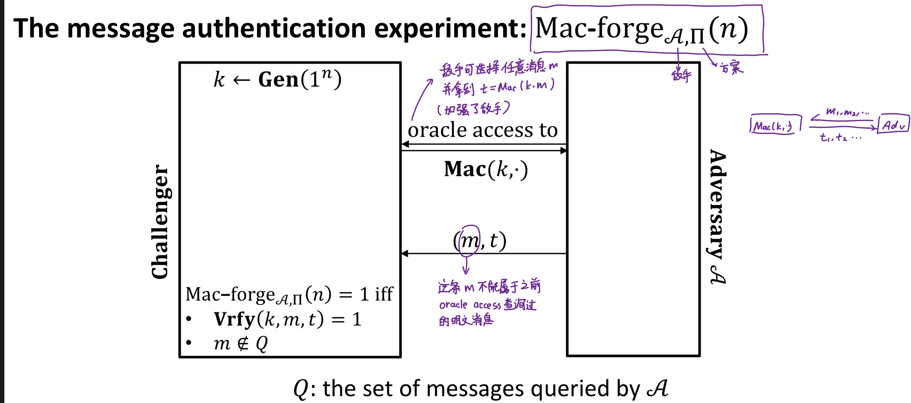

## EUF-CMA

**Definition**: $\Pi$ is **existentially unforgeable under an adaptive chosen-message attack (EUF-CMA)** (自适应选择消息攻击下的存在性不可伪造性) if for all PPT adversary, 
$$
\mathrm{Pr}[\mathrm{Mac-forge}_{\mathcal{A}, \Pi}(n) = 1] 
\leq \mathrm{negl}(n)
$$
**Replay attack**: adversary intercept $(m,t)$ and send it again 敌手可能会发送以前oracle access试过的消息重发一遍

-  sequence numbers / **time stamp** (send $T||m$ instead of $m$)

  可通过给消息加序列号/时间戳防止replay attack

## Fixed-Length MAC from PRF

**Construction**: 

- $F$: $\{0,1\}^n \times \{0,1\}^n \to \{0,1\}^n$, a length-preserving PRF
- $t = F_k(m)$ (fixed-length MAC generated from PRF $F$)

**Theorem**: If $F$ is a PRF, then $\Pi$ is EUF-CMA

## Arbitrary-Length MAC

### Idea

$m=m_1 m_2 \cdots m_d$ ，$t_i = ?$ ， $t=t_1\cdots t_d$

**Idea 1**: $t_i = \mathrm{Mac}(k, m_i)$

- **Block re-ordering attack**: 敌手改变分块顺序

- 解决方法: Idea 2 把块的序号加上

**Idea 2**: $t_i = \mathrm{Mac}(k, i||m_i)$

- 其中 $i$ 是消息的第几块的序号 ($i$从$1$到$d$)

- **Truncation attack**: 敌手从末尾丢弃分块
- 解决方法: Idea 3 把消息总长加上

**Idea** 3: $t_i = \mathrm{Mac(k, l||i||m_i)}$ 

- 其中 $l$ 是整个消息的长度, $l = |m|$

### Construction

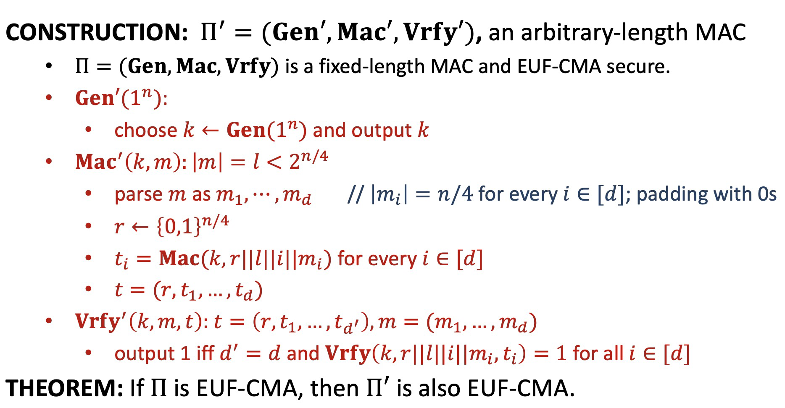

## Fixed-length CBC-MAC

**Construction**: 

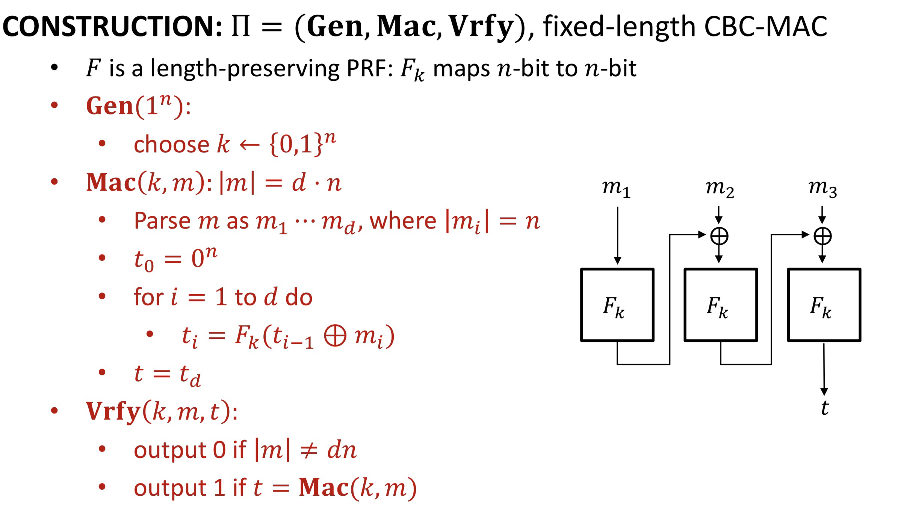

**Theorem**: If $F$ is a PRF, then EUF-CMA secure for messages of length $dn$.

如果F是PRF，那么上面的方案EUF-CMA安全，但是$d$必须确定. 

## Arbitrary-length MAC

TODO

# Lecture 13.

## sEUF-CMA

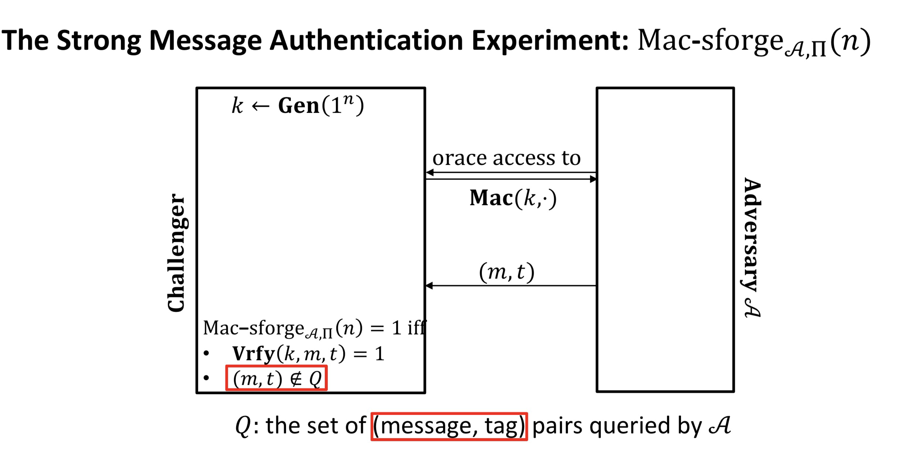

与EUF-CMA的不同: EUF-CMA是$m\notin Q$ (不能使用被查询过的明文), 这里$m$和$t$都$\notin Q$.

sEUF-CMA $\Rightarrow$ EUF-CMA.

## IND-CCA

**Chosen-ciphertext attack** 选择密文攻击

**CCA Indistinguishability experiment** CCA不可区分实验: 敌手oracle access能够选择任意明文加密, 选择任意密文解密。敌手发送两条消息, 判断哪一条消息被加密了

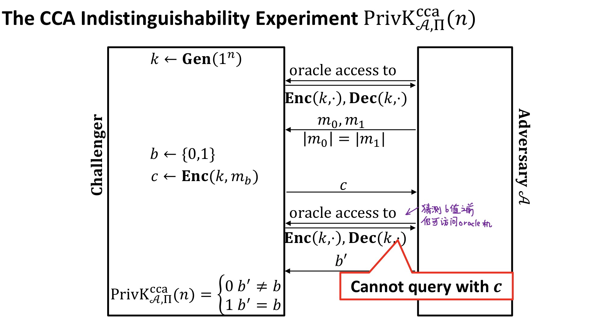

IND-CCA: $\Pi$ has **indistinguishable encryptions under a chosen-ciphertext attack (IND-CCA)** if 实验成功概率 $\leq \frac{1}{2} + \mathrm{negl}(n)$

IND-CCA $\Rightarrow$ IND-CPA

### OTP is not CCA

One time padding: $\mathrm{Enc}(k,m) = k \oplus m$

Attack via **Malleability**: (先用oracle access查询全0和全1的加密结果, 再改变一个bit生成新的消息)

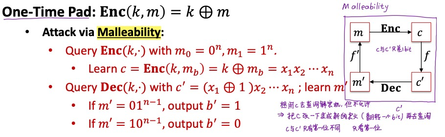

## Hash function

**Definition**: a hash function is a pair $\Pi = (\mathrm{Gen}, H)$ of PPT algorithms

- 生成key: $s = \mathrm{Gen}(1^n)$    (生成出来的密钥$s$是公开的)
- 哈希函数: $H^s = \{0,1\}^* \to \{0,1\}^{l(n)}$
  - 如果哈希函数的输入长度固定 (**fixed-length hash function**), $l'(n) < l(n)$, 则也叫 **compression function**

### Collision Resistance

**Collision-Finding experiment**: $\mathrm{Hash-coll}_{\mathcal{A}, \Pi}(n)$

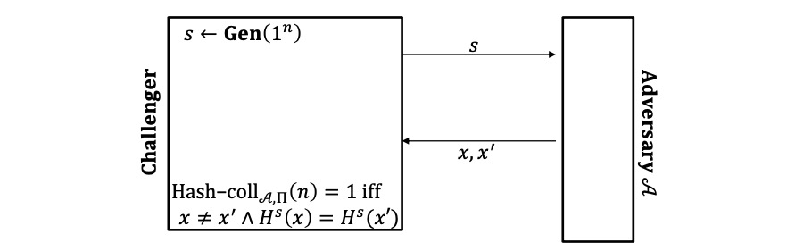

**Collision-resistant**: $\mathrm{Pr}[\mathrm{Hash-coll}_{\mathcal{A}, \Pi}(n)=1] \leq \mathrm{negl}(n)$

抗碰撞: 敌手发现哈希碰撞的概率要小于$\mathrm{negl}(n)$

### Second-Preimage Resistance

**Second Preimage-Finding experiment**: $\mathrm{Hash-SecPre}_{\mathcal{A}, \Pi}(n)$

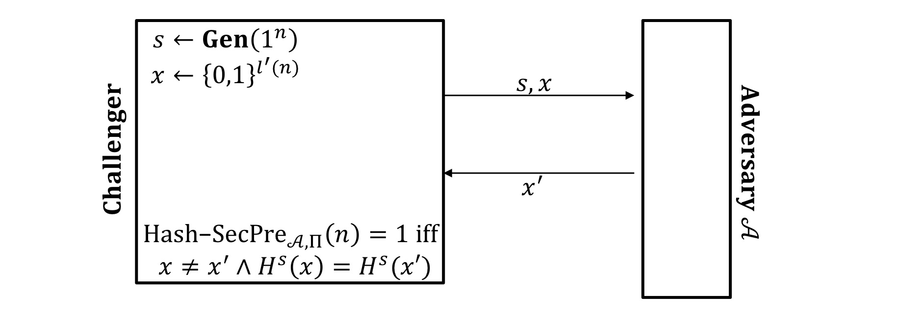

**Second Preimage resistant**: $\mathrm{Pr}[\mathrm{Hash-SecPre}_{\mathcal{A}, \Pi}(n)=1] \leq \mathrm{negl}(n)$

给定$x$, 敌手找到另一个 $x'$ 使得 $x$与$x'$哈希值相同的概率小于negl(n)

### Preimage Resistance

**Preimage-Finding experiment**: $\mathrm{Hash-Pre}_{\mathcal{A}, \Pi}(n)$

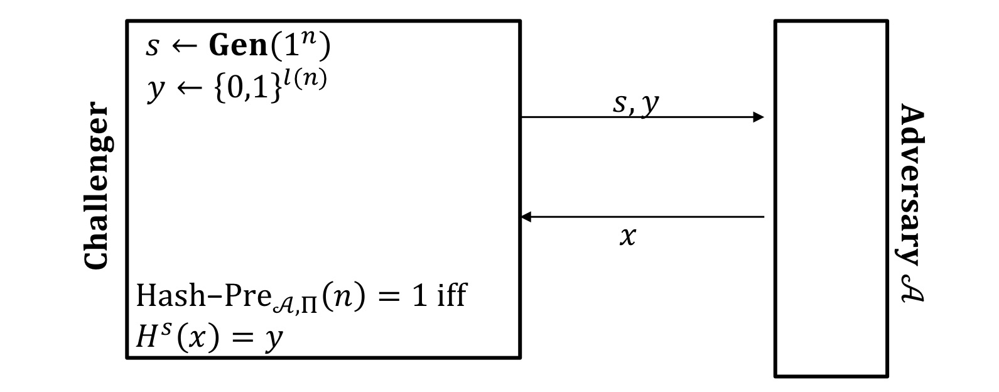

**Collision resistant $\Rightarrow$** **Second Preimage resistant**

**Second Preimage Resistant** $\Rightarrow$ **Preimage resistant**

## Merkle-Damgard Transform

Merkle-Damagard变换. 

给一个定长的抗碰撞哈希函数$\Gamma$, 可以制作出一个任意长度的抗碰撞哈希函数$\Pi$.

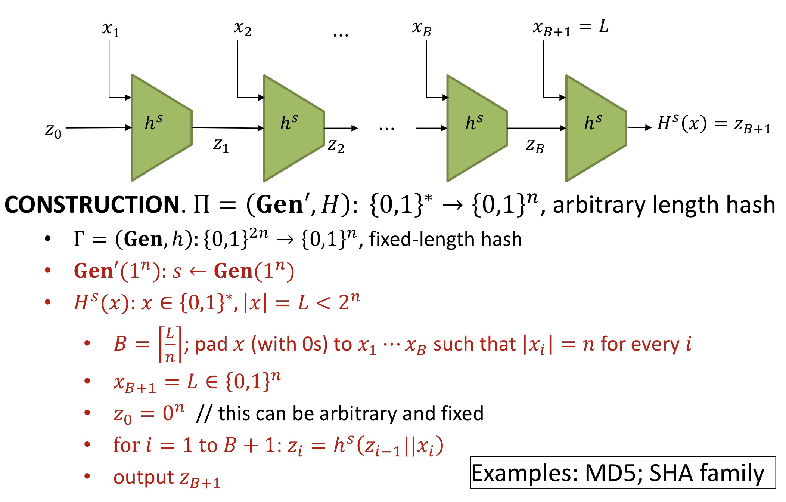

**Theorem**: If $\Gamma$ is collision-resistant, then $\Pi$ is collision-resistant.

# Lecture 14.

## Hash-and-MAC

以前学的Arbitrary-Length MAC:

- MAC from PRF: $m=m_1\cdots m_d$, long tag, 效率低
- CBC-MAC: 取 IV=$0^n$, short tag (t只取最后一块), 效率高一些, 但还是慢

**Hash-and-Mac**

// TODO

# Lecture 16.

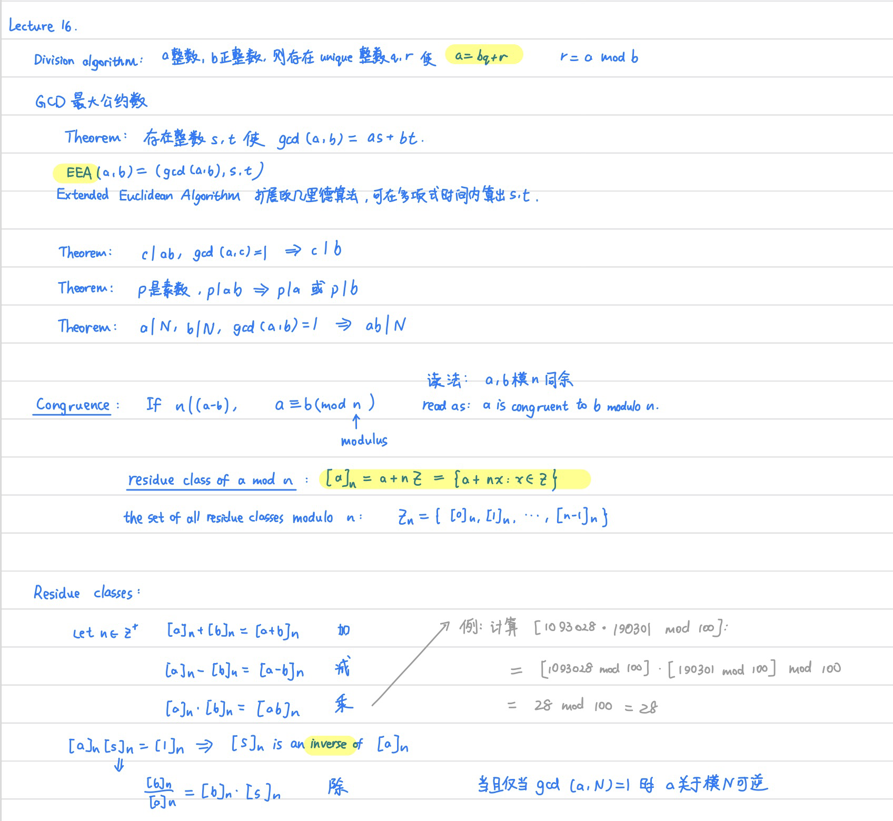

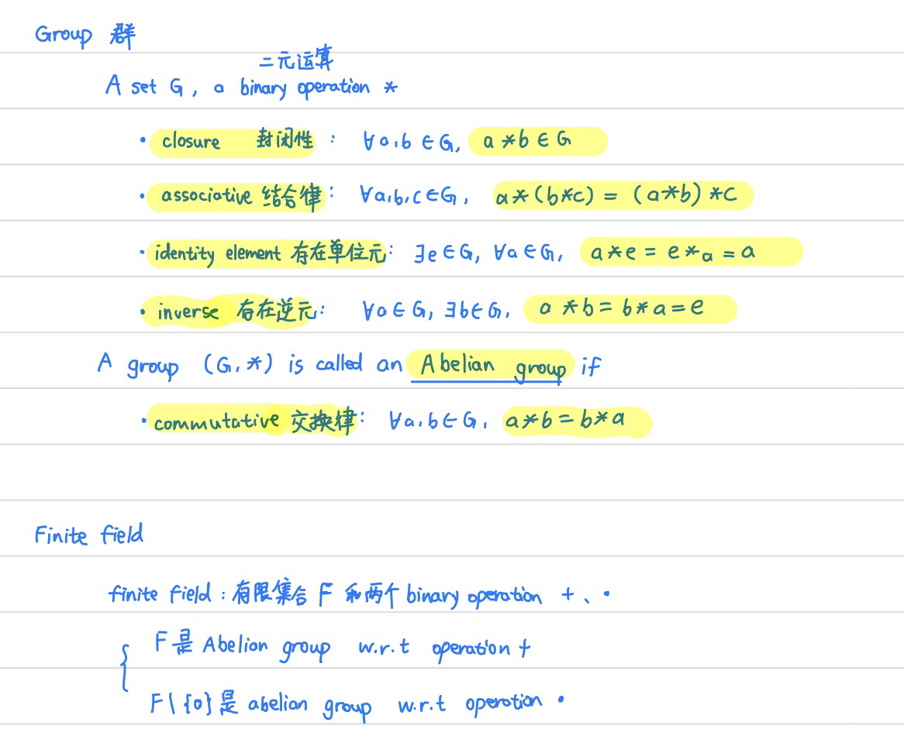

# Lecture 17

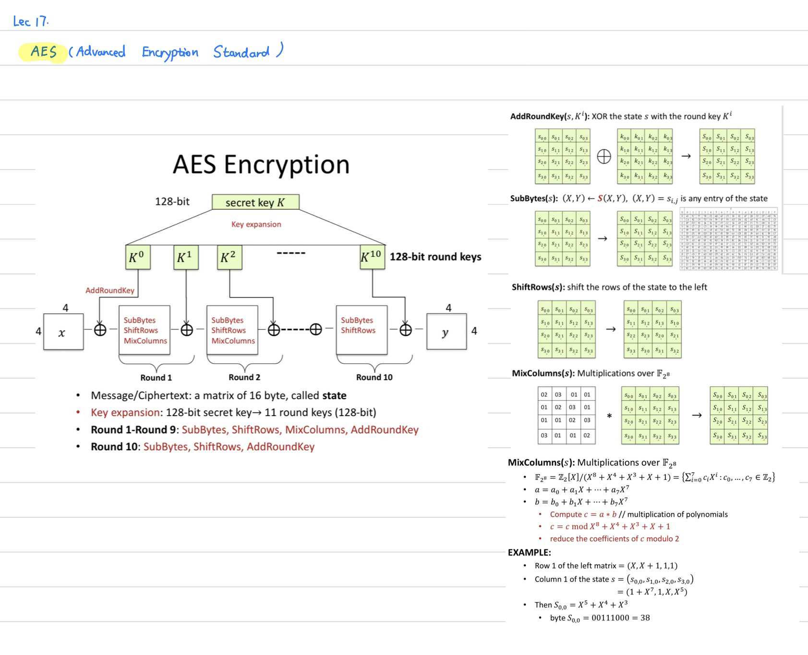

