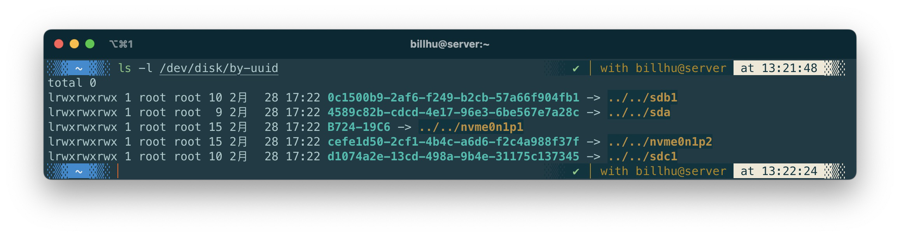
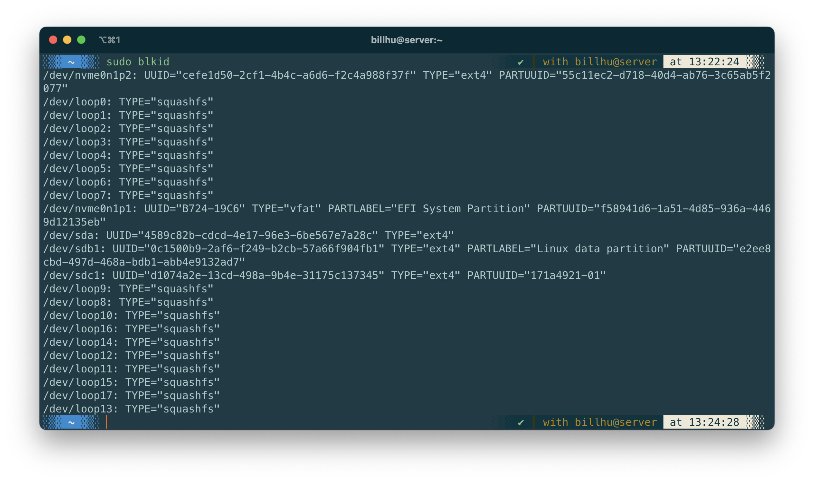
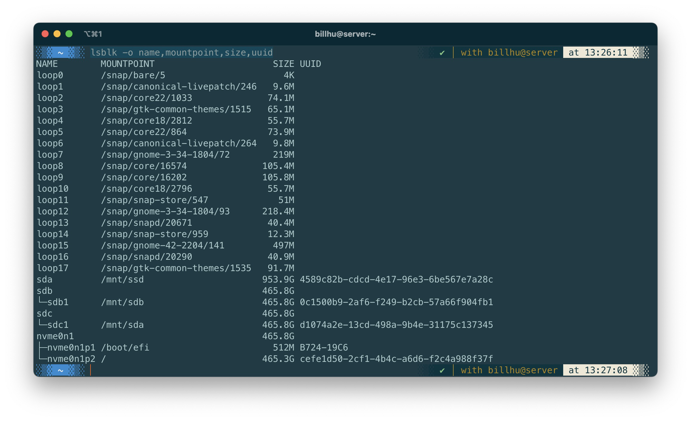
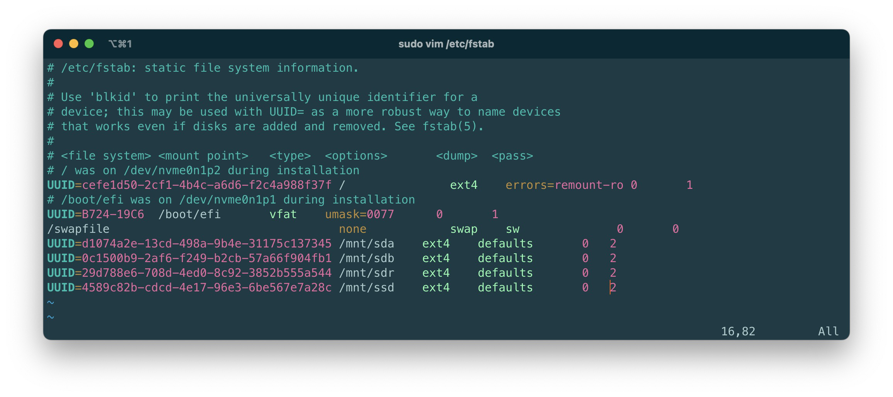

## 查看硬盘UUID的几种方法

- `ls -l /dev/disk/by-uuid`

  

- `sudo blkid`

  

- `lsblk -o name,mountpoint,size,uuid`

  

## 格式化硬盘为ext4

- `sudo mkfs.ext4 /dev/sda`

- `sudo mkfs -t ext4 /dev/sda`

  


## 手动挂载硬盘

将 `/dev/sda` 硬盘挂载到 `/mnt/ssd` 上

```shell
mkdir -p /mnt/ssd
sudo mount /dev/sda /mnt/ssd
```


## 开机自动挂载硬盘

修改 `/etc/fstab`

```shell
sudo vim /etc/fstab
```

在文件末尾加入信息

```
UUID=67E91005-EB18-4E24-8410-EB9A1C2E3882 /mnt/ssd ext4 defaults 0 0
```

E.g.




