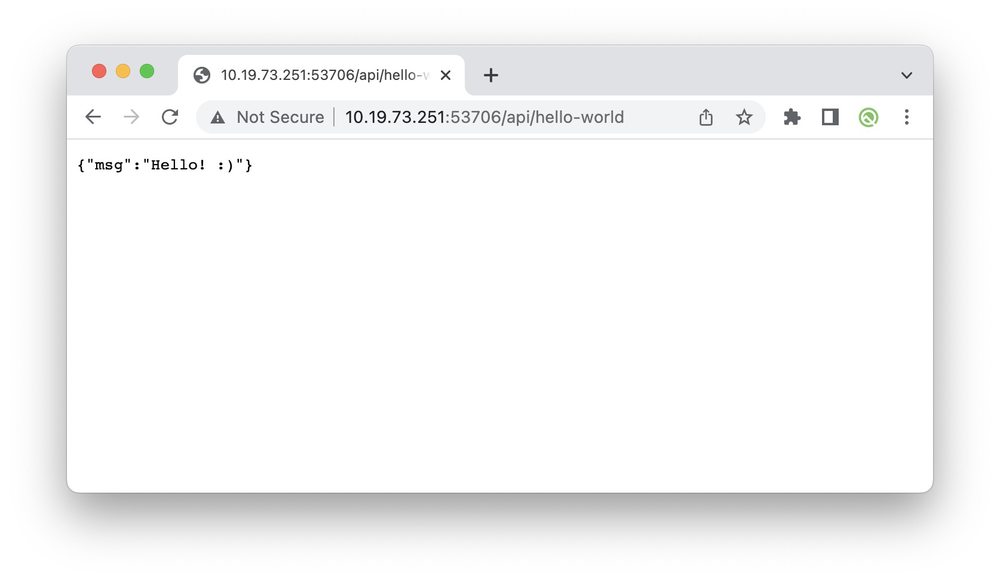
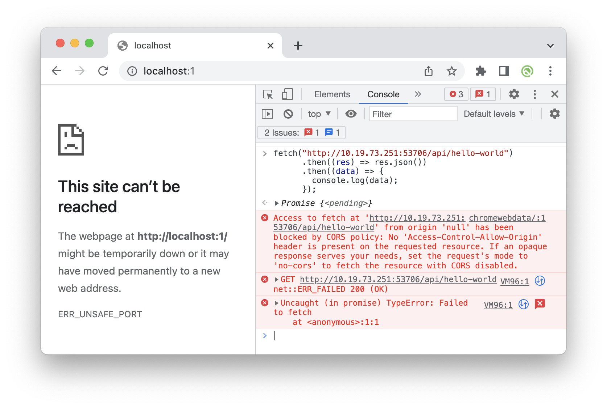


# TL, DR

CORS is a security feature by web browsers that **restricts webpages from making requests to resources on a different origin (domain)** than the one the web page was served from, unless permission is explicitly granted. 

To ignore the security constraints, use something like

```javascript
res.setHeader("Access-Control-Allow-Origin", req.headers.origin);
res.setHeader("Access-Control-Allow-Headers", "Origin, X-Requested-With, Content-Type, Accept, Authorization");
res.setHeader('Access-Control-Allow-Methods', 'GET, POST, DELETE, PUT, OPTIONS');
res.setHeader('Access-Control-Allow-Credentials', 'true');
res.setHeader('Access-Control-Expose-Headers', 'Set-Cookie');
```


## 事件起因

Initially, I utilized the following code to set up a backend nodejs server:

```javascript
import express from 'express';

const app = express();
const port = 53706;

app.get('/api/hello-world', (req, res) => {
  res.status(200).send({
    msg: "Hello! :)",
  })
})

app.listen(port, () => {
  console.log(`Listening at http://localhost:${port}`)
})
```

When accessing the URL  `http://{server_ip}:53706/api/hello-world` directly from Chrome, the message displayed correctly.



However, when opening chrome DevTools, and type the following code, there is an error:

```javascript
fetch("http://{server_ip}:53706/api/hello-world")
      .then((res) => res.json())
      .then((data) => {
        console.log(data);
      });
```

The console error is as follows:



Then I created a blank react project, and in `App.jsx`, I used the same fetch code above, the same problem still exists.

To troubleshoot, I added the following part of code to the server

```javascript
app.use((req, res, next) => {
  res.header("Access-Control-Allow-Origin", req.headers.origin);
  res.header("Access-Control-Allow-Headers", "Origin, X-Requested-With, Content-Type, Accept, Authorization");
  res.header('Access-Control-Allow-Methods', 'GET,POST,DELETE,PUT,OPTIONS');
  res.header('Access-Control-Allow-Credentials', 'true');
  res.header('Access-Control-Expose-Headers', 'Set-Cookie');
  next();
});
```

With this addition, all functionalities, including direct URL access, fetch in the React project, and direct fetch in the DevTools console, function as expected.


## Reason

This is related to the **Cross-Origin Resource Sharing (CORS)** policy.

In general, browsers are extremely hesitant to talk cross-origin. This is for security reasons.

Think of a user browing evil.com, where the  webpage is trying to make transactions on usbank.com. This would be bad! CORS is designed to be a layer of protection against this.

Because `http://{server_ip}:53706` is on a different port, these are considered of different origin. Therefore, we can view ``http://{server_ip}:53706/api/hello-world` just fine as the origin is the same. However when doing the same thing cross-origin, our browser does not allow such requests.

When making cross-origin requests, the backend server has to give explicit permission to which webpages can access it cross-origin. In general, we want to limit the `"Access-Control-Allow-Origin"` to a very small subset of permissible webpages. For this debug example, we can ignore the security considerations to make the code works fine. 


## Other languages/packages


Nodejs http

```javascript
const http = require('http');

const server = http.createServer((req, res) => {
  // Set CORS headers
  res.setHeader("Access-Control-Allow-Origin", req.headers.origin);
  res.setHeader("Access-Control-Allow-Headers", "Origin, X-Requested-With, Content-Type, Accept, Authorization");
  res.setHeader('Access-Control-Allow-Methods', 'GET, POST, DELETE, PUT, OPTIONS');
  res.setHeader('Access-Control-Allow-Credentials', 'true');
  res.setHeader('Access-Control-Expose-Headers', 'Set-Cookie');

  // Handle preflight request
  if (req.method === 'OPTIONS') {
    res.writeHead(200);
    res.end();
    return;
  }
});

```


Nodejs express

```javascript
const app = express();

app.use((req, res, next) => {
  res.header("Access-Control-Allow-Origin", req.headers.origin);
  res.header("Access-Control-Allow-Headers", "Origin, X-Requested-With, Content-Type, Accept, Authorization");
  res.header('Access-Control-Allow-Methods', 'GET,POST,DELETE,PUT,OPTIONS');
  res.header('Access-Control-Allow-Credentials', 'true');
  res.header('Access-Control-Expose-Headers', 'Set-Cookie');
  next();
});
```


Python flask

```python
from flask import Flask, jsonify
from flask_cors import CORS

app = Flask(__name__)
CORS(app)

@app.route('/api/hello-world')
def hello_world():
    return jsonify({'message': 'Hello, World!'})

if __name__ == '__main__':
    app.run(host='0.0.0.0', debug=True)
```


