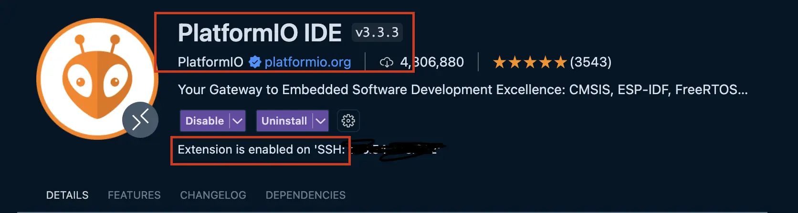
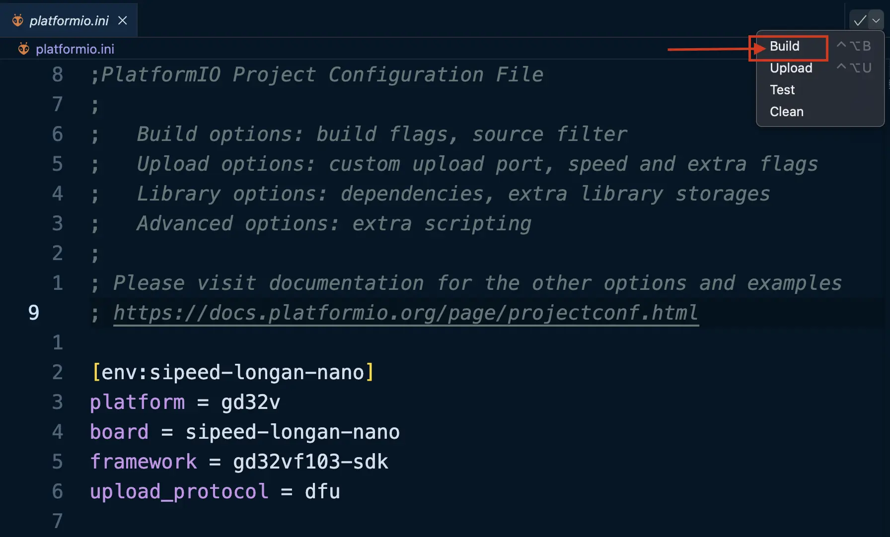
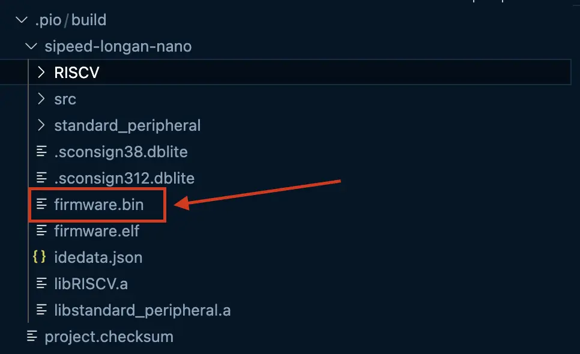

# 非官方 CS110 Longan Nano 指南

## Lab 11, Lab 12, Project 3 目的

- **Lab11**: 领取Longan Nano开发套件；使用 `dfu-util` 或 `DFU tool` 烧录固件并测试，确保7个按钮功能正常。Lab11不需要platformio。
- **Lab12**: 学会对Longan Nano编程；学会使用platformio编译固件。
- **Project3**: 制作Flappy Bird游戏。


## Longan Nano 核心版与载板的连接

确保Longan Nano每侧只有17个pin，而不是20个。如果是20个，把靠近type-c口的三个排针掰掉。

“8P排针紧贴此侧”；插到底。


## DFU工具的安装

下载地址：https://epan.shanghaitech.edu.cn/l/KFjNMO

DFU工具的用途：将已经编译好的固件(`.bin`)刷入Longan Nano开发板中。

### Windows (GD32 MCU DFU Tool)

打开 `windows-version\GD32 MCU Dfu Drivers_v1.0.1.2316`, 下面有两个文件夹（`x86`和`x64`），如果Windows操作系统为64位，请进入 `x64`；如果系统为32位，请进入 `x86` (绝大多数情况下，你的电脑是64位的)。

进入后运行 `GD32 MCU Dfu Drivers.exe` 安装驱动。

有可能导致蓝屏，如果电脑蓝屏则重启重试。

打开 `windows-version\GD32 MCU Dfu Tool_v3.8.1.5784`，运行 `GD32 MCU Dfu Tool.exe`。

实在受不了蓝屏的话请换Linux，实体机虚拟机都行。

### Linux (dfu-util)

找到 `linux-version` 下的 `dfu-util`。这是一个可执行文件，在终端中输入 `./dfu-util` 运行。

如果出现 "Permission denied"，请先执行 `chmod +x ./dfu-util`。

如果刷固件时出现错误，请尝试使用 `sudo ./dfu-util`。


## DFU工具的使用（烧录固件的方法）

**第一步：进入DFU模式**

首先需要在Longan Nano上进入DFU模式，进入的方法如下：

1. 按住 BOOT0 按键，不要松开
2. 按住 RESET 按键，不要松开
3. 松开 RESET 按键
4. 松开 BOOT0 按键

注意：按键的顺序非常重要，请勿颠倒。如果失败请重试一遍。

BOOT0按键和RESET按键的位置请查看下图


**第二步：下载（刷入）固件**

- Windows:

  - 运行 `GD32 MCU Dfu Tool.exe`

  - 选择 "Download to Device", 选择需要刷入的固件（后缀名为`.bin`），可能需要在文件选择器右下角将文件后缀选择到`.bin`。

  - 保持默认 `@0x80000000`。通常不需要 "Verify After Download" 或 "Erase All"。

  - 点击 "OK" 进行刷入。

    **如果找不到设备，请检查Longan Nano是否已进入DFU模式；是否已经安装 `GD32 MCU Dfu Drivers_v1.0.1.2316` 文件夹下的驱动；当前使用的USB typec线是否只能供电不能传数据，可以换一根线重试；请直接插到Longan Nano自带的type-口上，不要插到载板上的“仅供电”口上。**

- Linux:

  - 找到 `linux-version` 下的 `dfu-util`。输入 `./dfu-util` 运行。

    如果出现 "Permission denied"，请先执行 `chmod +x ./dfu-util`。

    如果刷固件时出现错误，请尝试使用 `sudo ./dfu-util`。

  - 执行一下命令，查看dfu-util能否识别到当前设备。

    ```
    ./dfu-util -l
    ```

    如果输出内容包含 `2e89:0189`，则代表已经检测到了Longan Nano设备。

    **如果找不到设备，请检查Longan Nano是否已进入DFU模式；如果使用的是Linux虚拟机，请检查虚拟机的设置，确认USB设备连接在虚拟机上而非Windows主机上；当前使用的USB typec线是否只能供电不能传数据，可以换一根线重试；请直接插到Longan Nano自带的type-口上，不要插到载板上的“仅供电”口上。**

    如果能够显示设备但不是 `2e89:0189`，请尝试使用 `lsusb` 命令。TODO

  - 找到需要刷入的固件（后缀名为 `.bin`）。假设该 `.bin` 文件已在当前目录下，使用以下命令：
  
    ```shell
    ./dfu-util -a 0 --dfuse-address 0x08000000:leave -D ./lab-longan-nano-firmware-distributable.bin
    ```

    如果出现错误，尝试在命令前添加 `sudo` 并重试。
  
  - 出现 `Invalid DFU suffix signature` and `dfu-util: Error during download get_status` 错误可忽略。

- Mac:

  - 通过 homebrew 安装 `dfu-util`.

    ```shell
    brew install dfu-util
    ```

  - 剩余过程同Linux

    

**第三步：离开DFU模式**

在Longan Nano上按下 RESET 按键即可。或者也可以拔掉 Longan Nano 上的typec线并重新插入（即断电再开机）。


以下为Lab12的内容

## PlatformIO的安装

- 推荐使用 vscode 和 PlatformIO IDE 插件的方式（这也是 [platformio.org](https://platformio.org) 官网推荐的方式），这样能获得最好的开发体验。
- 也可以纯命令行使用 `pip` 安装 `platformio` (`python3 -m pip install platformio`)，终端执行 `platformio run` 进行编译。
- **不要混用两种方法**（即不要既通过 pip 安装 platformio 又安装 vscode 的 PlatformIO IDE 插件；可以先卸载 pip 的 platformio 再去安装 vscode 插件）。


### vscode 插件方式

在 [此处](https://toast-lab.sist.shanghaitech.edu.cn/courses/CS110@ShanghaiTech/Spring-2024/labs/Lab12/lab12-starter-20240515.tar.gz) 下载 lab12-starter，并解压。



插件安装完成之后，点击 vscode 侧边栏中的 PlatformIO 图标，等待初始化完成


解压下载的 lab12-starter, 打开该目录并打开里面的 `platformio.ini` 文件，点击 build



由于Sipeed从platformio仓库中移除了Longan nano的开发套件，可能会提示错误。请下载 https://epan.shanghaitech.edu.cn/l/KFjNMO 中的Longan Dev Kit，按照里面的说明文档进行开发工具的安装。

然后需要将编译好的固件烧录进 Longan Nano。编译好的固件在 `./.pio/build/sipeed-longan-nano/firmware.bin`，请参考上文DFU工具的使用将该 `.bin` 结尾的固件刷入。



Troubleshooting:

- Fail to initialize PlatformIO: 彻底退出vscode并重试
- Cannot find Python Interpreter when initializing PlatformIO: 参考[此处](https://github.com/platformio/platformio-core-installer/issues/1774)的方法


### 命令行方法

使用 pip 安装 platformio

```
python3 -m pip install platformio`
```

同样下载 lab12-starter，解压

下载 https://epan.shanghaitech.edu.cn/l/KFjNMO 中的Longan Dev Kit，按照里面的说明文档进行开发工具的安装

然后使用 `platformio run` 命令进行编译

```
platformio run
```

