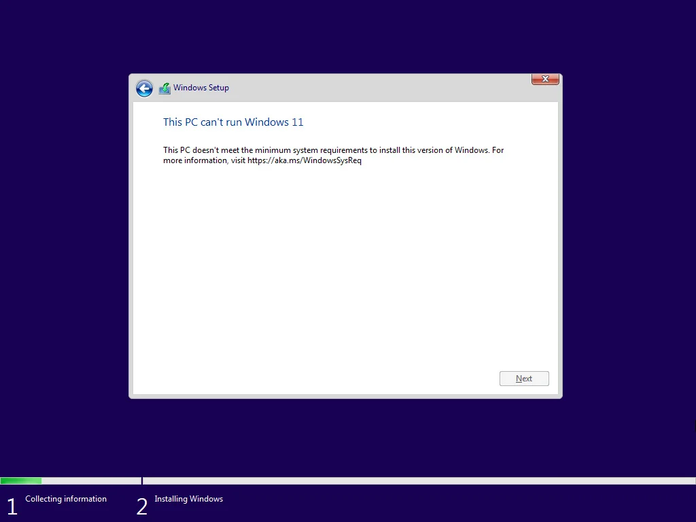
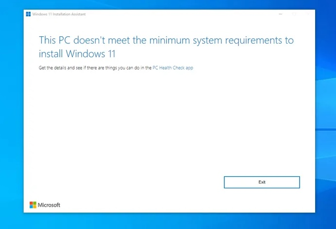
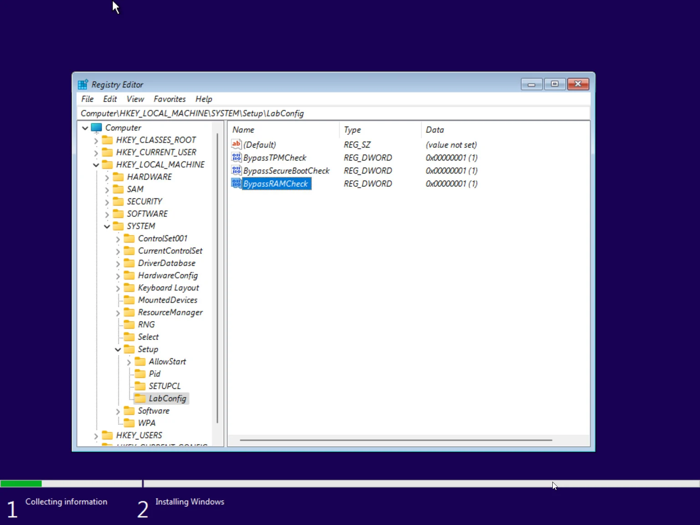
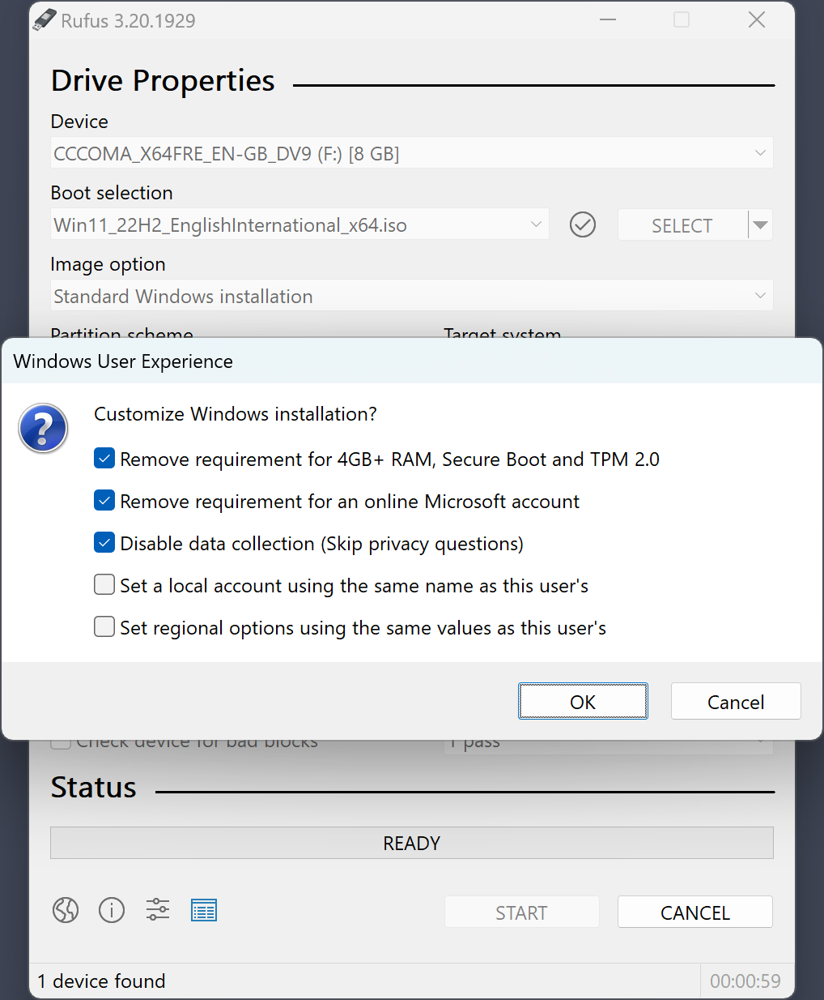


Download Windows ISO

You may download Windows 11 ISO from microsoft official website: [https://www.microsoft.com/zh-cn/software-download/windows11](https://www.microsoft.com/zh-cn/software-download/windows11).

If you do not want the newest version (for example, Windows11 21H2, 22H2), you may use [MediaCreationTool.bat (Github link)](https://github.com/AveYo/MediaCreationTool.bat), where you can select 'Auto ISO' and choose a history version of Windows. See the README.md in the Github link for details.


---

## Problem Description

You may encounter 'This PC can't run Windows 11' when upgrading to or installing Windows 11, like follows:






---


**TL, DR: Use Rufus!**

**TL, DR: Use Rufus!**

**TL, DR: Use Rufus!**

TL,DR: Using Rufus ([Solution 4](#solution-4-use-rufus)) seems to be the most convenient way.

However, if you prefer not to use any third-party software, there are also some alternative ways to do this. See below.


## Solution 1: registry


If you are booting from Windows 11 install disk, use Shift+F10 to open cmd. Otherwise just open cmd (run as administrater).


Use cmd to execute the following: 

```powershell
reg add HKLM\SYSTEM\Setup\LabConfig /v BypassTPMCheck /t REG_DWORD /d 1 /f
reg add HKLM\SYSTEM\Setup\LabConfig /v BypassSecureBootCheck /t REG_DWORD /d 1 /f
reg add HKLM\SYSTEM\Setup\LabConfig /v BypassRAMCheck /t REG_DWORD /d 1 /f
reg add HKLM\SYSTEM\Setup\LabConfig /v BypassStorageCheck /t REG_DWORD /d 1 /f
reg add HKLM\SYSTEM\Setup\MoSetup /v AllowUpgradesWithUnsupportedTPMOrCPU /t REG_DWORD /d 1 /f
```

Or, if you prefer the GUI registry editor, use Win+R and type `regedit`. Navigate to `HKEY_LOCAL_MACHINE\SYSTEM\Setup`, create an item called `LabConfig`, and add the following DWORD values:

- key name `BypassTPMCheck`, value `00000001`.
- key name `BypassSecureBootCheck`, value `00000001`
- key name `BypassRAMCheck`, value `00000001`
- key name `BypassStorageCheck`, value `00000001`

Then navigate to `HKEY_LOCAL_MACHINE\SYSTEM\Setup\MoSetup`, create a DWORD item with 

- key name `AllowUpgradesWithUnsupportedTPMOrCPU`, value `00000001`.

Save and exit. Like the following




## Solution 2: Modify WIM property to 'Server'

Use [wimlib](https://wimlib.net/) (the open source Windows Imaging (WIM) library) to modify the 'image-property' of `sources\install.vim` to 'Server'.

Download wimlib and execute 

```powershell
.\wimlib-imagex.exe info \path\to\Windows11.ISO\sources\install.wim --header
```

Look at '`Image Count`' in the output, it should be a number.

Then execute 

```powershell
.\wimlib-imagex.exe info \path\to\Windows11.ISO\sources\install.wim --image-property WINDOWS/INSTALLATIONTYPE=Server
```

Note that after changing to 'Server', you might be required to enter a product key when installing Windows. In this case, use `sources\setup.exe` instead of the `setup.exe` from the root folder of the ISO.


## Solution 3: Use Windows10 ISO and replace install.wim

Download any **Windows 10 ISO** and your selected Windows 11 ISO image.

Uncompress the Windows 10 ISO, replace `sources/install.wim` with the install.wim in Windows 11 ISO. Then run the Windows 10 setup.exe. 

In this way you are installing Windows 11 image with Windows 10 installer, so don't worry if you see "Windows 10 installer". You are installing Windows 11.


## Solution 4: Use Rufus

Download [Rufus](https://rufus.ie/), plug in an external U-disk and create a USB startup disk using Rufus. 



After that, directly run the setup.exe from your external U-disk.
