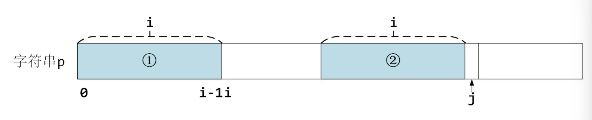
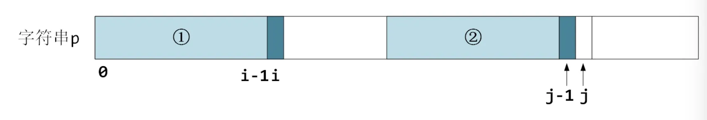
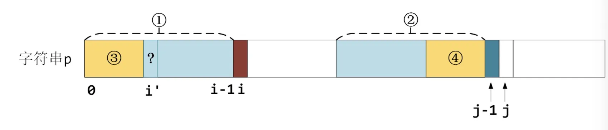
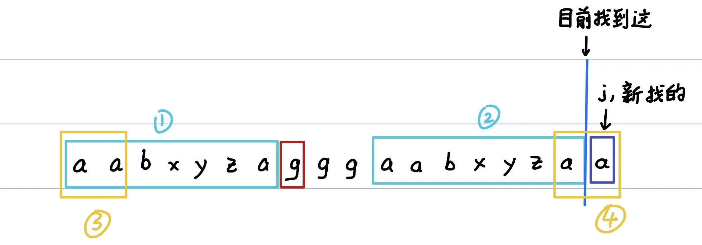
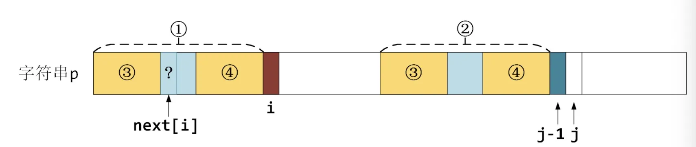

# Leetcode 28 题目描述

链接：[leetcode.cn/problems/find-the-index-of-the-first-occurrence-in-a-string](https://leetcode.cn/problems/find-the-index-of-the-first-occurrence-in-a-string/description/)

> **28. 找出字符串中第一个匹配项的下标**
>
> 给你两个字符串 `haystack` 和 `needle` ，请你在 `haystack` 字符串中找出 `needle` 字符串的第一个匹配项的下标（下标从 0 开始）。如果 `needle` 不是 `haystack` 的一部分，则返回 `-1` 。
>
> **示例 1：**
>
> ```txt
> 输入：haystack = "sadbutsad", needle = "sad"
> 输出：0
> 解释："sad" 在下标 0 和 6 处匹配。
> 第一个匹配项的下标是 0 ，所以返回 0 。
> ```
>
> **示例 2：**
>
> ```txt
> 输入：haystack = "leetcode", needle = "leeto"
> 输出：-1
> 解释："leeto" 没有在 "leetcode" 中出现，所以返回 -1 。
> ```


# 朴素解法一行 复杂度$O(m * n)$

```c++
using std::string;

class Solution {
public:
    int strStr(string haystack, string needle) {
				return haystack.find(needle);
    }
};
```

或者把这一行中的 `std::string::find` 手写一遍

```c++
class Solution {
public:
		// 直接调std::string的find相当于下面这个
    bool check(const string &haystack, const string &needle, int idx) {
        // prevent overflow
        if (idx + needle.size() >= haystack.size()) return false;
        for (int i = 0; i < needle.size(); i++) 
            if (haystack[idx + i] != needle[i]) return false;
        return true;
    }
    int strStr2(string haystack, string needle) {
        int index = 0;
        for (int i = 0; i < (int) haystack.size(); i++) {
            if (haystack[i] == needle[0] && check(haystack, needle, i)){
                return i;
            }
        }
        return -1;
    }
};
```

这种朴素方法能过但最坏时间复杂度是 $O(mn)$，如下面的例子

```c++
int main() {
		Solution s;
		std::clog << s.strStr("aaaaaaaaaaaaaaaaaaaaaaaaa", "aaaaaf");
}
```

使用KMP算法能把复杂度降至 $O(m+n)$。

# KMP算法 复杂度 $O(m+n)$

KMP是Knuth-Morris-Pratt，三个人名。

为了解释为什么KMP算法更快，我们需要先考虑一下朴素算法会怎么做。

举一个例子：haystack(原串，原字符串，主串)为 `abeababeabf`, needle(匹配串，模式串)为 `abeabf`。

## 朴素算法的问题

先考虑一下朴素算法会怎么做：

```txt
          |
haystack: a b e a b a b e a b f
needle:   a b e a b f
          |
```

原串和匹配串各有一个指针（代码块中竖线 `"|"` 代表指针），最初两个指针都指向各自的起始字符 `"a"`。

起始字符 `"a"` 之后的字符 `"b" "e" "a" "b"` 都是匹配的，两个指针会同时向右移动。

```txt
          | | | | | ?
haystack: a b e a b a b e a b f
needle:   a b e a b f
          | | | | | ?
```

下一个字符应该是 `"f"`，但原串中下一个字符是 `"a"`，对不上了！此时原串中的指针会移动至起始点的下一个位置，即第二个字符 `"b"` 处，而匹配串中的指针会移动至起始点，如下图所示：

```txt
            | ?
haystack: a b e a b a b e a b f
needle:   a b e a b f
          | ?
```

## KMP匹配过程

发现效率问题了吗？

我们要找`"abeabf"`，现在已经找到`"abeab"` 了，因为最后一个字符匹配不对而前功尽弃。

但是我们没必要前功尽弃。注意到 `"abeab"` 中有一个相同的“前缀”和“后缀” `"ab"`，我们可以将原串中的指针移动到第二个 `"ab"` 处。

```txt
                | | ?
haystack: a b e a b a b e a b f
needle:   a b e a b f
          | | ?
```

这样的话，我们不需要推倒重来从`"a"`重新找，而是可以从 `"ab"` 继续找。更具一般性地说：我们不需要回到匹配串的起始位置，而是根据相同的“前缀”和“后缀”，移动到这个**“前缀”下一个出现的位置继续匹配**。

这就是KMP算法的匹配过程。

## 最长相同前后缀 （next数组）

现在我们就明白了为什么KMP算法比朴素解法更快。

KMP能够利用已经匹配的原串部分相同的“前缀”和“后缀”来加速下一次匹配（不需从头匹配，而是回到前缀第二次出现处即可）。

但是有一个问题，我们如何找出上面这个“前缀第二次出现的位置”，或者说，如何找出当前已匹配字符串部分的最长前缀和后缀？

KMP算法引入了一个`next[]` 数组。`next[i]` **表示匹配串中前**`i**`个字符组成的子串最长的相同前缀后缀的长度**。



定义：前缀、后缀不能是整个字符串。

例如 `"abcd"` 前缀包含 "a", "ab", "abc"，而不包括 "abcd"。

例如 `"abcd"` 后缀包含 "d", "cd", "bcd"，而不包括 "abcd"。

再例如 `"a"` 没有前缀。空字符串 `""` 也没有前缀。



举上面一个例子，字符串 `"abeabf"` 的 `next[]` 数组值应为`[0,0,0,1,2,0]`。

`next[0] = 0`，因为 `"a"` 没有相同前后缀

`next[1] = 0 `，因为 `"ab"` 没有相同前后缀

`next[2] = 0`，因为 `"abe"` 没有相同前后缀

`next[3] = 1 `，因为 `"abea"` 最长相同前后缀为 `"a"`

`next[4] = 2`，因为 `"abeab"` 最长相同前后缀为 `"ab"`

`next[5] = 0 `，因为 `"abeabf"` 没有相同前后缀

那么还是上面的问题，怎么求 `next` 数组？暴力解法为 $O(n^2)$，但KMP算法有一个 $O(n)$ 的求法。

首先 `next[0] = 0`。假设现在我们已经计算出了 `next[j] = i`，即下图中两个浅蓝色区域①和②是相同的前后缀部分。



那么`j++` 后计算 `next[j+1]` 时：

如果说新的一个字符相等，那么简单了，前后缀各多一个字符(深蓝色部分)，那么 `next[j] = i+1`，如下图所示。



如果说不相等(褐色部分与深蓝色部分)，那么必然不能像刚才一样直接在`i`后+1了。我们需要找一个新的最长公共前后缀，即下图中，在区域①中找最长前缀③，在区域②中找相等的最长的后缀④。



给上图举个例子吧。考虑字符串 `"aabxyzagggaabxyzaa"`，目前已经查找到最长前后缀为 `"aabxyza"`。现在新的字符 `"g"`(褐色) 和 `"a"`(深蓝色) 不相等了，那么需要找区域③和区域④，如下图黄色框所示。




怎么找③和④呢？

注意到，①和②本身是完全相等的，因此，我们可以将 "在①中找最长前缀③，在②中找相等的最长后缀④" 的问题转化为 "在①中找最长前缀③，和一个相等的最长后缀④"，如下图所示



这不就是子串①的最长公共前后缀的定义吗？而这个①的最长公共前后缀已经求出来过了，值就是 `next[i]` （因为`i < j`，我们遍历到 `j` 时 `next[i]` 已经计算出来过了。

那么我们直接查找一下 `next[i]`，然后判断一下 `p[next[i]]` (上图中问号?所在处) 和 `p[j]`(图中深蓝色部分) 是否相等即可。如果不相等，让 `i = next[i]`  继续重复上述过程。

如果一直匹配失败，最终 `i` 会等于0，停到字符串第一个字符 `p[0]` 的位置。

`next[]` 数组求解代码：

```c++
class Solution {
public:
  	std::vector<int> next;
  	void calculate_next(const std::string &needle) {
      	next.resize(needle.size() + 1, 0);
      	for(int j = 2, i = 0; j <= n; j++) {
            while(i > 0 && needle[i] != needle[j - 1]) i = next[i];
            if(needle[i] == needle[j - 1]) i++;				 
            next[j] = i;			
        }
    }
  	...
};
```

## next求解完成之后的匹配过程

计算完 `next` 数组后，我们可以回到字符串的匹配过程了。

上面我们说过，匹配失败的时候，我们不需要从头开始，而是移动到这个“前缀”下一个出现的位置继续匹配。这里我们就可以利用刚刚算好的 `next` 数组，查找“前缀”下一个出现的位置。

在代码中我们仍然定义两个指针 `i` 和 `j`，分别是原串和匹配串的指针。

如果匹配失败，则将匹配串指针 `j` 移动至 `next[j]` 的位置。

代码如下：

```c++

class Solution {
public:
    ...
    int strStr(string haystack, string needle) {
        calculate_next(needle);

        for(int i = 0, j = 0; i < haystack.size(); i++) {
            while(j > 0 && haystack[i] != needle[j]) j = next[j];
            if(haystack[i] == needle[j]) j++;
            if(j == needle.size()) {
                return i - j + 1;
            }
        }
        return -1;
    }
};

```

## 完整代码

```c++
#include <iostream>
#include <vector>
#include <string>
using std::string;

class Solution {
public:
    std::vector<int> next;
  	void calculate_next(const std::string &needle) {
      	next.resize(needle.size() + 1, 0);
      	for(int j = 2, i = 0; j <= needle.size(); j++) {
            while(i > 0 && needle[i] != needle[j - 1]) i = next[i];
            if(needle[i] == needle[j - 1]) i++;				 
            next[j] = i;			
        }
    }

    int strStr(string haystack, string needle) {
        calculate_next(needle);

        for(int i = 0, j = 0; i < haystack.size(); i++) {
            while(j > 0 && haystack[i] != needle[j]) j = next[j];
            if(haystack[i] == needle[j]) j++;
            if(j == needle.size()) {
                return i - j + 1;
            }
        }
        return -1;
    }
};

int main() {

}


```


参考题解：

- FSWLY 看不懂你打我，kmp 算法，超清晰多图，逐步图解！: [Link](https://leetcode.cn/problems/find-the-index-of-the-first-occurrence-in-a-string/solutions/2600821/kan-bu-dong-ni-da-wo-kmp-suan-fa-chao-qi-z1y0/)
- 力扣官方题解：[Link](https://leetcode.cn/problems/find-the-index-of-the-first-occurrence-in-a-string/solutions/732236/shi-xian-strstr-by-leetcode-solution-ds6y/)
- Aoki_Umi KMP学习笔记: [Link](https://aokiumi.github.io/2018/08/20/KMP学习笔记/)
