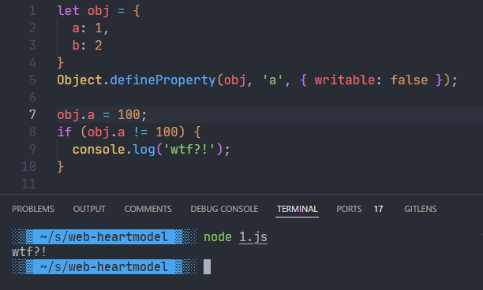

# 属性标注符 Accessor property

```javascript
let obj = {
	a: 1,
	b: 2
}
```

## 得到某一个属性的属性描述符: `Object.getOwnPropertyDescriptor`

```javascript
let desc = Object.getOwnPropertyDescriptor(obj, 'a');
console.log(desc);  
// {value: 1, writable: true, enumerable: true, configurable: true}
```

## 更改某一个属性的属性描述符：`Object.defineProperty`

  - **value**

    ```javascript
    Object.defineProperty(obj, 'a', {value: 10});
    console.log(obj);  // {a: 10, b: 2}
    ```

    这跟直接 `obj.a = 10` 似乎没有区别？但往下看

  - **writable**：可让该属性的值不可修改（修改时不会产生任何报错信息，你看似改了实际上没变）。

    ```javascript
    Object.defineProperty(obj, 'a', { writable: false });
    
    console.log(obj);  // {a: 10, b: 2}
    obj.a = 100;
    console.log(obj);  // {a: 10, b: 2}
    ```

    但是如果只看后三行代码可能会让别人很迷惑，为什么明明进行了 `obj.a = 100` 的赋值操作，值却没有修改？更好的做法是，使用 `getter`在修改属性时给出报错信息，告知使用者该属性不可修改。

    

  - **get, set**

    ```javascript
    Object.defineProperty(obj, 'a', {
      get: function() {},
      set: function(val) {}
    });
    ```

    像下面这么做会出问题！

    ```javascript
    Object.defineProperty(obj, 'a', {
      get: function() { return obj.a; },
      set: function(val) { obj.a = val; }
    });
    
    console.log(obj.a);  // 或其它需要读取obj.a属性的代码
    // Uncaught RangeError: Maximum call stack size exceeded
    //  at Object.get [as a] (<anonymous>:2:21)
    //  at Object.get [as a] (<anonymous>:2:32)
    //  at Object.get [as a] (<anonymous>:2:32)
    //  at Object.get [as a] (<anonymous>:2:32)
    ```

    为什么会导致无限递归？

    因为在外部访问 `obj.a` 相当于运行getter `get()` 函数得到函数返回值，但是在`get()` 内 `return obj.a` 也相当于访问了 `obj.a`, 也会运行 `get()` 函数，相当于 `get() { return get(); }`，从而导致套娃。

    同理，上面的 setter 也会有同样的错误

    ```javascript
    obj.a = 30;
    // Uncaught RangeError: Maximum call stack size exceeded
    //  at Object.set [as a] (<anonymous>:3:24)
    //  at Object.set [as a] (<anonymous>:3:30)
    //  at Object.set [as a] (<anonymous>:3:30)
    //  at Object.set [as a] (<anonymous>:3:30)
    ```

    产生错误的原因也相同，这个 setter 相当于 `set(val) { set (val); }`，导致无限递归。 

    所以怎么解决？

    ```javascript
    var internalValue = undefined;
    Object.defineProperty(obj, 'a', {
      get: function() { return internalValue; },
      set: function(val) { internalValue = val; }
    });
    ```

    那么回到上面的问题，如何让修改属性时给出报错信息，告知使用者该属性不可修改？

    ```javascript
    var internalValue = 10;
    Object.defineProperty(obj, 'a', {
      get: function() { return internalValue; },
      set: function(val) { throw new Error('This property is not writable!') }
    });
    
    console.log(obj.a);  // 10
    obj.a = 30;
    // Uncaught Error: This property is not writable!
    //  at Object.set [as a] (<anonymous>:4:30)
    //  at <anonymous>:1:7
    ```

    这样就做出了一个只读属性，尝试修改时会给出报错，避免造成困惑。

    ```javascript
    console.log(obj);  // {a: 10, b: 2}
    obj.a = 100;  // Will throw an error here!
    console.log(obj);  // {a: 10, b: 2}
    ```

  - **enumerable**：可让该属性不可被遍历到（实际上该属性仍存在于Object中）。

    先看看如何遍历一个Object:

    ```javascript
    for (let key in obj) { console.log(key); }  // output: a b
    
    let keys = Object.keys(obj);
    console.log(keys);  // ['a', 'b']
    ```

    设置enumerable为false后，就遍历不到这个key了，但实际上该属性仍存在于Object中，不影响直接使用 `obj.a`。

    ```javascript
    Object.defineProperty(obj, 'a', { enumerable: false });
    
    for (let key in obj) { console.log(key); }  // output: b
    
    let keys = Object.keys(obj);
    console.log(keys);  // ['b']
    
    // The following can still output all
    Object.getOwnPropertyNames(obj);  // ['a', 'b']
    ```

  - **configurable**：可让描述符本身无法修改

    ```javascript
    Object.defineProperty(obj, 'a', { configurable: false });
    
    Object.defineProperty(obj, 'a', { enumerable: true });
    // Uncaught TypeError: Cannot redefine property: a
    //  at Function.defineProperty (<anonymous>)
    //  at <anonymous>:1:8
    ```

> 参考文献：https://developer.mozilla.org/en-US/docs/Web/JavaScript/Data_structures#properties

